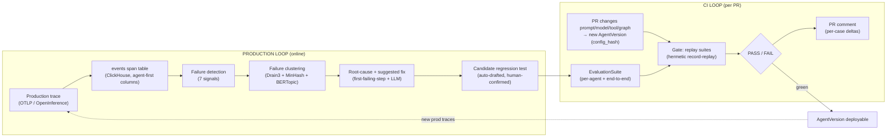

# Tracely — Design Dossier

**Trace-native CI/CD for AI agents.** Production traces become regression tests.

> `Production Trace → Failure Detection → Regression Test → CI/CD Gate`
>
> Not another Langfuse. Not prompt management. Not dataset-first eval. Not Datadog-for-LLMs.
> The trace is the source of truth; **everything else — evals, regression tests, failure clusters, suggested fixes, deployment gates, quality metrics — is derived from it.**

This dossier reverse-engineers Langfuse at the implementation level (by reading the actual source, not docs) and uses it as the foundation to design Tracely. It is written for a founding engineer about to build V1.

---

## TL;DR

- **Langfuse's tracing/storage substrate is excellent and largely reusable; its agent + evaluation layer is essentially absent.** Agent/turn/step/conversation are strings-in-metadata reconstructed at read time; eval is config-/dataset-first; there is no Agent, AgentVersion, Conversation, Turn, EvaluationSuite, EvaluationCase, or FailureCluster entity anywhere in its 65 Prisma models. **That missing semantic + trace-first-evaluation layer is Tracely's defensible surface.**
- **Steal:** the wide OTel-native `events_full` span table, the async S3-source-of-truth → Redis → batched-ClickHouse write path, `ReplacingMergeTree(event_ts,is_deleted)` upsert/dedup, the OTLP+OpenInference ingestion endpoint and `ObservationTypeMapper` registry, the orphan-tolerant iterative span-tree builder, the `Score` sink with self-tracing evals, sharded BullMQ + `WorkerManager`, and the `TraceUpsert` production-trace→eval trigger. (See [`01-steal-and-do-not-copy.md`](part2-tracely/01-steal-and-do-not-copy.md).)
- **Tracely makes agent semantics first-class** — `agent_id / agent_version_id / agent_run_id / conversation_id / turn_id / step_id` and typed edges become **indexed columns on the span row**, plus a Postgres registry (Agent, AgentVersion, EvaluationSuite/Case, FailureCluster, GateRun/Case). The wedge: **a regression test is a production trace** — captured input + recorded fixtures (hermetic replay) + reference trajectory (`agentevals` match modes) + a fail-to-pass contract — that **gates the PR which changed an AgentVersion**.
- **The whole design is internally consistent and buildable.** An adversarial critic found 16 cross-doc conflicts; all are resolved in [`00-canonical-decisions.md`](part2-tracely/00-canonical-decisions.md) (the single source of truth), with the schema reconciled in [`09-database-schema.md`](part2-tracely/09-database-schema.md).

---

## How this was produced (provenance)

1. **Reverse-engineered Langfuse v3.177.1 from the actual source** at `/Users/julien/Documents/Repos/langfuse` — backend, frontend, Postgres + ClickHouse schemas, queue/worker, OpenTelemetry, ingestion, reconstruction, infra. Every Part 1 claim cites a `file:line`.
2. **Code-verified those notes** with a fan-out of agents re-reading the real code; corrections + verbatim schemas/enums/keys are consolidated in [`92-langfuse-verified-facts.md`](part2-tracely/92-langfuse-verified-facts.md).
3. **Designed Tracely** as parallel section drafts grounded in the verified facts + competitive/technique research, then **adjudicated all cross-doc conflicts** into the canonical-decisions spec and reconciled every doc to it.

---

## Part 1 — Reverse-engineered Langfuse (`part1-langfuse/`)

| Doc | Covers |
|---|---|
| [01-architecture-overview.md](part1-langfuse/01-architecture-overview.md) | Services, data flow, write/read paths, trace & event lifecycle |
| [02-infrastructure.md](part1-langfuse/02-infrastructure.md) | Containers, env surface, scaling/config |
| [03-database-clickhouse.md](part1-langfuse/03-database-clickhouse.md) | ClickHouse engines, partitioning, dedup, `events_full` |
| [04-database-postgres.md](part1-langfuse/04-database-postgres.md) | Prisma models, OLTP responsibilities |
| [05-ingestion-pipeline.md](part1-langfuse/05-ingestion-pipeline.md) | `processEventBatch`, S3-first durability, merge, batched writes |
| [06-tracing-model.md](part1-langfuse/06-tracing-model.md) | Trace / Observation / Score / Session; the agent-layer gap |
| [07-opentelemetry.md](part1-langfuse/07-opentelemetry.md) | OTLP endpoint, span→observation mapping |
| [08-frontend-waterfall.md](part1-langfuse/08-frontend-waterfall.md) | Waterfall UI, tree reconstruction, query patterns |
| [09-queue-worker.md](part1-langfuse/09-queue-worker.md) | BullMQ queues, `WorkerManager`, `ClickhouseWriter` |
| [10-evals-current.md](part1-langfuse/10-evals-current.md) | Langfuse eval/score/dataset plumbing (what to reuse vs replace) |
| [11-framework-integrations.md](part1-langfuse/11-framework-integrations.md) | OpenInference/GenAI/Vercel/LangGraph adapters |
| [12-otel-genai-conventions.md](part1-langfuse/12-otel-genai-conventions.md) | OTel GenAI semantic conventions |

---

## Part 2 — The Tracely design (`part2-tracely/`)

**Read in this order.** [`00-canonical-decisions.md`](part2-tracely/00-canonical-decisions.md) is authoritative for all names/keys/enums/queues; [`09`](part2-tracely/09-database-schema.md) is the schema of record.

| Doc | Covers |
|---|---|
| [00-canonical-decisions.md](part2-tracely/00-canonical-decisions.md) | **AUTHORITATIVE** entity/enum/queue glossary + `config_hash`, replay-shim, and canonical `Trajectory` specs |
| [01-steal-and-do-not-copy.md](part2-tracely/01-steal-and-do-not-copy.md) | Steal Aggressively (12) / Do Not Copy (9), opinionated, with `file:line` |
| [02-system-architecture.md](part2-tracely/02-system-architecture.md) | Service topology, 5 stores, production + CI data flows, integration surface, deploy |
| [03-agent-and-trace-data-model.md](part2-tracely/03-agent-and-trace-data-model.md) | 14 canonical entities + how they map onto the wide span table + typed edges + OTel attrs |
| [04-evaluation-architecture.md](part2-tracely/04-evaluation-architecture.md) | Six-level eval (conversation→multi-agent), 3 evaluator families, trajectory-first |
| [05-regression-testing.md](part2-tracely/05-regression-testing.md) | EvaluationCase = trace + fixtures + reference trajectory + fail-to-pass; replay modes; promotion |
| [06-multi-agent-architecture.md](part2-tracely/06-multi-agent-architecture.md) | Supervisor + sub-agents; per-agent vs end-to-end suites; handoff edges; impact analysis |
| [07-failure-intelligence.md](part2-tracely/07-failure-intelligence.md) | Detect → cluster → root-cause → suggest fix → auto-generate test; v1 + v2 (codebase) |
| [08-cicd-architecture.md](part2-tracely/08-cicd-architecture.md) | `tracely.yaml`, GitHub App/Action, gate decision engine, PR comment, baseline compare |
| [09-database-schema.md](part2-tracely/09-database-schema.md) | **Schema of record** — copy-pasteable ClickHouse DDL + Prisma models |
| [10-mvp-and-roadmap.md](part2-tracely/10-mvp-and-roadmap.md) | MVP slice, killer demo, deferrals, P0–P5 roadmap, first 2 weeks / 90 days |
| [11-prd-next-steps.md](part2-tracely/11-prd-next-steps.md) | **Near-term execution PRD** — close the Observe→Detect loop (evaluators first-class), Trace Explorer GA, multi-tenancy |
| [90-competitive-landscape.md](part2-tracely/90-competitive-landscape.md) | Braintrust/LangSmith/Phoenix/Galileo/… vs the thesis (research foundation) |
| [91-techniques-references.md](part2-tracely/91-techniques-references.md) | Trajectory eval, failure clustering, RCA, test-gen techniques (research foundation) |
| [92-langfuse-verified-facts.md](part2-tracely/92-langfuse-verified-facts.md) | Code-verified Langfuse schemas/enums/keys (the design's ground truth) |

---

## Deliverable coverage map (the 18 you asked for)

| # | Deliverable | Where |
|---|---|---|
| 1 | Reverse-engineered Langfuse architecture | part1 `01` |
| 2 | Infrastructure analysis | part1 `02` |
| 3 | Database analysis | part1 `03` (ClickHouse) + `04` (Postgres) |
| 4 | OpenTelemetry analysis | part1 `07` + `12`; applied in part2 `03` Part C |
| 5 | Frontend / waterfall analysis | part1 `08` + `11` |
| 6 | Steal Aggressively | part2 `01` Part A |
| 7 | Do Not Copy | part2 `01` Part B |
| 8 | Proposed system architecture | part2 `02` |
| 9 | Agent data model | part2 `03` Part A |
| 10 | Trace data model | part2 `03` Parts B–C |
| 11 | Evaluation architecture (multi-level) | part2 `04` |
| 12 | Regression testing architecture | part2 `05` |
| 13 | Multi-agent architecture | part2 `06` |
| 14 | Failure clustering / RCA / suggested-fix | part2 `07` |
| 15 | CI/CD architecture | part2 `08` |
| 16 | Database schema proposal | part2 `09` (+ canonical `00`) |
| 17 | MVP definition | part2 `10` §0–§3 |
| 18 | Implementation roadmap | part2 `10` §4–§8 |

---

## The spine, in one screen

- **Storage:** one wide, immutable, OTel-shaped `events` span table in ClickHouse (modeled on Langfuse `events_full`) carries the trajectory via `parent_span_id` **plus first-class `agent_*/conversation_id/turn_id/step_id/env` columns and typed edges**. `ReplacingMergeTree(event_ts,is_deleted)` + `FINAL`/`LIMIT 1 BY` for upsert/dedup. Postgres holds the registry (Agent, AgentVersion, suites, cases, clusters, gate runs); S3 holds raw blobs + replay fixtures; Redis/BullMQ the queues; pgvector the failure embeddings.
- **AgentVersion = the content-addressed config snapshot** (`config_hash` over models + prompt hashes + tool schemas + graph topology + git sha). **This is what CI gates.**
- **A regression test = a production trace**: captured input/prefix + S3 fixture bundle (deterministic hermetic replay) + reference trajectory + `agentevals` match mode + optional G-Eval rubric + **fail-to-pass contract** + provenance (`source_trace_id`, `failure_cluster_id`, `agent_version_first_failed`).
- **Failure intelligence:** detect (7 signals) → cluster (ingest-time Drain3 + MinHash-LSH, batch BERTopic) → localize first-failing-step + LLM RCA → suggest fix → auto-draft a candidate test (human-confirmed). v1 uses traces/prompts/tool schemas/outputs/graph; v2 adds the customer codebase.
- **CI/CD gate:** a PR that changes a prompt/model/tool/graph creates a new AgentVersion; the gate replays the agent's regression + eval suites (and impacted end-to-end suites) and returns PASS/FAIL with a per-case PR comment. **Regression fail-to-pass is the only hard gate by default**; cost/latency/quality deltas start as warnings.

---

## MVP & first move

**MVP (one killer demo):** ingest OTLP/OpenInference traces → store in the `events` table + agent registry → detect a failure → **one-click promote a failing trace into a record-replay regression case** → run that suite in CI via the GitHub Action → **PASS/FAIL PR gate with a comment.** Everything else (semantic clustering, RCA, suggested fixes, multi-agent e2e, LLM-judge levels, v2 codebase) is deferred. Details + P0–P5 roadmap in [`10-mvp-and-roadmap.md`](part2-tracely/10-mvp-and-roadmap.md).

**First move:** stand up the stolen Langfuse ingestion path (OTLP → S3 → Redis → ClickHouse `events`) and prove hermetic record-replay determinism on a single LangGraph agent — that replay shim ([`00` §7.4](part2-tracely/00-canonical-decisions.md)) is the highest-risk primitive; de-risk it in week 2.
