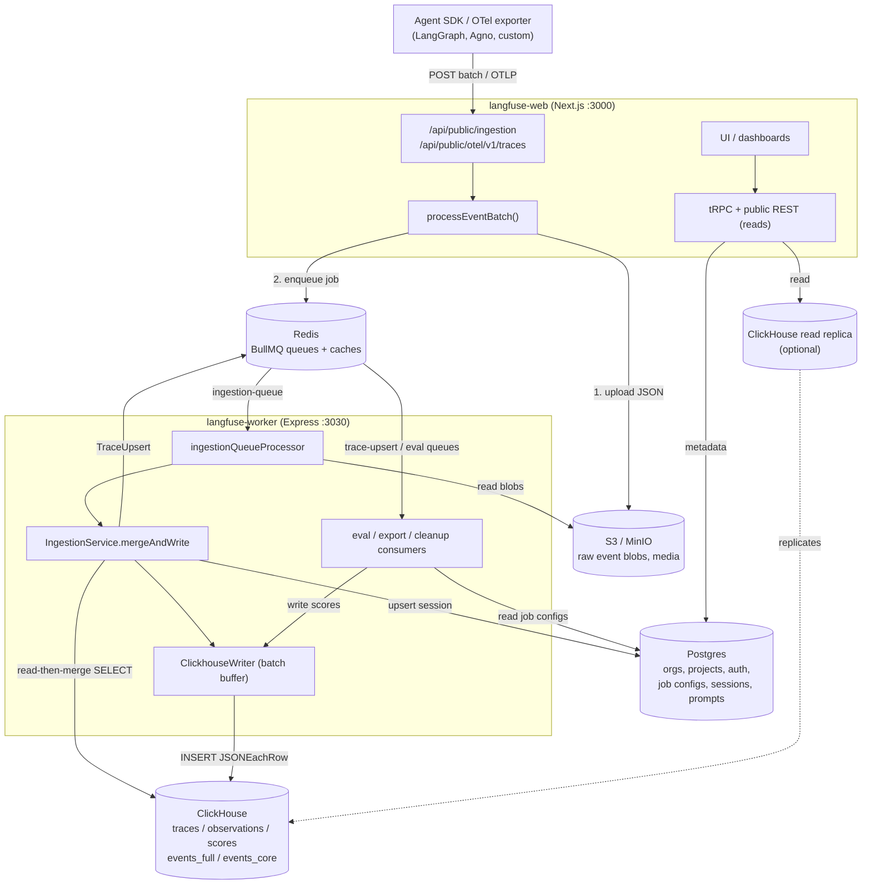
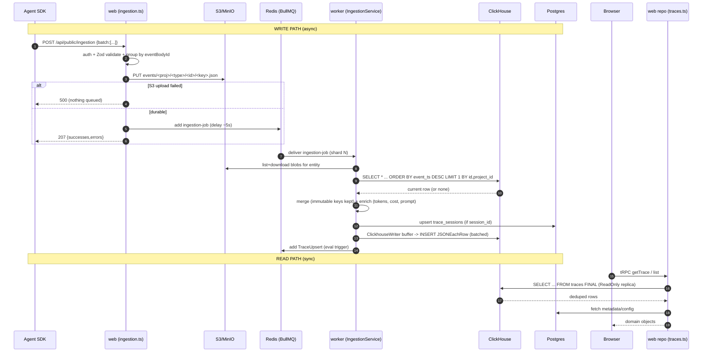

# Langfuse v3 Architecture Overview — Services, Data Flow, Trace & Event Lifecycle

> Reverse-engineered by reading the actual source at `/Users/julien/Documents/Repos/langfuse` (v3.177.1). All paths below are repo-relative to that root.

## TL;DR

Langfuse v3 is a **two-process monorepo** (`web` Next.js + `worker` Express) sharing one library (`packages/shared`), backed by **five stateful services**: Postgres (metadata/config/auth), ClickHouse (traces/observations/scores/events — the analytical store), Redis (BullMQ queues + caches), S3/MinIO (raw event blobs + media), and an optional read-replica ClickHouse. The **write path is fully async**: SDK → ingestion API → S3 blob + Redis queue → worker → merge against ClickHouse → batched ClickHouse insert. The **read path is synchronous**: frontend → tRPC/REST in `web` → ClickHouse query (with `FINAL`/`LIMIT 1 BY` dedup) joined to Postgres metadata. The single most reusable idea for Tracely is the **immutable, OTel-shaped `events_full` table** (one row per span, `trace_id`/`span_id`/`parent_span_id`, tool calls, experiment columns) — a trace-native physical model that already encodes trajectories.

---

## 1. Runtime topology: every container/service

Source: `docker-compose.yml` (production reference), `docker-compose.build.yml` (local build).

| Service | Image | Ports | Role | Evidence |
|---|---|---|---|---|
| `langfuse-web` | `langfuse/langfuse:3` | `3000` | Next.js app: UI, tRPC, public REST + OTel ingestion endpoints, auth | `docker-compose.yml:71-88` |
| `langfuse-worker` | `langfuse/langfuse-worker:3` | `3030` | Express app: BullMQ consumers, all async processing, scheduled jobs | `docker-compose.yml:7-69` |
| `postgres` | `postgres:17` | `5432` | OLTP: orgs, projects, users, API keys, prompts, datasets, **job configurations (evals)**, sessions, models/prices | `docker-compose.yml:149-166` |
| `clickhouse` | `clickhouse/clickhouse-server` | `8123` (HTTP), `9000` (native) | OLAP: `traces`, `observations`, `scores`, `dataset_run_items_rmt`, `events_full`/`events_core`, blob log | `docker-compose.yml:90-109` |
| `redis` | `redis:7` | `6379` | BullMQ queues, rate-limit counters, dedup/seen caches, S3-slowdown flags. **`--maxmemory-policy noeviction`** (queues must not be evicted) | `docker-compose.yml:132-147` |
| `minio` | `chainguard/minio` | `9090→9000`, `9091→9001` | S3-compatible: raw event blobs (`events/` prefix), media (`media/`), batch exports (`exports/`) | `docker-compose.yml:111-130` |

Both app containers run the **same env block** (`&langfuse-worker-env`, merged via `<<: *langfuse-worker-env` at `docker-compose.yml:78`), i.e. they share the same DB/CH/Redis/S3 config. `web` adds `NEXTAUTH_SECRET` + `LANGFUSE_INIT_*` provisioning vars (`docker-compose.yml:79-88`).

**Optional / cloud-only services** (referenced in code, not in the OSS compose):
- **Read-replica ClickHouse**: `CLICKHOUSE_READ_ONLY_URL` and `CLICKHOUSE_EVENTS_READ_ONLY_URL` route reads away from the write node (`packages/shared/src/server/clickhouse/client.ts:109-125`). Three logical services: `"ReadWrite"`, `"ReadOnly"`, `"EventsReadOnly"`.
- **Redis Cluster / Sentinel**: `REDIS_CLUSTER_ENABLED`, `REDIS_SENTINEL_ENABLED` (`packages/shared/src/server/redis/redis.ts:183-236`).
- **Azure Blob / OCI / GCS** as S3 alternatives (`LANGFUSE_USE_AZURE_BLOB`, `LANGFUSE_USE_OCI_NATIVE_OBJECT_STORAGE` — `docker-compose.yml:33-35`).
- **Stripe** for cloud metering/spend-alert queues (`worker/src/app.ts:390-452`).

### Monorepo wiring
`pnpm-workspace.yaml:1-6` declares workspaces `web`, `worker`, `packages/**`, `ee`. `packages/shared` is imported as `@langfuse/shared` (client-safe) and `@langfuse/shared/src/server` (server-only: queues, ClickHouse, repositories, ingestion). Turbo orchestrates builds; `db:generate` (Prisma) is a dependency of `build`/`dev`/`typecheck` (`turbo.json:11-65`). Both apps are deployed as Linux Alpine Docker images (`README.md:247`).

```
                         packages/shared  (@langfuse/shared, @langfuse/shared/src/server)
                         ├─ queues.ts (QueueName, QueueJobs, Zod payloads)
                         ├─ server/redis/*  (BullMQ queue classes, sharding)
                         ├─ server/clickhouse/*  (client, schema)
                         ├─ server/ingestion/processEventBatch.ts  (write entrypoint)
                         └─ server/repositories/*  (read entrypoint: traces/observations/scores)
                                   ▲                                   ▲
                  imported by      │                                   │  imported by
            ┌──────────────────────┴───────────┐         ┌─────────────┴──────────────────┐
            │  web  (Next.js, port 3000)        │         │  worker  (Express, port 3030)   │
            │  - public REST + OTel ingest      │         │  - BullMQ consumers             │
            │  - tRPC + REST reads              │         │  - IngestionService merge       │
            │  - Next.js UI / dashboards        │         │  - ClickhouseWriter batch flush │
            └───────────────────────────────────┘         │  - eval/export/cleanup jobs     │
                                                           └─────────────────────────────────┘
```

---

## 2. The two app processes

### 2.1 `web` (Next.js)
Bootstraps via `web/src/instrumentation.ts` → on `NEXT_RUNTIME === "nodejs"` it imports `./observability.config` then `./initialize` (`web/src/instrumentation.ts:10-14`). Observability = OpenTelemetry `NodeSDK` exporting OTLP traces, with **trace sampling** via `TraceIdRatioBasedSampler(env.OTEL_TRACE_SAMPLING_RATIO)` (`web/src/observability.config.ts:79`), plus instrumentations for HTTP, Prisma, AWS SDK, Winston, IORedis, BullMQ. `web` writes data **only** through `processEventBatch`; it never inserts into ClickHouse on the hot path.

Key ingestion endpoints (Next.js Pages API):
- `web/src/pages/api/public/ingestion.ts` — the Langfuse-native batch endpoint (`POST`, body limit `4.5mb` at line 26-32).
- `web/src/pages/api/public/otel/v1/traces/index.ts` — OTLP/HTTP traces (protobuf + JSON), the **OpenTelemetry-compatible** path.

### 2.2 `worker` (Express)
`worker/src/index.ts` imports `./instrumentation` first, then `./app`, then `app.listen(env.PORT, env.HOSTNAME)` (`worker/src/index.ts:1-8`). `worker/src/app.ts` is a giant **conditional queue-registration manifest**: each `QUEUE_CONSUMER_*_IS_ENABLED` env flag gates a `WorkerManager.register(QueueName.X, processor, opts)` call. The worker also runs **scheduled/background loops** outside BullMQ: background migrations (`worker/src/app.ts:114-119`), `ClickhouseReadSkipCache` init (`:122-126`), and several "cleaner" classes for batch deletion / retention / queue metrics (`:637-714`).

`worker/src/initialize.ts` seeds Postgres on boot: default model prices, managed evaluators, Langfuse dashboards (`worker/src/initialize.ts:5-7`).

**Instrumentation differences:** worker omits the sampler (ingests 100% of its own spans) and adds `ExpressInstrumentation` (`worker/src/instrumentation.ts:56`). Both set `BullMQInstrumentation({ useProducerSpanAsConsumerParent: true })` (`worker/src/instrumentation.ts:68`) so a producer span (web) becomes the parent of the consumer span (worker) — **distributed tracing across the queue boundary**.

---

## 3. The queue layer (Redis + BullMQ)

`QueueName` enum (`packages/shared/src/server/queues.ts:324-361`) defines **35+ queues**. The ones on the trace hot path:

| Queue | String value | Purpose | Source |
|---|---|---|---|
| `IngestionQueue` | `ingestion-queue` | "Process single events with S3-merge" | `queues.ts:336` |
| `IngestionSecondaryQueue` | `secondary-ingestion-queue` | Isolate high-throughput / S3-throttled projects | `queues.ts:337` |
| `OtelIngestionQueue` | `otel-ingestion-queue` | OTLP spans → Langfuse events | `queues.ts:334` |
| `TraceUpsert` | `trace-upsert` | "Ingestion pipeline adds events on each Trace upsert" → triggers evals | `queues.ts:325` |
| `CreateEvalQueue` | `create-eval-queue` | Materialize eval job-executions from configs | `queues.ts:353` |
| `EvaluationExecution` | `evaluation-execution-queue` | Run LLM-as-judge / eval jobs | `queues.ts:328` |
| `LLMAsJudgeExecution` / `CodeEvalExecution` | … | Observation-scoped evals | `queues.ts:330-331` |

Each job payload is a **Zod-validated, discriminated schema** (`queues.ts:15-322`), and `TQueueJobTypes` (`queues.ts:399-578`) maps queue → `{ timestamp, id, payload, name }`. Many jobs carry a `retryBaggage: { originalJobTimestamp, attempt }` (`queues.ts:317-322`) for idempotent retries across redeploys.

### 3.1 Sharding
Hot queues are **horizontally sharded**. `IngestionQueue.getShardNames()` produces `ingestion-queue`, `ingestion-queue-1`, … up to `LANGFUSE_INGESTION_QUEUE_SHARD_COUNT` (`packages/shared/src/server/redis/ingestionQueue.ts:18-23`). Shard selection: `getShardIndex(shardingKey, shardCount)` = `SHA-256(key) % shardCount` (`packages/shared/src/server/redis/sharding.ts:9-20`); the sharding key is `${projectId}-${eventBodyId}` (`processEventBatch.ts:284`). **Sharding only activates when `REDIS_CLUSTER_ENABLED === "true"`** — otherwise everything lands on shard 0 (`ingestionQueue.ts:52-56`). The worker registers one BullMQ `Worker` per shard name (`worker/src/app.ts:362-374`).

### 3.2 Worker registration & resilience
`WorkerManager.register` (`worker/src/queues/workerManager.ts:127-185`) creates a dedicated Redis connection per worker, wraps the processor in `metricWrapper` (records wait-time, processing-time, queue depth gauges — `:41-110`), and attaches `failed`/`error` handlers that push to a Sentry-style `traceException`. Default ingestion job options: `removeOnComplete: true`, `removeOnFail: 100_000`, `attempts: 6`, exponential backoff 5s (`ingestionQueue.ts:73-82`).

---

## 4. WRITE PATH (the async ingestion pipeline)

This is the architecturally important half. Trace data is **never written synchronously**.

### 4.1 Stage 1 — API validation (`web`)
`processEventBatch(input, authCheck, options)` (`packages/shared/src/server/ingestion/processEventBatch.ts:104`):
1. Auth scope check (`projectId` required, `:147-149`); per-event Zod parse (`:155-178`); per-event authorization by `accessLevel` (`isAuthorized`, `:358-374`).
2. `SDK_LOG` events are logged and dropped (`:180-186`).
3. **Sort**: updates (`GENERATION_UPDATE`, `SPAN_UPDATE`, `OBSERVATION_UPDATE`) sorted last; everything else by timestamp asc (`sortBatch`, `:379-398`). This guarantees creates precede updates within a batch.
4. **Group by `eventBodyId`**: key = `${clickhouseEntityType}-${body.id}` (`:192-221`) so all events for one entity (e.g. a generation's create+update) become one S3 file and one queue job.

### 4.2 Stage 2 — S3 upload + enqueue (`web`)
5. **Blocking, non-failing S3 upload** of each group as JSON: path `${LANGFUSE_S3_EVENT_UPLOAD_PREFIX}${projectId}/${entityType}/${eventBodyId}/${key}.json` (`:227-265`). If any upload rejects, the **whole batch throws** (`:268-272`) — S3 is the source of truth; nothing is queued unless the blob is durable. S3 `SlowDown` errors flag the project for the secondary queue (`:248-258`).
6. **Sampling** decision (`isTraceIdInSample`, `:300-319`) can drop the event before enqueue.
7. **Enqueue one job per group** to the right `IngestionQueue` shard, payload = `{ data: { type, eventBodyId, fileKey, skipS3List, forwardToEventsTable }, authCheck }` (`:321-347`). A **delay** is applied (`getDelay`, `:62-82`): default 5s (`Math.min(5000, …)`) to collapse rapid updates, larger near UTC midnight to avoid date-partition races.
8. Returns HTTP `207` with per-event `successes`/`errors` (`web/src/pages/api/public/ingestion.ts:139`).

### 4.3 Stage 3 — worker consumes & merges
`ingestionQueueProcessorBuilder` (`worker/src/queues/ingestionQueue.ts:29`):
9. Optional **dedup**: if `LANGFUSE_ENABLE_REDIS_SEEN_EVENT_CACHE`, a Redis key `langfuse:ingestion:recently-processed:<proj>:<type>:<id>:<fileKey>` short-circuits reprocessing (`:84-106`, set with 5-min TTL at `:241-261`).
10. Optional **secondary-queue redirect** for throttled projects (`:108-133`).
11. **Download** all event files for the entity from S3 (lists the `eventBodyId/` prefix, or direct-downloads a single file when `skipS3List`) and parses them into one array (`:149-206`).
12. Calls `new IngestionService(redis, prisma, clickhouseWriter, clickhouseClient()).mergeAndWrite(entityType, projectId, eventBodyId, firstS3WriteTime, events, forwardToEventsTable)` (`:273-285`).

### 4.4 Stage 4 — the merge (`IngestionService`)
`mergeAndWrite` dispatches by entity type to `processTraceEventList` / `processObservationEventList` / `processScoreEventList` / `processDatasetRunItemEventList` (`worker/src/services/IngestionService/index.ts:148-194`).

The **read-then-merge** pattern (using `processTraceEventList` as the example, `:592-667`):
- Time-sort the events; build candidate records (`:608-615`).
- Pick the **last non-null** `input`/`output` across events (`:617-627`).
- **Read the current record from ClickHouse**: `getClickhouseRecord` issues `SELECT * FROM <table> WHERE project_id=… AND id=… ORDER BY event_ts DESC LIMIT 1 BY id, project_id` (`:1425-1436`). This can be **skipped** per-project via `ClickhouseReadSkipCache` (`:1395-1405`) when a project is known to never send updates — a key throughput optimization.
- **Merge** new events over the existing CH record; **immutable keys** (`id`, `project_id`, `timestamp`, `created_at`, `environment`) are never overwritten (`immutableEntityKeys`, `:85-134`).
- Enqueue the merged record into `ClickhouseWriter` (`:667`).
- **Side effects**: upsert `trace_sessions` into Postgres (`:676-689`); optionally dual-write a synthetic "trace-as-span" into `observations_batch_staging` (`:691-702`); and — critically — **enqueue `TraceUpsert` for eval processing** unless `hasNoEvalConfigsCache` says the project has no evaluators (`:704-729`).

Observation enrichment (`createEventRecord`, `:211-388`) does prompt lookup by name+version, model matching, **tokenization + cost calculation** (`getGenerationUsage`/`calculateUsageCosts`, `:1282-1354`), and metadata flattening — i.e. derived metrics are computed at ingest time and stored.

### 4.5 Stage 5 — batched ClickHouse write (`ClickhouseWriter`)
A **singleton in-memory buffer** per worker (`worker/src/services/ClickhouseWriter/index.ts:32-78`). One queue array per target table (`:50-59`). It flushes when **either** a table buffer reaches `LANGFUSE_INGESTION_CLICKHOUSE_WRITE_BATCH_SIZE` (`addToQueue`, `:548-566`) **or** the `LANGFUSE_INGESTION_CLICKHOUSE_WRITE_INTERVAL_MS` timer fires (`start`, `:80-96`). Writes use `INSERT … FORMAT JSONEachRow` with `async_insert=1, wait_for_async_insert=1` (`:568-602`, `client.ts:203-204`). Failure handling is sophisticated: retry on socket-hang-up, **split the batch in half** on JS string-length errors, **truncate oversized fields** on CH "json object too large", and re-enqueue with incremented attempt count up to `maxAttempts` before dropping (`flush`, `:356-546`). Target tables enum (`TableName`, `:605-614`): `traces`, `traces_null`, `scores`, `observations`, `observations_batch_staging`, `blob_storage_file_log`, `dataset_run_items_rmt`, `events_full`.

```
SDK / OTLP
   │  POST batch                         WEB CONTAINER
   ▼
ingestion.ts ──► processEventBatch
   │  1. validate + auth (Zod)
   │  2. group by eventBodyId
   │  3. upload JSON blobs ───────────────────────────────────────────► S3 (events/<proj>/<type>/<id>/<key>.json)
   │  4. enqueue 1 job/group  (delay ~5s)
   ▼
Redis ── ingestion-queue[-N] ──────────────────────────────────────────────────────────────────┐
                                                                                                  │
   WORKER CONTAINER                                                                               ▼
ingestionQueueProcessor
   │  5. (seen-cache? secondary-redirect?)
   │  6. list+download blobs ◄────────────────────────────────────────── S3
   │  7. IngestionService.mergeAndWrite
   │        ├─ getClickhouseRecord  (SELECT … ORDER BY event_ts DESC LIMIT 1 BY id,project_id) ◄── ClickHouse
   │        ├─ merge (immutable keys preserved) + enrich (tokens, cost, prompt)
   │        ├─ upsert trace_sessions ──────────────────────────────────► Postgres
   │        ├─ ClickhouseWriter.addToQueue(traces|observations|scores|events_full)
   │        └─ TraceUpsertQueue.add  ──► Redis (trace-upsert) ──► eval pipeline
   ▼
ClickhouseWriter (batch buffer, flush on size OR interval)
   │  INSERT … FORMAT JSONEachRow (async_insert=1)
   ▼
ClickHouse (ReplacingMergeTree dedup on background merge)
```

---

## 5. READ PATH (synchronous, from `web`)

Reads bypass the queue entirely. The frontend calls **tRPC** (`web/src/pages/api/trpc/*`) or **public REST** (`web/src/pages/api/public/*`), which call repository functions in `packages/shared/src/server/repositories/*` (`traces.ts`, `observations.ts`, `scores.ts`). Those issue parametrized ClickHouse SQL.

The central problem: ClickHouse `ReplacingMergeTree` only deduplicates on **background merges**, so a freshly-updated row may transiently coexist with its older version. Reads solve this two ways:
- **`FINAL`** — forces merge-on-read for correctness on detail/aggregation queries (`traces.ts:1295`, `:1402`, `:1444`, `:1466`).
- **`LIMIT 1 BY id, project_id`** after `ORDER BY … timestamp/event_ts` — cheaper "latest row per id" without full `FINAL` (`traces.ts:920`; same pattern in the ingestion read at `IngestionService/index.ts:1433`).
- Some hot existence checks **deliberately skip `FINAL`** to trade correctness for speed (`traces.ts:166` comment: "We skip FINAL here … we consider this truthy"; `:1633`).

Reads are routed to a **read replica** when configured: repository calls pass `preferredClickhouseService: "ReadOnly"` (`traces.ts:881`), which `ClickHouseClientManager.getClickhouseUrl` maps to `CLICKHOUSE_READ_ONLY_URL` (`client.ts:109-125`). The newer events tables can target a separate `EventsReadOnly` node with full-text-index settings enabled (`client.ts:88-101`).

Trace + observation rows are then **joined to Postgres metadata** (e.g. dataset/run names, scores configs) and converted to domain objects via `*_converters.ts` before reaching the UI.

```
Browser ──► web (tRPC / REST)
              │  repository fn (traces.ts / observations.ts / scores.ts)
              ▼
         queryClickhouse(...)  ── preferredClickhouseService: "ReadOnly"
              │  SELECT … FROM traces FINAL   |   ORDER BY … LIMIT 1 BY id, project_id
              ▼
         ClickHouse (read replica if CLICKHOUSE_READ_ONLY_URL set)
              │  + join Postgres for metadata/config
              ▼
         domain objects ──► UI / dashboards
```

---

## 6. ClickHouse physical model — the merge engine

All hot tables use **`(Replicated)ReplacingMergeTree(event_ts, is_deleted)`**: dedup by sort key, keep the row with the highest `event_ts`, and treat `is_deleted=1` as a tombstone. This is how "updates" and "soft deletes" work without UPDATE statements.

**`traces`** (`packages/shared/clickhouse/migrations/clustered/0001_traces.up.sql`):
- Columns incl. `id, timestamp, name, user_id, metadata Map(LowCardinality(String),String), session_id, input/output Nullable(String) CODEC(ZSTD(3)), tags Array(String), event_ts, is_deleted` (`:1-19`).
- `ENGINE = ReplicatedReplacingMergeTree(event_ts, is_deleted) PARTITION BY toYYYYMM(timestamp)`, `ORDER BY (project_id, toDate(timestamp), id)` (`:23-32`). Bloom-filter indexes on `id` and metadata keys/values (`:20-22`).

**`observations`** (`0002_observations.up.sql`): the per-span record — `trace_id, parent_observation_id, type, start_time/end_time, usage_details Map(...,UInt64), cost_details Map(...,Decimal64(12)), total_cost, prompt_id/name/version, internal_model_id` (`:1-31`). `PARTITION BY toYYYYMM(start_time)`, `ORDER BY (project_id, type, toDate(start_time), id)` (`:35-46`).

**`scores`** (`0003_scores.up.sql`) and **`dataset_run_items_rmt`** (`0024_dataset_run_items.up.sql`) follow the same engine.

### 6.1 The `events_full` / `events_core` model (the trace-native rewrite)
Defined (still experimental, hence in a script not a numbered migration) in `packages/shared/clickhouse/scripts/dev-tables.sh:137-281`. **This is the most relevant artifact for Tracely.** Design intent (verbatim comment, `:132-134`): *"Create new events table … We expect this to be fully immutable and eventually replace observations."*

`events_full` is **one row per span**, OTel-shaped:
- Trace topology: `project_id, trace_id, span_id, parent_span_id, is_app_root Bool` (`:139-143`, `:160`) — i.e. the **trajectory is explicit in the table** via parent pointers.
- Span data: `name, type, start_time DateTime64(6), end_time, level, status_message, completion_start_time`.
- **Trace-level denormalized onto every span**: `trace_name, user_id, session_id, tags, bookmarked, public` (`:153-164`) — so any span row self-describes its trace.
- LLM call fields: `model_id, provided_model_name, model_parameters, usage_details, cost_details` (+ materialized `calculated_input/output/total_cost`, `:177-184`).
- **Tool calls as first-class columns**: `tool_definitions Map(String,String), tool_calls Array(String), tool_call_names Array(String)` (`:189-193`).
- **Experiment / dataset columns inline**: `experiment_id, experiment_name, experiment_dataset_id, experiment_item_id, experiment_item_expected_output, experiment_item_root_span_id` (`:204-217`) — the dataset-run linkage is baked into the event row.
- **Instrumentation source**: `source LowCardinality(String), service_name, scope_name, telemetry_sdk_language/name/version` (`:218-226`) — distinguishes OTel vs native SDK vs experiment dual-write (`source` computed via `multiIf(...)` at `:650`/`:721`).
- **Full-text search** indexes on `input`/`output`/`metadata` via `TYPE text(tokenizer = splitByNonAlpha)` (`:243-254`).
- `ENGINE = ReplacingMergeTree(event_ts, is_deleted)`, `PARTITION BY toYYYYMM(start_time)`, `ORDER BY (project_id, toStartOfMinute(start_time), xxHash32(trace_id), span_id, start_time)`, `SAMPLE BY xxHash32(trace_id)` (`:268-273`) — **co-locates all spans of a trace** so reconstructing a full trajectory is a contiguous range scan.

`events_core` (`:285-411`) is a **lighter projection** populated by a ClickHouse **materialized view** `events_core_mv` (`:414-482`) that truncates `input`/`output`/`metadata` to 200 chars (`leftUTF8(input, 200)`) for fast list/dashboard queries. Schema constant `ClickhouseTableNames` confirms the trio `events_proto` (UI column-mapping placeholder), `events_core`, `events_full` (`packages/shared/src/server/clickhouse/schema.ts:1-33`). The ingestion writer's primary target is `events_full`, with the MV auto-populating `events_core` (comment at `ClickhouseWriter/index.ts:613`).

How rows get there today (dual-write transition): a trace is converted to a synthetic span (`span_id = 't-' + trace_id`) and staged in `observations_batch_staging` (3-minute partitions, 12h TTL — `dev-tables.sh:81-130`), then batch-propagated to `events_full`; observations and traces are joined to `dataset_run_items_rmt` to fill experiment columns (`dev-tables.sh:583-730`).

---

## 7. Event & trace lifecycle (precise)

**Event lifecycle** (single ingestion event):
1. **Created** by SDK; POSTed in a `batch` array.
2. **Validated + grouped** by `eventBodyId` in `web` (`processEventBatch`).
3. **Persisted raw** to S3 as JSON (immutable record of exactly what was sent).
4. **Enqueued** (one job per entity-group) to a sharded `ingestion-queue`, with a delay.
5. **Consumed** by worker; all blobs for the entity re-read from S3.
6. **Merged** with the latest ClickHouse row (read-then-write), enriched (tokens/cost/prompt).
7. **Buffered** in `ClickhouseWriter`, flushed in batches via async insert.
8. **Deduplicated** lazily by ClickHouse `ReplacingMergeTree` on background merge; reads use `FINAL`/`LIMIT 1 BY` to see the latest version immediately.

**Trace lifecycle**: a trace is the aggregate of its `traces` row + N `observations` rows + M `scores`, all sharing `trace_id`. Because each entity is processed independently and merged, a trace **materializes incrementally** and is queryable the moment any part lands. After every trace upsert, the worker enqueues `TraceUpsert` (`IngestionService/index.ts:723-729`), and `evalJobTraceCreatorQueueProcessor` calls `createEvalJobs({ sourceEventType: "trace-upsert", … })` (`worker/src/queues/evalQueue.ts:25-44`) — **evaluation is derived from the trace, not from a pre-curated dataset**. `createEvalJobs` fetches Postgres `jobConfiguration` rows (`jobType: "EVAL"`), evaluates their filters against the trace, and schedules `EvaluationExecution` jobs (`worker/src/features/evaluation/evalService.ts:180-389`).

---

## 8. Cross-process distributed tracing & graceful shutdown

- Web→worker spans are linked: BullMQ producer spans become consumer-span parents (`useProducerSpanAsConsumerParent: true`, both `instrumentation.ts:68`). Langfuse-internal context is propagated via `contextWithLangfuseProps` on ingestion (`web/src/pages/api/public/ingestion.ts:96-102`) and injected into ClickHouse HTTP headers (`client.ts:142-145`).
- **Shutdown ordering matters** (`worker/src/utils/shutdown.ts`, invoked on SIGINT/SIGTERM at `worker/src/app.ts:716-717`): stop cleaners → `WorkerManager.closeWorkers()` (line 56, stop pulling new jobs) → `ClickhouseWriter.getInstance().shutdown()` (line 62, **flush remaining buffered rows**) → `redis?.disconnect()` (65) → `prisma.$disconnect()` (68). The flush-before-disconnect guarantees in-memory batches aren't lost on deploy.

---

## 9. Relevance to Tracely

**STEAL (directly reusable, trace-native, agent-agnostic):**

1. **`events_full` as the canonical span table.** It is already Tracely's data model: `trace_id`/`span_id`/`parent_span_id` encode the **trajectory/DAG** (handoffs, planner→executor, sub-agent calls are just parent links); `tool_calls`/`tool_definitions`/`tool_call_names` are first-class; `source`/`service_name`/`telemetry_sdk_*` capture LangGraph/Agno/OTel provenance; `ORDER BY (project_id, …, xxHash32(trace_id), span_id)` co-locates a whole agent run for cheap trajectory reads. Tracely's Agent/AgentVersion/AgentRun/Turn/Step/ToolCall entities map onto span `type` + `parent_span_id` + a few added columns (e.g. `agent_id`, `agent_version_id`, `turn_id`). `is_app_root` already marks the root span.
2. **Async write architecture: S3-as-source-of-truth + Redis queue + batched ClickHouse insert.** The "upload blob first, never queue unless durable" rule (`processEventBatch.ts:268-272`) and the `ClickhouseWriter` batch-on-size-or-interval buffer (`ClickhouseWriter/index.ts`) are exactly what a high-volume trace ingest needs. Keep it.
3. **`ReplacingMergeTree(event_ts, is_deleted)` + `FINAL`/`LIMIT 1 BY` reads.** Gives upsert + soft-delete semantics on an append-only OLAP store. Tracely should reuse this verbatim for spans/scores.
4. **The trace→eval trigger (`TraceUpsert` queue).** Langfuse already fires evaluation off **production trace upserts**, not off a dataset import. This is the seed of Tracely's "production trace → regression test." The plumbing (sharded trigger queue, `hasNoEvalConfigsCache` short-circuit, retry baggage) is reusable.
5. **Sharded BullMQ + `WorkerManager` + per-queue concurrency/limiter knobs.** A clean, observable async-worker framework.
6. **OTLP ingestion endpoint** (`otel/v1/traces`) + `OtelIngestionProcessor`. Tracely is "OpenTelemetry-compatible" — this is a ready-made front door for LangGraph/Agno/custom OTel SDKs.

**ADAPT (right architecture, wrong altitude for an agent-first product):**

7. **Eval is config-first, not trace-first.** Langfuse `createEvalJobs` starts from Postgres `jobConfiguration` rows and *filters traces into them* (`evalService.ts:191-389`). It is **trace-triggered but dataset/config-centric**, and evaluators target a single trace or single observation. Tracely wants the inverse: a **failure detected in a trajectory becomes the test**, and evals run at conversation/turn/step/tool/agent/multi-agent levels over the *whole trajectory*. Reuse the `TraceUpsert` trigger and the BullMQ executor shell; **replace** the config-fetch-and-filter core with trajectory-level failure detection + regression-case generation.
8. **No first-class "Agent / Agent Version / Conversation / Turn / Failure Cluster" entities.** Langfuse has `trace`, `observation`, `score`, `dataset_run_item`, `session` (sessions ≈ conversations, but thin — just an id upserted into Postgres at `IngestionService/index.ts:676-689`). Tracely must add these as new dimensions, ideally as columns on `events_full` (cheap) plus Postgres tables for Agent/AgentVersion registry and Failure Cluster metadata.

**IGNORE (Langfuse-specific distractions for our thesis):**

9. **Prompt management** (`PromptService`, `prompt_id/name/version` enrichment), **dataset-first experiments** (`dataset_run_items_rmt`, `ExperimentCreate` queue), cloud **billing/metering/spend-alert** queues (`worker/src/app.ts:390-452`), PostHog/Mixpanel/Blob integrations, and the `traces_null`/legacy AggregatingMergeTree migrations. These are product surface area, not architecture we need.

**Open design tension to carry forward:** Langfuse's `traces` + `observations` (two tables, mutable-via-merge) vs. `events_full` (one immutable span table) is a live migration *inside Langfuse*. Tracely should **start on the `events_full` model** and skip the legacy split entirely — but note that `events_full` still uses `ReplacingMergeTree` (not truly immutable yet) to support late-arriving updates to a span, so "immutable" is aspirational even here.

---

### Appendix A — Component diagram (mermaid)



### Appendix B — Ingestion + read sequence (mermaid)


