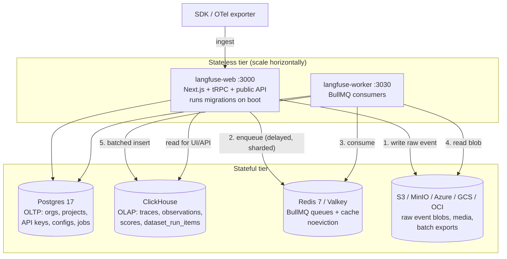
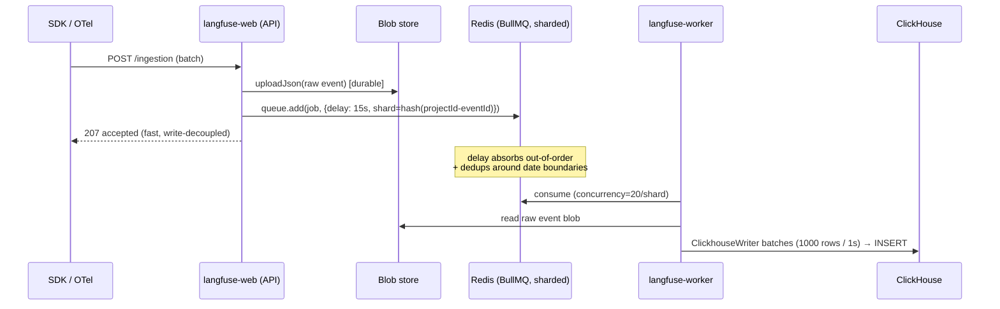

# Langfuse v3.177.1 — Infrastructure Configuration & Scaling Strategy

> Reverse-engineered from the actual local source at `/Users/julien/Documents/Repos/langfuse` (version `v3.177.1`, per `packages/shared/src/constants/VERSION.ts:1`). All paths below are repo-relative to that root.

## TL;DR

Langfuse runs as **two stateless Node.js 24 containers** (`langfuse/langfuse:3` web, `langfuse/langfuse-worker:3` worker) backed by **four stateful services**: Postgres (transactional/OLTP), ClickHouse (analytics/trace store), Redis/Valkey (BullMQ queues + cache), and an S3-compatible blob store (the durable event landing zone). The entire deployment is driven by a **Zod-validated env-var surface** split across `packages/shared/src/env.ts` (478 lines, shared), `worker/src/env.ts` (474 lines, worker), and `web/src/env.mjs`. Single-node vs clustered is a **pure config toggle**: `CLICKHOUSE_CLUSTER_ENABLED` swaps the migration directory (`unclustered/` → `clustered/`, `ReplacingMergeTree` → `ReplicatedReplacingMergeTree`), and `REDIS_CLUSTER_ENABLED` switches ioredis from a single client to a `Cluster` and turns on **hash-tag queue prefixes + consistent-hash queue sharding**. Notably, ClickHouse "clustered" here means **replication for HA, not sharding** — there are zero `Distributed` tables in the entire migration set.

---

## 1. Container Images & Required Services

### 1.1 The application images (stateless)

Built from `web/Dockerfile` and `worker/Dockerfile`. Both:
- Base on `node:24-alpine` (`web/Dockerfile:2`, `worker/Dockerfile:2`); `.nvmrc` pins `v24.6.0`.
- Use a multi-stage build: `turbo prune --scope=web|worker --docker` (pruner) → `pnpm install --frozen-lockfile` (builder) → minimal runner. Turbo is pinned to `2.9.14`, pnpm to `11.1.3` (`web/Dockerfile:10-14`).
- Compile the **golang-migrate** ClickHouse CLI from source in a `golang:1.26` stage with only the `clickhouse` build tag, to avoid CVEs from prebuilt multi-driver binaries (`web/Dockerfile:23-35`).
- Wrap the process in `dumb-init` and an `entrypoint.sh` that runs DB migrations before exec'ing the app (`web/Dockerfile:181`, `worker/Dockerfile:99-102`).

| Image (published) | Compose service | Port | Entrypoint → CMD | Source |
|---|---|---|---|---|
| `docker.io/langfuse/langfuse:3` | `langfuse-web` | `3000` | `dumb-init → web/entrypoint.sh` → `node ./web/server.js --keepAliveTimeout 110000` | `docker-compose.yml:71-76`, `web/Dockerfile:181-188` |
| `docker.io/langfuse/langfuse-worker:3` | `langfuse-worker` | `3030` | `dumb-init → worker/entrypoint.sh` → `node worker/dist/index.js` | `docker-compose.yml:7-20`, `worker/Dockerfile:94-102` |

The **web container is the migration runner**. `web/entrypoint.sh` runs, in order: `prisma db execute … cleanup.sql`, `prisma migrate deploy` (Postgres), then `sh ./clickhouse/scripts/up.sh` (ClickHouse) — each gated by `LANGFUSE_AUTO_POSTGRES_MIGRATION_DISABLED` / `LANGFUSE_AUTO_CLICKHOUSE_MIGRATION_DISABLED`. The worker's `entrypoint.sh` only normalizes `DATABASE_URL` and does **not** migrate (`worker/entrypoint.sh`). The web CMD conditionally wraps startup in `dd-trace` when `NEXT_PUBLIC_LANGFUSE_CLOUD_REGION` is set (`web/Dockerfile:184-188`) — a Cloud-only path.

Health endpoints: web `GET /api/public/health` (`docker-compose.build.yml:60`), worker `GET /api/health` on `:3030` (`docker-compose.build.yml:78`). The worker is a full Express app (`worker/src/app.ts:3`) whose primary job is hosting BullMQ consumers, not serving traffic.

### 1.2 The stateful services & pinned versions

From `docker-compose.yml` (production reference compose):

| Service | Image | Default version | Healthcheck | Ports (bound to 127.0.0.1) |
|---|---|---|---|---|
| `postgres` | `docker.io/postgres:${POSTGRES_VERSION:-17}` | **17** | `pg_isready -U postgres` | `5432` |
| `clickhouse` | `docker.io/clickhouse/clickhouse-server` | unpinned (`:latest`); dev compose pins **`24.3`** | `wget … :8123/ping` | `8123` (HTTP), `9000` (native) |
| `redis` | `docker.io/redis:7` | **7** | `redis-cli ping` | `6379` |
| `minio` | `cgr.dev/chainguard/minio` | unpinned | `mc ready local` | `9090→9000`, `9091→9001` |

`clickhouse` runs as user `101:101` and persists two volumes: `langfuse_clickhouse_data` and `langfuse_clickhouse_logs` (`docker-compose.yml:90-100`). `redis` is launched with `--requirepass ${REDIS_AUTH} --maxmemory-policy noeviction` — **noeviction is mandatory** because Redis holds durable BullMQ job state, not a disposable cache (`docker-compose.yml:136-137`). MinIO's command pre-creates the `langfuse` bucket on boot (`docker-compose.yml:116`).

The compose file's security model: only `langfuse-web:3000` and `minio:9090` are exposed on all interfaces; every other service binds `127.0.0.1` (`docker-compose.yml:1-5`).



---

## 2. The Env-Var Configuration Surface

Config is **schema-validated at process start** via Zod. `packages/shared/src/env.ts:475-478` parses `process.env` (after `removeEmptyEnvVariables`), except when `DOCKER_BUILD === "1"` (build-time bypass). Invalid/missing required vars crash the process — there is no silent default for `CLICKHOUSE_URL`, `CLICKHOUSE_USER`, `CLICKHOUSE_PASSWORD`, or `LANGFUSE_S3_EVENT_UPLOAD_BUCKET` (all non-optional in the schema).

### 2.1 Database (Postgres)

| Var | Default | Notes |
|---|---|---|
| `DATABASE_URL` | — (required) | Prisma connection URL; supports pooled (PgBouncer) |
| `DIRECT_URL` | `=DATABASE_URL` | Required for `prisma migrate deploy` (set in `web/entrypoint.sh`) |
| `SHADOW_DATABASE_URL` | optional | Prisma shadow DB |
| `POSTGRES_VERSION` | `17` | compose only |
| `LANGFUSE_AUTO_POSTGRES_MIGRATION_DISABLED` | unset | skip Prisma migration on boot |

(`.env.prod.example:6-13`, `web/entrypoint.sh`)

### 2.2 ClickHouse

The richest tuning surface (`packages/shared/src/env.ts:81-124`):

| Var | Default | Purpose |
|---|---|---|
| `CLICKHOUSE_URL` | required | HTTP endpoint `:8123` (read/write) |
| `CLICKHOUSE_MIGRATION_URL` | `clickhouse://clickhouse:9000` | native protocol for golang-migrate |
| `CLICKHOUSE_READ_ONLY_URL` / `CLICKHOUSE_EVENTS_READ_ONLY_URL` | optional | route reads to replicas (`client.ts:109-125`) |
| `CLICKHOUSE_CLUSTER_ENABLED` | `true` (worker + web schemas) | **toggles clustered DDL** |
| `CLICKHOUSE_CLUSTER_NAME` | `default` | passed as `ON CLUSTER <name>` macro |
| `CLICKHOUSE_DB` | `default` | |
| `CLICKHOUSE_MAX_OPEN_CONNECTIONS` | `25` | per-client HTTP pool (`client.ts:163`) |
| `CLICKHOUSE_KEEP_ALIVE_IDLE_SOCKET_TTL` | `9000` ms | (`client.ts:160-162`) |
| `CLICKHOUSE_ASYNC_INSERT_MAX_DATA_SIZE` / `_BUSY_TIMEOUT_MS` / `_BUSY_TIMEOUT_MIN_MS` | server default | throughput tuning; client always sets `async_insert: 1, wait_for_async_insert: 1` (`client.ts:168-204`) |
| `CLICKHOUSE_MAX_BYTES_BEFORE_EXTERNAL_GROUP_BY` | `32_000_000_000` (~32 GB) | spill-to-disk threshold |
| `CLICKHOUSE_LIGHTWEIGHT_DELETE_MODE` | `alter_update` | `alter_update` / `lightweight_update` / `lightweight_update_force` |

Note the **default skew**: both the worker (`worker/src/env.ts:110`) and web (`web/src/env.mjs:285`) schemas default `CLICKHOUSE_CLUSTER_ENABLED=true`, but **both compose files override to `false`** via `${CLICKHOUSE_CLUSTER_ENABLED:-false}` (`docker-compose.yml:32`, `docker-compose.build.yml:43`). So the out-of-box Docker experience is single-node; the schema default assumes the (clustered) Cloud deployment. Always set this explicitly. (`CLICKHOUSE_CLUSTER_ENABLED` is defined in the web/worker env schemas, not in shared `env.ts`.)

### 2.3 Redis / Valkey

`packages/shared/src/env.ts:20-57`. Three mutually-exclusive topologies:

| Group | Vars | Default |
|---|---|---|
| **Single node** | `REDIS_HOST`, `REDIS_PORT` (`6379`), `REDIS_AUTH`, `REDIS_USERNAME`, `REDIS_CONNECTION_STRING` | host-based |
| **Cluster** | `REDIS_CLUSTER_ENABLED` (`false`), `REDIS_CLUSTER_NODES` (`h:p,h:p,…`), `REDIS_CLUSTER_SLOTS_REFRESH_TIMEOUT` (`5000`) | off |
| **Sentinel** | `REDIS_SENTINEL_ENABLED` (`false`), `REDIS_SENTINEL_NODES`, `REDIS_SENTINEL_MASTER_NAME`, `REDIS_SENTINEL_USERNAME/PASSWORD` | off |
| **TLS** | `REDIS_TLS_ENABLED` + 9 `REDIS_TLS_*` knobs (CA/cert/key paths, servername, ciphers, …) | off |
| **Misc** | `REDIS_KEY_PREFIX` (multi-tenant), `REDIS_ENABLE_AUTO_PIPELINING` (`true`) | |

Cluster + Sentinel cannot both be `true` — `createNewRedisInstance` logs an error and returns `null` (`redis.ts:186-194`).

### 2.4 S3 / Blob storage

Three independent buckets, each with the same 8-var shape (`bucket`, `prefix`, `region`, `endpoint`, `access_key_id`, `secret_access_key`, `force_path_style`, `sse`/`sse_kms_key_id`):

| Bucket purpose | Prefix var | Required? | Source |
|---|---|---|---|
| **Event upload** (raw ingestion blobs) | `LANGFUSE_S3_EVENT_UPLOAD_*` (`PREFIX` default `events/`) | **bucket required** | `env.ts:215-225` |
| **Media upload** (images/audio in traces) | `LANGFUSE_S3_MEDIA_UPLOAD_*` (`PREFIX` default `media/`) | optional | `env.ts:226-236` |
| **Batch export** (UI exports) | `LANGFUSE_S3_BATCH_EXPORT_*` (`PREFIX` default `exports/`) | gated by `LANGFUSE_S3_BATCH_EXPORT_ENABLED` | `worker/src/env.ts:27-39` |
| **Core data export** (Cloud) | `LANGFUSE_S3_CORE_DATA_*` | gated by `..._IS_ENABLED` | `worker/src/env.ts:303-316` |

Backend selection (alternative clouds) — toggled in `StorageServiceFactory.getInstance` (`StorageService.ts:206-257`):
- `LANGFUSE_USE_AZURE_BLOB=true` → `AzureBlobStorageService`
- `LANGFUSE_USE_GOOGLE_CLOUD_STORAGE=true` (+ `LANGFUSE_GOOGLE_CLOUD_STORAGE_CREDENTIALS`) → `GoogleCloudStorageService`
- `LANGFUSE_USE_OCI_NATIVE_OBJECT_STORAGE=true` (+ `LANGFUSE_OCI_AUTH_TYPE` ∈ {workload_identity, instance_principal, resource_principal, oci_profile, session_token}) → `OCIObjectStorageService`
- else → `S3StorageService` (AWS S3 / MinIO; MinIO needs `FORCE_PATH_STYLE=true`)

Throughput knobs: `LANGFUSE_S3_CONCURRENT_WRITES` (`50`), `LANGFUSE_S3_CONCURRENT_READS` (worker, `50`), `LANGFUSE_S3_UPLOAD_MAX_CONCURRENT_PARTS` (`3`), `LANGFUSE_S3_LIST_MAX_KEYS` (`200`) (`env.ts:201-264`).

### 2.5 Auth

`web/src/env.mjs` (NextAuth). Core: `NEXTAUTH_URL`, `NEXTAUTH_SECRET`, `SALT` (API-key hashing), `ENCRYPTION_KEY` (must be 64 hex chars / 256 bits — enforced by `.length(64)` in `env.ts:58-64`). SSO is provider-grouped with ~10 providers (Google, GitHub, GitHub Enterprise, GitLab, Azure AD, Okta, Auth0, Cognito, Keycloak, WorkOS, custom OIDC, JumpCloud), each with `CLIENT_ID/SECRET/ISSUER/ALLOW_ACCOUNT_LINKING/...` (`.env.prod.example:65-151`). Behavior toggles: `AUTH_DISABLE_USERNAME_PASSWORD`, `AUTH_DISABLE_SIGNUP`, `AUTH_DOMAINS_WITH_SSO_ENFORCEMENT`, `AUTH_SESSION_MAX_AGE` (`.env.prod.example:58-63`).

### 2.6 Queues (BullMQ)

Per-queue **shard counts** (sharding only activates in Redis cluster mode — see §3.3) and **delay/attempt** tuning (`env.ts:125-178`):

| Var | Default |
|---|---|
| `LANGFUSE_INGESTION_QUEUE_DELAY_MS` | `15_000` |
| `LANGFUSE_INGESTION_QUEUE_SHARD_COUNT` / `_SECONDARY_QUEUE_SHARD_COUNT` | `1` |
| `LANGFUSE_OTEL_INGESTION_QUEUE_SHARD_COUNT` / secondary | `1` |
| `LANGFUSE_EVAL_EXECUTION_QUEUE_SHARD_COUNT` / secondary | `1` |
| `LANGFUSE_LLM_AS_JUDGE_EXECUTION_QUEUE_SHARD_COUNT` | `1` |
| `LANGFUSE_CODE_EVAL_EXECUTION_QUEUE_SHARD_COUNT` | `1` |
| `LANGFUSE_TRACE_UPSERT_QUEUE_SHARD_COUNT` | `1` |

Worker-side **consumer concurrency** + **on/off toggles** (`worker/src/env.ts:70-275`): every queue has a `QUEUE_CONSUMER_*_IS_ENABLED` flag (mostly default `true`; `DEAD_LETTER_RETRY` and `EVENT_PROPAGATION` default `false`) and a `*_WORKER_CONCURRENCY` / `*_PROCESSING_CONCURRENCY` integer. Key defaults: `LANGFUSE_INGESTION_QUEUE_PROCESSING_CONCURRENCY=20`, `LANGFUSE_TRACE_UPSERT_WORKER_CONCURRENCY=25`, `LANGFUSE_EVAL_EXECUTION_WORKER_CONCURRENCY=5`, batch-export/batch-action hard-coded to `concurrency: 1`.

ClickHouse write-batching (worker ingestion sink) — `worker/src/env.ts:90-101`, wired into `worker/src/services/ClickhouseWriter/index.ts:44-46`:
- `LANGFUSE_INGESTION_CLICKHOUSE_WRITE_BATCH_SIZE=1000`
- `LANGFUSE_INGESTION_CLICKHOUSE_WRITE_INTERVAL_MS=1000`
- `LANGFUSE_INGESTION_CLICKHOUSE_MAX_ATTEMPTS=3`

The `ClickhouseWriter` is a singleton with a `setInterval` flush loop (`index.ts:85-92`) that batches per-table inserts (`Traces`, `Observations`, `Scores`, `DatasetRunItems`, `EventsFull`, …) to amortize ClickHouse insert overhead.

### 2.7 Features / EE / ops

- **EE license**: `LANGFUSE_EE_LICENSE_KEY` (`env.ts:450`).
- **Experimental**: `LANGFUSE_ENABLE_EXPERIMENTAL_FEATURES` (`false`).
- **Caching**: `LANGFUSE_CACHE_API_KEY_*`, `LANGFUSE_CACHE_PROMPT_*` (`enabled`, `TTL_SECONDS`), `LANGFUSE_CACHE_MODEL_MATCH_*` (`env.ts:65-80`).
- **Rate limiting**: `LANGFUSE_RATE_LIMITS_ENABLED`.
- **Observability of Langfuse itself**: `OTEL_EXPORTER_OTLP_ENDPOINT` (`http://localhost:4318`), `OTEL_SERVICE_NAME`, `ENABLE_AWS_CLOUDWATCH_METRIC_PUBLISHING`, `LANGFUSE_LOG_LEVEL`, `LANGFUSE_LOG_FORMAT` (text/json).
- **Code-eval dispatcher**: `LANGFUSE_CODE_EVAL_DISPATCHER` ∈ {`insecure-local`, `aws-lambda`} with `LANGFUSE_CODE_EVAL_AWS_LAMBDA_*` function names (`env.ts:159-173`) — sandboxed code evaluation runs in Lambda in Cloud.
- **Auto-provisioning**: `LANGFUSE_INIT_ORG_ID/PROJECT_ID/PROJECT_PUBLIC_KEY/PROJECT_SECRET_KEY/USER_EMAIL/...` (`docker-compose.yml:80-88`) for one-shot bootstrap.

---

## 3. Horizontal Scaling Strategy by Tier

### 3.1 Stateless web — scale freely

`langfuse-web` is a standard Next.js standalone server. It holds no local state (sessions live in Postgres/JWT, cache in Redis). Scale by adding replicas behind a load balancer. **Caveat**: every replica runs migrations on boot via `web/entrypoint.sh`; Prisma `migrate deploy` and golang-migrate both take advisory/lock-based coordination, but rolling many replicas simultaneously can race — production deployments typically run migrations as a one-shot Job and disable them on the serving replicas (`LANGFUSE_AUTO_*_MIGRATION_DISABLED=true`). `--keepAliveTimeout 110000` is tuned to sit above typical ALB idle timeouts (`web/Dockerfile:185-187`).

### 3.2 Stateless worker — scale freely, tune per-queue

`langfuse-worker` registers one BullMQ `Worker` per queue (and **per shard**) in `worker/src/app.ts`. Each registration reads its concurrency from env and gets its **own Redis connection** (`WorkerManager.register`, `workerManager.ts:127-155`). Two independent scaling axes:
1. **Replicas** — add worker containers; BullMQ distributes jobs across all consumers of a queue.
2. **Concurrency** — raise `*_WORKER_CONCURRENCY` per queue within a container.
3. **Selective consumers** — set `QUEUE_CONSUMER_*_IS_ENABLED=false` to dedicate a worker pool to a subset of queues (e.g., a fleet that only does ingestion, another only evals). This is how you isolate noisy-neighbor workloads.

```
worker/src/app.ts (boot)
 ├─ if QUEUE_CONSUMER_INGESTION_QUEUE_IS_ENABLED:
 │     IngestionQueue.getShardNames() → ["ingestion-queue","ingestion-queue-1",…]
 │     for each shard → WorkerManager.register(shard, processor,
 │                         { concurrency: LANGFUSE_INGESTION_QUEUE_PROCESSING_CONCURRENCY })
 ├─ if QUEUE_CONSUMER_TRACE_UPSERT… → register per shard, concurrency=25
 ├─ if QUEUE_CONSUMER_EVAL_EXECUTION… → register per shard, concurrency=5
 └─ … (one block per queue, each env-gated)
```

### 3.3 Redis: single-node ↔ cluster ↔ sentinel

`createNewRedisInstance` (`redis.ts:183-229`) branches on `REDIS_CLUSTER_ENABLED` / `REDIS_SENTINEL_ENABLED`. Cluster mode does three extra things:

1. **Hash-tag queue prefixes** — `getQueuePrefix` wraps queue names in `{…}` so all keys for one BullMQ queue land on the same hash slot, which BullMQ's multi-key Lua scripts require (`redis.ts:236-250`). Format: `{prefix:queueName}` or `{queueName}`.
2. **Consistent-hash queue sharding** — high-throughput queues are split into N shards. `IngestionQueue.getInstance({ shardingKey })` computes `getShardIndex(shardingKey, SHARD_COUNT)` via SHA-256 (`sharding.ts:9-20`) **only when `REDIS_CLUSTER_ENABLED === "true"`** (`ingestionQueue.ts:52-56`); in single-node mode everything goes to shard 0. The sharding key is `${projectId}-${eventBodyId}` (`processEventBatch.ts:284`). This spreads queue load across cluster nodes and lets the worker fleet parallelize.
3. **Cluster-safe ops** — `safeMultiDel` issues per-key `DEL` to avoid `CROSSSLOT` errors; `scanKeys` fans `SCAN` across all master nodes (`redis.ts:255-310`).

ioredis is configured for production resilience: `maxRetriesPerRequest: null` (retry forever — required by BullMQ blocking commands), `enableReadyCheck: true`, `keepAlive: 10000`, `socketTimeout: 30000`, plus a `retryStrategy` (1–20 s backoff) and `reconnectOnError` that treats `MOVED`/`READONLY` as normal cluster events (`redis.ts:6-36`). Cluster `dnsLookup` is overridden to pass addresses through unchanged — explicitly noted as required for AWS ElastiCache TLS (`redis.ts:119-122`).

A dedicated **6-node Redis Cluster** dev topology exists (`docker-compose.dev-redis-cluster.yml`, `bitnamilegacy/redis-cluster:8.0`, 1 replica per master) paired with `.env.dev-redis-cluster.example` which sets `REDIS_CLUSTER_ENABLED=true` and bumps every shard count to 4–8 (`LANGFUSE_INGESTION_QUEUE_SHARD_COUNT=8`, etc.).

### 3.4 ClickHouse: single-node ↔ replicated (NOT sharded)

This is the most important — and most easily misread — finding. `CLICKHOUSE_CLUSTER_ENABLED` selects which migration directory `clickhouse/scripts/up.sh` feeds to golang-migrate (`up.sh:54-71`):

| Mode | Migration dir | Table engine | DDL | Migrations table engine |
|---|---|---|---|---|
| `false` | `clickhouse/migrations/unclustered/` | `ReplacingMergeTree` / `AggregatingMergeTree` | plain | `MergeTree` |
| `true` | `clickhouse/migrations/clustered/` | `ReplicatedReplacingMergeTree` / `ReplicatedAggregatingMergeTree` | `ON CLUSTER ${CLICKHOUSE_CLUSTER_NAME}` | `ReplicatedMergeTree` |

Confirmed engine inventory:
- unclustered `*.up.sql`: 6× `ReplacingMergeTree`, 1× `AggregatingMergeTree`, 1× `MergeTree`.
- clustered `*.up.sql`: 5× `ReplicatedReplacingMergeTree`, 1× `ReplicatedAggregatingMergeTree`, plus migration-table `MergeTree`/`ReplacingMergeTree`.

Example diff (`migrations/{unclustered,clustered}/0001_traces.up.sql`):
```sql
-- unclustered
CREATE TABLE traces ( … ) ENGINE = ReplacingMergeTree(event_ts, is_deleted) …
-- clustered
CREATE TABLE traces ON CLUSTER default ( … ) ENGINE = ReplicatedReplacingMergeTree(event_ts, is_deleted) …
```

**There are zero `Distributed` tables in either directory** (`grep -rl Distributed … | wc -l` → 0). Conclusion: Langfuse's "clustered" mode gives you **multi-replica high availability** (ReplicatedMergeTree replicas synced via ClickHouse Keeper/ZooKeeper) and `ON CLUSTER` DDL fan-out, but **does not shard rows across nodes**. Horizontal scale-out of ClickHouse storage/throughput beyond a single shard is left to the operator (ClickHouse Cloud, or manual Distributed setup) — it is not baked into the migrations. The app's read scaling lever is instead `CLICKHOUSE_READ_ONLY_URL` to route SELECTs to replicas (`client.ts:121-123`).

Single-node throughput is protected by: async inserts (`async_insert=1`), a 25-connection HTTP pool, worker-side batch writes (1000 rows / 1 s), and partitioning by `toYYYYMM(timestamp)` with a `(project_id, toDate(timestamp), id)` sort key on every core table.

### 3.5 S3 / blob — externally elastic

The blob store is the **durable landing zone**: every ingested event is written to S3 *before* enqueuing (`processEventBatch.ts:240` `uploadJson`), so S3 durability bounds data-loss risk. Scaling is delegated to the provider (S3/GCS/Azure/OCI are infinitely elastic; MinIO is the local stand-in). App-side concurrency caps (`LANGFUSE_S3_CONCURRENT_WRITES=50`, multipart part size/concurrency) prevent a worker from saturating the endpoint. `LANGFUSE_S3_RATE_ERROR_SLOWDOWN_ENABLED` adds backoff tracking via Redis (`s3SlowdownTracking.ts`) when the store returns `SlowDown`.

### 3.6 The end-to-end write path (why this architecture scales)



The ingestion API responds before the trace hits ClickHouse — write and read paths are fully decoupled through S3 + Redis. The `LANGFUSE_INGESTION_QUEUE_DELAY_MS` (15 s) intentionally delays processing to let an event's late-arriving updates coalesce and to avoid duplicate processing around UTC date partition boundaries (`processEventBatch.ts:57-81`). This is the core reason web and worker scale independently.

---

## 4. Deployment beyond compose (Helm / Terraform)

There is **no Helm chart, k8s manifest, or Terraform in this repo** — searches return only README links pointing to external repos. `README.md:118-119` states: Kubernetes (Helm) is the *preferred production deployment*, with Terraform templates for AWS/Azure/GCP, all hosted at `langfuse.com/self-hosting/*`. So the in-repo deployment artifacts are: the two Dockerfiles, the reference `docker-compose.yml`, and the dev variants (`docker-compose.dev.yml`, `…dev-azure.yml`, `…dev-redis-cluster.yml`, `…dev-oci.yml` via `.env.dev-oci.example`). The scaling primitives (stateless containers, env-driven cluster toggles, per-queue concurrency) are exactly what those external Helm charts parametrize.

---

## 5. Relevance to Tracely

Tracely is agent-first and trace-first, but the **ingest + storage + queue substrate is almost entirely reusable** — these are framework-agnostic systems problems, not eval-philosophy problems. Map directly onto Tracely's entities (Agent Run / Trace / Turn / Step / Tool Call / LLM Call / Sub-Agent Call).

**Steal wholesale (reusable):**
- **The decoupled write path**: blob-first durability → delayed, sharded Redis queue → batched columnar insert. This is the right backbone for high-volume agent traces (which are far larger than single LLM calls — full trajectories with tool I/O). Tracely's `Trace`/`Step` ingest should write the raw span blob to S3 first, then enqueue. (`processEventBatch.ts`, `ClickhouseWriter/index.ts`)
- **Two-image stateless split** (web + worker) with per-queue `QUEUE_CONSUMER_*_IS_ENABLED` + `*_CONCURRENCY`. Tracely will want dedicated worker pools for the *new* queues that don't exist here: a **regression-test runner queue**, a **failure-clustering queue**, and a **CI-gate evaluation queue**. The `WorkerManager.register` + shard-name pattern (`workerManager.ts`, `ingestionQueue.ts`) is the template — add `RegressionRunQueue`, `FailureClusterQueue`, `CIGateQueue` to the `QueueName` enum with their own shard counts.
- **Zod-validated env surface** crashing on bad config — adopt verbatim; it's how you keep a config-driven multi-tenant platform safe.
- **Single-node ↔ cluster as a pure toggle** for both Redis (`REDIS_CLUSTER_ENABLED` → hash-tags + consistent-hash sharding) and ClickHouse (`CLICKHOUSE_CLUSTER_ENABLED` → swap migration dir). Lets Tracely ship a one-container dev experience and a clustered prod from the same code.
- **Multi-cloud blob abstraction** (`StorageServiceFactory`) — agents run everywhere; supporting S3/GCS/Azure/OCI out of the box lowers adoption friction.
- **ClickHouse as the trace store** with `(project_id, toDate(timestamp), id)` sort + `toYYYYMM` partitioning + async inserts. The trace-as-source-of-truth thesis needs exactly this kind of cheap, append-heavy, time-partitioned columnar store. Tracely's per-step / per-tool-call rows fit the same model.

**Langfuse-specific / deprioritize (distraction):**
- The vast **Cloud-only env surface** (Stripe, free-tier metering, PostHog/Mixpanel/Slack integrations, `CLOUD_CRM_EMAIL`, Plain/Pylon support, Betterstack) — `.env.prod.example:277-345`. Ignore; not core to a CI/CD-for-agents product.
- **ClickHouse "clustered" ≠ horizontal sharding.** Do not assume Langfuse gives you scale-out ClickHouse — it gives you HA replication only (no `Distributed` tables). If Tracely expects very high per-tenant trace volume, plan the sharding story explicitly (ClickHouse Cloud, or real `Distributed` tables) rather than inheriting it.
- **Dataset/experiment-centric queues** (`DatasetRunItemUpsert`, `ExperimentCreate`, `CreateEvalQueue`, batch-export) embody the dataset-first eval model Tracely rejects. Reuse the *queue plumbing* but replace the *job semantics* with trace-derived regression runs and trajectory evals. The `LLMAsJudgeExecution` and `CodeEvalExecution` queues (observation-based, sandboxed Lambda dispatch — `env.ts:159-173`) are the closest existing analog to what Tracely needs and are worth studying as a starting point for step/tool/trajectory-level evaluators.
- **Prompt-management** config (`LANGFUSE_CACHE_PROMPT_*`) — explicitly out of scope for Tracely.

**Open infra decisions for Tracely** (driven by the above): where do regression-test executions run (reuse the Lambda code-eval dispatcher pattern, or a dedicated sandbox tier?), and does the CI-gate need a synchronous low-latency path that bypasses the 15 s ingestion delay (a CI gate cannot wait 15 s + batch interval for a verdict)?
