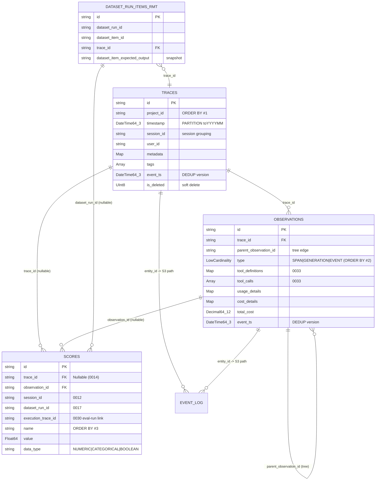

# Langfuse v3.177.1 — ClickHouse Schema, Engines, Dedup & Write Model

> Reverse-engineered by reading the actual local source at `/Users/julien/Documents/Repos/langfuse` (version `3.177.1`, confirmed in `package.json:3`). Every claim below is traceable to a file + line. Paths are repo-relative to the Langfuse repo unless noted.

## TL;DR

Langfuse stores all trace data in ClickHouse as **append-only event streams deduplicated on merge**. The three original OLAP tables — `traces`, `observations`, `scores` — are all `ReplicatedReplacingMergeTree(event_ts, is_deleted)`, partitioned `toYYYYMM(...)`, and every `ORDER BY` is **`project_id`-first** for multi-tenant locality. Writes are **batched in-process** (`ClickhouseWriter`) and sent as **`async_insert=1, wait_for_async_insert=1`** `JSONEachRow` inserts; full object payloads also go to S3 (the trace is durable in object storage, ClickHouse is the queryable index). The most Tracely-relevant artifact is the **newer unified `events_full` / `events_core` model** (in `clickhouse/scripts/dev-tables.sh`, not yet a numbered migration): one immutable wide row **per span**, with traces folded in as synthetic `t-<trace_id>` spans, tool-call columns, full-text `text` indexes, and experiment/dataset fields denormalized inline. The abandoned `traces_null` → `AggregatingMergeTree` path (migration `0023`, dropped in `0028`/`0029`) shows the design they moved *away* from.

---

## 1. How migrations are applied (clustered vs unclustered)

Two parallel migration trees exist, selected at deploy time by `golang-migrate`:

- `packages/shared/clickhouse/migrations/clustered/` — production / replicated.
- `packages/shared/clickhouse/migrations/unclustered/` — single-node / dev.

The selector is `CLICKHOUSE_CLUSTER_ENABLED` (`packages/shared/clickhouse/scripts/up.sh:54`):

```bash
# up.sh:54-71
if [ "$CLICKHOUSE_CLUSTER_ENABLED" == "false" ] ; then
  migrate -source file://clickhouse/migrations/unclustered ... up   # x-migrations-table-engine=MergeTree
else
  migrate -source file://clickhouse/migrations/clustered   ... up   # x-cluster-name=${CLICKHOUSE_CLUSTER_NAME}, x-migrations-table-engine=ReplicatedMergeTree
fi
```

The clustered tree uses `ON CLUSTER default` on every DDL and `Replicated*MergeTree` engines; the unclustered tree drops `ON CLUSTER` and uses plain `*MergeTree`. There are **34 numbered migrations** (`0001`–`0034`). This document reads the **clustered** tree (production-true).

Two important tables are **NOT** in the numbered migrations — they are created by a dev/experimental setup script `packages/shared/clickhouse/scripts/dev-tables.sh` (header at lines 1-13: *"experimental/development tables that are not yet ready to be part of the official migration system"*): `observations_batch_staging`, `events_full`, `events_core` (+ MVs and diagnostic tables). In OSS dev they are `(non-replicated) ReplacingMergeTree`; the DDL comments show the prod form is `(Replicated)ReplacingMergeTree` (`dev-tables.sh:269`).

---

## 2. Core table: `traces`

`packages/shared/clickhouse/migrations/clustered/0001_traces.up.sql:1-32`. Full column list quoted:

```sql
CREATE TABLE traces ON CLUSTER default (
    `id` String,
    `timestamp` DateTime64(3),
    `name` String,
    `user_id` Nullable(String),
    `metadata` Map(LowCardinality(String), String),
    `release` Nullable(String),
    `version` Nullable(String),
    `project_id` String,
    `public` Bool,
    `bookmarked` Bool,
    `tags` Array(String),
    `input` Nullable(String) CODEC(ZSTD(3)),
    `output` Nullable(String) CODEC(ZSTD(3)),
    `session_id` Nullable(String),
    `created_at` DateTime64(3) DEFAULT now(),
    updated_at DateTime64(3) DEFAULT now(),
    `event_ts` DateTime64(3),
    `is_deleted` UInt8,
    INDEX idx_id id TYPE bloom_filter(0.001) GRANULARITY 1,
    INDEX idx_res_metadata_key mapKeys(metadata) TYPE bloom_filter(0.01) GRANULARITY 1,
    INDEX idx_res_metadata_value mapValues(metadata) TYPE bloom_filter(0.01) GRANULARITY 1
) ENGINE = ReplicatedReplacingMergeTree(event_ts, is_deleted) Partition by toYYYYMM(timestamp)
PRIMARY KEY (project_id, toDate(timestamp))
ORDER BY (project_id, toDate(timestamp), id);
```

| Property | Value |
|---|---|
| Engine | `ReplicatedReplacingMergeTree(event_ts, is_deleted)` |
| Version column (dedup) | `event_ts` (keeps row with **max** `event_ts` per ORDER BY key) |
| Soft-delete column | `is_deleted` (the `ReplacingMergeTree` "is_deleted" param) |
| PARTITION BY | `toYYYYMM(timestamp)` (monthly) |
| ORDER BY / dedup key | `(project_id, toDate(timestamp), id)` |
| PRIMARY KEY | `(project_id, toDate(timestamp))` — prefix of ORDER BY, sparse |
| Skip indexes | `idx_id` bloom_filter(0.001); `idx_res_metadata_key`/`_value` bloom over `mapKeys`/`mapValues`; later `idx_session_id`, `idx_user_id` (added in `0005`/`0006`) |
| TTL | none |
| Added later | `environment LowCardinality(String) DEFAULT 'default'` (`0008_add_environments_column.up.sql:1`, `AFTER project_id`) |

The `(timestamp, toDate(timestamp), id)` dedup key means: **two writes of the same trace `id` dedup only if they land in the same day-bucket** of the ORDER BY. `event_ts` is set to "now" on each write (`repositories/clickhouse.ts:199`), so the latest write wins on merge.

---

## 3. Core table: `observations`

`0002_observations.up.sql:1-46`. This is the **step / span / LLM-call** table — the richest for agent trajectories. Column list (with later `ALTER`s noted):

```sql
CREATE TABLE observations ON CLUSTER default (
    `id` String,
    `trace_id` String,
    `project_id` String,
    `type` LowCardinality(String),               -- SPAN | GENERATION | EVENT
    `parent_observation_id` Nullable(String),    -- tree edge: child -> parent
    `start_time` DateTime64(3),
    `end_time` Nullable(DateTime64(3)),
    `name` String,
    `metadata` Map(LowCardinality(String), String),
    `level` LowCardinality(String),              -- DEBUG/DEFAULT/WARNING/ERROR
    `status_message` Nullable(String),
    `version` Nullable(String),
    `input` Nullable(String) CODEC(ZSTD(3)),
    `output` Nullable(String) CODEC(ZSTD(3)),
    `provided_model_name` Nullable(String),
    `internal_model_id` Nullable(String),
    `model_parameters` Nullable(String),
    `provided_usage_details` Map(LowCardinality(String), UInt64),
    `usage_details` Map(LowCardinality(String), UInt64),
    `provided_cost_details` Map(LowCardinality(String), Decimal64(12)),
    `cost_details` Map(LowCardinality(String), Decimal64(12)),
    `total_cost` Nullable(Decimal64(12)),
    `completion_start_time` Nullable(DateTime64(3)),   -- TTFT
    `prompt_id` Nullable(String),
    `prompt_name` Nullable(String),
    `prompt_version` Nullable(UInt16),
    `created_at` DateTime64(3) DEFAULT now(),
    `updated_at` DateTime64(3) DEFAULT now(),
    event_ts DateTime64(3),
    is_deleted UInt8,
    INDEX idx_id id TYPE bloom_filter() GRANULARITY 1,
    INDEX idx_trace_id trace_id TYPE bloom_filter() GRANULARITY 1,
    INDEX idx_project_id project_id TYPE bloom_filter() GRANULARITY 1   -- DROPPED in 0004
) ENGINE = ReplicatedReplacingMergeTree(event_ts, is_deleted) Partition by toYYYYMM(start_time)
PRIMARY KEY (project_id, `type`, toDate(start_time))
ORDER BY (project_id, `type`, toDate(start_time), id);
```

| Property | Value |
|---|---|
| Engine | `ReplicatedReplacingMergeTree(event_ts, is_deleted)` |
| PARTITION BY | `toYYYYMM(start_time)` |
| ORDER BY | `(project_id, type, toDate(start_time), id)` — **`type` is the 2nd sort key** |
| PRIMARY KEY | `(project_id, type, toDate(start_time))` |
| TTL | none |

`ALTER`s that matter for Tracely:
- `0033_add_tool_call_columns.up.sql:1-3`: **`tool_definitions Map(String,String)`, `tool_calls Array(String)`, `tool_call_names Array(String)`** — first-class tool-call structure on the step row.
- `0008`: `environment LowCardinality(String) DEFAULT 'default'`.
- `0031_add_usage_pricing_tier_columns.up.sql:1-2`: `usage_pricing_tier_id`, `usage_pricing_tier_name`.
- `0025_add_observations_metadata_indexes.up.sql:1-4`: adds `idx_res_metadata_key` / `idx_res_metadata_value` (bloom over `mapKeys`/`mapValues`) **and `MATERIALIZE`s** them on existing parts (`mutations_sync = 2`).

The agent tree is reconstructed from `(trace_id, id, parent_observation_id)`. `type` distinguishes `SPAN` (sub-agent / tool wrapper), `GENERATION` (LLM call), `EVENT`. There is **no dedicated `tool_call` or `sub_agent_call` table** — everything is an `observation` discriminated by `type`.

---

## 4. Core table: `scores`

`0003_scores.up.sql:1-33` + heavy column evolution. Scores are Langfuse's evaluation/feedback primitive (numeric, categorical, boolean). Base:

```sql
CREATE TABLE scores ON CLUSTER default (
    `id` String,
    `timestamp` DateTime64(3),
    `project_id` String,
    `trace_id` String,                       -- later MODIFY -> Nullable(String) (0014)
    `observation_id` Nullable(String),
    `name` String,
    `value` Float64,
    `source` String,                         -- ANNOTATION | API | EVAL
    `comment` Nullable(String) CODEC(ZSTD(1)),
    `author_user_id` Nullable(String),
    `config_id` Nullable(String),
    `data_type` String,                      -- NUMERIC | CATEGORICAL | BOOLEAN | CORRECTION
    `string_value` Nullable(String),
    `queue_id` Nullable(String),
    `created_at` DateTime64(3) DEFAULT now(),
    `updated_at` DateTime64(3) DEFAULT now(),
    event_ts DateTime64(3),
    `is_deleted` UInt8,
    INDEX idx_id id TYPE bloom_filter(0.001) GRANULARITY 1,
    INDEX idx_project_trace_observation (project_id, trace_id, observation_id) TYPE bloom_filter(0.001) GRANULARITY 1
) ENGINE = ReplicatedReplacingMergeTree(event_ts, is_deleted) Partition by toYYYYMM(timestamp)
PRIMARY KEY (project_id, toDate(timestamp), name)
ORDER BY (project_id, toDate(timestamp), name, id);
```

| Property | Value |
|---|---|
| Engine | `ReplicatedReplacingMergeTree(event_ts, is_deleted)` |
| PARTITION BY | `toYYYYMM(timestamp)` |
| ORDER BY | `(project_id, toDate(timestamp), name, id)` — **`name` is the 3rd sort key** (scores are queried by metric name) |
| TTL | none |

Columns/indexes added over time (each its own migration — note how the eval model grew **inside one table**):
- `0010`: `metadata Map(LowCardinality(String), String)`.
- `0012`: `session_id Nullable(String)` — session-level scores.
- `0014`: `trace_id` becomes `Nullable(String)` (scores no longer require a trace → enables **session-only** and **dataset-run-only** scores).
- `0017`: `dataset_run_id Nullable(String)` — experiment/dataset-run scores.
- `0030`: `execution_trace_id Nullable(String)` — link a score back to the **trace of the LLM-as-judge eval run** that produced it.
- `0034`: `long_string_value String CODEC(ZSTD(3))` — overflow for long categorical/correction values.
- Indexes: `idx_project_trace_observation` (dropped `0013`, re-added `0015`), `idx_project_session` (`0016`), `idx_project_dataset_run` (`0018`) — all `bloom_filter(0.001)`.

A score can therefore attach to **trace, observation, session, or dataset-run**, and carry the eval's own execution trace id. This is the closest thing Langfuse has to "evaluation result" storage, and it is **score-per-row, not suite/case-structured**.

---

## 5. `dataset_run_items` (the dataset-first eval join table)

There are **two**: `dataset_run_items` (`0022`, non-replicated `ReplacingMergeTree`) and `dataset_run_items_rmt` (`0024`, `ReplicatedReplacingMergeTree`). The `_rmt` table is the **production write target** (`worker/src/services/ClickhouseWriter/index.ts:612` `DatasetRunItems = "dataset_run_items_rmt"`; also in `clickhouse/schema.ts:5`). Columns (`0024_dataset_run_items.up.sql:1-36`):

```sql
CREATE TABLE dataset_run_items_rmt ON CLUSTER default (
    `id` String, `project_id` String,
    `dataset_run_id` String, `dataset_item_id` String, `dataset_id` String,
    `trace_id` String, `observation_id` Nullable(String),
    `error` Nullable(String),
    `created_at` DateTime64(3) DEFAULT now(), `updated_at` DateTime64(3) DEFAULT now(),
    -- denormalized immutable dataset run fields:
    `dataset_run_name` String, `dataset_run_description` Nullable(String),
    `dataset_run_metadata` Map(LowCardinality(String), String), `dataset_run_created_at` DateTime64(3),
    -- denormalized dataset item snapshot:
    `dataset_item_input` Nullable(String) CODEC(ZSTD(3)),
    `dataset_item_expected_output` Nullable(String) CODEC(ZSTD(3)),
    `dataset_item_metadata` Map(LowCardinality(String), String),
    `event_ts` DateTime64(3), `is_deleted` UInt8,
    INDEX idx_dataset_item dataset_item_id TYPE bloom_filter(0.001) GRANULARITY 1
) ENGINE = ReplicatedReplacingMergeTree(event_ts, is_deleted)
ORDER BY (project_id, dataset_id, dataset_run_id, id);
```

`0032` adds `dataset_item_version Nullable(DateTime64(3))`; `0026` adds `idx_trace_id` bloom. Note: **no PARTITION BY** (small table). It is a **join row** linking a `(dataset_run, dataset_item)` to the `trace_id` that executed it, with the item's `input`/`expected_output` snapshotted inline. This is exactly the **dataset → eval → deploy** model Tracely is rejecting — but the *denormalization-into-the-row* pattern is reusable.

---

## 6. Log tables: `event_log`, `blob_storage_file_log`

- **`event_log`** (`0007_add_event_log.up.sql:1-19`): `ENGINE = MergeTree()` (plain, append-only, no dedup), `ORDER BY (project_id, entity_type, entity_id)`. Columns: `id, project_id, entity_type, entity_id, event_id Nullable, bucket_name, bucket_path, created_at, updated_at`. It records **where each ingested event's raw JSON lives in object storage** (S3 bucket + path).

- **`blob_storage_file_log`** (`0011_add_blob_storage_file_log.up.sql:1-21`): same columns but `event_id String` (non-null) plus `event_ts`/`is_deleted`, `ENGINE = ReplicatedReplacingMergeTree(event_ts, is_deleted)`, `ORDER BY (project_id, entity_type, entity_id, event_id)`. Written **directly** (not via the batching writer) when `LANGFUSE_ENABLE_BLOB_STORAGE_FILE_LOG === "true"` (`repositories/clickhouse.ts:157-179`). It is the index used by the data-retention cleaner to find and delete S3 blobs.

These encode the architectural fact: **the raw event payload is the source of truth in S3; ClickHouse rows are a derived, queryable projection** (see §9).

---

## 7. The unified event model: `events_full` / `events_core` (most relevant to Tracely)

Defined in `packages/shared/clickhouse/scripts/dev-tables.sh` (lines `137` and `285`). The in-code `TableName` enum comment is explicit (`worker/src/services/ClickhouseWriter/index.ts:613`):

```ts
EventsFull = "events_full", // Primary write target - MV auto-populates events_core
```

### 7a. `events_full` — immutable wide row per span

`dev-tables.sh:137-281`. One row **per span/observation**, with trace-level context, model, usage/cost, tools, I/O, metadata, **and experiment/dataset fields all denormalized into the same row**. Engine and physical layout:

```sql
ENGINE = ReplacingMergeTree(event_ts, is_deleted)              -- prod: (Replicated)ReplacingMergeTree (line 269)
PARTITION BY toYYYYMM(start_time)
PRIMARY KEY (project_id, toStartOfMinute(start_time), xxHash32(trace_id))
ORDER BY    (project_id, toStartOfMinute(start_time), xxHash32(trace_id), span_id, start_time)
SAMPLE BY   xxHash32(trace_id)
SETTINGS index_granularity_bytes = '64Mi', merge_max_block_size_bytes = '64Mi',
         enable_block_number_column = 1, enable_block_offset_column = 1,
         prewarm_mark_cache = 1, prewarm_primary_key_cache = 1;
```

Notable structural choices (all `dev-tables.sh`):
- **`DateTime64(6)`** microsecond precision (vs `(3)` on the legacy tables) — finer span ordering.
- Identity is **`(trace_id, span_id, parent_span_id)`**, OTel-native naming (the legacy table called these `id`/`trace_id`/`parent_observation_id`).
- `xxHash32(trace_id)` in the sort key + `SAMPLE BY` → **all spans of a trace are co-located** and the table is sampleable for cheap approximate analytics.
- **Materialized computed columns** (lines 181-184): `calculated_input_cost`, `calculated_output_cost`, `calculated_total_cost` (`arraySum(mapValues(mapFilter(...cost_details)))`), and `total_cost Decimal(18,12) ALIAS cost_details['total']`. `input_length`/`output_length` are `MATERIALIZED lengthUTF8(...)` (lines 196-198).
- **Full-text `text` indexes** (lines 243-254): `idx_fts_input_low lower(input) TYPE text(tokenizer = splitByNonAlpha)`, same for `output`, `metadata_values`, `metadata_names`. Plus bloom indexes on `span_id/trace_id/user_id/session_id` and `minmax` on `created_at/updated_at`. (Commented-out `ngrambf_v1` variants at 258-266 show alternatives they benchmarked.)
- Tool columns first-class: `tool_definitions Map(String,String)`, `tool_calls Array(String)`, `tool_call_names Array(String)` (lines 190-192).
- **Experiment / dataset block inline** (lines 204-216): `experiment_id`, `experiment_name`, `experiment_dataset_id`, `experiment_item_id`, `experiment_item_expected_output`, `experiment_item_root_span_id`, plus metadata name/value arrays. So a *run against a dataset* is just an event with these fields populated — no separate join at read time.
- **Instrumentation/source block** (lines 218-226): `source LowCardinality`, `service_name`, `scope_name/version`, `telemetry_sdk_language/name/version` — OTel resource attributes captured on every span.
- `is_app_root Bool` (line 160) flags the trace-root span.

### 7b. `events_core` — truncated fast-query mirror

`dev-tables.sh:285-411`. **Same schema**, same engine/partition/order/sample, but `input`/`output` are plain `String` (not the ZSTD source), and it is populated by a materialized view that **truncates to 200 chars** (`dev-tables.sh:414-482`):

```sql
CREATE MATERIALIZED VIEW IF NOT EXISTS events_core_mv TO events_core AS
SELECT ...,
    leftUTF8(input, 200) as input,
    leftUTF8(output, 200) as output,
    metadata_names,
    arrayMap(v -> leftUTF8(v, 200), metadata_values) as metadata_values,
    ...
FROM events_full;
```

So the write hits **only `events_full`**; `events_core` is filled automatically by the MV. Reads default to the cheap `events_core` and **escalate to `events_full` only when full I/O / metadata is needed** (`event-query-builder.ts:851-854`, `:1122-1125`):

```ts
// event-query-builder.ts
protected getTableName(): EventsTableName { return "events_core"; }            // default
... return this.needsFullTable() ? "events_full" : "events_core";              // escalate
// buildQuery(): "FROM events_core e"  (line 1707)
```

`events_core` adds query-tuned skip indexes the full table omits: `idx_provided_model_name`, `idx_experiment_id`, `idx_metadata_names` (bloom) + the metadata `text` indexes (`dev-tables.sh:385-399`).

### 7c. How traces fold into the event stream

The backfill/dual-write logic (`dev-tables.sh:583-730`) shows the mapping rules that the live ingestion pipeline mirrors:
- An **observation** becomes an event with `span_id = o.id`, `parent_span_id = parent_observation_id` (or `t-<trace_id>` if root).
- A **trace** becomes a synthetic root event with `span_id = concat('t-', t.id)`, `type = 'SPAN'`, `parent_span_id = ''` (`dev-tables.sh:681-685`).
- `source` is derived: `ingestion-api-dual-write` / `otel-dual-write` / `...-experiments` (`dev-tables.sh:650`, `:721`).
- Experiment fields come from a `LEFT JOIN dataset_run_items_rmt` on `trace_id`.

> **This `events_full` table is the single most important thing to steal for Tracely.** It is already trace-native (one row per span), tree-aware (`parent_span_id`, `is_app_root`), tool-aware, OTel-source-aware, and full-text searchable — and it folds the run/dataset linkage *into the row* instead of a dataset-first join. Tracely's Agent / Agent Version / Step / Tool Call / Sub-Agent Call can map onto this with added agent-identity columns.

### 7d. Two more dev-tables artifacts

- `observations_batch_staging` (`dev-tables.sh:81-130`): `ReplacingMergeTree(event_ts, is_deleted)`, **3-minute partitions** `PARTITION BY toStartOfInterval(s3_first_seen_timestamp, INTERVAL 3 MINUTE)`, `TTL s3_first_seen_timestamp + INTERVAL 12 HOUR` with `SETTINGS ttl_only_drop_parts = 1`. A short-lived staging table to batch observations and merge with traces into events (LFE-7122). Demonstrates the **micro-partition + whole-partition-drop TTL** pattern.
- `ingestion_size_stats` (`dev-tables.sh:487-528`): plain `MergeTree` diagnostic table fed by MVs from `observations` and `traces`, `byteSize(*)` per row — a per-project payload-size telemetry table (every insert produces a row, no dedup).

---

## 8. The abandoned path: `traces_null` + AggregatingMergeTree (read this as an anti-pattern)

Migration `0023_traces_aggregating_merge_trees.up.sql` (300+ lines) built a sophisticated **incremental aggregation pipeline**:

- `traces_null` — a `Engine = Null()` table (line 39) used purely as an **MV trigger** ("avoid storing intermediate results and save on storage", lines 1-2).
- Three target `AggregatingMergeTree` tables `traces_all_amt`, `traces_7d_amt`, `traces_30d_amt` (the 7d/30d ones carry `TTL toDate(start_time) + INTERVAL {7,30} DAY`, lines 174 & 261) — each `ORDER BY (project_id, id)`.
- Three MVs (`traces_*_amt_mv`) that `GROUP BY project_id, id` and aggregate spans into one trace row using `SimpleAggregateFunction`/`AggregateFunction`: `min(start_time)`, `max(end_time)`, `anyLast(name)`, `maxMap(metadata)`, `sumMap(cost_details)`, `groupUniqArrayArray(observation_ids)`, and **`argMaxState(input, event_ts)`** for last-write-wins I/O (lines 110-121).

**This entire pipeline was dropped**: `0028_drop_traces_null_mvs.up.sql` drops the 3 MVs, `0029_drop_traces_null_and_amt_tables.up.sql` drops `traces_null` + all 3 AMT tables. The same happened to `project_environments` (`0009`: a `ReplicatedAggregatingMergeTree` + 3 MVs; MVs dropped in `0027`). The `ClickhouseWriter` still has a vestigial `TracesNull` queue entry (`worker/.../ClickhouseWriter/index.ts:51,607`) but the table no longer exists.

> **Lesson for Tracely:** Langfuse tried pre-aggregating traces via AMT and *abandoned it* in favor of the flat `events_full`/`events_core` + read-time `argMaxIf`/`LIMIT 1 BY` approach. Don't build AggregatingMergeTree rollups for the trace itself; keep events flat and aggregate at read time (or in `events_core`).

---

## 9. Write model

### 9a. Durable-payload-first

Every upsert writes the **full JSON event to S3 first**, then inserts the row (`packages/shared/src/server/repositories/clickhouse.ts:182-205`). The S3 key is `${PREFIX}${project_id}/${entityType}/${id}/${eventId}.json` (`clickhouse.ts:155`). If `LANGFUSE_ENABLE_BLOB_STORAGE_FILE_LOG` is on, a `blob_storage_file_log` row is inserted **synchronously** (`clickhouse.ts:160-179`). ClickHouse is thus a rebuildable index over S3.

### 9b. Batched in-process writer

`worker/src/services/ClickhouseWriter/index.ts` is a **singleton with per-table in-memory queues** (`queue` keyed by `TableName`, line 50-59), flushed two ways:
- **Time-based**: `setInterval(this.writeInterval)` (`LANGFUSE_INGESTION_CLICKHOUSE_WRITE_INTERVAL_MS`, lines 45, 85-95).
- **Size-based**: when a queue reaches `batchSize` (`LANGFUSE_INGESTION_CLICKHOUSE_WRITE_BATCH_SIZE`, lines 44, 559-565).

Each flush inserts `JSONEachRow` (`writeToClickhouse`, lines 568-595). Resilience built in:
- Retries `LANGFUSE_INGESTION_CLICKHOUSE_MAX_ATTEMPTS` times with backoff (lines 389-481).
- **String-length error → split the batch in half and re-queue** (lines 172-206, 415-445).
- **Size error → truncate input/output/metadata to 500KB** (`truncateOversizedRecord`, lines 208-278).
- **Decimal64(12) overflow → clamp** cost maps/`total_cost` to ±999 999.999999 (lines 280-354).
- On terminal failure after `maxAttempts`, **rows are dropped** (TODO: dead-letter to Redis, line 516) and counted in `langfuse.queue.clickhouse_writer.rows_dropped`.

### 9c. Async inserts

The client (`packages/shared/src/server/clickhouse/client.ts:156-212`) forces, on every connection:

```ts
clickhouse_settings: {
  ...
  async_insert: 1,
  wait_for_async_insert: 1, // "if disabled, we won't get errors from clickhouse" (line 204)
  ...
}
```

So inserts ride ClickHouse **server-side async insert buffering** (batches across connections into bigger parts), while `wait_for_async_insert: 1` preserves error propagation. Tunable via `CLICKHOUSE_ASYNC_INSERT_MAX_DATA_SIZE`, `CLICKHOUSE_ASYNC_INSERT_BUSY_TIMEOUT_MS`, `..._MIN_MS` (lines 170-187). Lightweight delete behaviour is configurable (`CLICKHOUSE_LIGHTWEIGHT_DELETE_MODE`, `CLICKHOUSE_UPDATE_PARALLEL_MODE`, lines 188-193). A read-time guard forbids querying the legacy `events` table — reads must use `events_core`/`events_full` (`repositories/clickhouse.ts:118-126`).

### 9d. Connection routing (read/write split + events service)

`PreferredClickhouseService = "ReadWrite" | "ReadOnly" | "EventsReadOnly"` (`client.ts:11-14`). URLs resolve per service (`client.ts:109-125`): `EventsReadOnly` → `CLICKHOUSE_EVENTS_READ_ONLY_URL ?? CLICKHOUSE_READ_ONLY_URL ?? CLICKHOUSE_URL`. For the events read path, `enable_full_text_index = 1` is injected (`client.ts:88-101`) when any `LANGFUSE_ENABLE_EVENTS_TABLE_*` flag is set — i.e. the full-text index on `events_*` is gated behind feature flags.

---

## 10. Dedup-on-merge & read-time finalization (the heart of the model)

All trace tables are `ReplacingMergeTree(event_ts, is_deleted)`. **Merges are asynchronous and not guaranteed**, so reads must dedup themselves. Langfuse uses **three** read-time strategies:

1. **`FINAL`** — forces merge-on-read of the latest version per ORDER-BY key. Used where correctness matters and skip indexes aren't critical, e.g. `FROM ${traceTable} t FINAL` (`repositories/traces.ts:1295,1402,1466`), `FROM observations o FINAL` (`observations.ts:1929`), `scores FINAL` (`scores.ts:2043`). Also used in the dev-tables backfill (`FROM observations o FINAL`, `dev-tables.sh:657`).

2. **`LIMIT 1 BY id, project_id` + `ORDER BY event_ts DESC`** — manual dedup that **lets ClickHouse use skip indexes** (FINAL disables some index usage). The tradeoff is documented in source:

   > `observations.ts:1206` — *"Wrapping the query in a CTE allows us to skip FINAL which allows Clickhouse to use skip indexes."*

   Example (`observations.ts:69-77`):
   ```sql
   SELECT id, project_id FROM observations o
   WHERE project_id = {projectId:String} AND id = {id:String}
   ORDER BY event_ts DESC
   LIMIT 1 BY id, project_id
   ```
   Used pervasively: `LIMIT 1 BY id, project_id` (traces.ts:920, observations.ts:76/188/309), `LIMIT 1 BY s.id, s.project_id` (scores.ts:91/250/304/...).

3. **`argMaxIf(col, event_ts, predicate)` + `GROUP BY`** — for the `events_*` tables, where a single trace spans many rows and trace-level fields live only on the **root span**. The event query builder pulls them from the root via the `parent_span_id = ''` predicate (`event-query-builder.ts:442-480`):
   ```sql
   argMaxIf(trace_name,  event_ts, trace_name <> '')   AS name
   argMaxIf(user_id,     event_ts, user_id <> '')        AS user_id
   argMaxIf(session_id,  event_ts, session_id <> '')     AS session_id
   argMaxIf(input,       event_ts, parent_span_id = '')  AS input    -- from root span
   argMaxIf(output,      event_ts, parent_span_id = '')  AS output
   argMaxIf(bookmarked,  event_ts, parent_span_id = '')  AS bookmarked
   ```
   plus a configurable `LIMIT 1 BY` (`event-query-builder.ts:622-631`).

There is a recurring caveat comment for analytics queries that **deliberately skip FINAL** for speed and accept double-count risk: *"Note: Skips using FINAL (double counting risk) for faster and cheaper"* (`traces.ts:1633`, `observations.ts:2015`, `scores.ts:2285`).

The dedup/version column on the wire: the converters always set `event_ts` = now and `is_deleted` = 0 on writes (`repositories/clickhouse.ts:199`, `traces_converters.ts:33-34`, `scores_converters.ts` via insert schema, `definitions.ts:475-476,594-595`). A delete is just a new row with `is_deleted = 1` and a higher `event_ts`.

---

## 11. Partitioning, sharding & multi-tenant isolation

- **Partitioning**: monthly `toYYYYMM(...)` on `traces`/`observations`/`scores`/`events_full`/`events_core`; **3-minute** on `observations_batch_staging`; **none** on `dataset_run_items_rmt`, `event_log`, `blob_storage_file_log`. Monthly partitions make **time-range pruning** and **whole-partition drops** (data retention) cheap.
- **Sharding/replication**: handled by `Replicated*` engines + `ON CLUSTER default` (clustered tree) over a ClickHouse Keeper-coordinated cluster (`CLICKHOUSE_CLUSTER_NAME`, `up.sh:48-51`). Langfuse does **not** declare a `Distributed` table or explicit sharding key in these migrations — sharding is a cluster-topology concern; `events_full`'s `xxHash32(trace_id)` in the sort/sample key is the only explicit data-locality hash.
- **Multi-tenant isolation = `project_id` is the leading ORDER BY / PRIMARY KEY column on *every* table.** This is the single most consistent design rule:
  - `traces`: `(project_id, toDate(timestamp), id)`
  - `observations`: `(project_id, type, toDate(start_time), id)`
  - `scores`: `(project_id, toDate(timestamp), name, id)`
  - `dataset_run_items_rmt`: `(project_id, dataset_id, dataset_run_id, id)`
  - `events_full`/`events_core`: `(project_id, toStartOfMinute(start_time), xxHash32(trace_id), span_id, start_time)`
  - `event_log`/`blob_storage_file_log`: `(project_id, entity_type, entity_id[, event_id])`

  Every read query also injects `project_id = {projectId:String}` as the first WHERE clause (e.g. `event-query-builder.ts:1717`). So tenant isolation is enforced **both** by the sort-key prefix (physical locality + index pruning) **and** by mandatory query predicates.

---

## 12. Table-by-table summary

| Table | Engine | PARTITION BY | ORDER BY (dedup key) | Dedup/version | TTL | Source |
|---|---|---|---|---|---|---|
| `traces` | ReplicatedReplacingMergeTree | `toYYYYMM(timestamp)` | `(project_id, toDate(timestamp), id)` | `event_ts`, `is_deleted` | — | `0001` |
| `observations` | ReplicatedReplacingMergeTree | `toYYYYMM(start_time)` | `(project_id, type, toDate(start_time), id)` | `event_ts`, `is_deleted` | — | `0002` |
| `scores` | ReplicatedReplacingMergeTree | `toYYYYMM(timestamp)` | `(project_id, toDate(timestamp), name, id)` | `event_ts`, `is_deleted` | — | `0003` |
| `dataset_run_items_rmt` | ReplicatedReplacingMergeTree | none | `(project_id, dataset_id, dataset_run_id, id)` | `event_ts`, `is_deleted` | — | `0024` |
| `event_log` | MergeTree | none | `(project_id, entity_type, entity_id)` | none (append) | — | `0007` |
| `blob_storage_file_log` | ReplicatedReplacingMergeTree | none | `(project_id, entity_type, entity_id, event_id)` | `event_ts`, `is_deleted` | — | `0011` |
| `events_full` | (Replicated)ReplacingMergeTree | `toYYYYMM(start_time)` | `(project_id, toStartOfMinute(start_time), xxHash32(trace_id), span_id, start_time)` | `event_ts`, `is_deleted` | — | `dev-tables.sh:137` |
| `events_core` | (Replicated)ReplacingMergeTree | `toYYYYMM(start_time)` | same as `events_full` | `event_ts`, `is_deleted` | — | `dev-tables.sh:285` |
| `observations_batch_staging` | ReplacingMergeTree | `toStartOfInterval(s3_first_seen_timestamp, 3 MIN)` | `(project_id, toDate(s3_first_seen_timestamp), trace_id, id)` | `event_ts`, `is_deleted` | **12 HOUR** (`ttl_only_drop_parts=1`) | `dev-tables.sh:81` |
| `ingestion_size_stats` | MergeTree | none | `(toStartOfHour(created_at), project_id, trace_id, span_id, created_at)` | none | — | `dev-tables.sh:487` |
| `analytics_traces/observations/scores` | **plain VIEW** (not MV) | — | hourly `GROUP BY project_id[,type], hour` | — | — | `0019`/`0020`/`0021` |
| `analytics_events_core` | **plain VIEW** | — | hourly over `events_core` | — | — | `dev-tables.sh:530` |
| ~~`traces_null` / `traces_*_amt`~~ | ~~Null / AggregatingMergeTree~~ | — | ~~`(project_id, id)`~~ | argMaxState | 7d/30d | **DROPPED** `0028`/`0029` |
| ~~`project_environments`~~ | ReplicatedAggregatingMergeTree (table kept, MVs dropped `0027`) | none | `(project_id)` | groupUniqArrayArray | — | `0009`/`0027` |

> `analytics_*` are `CREATE VIEW` (computed at query time), **not** materialized views — they don't store anything; they aggregate the base tables on read (`0019_analytics_traces.up.sql:1` `CREATE VIEW analytics_traces ...`).

---

## 13. ER-ish diagram



The newer `events_full` collapses TRACES + OBSERVATIONS (and the DATASET_RUN_ITEMS join) into one denormalized row stream:

```
                 INGESTION (worker)
   raw event JSON ─────────────► S3  (source of truth)
        │                         │
        │   ClickhouseWriter      │ event_log / blob_storage_file_log (S3 index)
        │   (batched, async_insert=1)
        ▼
   ┌─────────────────────────────────────────────────────────┐
   │  events_full  (1 row / span, ReplacingMergeTree)          │
   │  trace_id · span_id · parent_span_id · is_app_root        │
   │  type · tool_calls · usage/cost · input/output(ZSTD)      │
   │  experiment_* (dataset run folded in) · source/scope(OTel)│
   │  text indexes on input/output/metadata                    │
   └───────────────┬───────────────────────────────────────────┘
                   │  events_core_mv  (leftUTF8 200-char truncation)
                   ▼
   ┌─────────────────────────────────────────────────────────┐
   │  events_core  (truncated I/O, extra skip indexes)         │
   │  ← DEFAULT READ TARGET (event-query-builder.ts:854/1707)  │
   └─────────────────────────────────────────────────────────┘
   Reads dedup via:  argMaxIf(col,event_ts,parent_span_id='')  +  LIMIT 1 BY
```

---

## 14. Relevance to Tracely

**Steal directly (trace-native, agent-friendly):**

1. **The `events_full` / `events_core` split.** One immutable wide row per span; a cheap truncated mirror (`events_core`, default read) auto-populated by a 200-char-truncating MV; escalate to `events_full` only for full I/O/search. This is exactly the storage Tracely needs for trajectories — it is already span-level, tree-aware (`parent_span_id`, `is_app_root`), tool-aware (`tool_definitions/tool_calls/tool_call_names`), and OTel-source-aware (`source`, `scope_*`, `telemetry_sdk_*`). Add `agent_id`, `agent_version_id`, `sub_agent_call` discriminators and a `handoff` edge and you have a multi-agent trajectory store. Source: `dev-tables.sh:137-482`.
2. **`ReplacingMergeTree(event_ts, is_deleted)` + read-time `LIMIT 1 BY ... ORDER BY event_ts DESC`** as the dedup discipline, with the explicit reason captured in their own comment: *"skip FINAL → use skip indexes"* (`observations.ts:1206`). Inserts are idempotent (re-ingest a span, latest `event_ts` wins); deletes are tombstones. Perfect for "re-run a production trace as a regression test" where the same span may be re-written.
3. **`project_id`-leading ORDER BY on every table** for multi-tenant isolation by physical locality + mandatory `project_id` WHERE predicate. Tracely should make `(project_id/org, agent_id, ...)` the universal prefix.
4. **Durable-payload-first ingestion**: raw event JSON → S3, ClickHouse rows are a rebuildable index (`clickhouse.ts:182-205`, `event_log`/`blob_storage_file_log`). Lets Tracely re-derive evals/regression tests/failure clusters from the raw trace without re-instrumenting.
5. **Batched in-process writer** with backoff, batch-splitting on string-length errors, oversized-field truncation, and Decimal64 clamping (`ClickhouseWriter/index.ts`) + server-side `async_insert=1, wait_for_async_insert=1` (`client.ts:203-204`). Battle-tested ingestion resilience to copy.
6. **Full-text `text(tokenizer = splitByNonAlpha)` indexes on input/output/metadata** (`dev-tables.sh:243-254`) — directly useful for failure-cluster search and "find traces like this" without a separate search store.
7. **`xxHash32(trace_id)` in the sort/sample key** co-locates a whole trace's spans and enables `SAMPLE BY` for cheap approximate quality metrics over huge trace volumes (`dev-tables.sh:271-273`).
8. **Denormalize the "run context" into the event row** (`experiment_id/experiment_item_*`), as `events_full` does, instead of a dataset-first join table. For Tracely this becomes `regression_run_id` / `regression_case_id` / `ci_gate_id` folded into the span row — the trace *is* the test result.

**Langfuse-specific / not the direction Tracely wants:**

- **`dataset_run_items_rmt`** is the literal embodiment of the dataset → eval → deploy model Tracely is rejecting. Its denormalization trick is reusable; its *role* (pre-curated dataset items with `expected_output` snapshots) is not. (`0024`)
- **`scores` as a flat per-row table** keyed by `name`. It supports trace/observation/session/dataset-run scopes and an `execution_trace_id` back-link (good), but it has **no Evaluation-Suite / Evaluation-Case / Failure-Cluster structure** — those are Tracely-native entities you must add. Langfuse evals are "a score row", not "a suite run with cases and a CI verdict". (`0003` + `0010`–`0034`)
- **The abandoned `traces_null` + AggregatingMergeTree rollups** (`0023`, dropped `0028`/`0029`) — a cautionary tale. Don't pre-aggregate the trace; keep events flat, aggregate at read time / in `events_core`.
- **`analytics_*` plain VIEWs** are Datadog-style usage dashboards (counts/hasX per hour) — the "Datadog for LLMs" framing Tracely explicitly is *not*. Reusable only as cheap metadata-presence probes.
- The `prompt_id/prompt_name/prompt_version` columns on observations/events tie into Langfuse **prompt management**, which is out of scope for Tracely.

**Open design choices Tracely must make that Langfuse's schema doesn't answer:**

- No first-class **Agent / Agent Version / Sub-Agent Call / Handoff** entities — Langfuse models everything as `observation.type ∈ {SPAN, GENERATION, EVENT}`. Tracely needs explicit agent identity + version columns and a handoff edge to evaluate multi-agent trajectories and gate deploys per agent-version.
- No **regression-test / CI-gate / failure-cluster** tables — these are net-new for Tracely and should be derived-from-and-linked-back-to `events_full` rows (e.g. a `failure_clusters` table keyed by `(project_id, agent_id)` referencing span ids).
