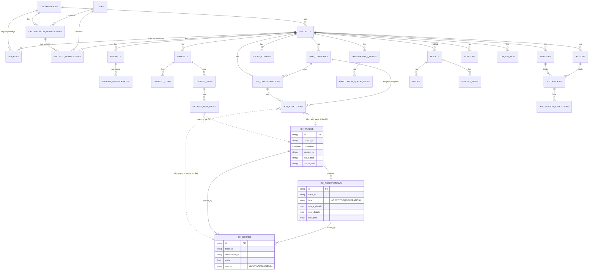

# Langfuse v3.177.1 — PostgreSQL (Prisma) Schema & the Control-Plane / Data-Plane Split

> **TL;DR.** Langfuse runs a **two-store architecture**: PostgreSQL (via Prisma, `packages/shared/prisma/schema.prisma`) is the **control plane** — identity, RBAC, config, eval/automation definitions, billing, integration credentials, job bookkeeping — while ClickHouse (`packages/shared/clickhouse/migrations/`) is the **data plane** holding the three high-volume, append-mostly entities: `traces`, `observations`, `scores`. Everything in Postgres is low-volume relational/transactional state that needs FK integrity and updates; everything in ClickHouse is partitioned-by-month `ReplicatedReplacingMergeTree` columnar telemetry. The trace itself does **not** live in Postgres — only pointers to it do (e.g. `job_executions.job_input_trace_id` carries an explicit comment "no fk constraint - traces in ClickHouse"). For Tracely this split is directly reusable, but the *eval data model* (dataset-first `eval_templates` → `job_configurations` → `job_executions`) is exactly the dataset-first pattern Tracely wants to invert.

All paths below are repo-relative to `/Users/julien/Documents/Repos/langfuse`. Line numbers are from the files as read.

---

## 0. How the two stores are wired

| Aspect | PostgreSQL (control plane) | ClickHouse (data plane) |
|---|---|---|
| ORM / migrations | Prisma; `packages/shared/prisma/schema.prisma` (1752 lines), **399 migration dirs** under `packages/shared/prisma/migrations/` (latest `20260529120000_add_organization_ai_telemetry_enabled`) | Hand-written SQL; `packages/shared/clickhouse/migrations/{clustered,unclustered}/` (34 numbered migrations) |
| Connection | `DATABASE_URL` + `DIRECT_URL` + `SHADOW_DATABASE_URL` (`schema.prisma:11-13`); validated in service env, e.g. `worker/src/env.ts:9` `DATABASE_URL: z.string()` | `CLICKHOUSE_URL` (`packages/shared/src/env.ts:81`), `CLICKHOUSE_READ_ONLY_URL` (`:82`), `CLICKHOUSE_CLUSTER_NAME` default `"default"` (`:84`), `CLICKHOUSE_USER`/`CLICKHOUSE_PASSWORD` (`:86-87`) |
| Client | `PrismaClientSingleton` exported as `prisma` in `packages/shared/src/db.ts:8-60`; re-exports `@prisma/client` types (`:62`). Note (`db.ts:1-2`): must **not** be imported into FE code | ClickHouse client in `packages/shared/src/server` |
| Engine | PostgreSQL with Prisma preview features `["views","relationJoins","metrics"]` (`schema.prisma:6`) | `ReplicatedReplacingMergeTree(event_ts, is_deleted)` partitioned `toYYYYMM(...)` |
| Naming convention | Prisma models PascalCase, `@@map` to snake_case tables, columns `@map` to snake_case | snake_case throughout |

The ingestion path is event-driven through Redis/BullMQ queues (`packages/shared/src/server/queues.ts`): raw events land via `OtelIngestionQueue = "otel-ingestion-queue"` (`:334`) / `IngestionQueue = "ingestion-queue"` (`:336`), get merged through S3, and `TraceUpsert = "trace-upsert"` (`:325`) writes to ClickHouse. Postgres is **not** in the hot ingestion path for traces.

---

## 1. Identity, Orgs/Projects, Memberships & RBAC

The tenancy spine is **Organization → Project**, with users attached through a two-level membership model.

**Core tables**
- `organizations` (`Organization`, `schema.prisma:93-115`): `id`, `name`, `cloud_config` Json (Langfuse Cloud), `metadata`, plus **billing anchors** `cloud_billing_cycle_anchor`, `cloud_current_cycle_usage`, `cloud_free_tier_usage_threshold_state`, and feature flags `ai_features_enabled` / `ai_telemetry_enabled`.
- `projects` (`Project`, `:117-177`): `id`, `org_id` (FK → org, `onDelete: Cascade`), `deleted_at` (soft-delete), `retention_days`, `has_traces` Boolean, `metadata`. **This is the fan-out hub** — ~50 back-relations hang off Project (every domain table is project-scoped).
- `users` (`User`, `:48-82`): NextAuth user; `email` unique, `password`, `admin` Boolean, `feature_flags String[]`, `v4_beta_enabled`.
- `organization_memberships` (`OrganizationMembership`, `:248-262`): `(org_id, user_id)` unique, `role Role`.
- `project_memberships` (`ProjectMembership`, `:265-281`): composite PK `(project_id, user_id)`, references `org_membership_id` — i.e. a **project-specific role override** on top of the org membership.
- `membership_invitations` (`MembershipInvitation`, `:283-302`): pending invites with `org_role` + optional `project_role`.

**RBAC** is a single enum `Role { OWNER, ADMIN, MEMBER, VIEWER, NONE }` (`:304-310`) applied at both org and project membership level. There is no separate permissions table — roles map to permission sets in application code (EE).

**NextAuth tables**: `Account` (`:17-38`, OAuth tokens), `Session` (`:40-46`), `verification_tokens` (`:84-91`).

**SSO / domain verification** (Enterprise): `sso_configs` (`SsoConfig`, `:1075-1086`, keyed by `domain`, `auth_config` Json with app-level-encrypted secrets) and `verified_domains` (`VerifiedDomain`, `:1090-1108`, DNS-TXT `verification_token`, partial-unique enforced in migration).

```
organizations ──< projects ──< (everything else)
     │                │
     └─< org_memberships ─< project_memberships
              │                    │
            users ────────────────┘
```

---

## 2. API Keys & Auth

`api_keys` (`ApiKey`, `schema.prisma:184-207`) is **dual-scope** via `ApiKeyScope { ORGANIZATION, PROJECT }` (`:179-182`, default `PROJECT`): `project_id` *or* `organization_id` is set. Key columns:
- `public_key` (unique), `hashed_secret_key` (unique), `fast_hashed_secret_key` (unique, nullable), `display_secret_key`.
- `last_used_at`, `expires_at`, `is_in_app_agent_key` Boolean (`:194`, recent — migration `20260521130000_add_in_app_agent_api_key_marker`).

Hashing is in `packages/shared/src/server/auth/apiKeys.ts`: `generateKeySet()` (`:19`), `createShaHash(privateKey, salt)` (`:31`) produces both a slow bcrypt-style `hashedSecretKey` and a `fastHashedSecretKey` (`:73-75`) for hot-path lookups (indexed at `schema.prisma:205`).

`audit_logs` (`AuditLog`, `:891-915`) — deliberately **no FK constraints** ("To preserve audit logs", `:890`): `type (USER|API_KEY)`, `resource_type`, `resource_id`, `action`, `before`/`after` stringified JSON. Indexed by project/org/user/apiKey/createdAt.

LLM provider credentials: `llm_api_keys` (`LlmApiKeys`, `:224-246`): per-project `(projectId, provider)` unique, `secret_key`/`display_secret_key`, `adapter` (e.g. openai/anthropic), `base_url`, `custom_models String[]`, `extra_headers`. `default_llm_models` (`DefaultLlmModel`, `:1053-1071`) sets one default eval model per project (`@@unique([projectId])`).

> **Secrets are encrypted at the application layer**, not in DB: `ENCRYPTION_KEY` (256-bit hex) in `packages/shared/src/encryption/encryption.ts:4,19-25` (throws if missing). This is how `llm_api_keys.secret_key`, `sso_configs.auth_config`, Slack `bot_token`, and webhook secrets are protected.

---

## 3. Prompts & Prompt Versions

> Langfuse's prompt-management subsystem — explicitly **out of scope** for Tracely, included for completeness.

- `prompts` (`Prompt`, `schema.prisma:760-787`): versioned by `@@unique([projectId, name, version])`. Columns: `prompt` Json, `version` Int, `type` (default `"text"`), `config` Json, `tags String[]`, `labels String[]` (the `production`/`latest` label mechanism), `commit_message`, `is_active` (deprecated). GIN index on tags (`:785`).
- `prompt_dependencies` (`PromptDependency`, `:789-807`): prompt-composition graph — `parent_id` → child by `(child_name, child_label|child_version)`. Enables prompts referencing other prompts.
- `prompt_protected_labels` (`PromptProtectedLabels`, `:809-819`): labels that require elevated permission to move (`@@unique([projectId, label])`).

---

## 4. Datasets & Dataset Items (the dataset-first eval substrate)

> **This is the part Tracely explicitly rejects.** It is the classic Dataset → Run → Eval loop. Studying it tells us exactly what to invert.

- `datasets` (`Dataset`, `schema.prisma:586-608`): composite PK `(id, projectId)`, `@@unique([projectId, name])`. Notably carries **remote-experiment** hooks (`remote_experiment_url`, `remote_experiment_payload`, `remote_experiment_enabled`) and **schemas** `input_schema` / `expected_output_schema` Json.
- `dataset_items` (`DatasetItem`, `:610-637`): **versioned via SCD-2 columns** `valid_from` / `valid_to` / `is_deleted` — PK is `(id, projectId, validFrom)` (`:628`). Carries `input`, `expected_output`, `metadata`, and **provenance pointers** `source_trace_id` / `source_observation_id` (`:617-618`) — i.e. you can *seed a dataset item from a production trace*. **This is the seam Tracely generalizes into "trace → regression case".**
- `dataset_runs` (`DatasetRuns`, `:644-662`): a run of a dataset (`@@unique([datasetId, projectId, name])`).
- `dataset_run_items` (`DatasetRunItems`, `:664-683`): links a `dataset_item_id` to the `trace_id` (+ optional `observation_id`) produced when the item was executed. **No FK to trace** (trace is in ClickHouse).

**Cross-store mirroring of run items.** `dataset_run_items` also exists in ClickHouse as `dataset_run_items_rmt` (`packages/shared/clickhouse/migrations/clustered/0024_dataset_run_items.up.sql`), a `ReplicatedReplacingMergeTree` that **denormalizes immutable run + item snapshots** (`dataset_run_name`, `dataset_item_input`, `dataset_item_expected_output`, `dataset_item_metadata`) alongside `trace_id`/`observation_id`, so eval analytics can be computed entirely in ClickHouse without joining Postgres. This is a strong pattern: **mutable definition in PG, immutable snapshot in CH.**

---

## 5. Evaluation: Templates, Job Configurations, Job Executions

This is Langfuse's eval engine — **trigger-on-trace LLM-as-judge + code evals**, all in Postgres.

- `eval_templates` (`EvalTemplate`, `schema.prisma:917-945`): versioned `(projectId, name, version)`. `type EvalTemplateType { LLM_AS_JUDGE, CODE }` (`:947-950`). For LLM judges: `prompt`, `model`, `provider`, `model_params`, `vars String[]`, `output_schema` Json. For **code evals** (recent, migration `20260518090000_add_code_eval_template_fields`): `source_code` (`VarChar(262144)`) and `source_code_language EvalTemplateSourceCodeLanguage { PYTHON, TYPESCRIPT }` (`:937-938, 952-955`). `partner` field (e.g. `"ragas"`).
- `job_configurations` (`JobConfiguration`, `:977-1004`): the **standing rule** that says *which traces get evaluated*. Key columns:
  - `job_type JobType { EVAL }` (`:959-961`) — currently EVAL-only (comment at `:957` warns the count queries assume this).
  - `filter` Json (which traces match), `target_object` String, `variable_mapping` Json (maps trace fields → template vars), `score_name`.
  - `sampling` Decimal 0..1, `delay` ms, `time_scope String[]` default `["NEW"]` (`:999`) — NEW vs EXISTING traces.
  - `status JobConfigState { ACTIVE, INACTIVE }` and a rich `block_reason EvaluatorBlockReason` enum (`:968-975`: `LLM_CONNECTION_MISSING`, `DEFAULT_EVAL_MODEL_MISSING`, `EVAL_MODEL_UNAVAILABLE`, ...).
- `job_executions` (`JobExecution`, `:1014-1051`): one row per evaluation run. `status JobExecutionStatus { COMPLETED, ERROR, PENDING, CANCELLED, DELAYED }` (`:1006-1012`). **The critical cross-store pointers** (all FK-less, by design):
  - `job_input_trace_id` — comment: *"no fk constraint - traces in ClickHouse, deletion handled via project cascade"* (`:1033`).
  - `job_input_observation_id` (`:1037`), `job_input_dataset_item_id` (`:1039`), `job_output_score_id` (`:1043`, points at the score it produced in ClickHouse), `execution_trace_id` (`:1045`, the trace of the judge call itself).

**Pipeline (queues).** `CreateEvalQueue = "create-eval-queue"` (`queues.ts:353`) decides which traces need eval; `EvaluationExecution = "evaluation-execution-queue"` (`:328`) + secondary (`:329`), `LLMAsJudgeExecution = "llm-as-a-judge-execution-queue"` (`:330`), `CodeEvalExecution = "code-eval-execution-queue"` (`:331`) run them. Output scores are written to ClickHouse `scores`.

> **Tracely implication:** Langfuse already supports trigger-on-trace eval (`time_scope=["NEW"]`, filter on traces) and code evals. But the data model is *anchored to `eval_templates` + `score_name`* and emits a single `score` per (trace, observation). It has **no first-class notion of a regression suite, a failure cluster, a trajectory-level assertion, or a CI gate**. Tracely needs new top-level entities (Evaluation Suite, Evaluation Case, Failure Cluster) that *reference traces directly* rather than going through datasets.

---

## 6. Score Configs (the eval-output schema)

`score_configs` (`ScoreConfig`, `schema.prisma:475-498`): defines the shape of a score dimension. `data_type ScoreConfigDataType { CATEGORICAL, NUMERIC, BOOLEAN, TEXT }` (`:500-505`), `min_value`/`max_value`, `categories` Json, `is_archived`. The actual score *values* live in ClickHouse (`scores` table) and in the legacy Postgres `scores` table (see §11). `score_configs` is the only score-related metadata that stays in Postgres because it's low-volume config.

---

## 7. Models & Pricing

A small pricing engine for cost attribution:
- `models` (`Model`, `schema.prisma:822-845`): `model_name`, `match_pattern` (regex to match observation model strings), `start_date` (time-versioned pricing), legacy `input_price`/`output_price`/`total_price`, `unit`, `tokenizer_id`/`tokenizer_config`. `project_id` **nullable** → null = global/default Langfuse-managed model. `@@unique([projectId, modelName, startDate, unit])`.
- `prices` (`Price`, `:847-863`): newer multi-usage-type pricing — `usage_type` String + `price` Decimal, tied to a `pricing_tier_id`.
- `pricing_tiers` (`PricingTier`, `:865-883`): tiered pricing with `conditions` JsonB, `priority`, `is_default`.

Cost is computed at ingestion and stored denormalized in ClickHouse `observations.cost_details` / `total_cost` (§9).

---

## 8. Automations: Triggers, Actions, Executions + Webhooks/Slack/GitHub

> **Highly relevant to Tracely's CI-gate thesis** — this is Langfuse's event→action engine.

The model is **Trigger + Action composed by an Automation**, with an execution log:
- `triggers` (`Trigger`, `schema.prisma:1512-1534`): `event_source` String (e.g. `"trace"`, `"prompt"`), `event_actions String[]` (created/updated/deleted), `filter` Json, `status JobConfigState`.
- `actions` (`Action`, `:1490-1510`): `type ActionType { WEBHOOK, SLACK, GITHUB_DISPATCH }` (`:1553-1558`) + `config` Json. The config is a discriminated union (`packages/shared/src/domain/automations.ts:125-129`):
  - **WEBHOOK** (`WebhookActionConfigSchema`, `automations.ts:55-65`): `url`, `requestHeaders` (with per-header `secret` flag, `:50-53`), `apiVersion`, `secretKey` + `displaySecretKey` (HMAC signing secret).
  - **GITHUB_DISPATCH** (`GitHubDispatchActionConfigSchema`, `:93-100`): `url`, `eventType`, `githubToken` + `displayGitHubToken`. **This is literally a "kick off a GitHub Actions workflow" action** — directly aligned with Tracely's "GitHub Actions + Langfuse" framing.
  - **SLACK** (`:84-89`): `channelId`, `messageTemplate`.
- `automations` (`Automation`, `:1536-1551`): joins one `trigger_id` + one `action_id`, named.
- `automation_executions` (`AutomationExecution`, `:1567-1596`): `status ActionExecutionStatus { COMPLETED, ERROR, PENDING, CANCELLED }` (`:1560-1565`), `source_id`, `input`/`output` Json, `started_at`/`finished_at`, `error`.
- `slack_integrations` (`SlackIntegration`, `:1679-1695`): per-project (`@@unique`), encrypted `bot_token`, `team_id`/`team_name`.

Execution is async: `WebhookQueue = "webhook-queue"` (`queues.ts:357`), domain code in `packages/shared/src/server/webhooks/` and `packages/shared/src/server/redis/webhookQueue.ts`. `EntityChangeQueue = "entity-change-queue"` (`:358`) + `EventPropagationQueue` (`:359`) feed triggers.

> **Tracely implication:** The Trigger→Action→Execution skeleton is the *exact shape* of a CI gate (event = "new failing trace / regression detected"; action = "block deploy / dispatch GitHub workflow / post to Slack"). `GITHUB_DISPATCH` + `automation_executions` is a ready-made template. What's missing for Tracely: triggers fire on raw entity events (trace created), not on **derived signals** (regression detected, suite failed, failure-cluster threshold crossed). Tracely's trigger event_source space must include eval/suite/cluster outcomes.

---

## 9. The Data Plane (ClickHouse) — what is NOT in Postgres

Three core tables, all `ReplicatedReplacingMergeTree(event_ts, is_deleted)`, partitioned by month:

**`traces`** (`clickhouse/migrations/clustered/0001_traces.up.sql:1-32`): `id`, `timestamp DateTime64(3)`, `name`, `user_id`, `metadata Map(LowCardinality(String),String)`, `session_id`, `tags Array(String)`, `input`/`output` `Nullable(String) CODEC(ZSTD(3))` (compressed). `PRIMARY KEY (project_id, toDate(timestamp))`, `ORDER BY (project_id, toDate(timestamp), id)`. Bloom-filter indexes on `id` and metadata keys/values.

**`observations`** (`0002_observations.up.sql:1-46`): the per-step span table — `id`, `trace_id`, `parent_observation_id`, `type LowCardinality(String)`, `start_time`/`end_time`, `level`, `input`/`output` (ZSTD), model fields (`provided_model_name`, `internal_model_id`, `model_parameters`), **usage/cost as Maps** (`usage_details Map(...,UInt64)`, `cost_details Map(...,Decimal64(12))`, `total_cost`), and `prompt_id`/`prompt_name`/`prompt_version`. `PRIMARY KEY (project_id, type, toDate(start_time))`.
  - **Tool-call columns** (recent, `0033_add_tool_call_columns.up.sql`): `tool_definitions Map(String,String)`, `tool_calls Array(String)`, `tool_call_names Array(String)`. → Langfuse already captures tool calls at the observation level. The observation `type` enum (PG mirror `LegacyPrismaObservationType`, `schema.prisma:410-423`) includes `SPAN, EVENT, GENERATION, AGENT, TOOL, CHAIN, RETRIEVER, EVALUATOR, EMBEDDING, GUARDRAIL` — so **Agent / Tool / Chain are already first-class observation types**.

**`scores`** (`0003_scores.up.sql:1-33`): `id`, `trace_id`, `observation_id`, `name`, `value Float64`, `string_value`, `source`, `data_type`, `config_id`, `queue_id`, `comment`. `PRIMARY KEY (project_id, toDate(timestamp), name)`.

**Supporting CH tables**: `event_log` (`0007_add_event_log.up.sql`) — a `MergeTree` mapping `(project_id, entity_type, entity_id)` → `bucket_name`/`bucket_path`, i.e. **the S3 pointer index** that makes blob storage the real source of truth for event payloads. `dataset_run_items_rmt` (§4), `blob_storage_file_log`, plus analytics materialized views (`0019/0020/0021_analytics_*`, `0023_traces_aggregating_merge_trees`).

---

## 10. Everything else in Postgres (config, ops, billing, integrations)

| Group | Tables (model → `@@map`) | Notes / key cols |
|---|---|---|
| **Annotation queues** | `annotation_queues` (`:507-523`), `annotation_queue_items` (`:525-549`), `annotation_queue_assignments` (`:562-575`) | Human-in-the-loop scoring. Item `object_type AnnotationQueueObjectType { TRACE, OBSERVATION, SESSION }` (`:556-560`), `status { PENDING, COMPLETED }`, `locked_by_user_id`/`annotator_user_id`. `scoreConfigIds String[]`. |
| **Comments** | `comments` (`:685-708`), `comment_reactions` (`:710-723`) | `object_type CommentObjectType { TRACE, OBSERVATION, SESSION, PROMPT }` (`:725-730`). Supports **inline anchored comments** via parallel arrays `path`/`range_start`/`range_end` (`:701-704`). Reactions are emoji per (comment,user). |
| **Notifications** | `notification_preferences` (`:742-758`) | `channel NotificationChannel { EMAIL }`, `type NotificationType { COMMENT_MENTION }` — both enums explicitly marked extensible (`:732-740`). `NotificationQueue` (`queues.ts:360`). |
| **Batch exports** | `batch_exports` (`:1207-1229`) | Async CSV/JSON export of CH data: `query` Json, `format`, `url`, `status`, `expires_at`. Driven by `BatchExport = "batch-export-queue"` (`queues.ts:333`). |
| **Batch actions** | `batch_actions` (`:1231-1258`) | Bulk ops over a table: `action_type`, `table_name`, `query` Json, progress counters `total_count`/`processed_count`/`failed_count`. `BatchActionQueue` (`:352`). |
| **Media** | `media` (`:1260-1281`), `trace_media` (`:1283-1297`), `observation_media` (`:1299-1314`) | `media` holds blob metadata (`sha_256_hash Char(44)`, `bucket_path`/`bucket_name`, `content_type`, `content_length BigInt`, `upload_http_status`). Junction tables link a media blob to a trace/observation `field`. Blobs themselves live in S3, **not** Postgres. |
| **Analytics integrations** | `posthog_integrations` (`:1110-1121`), `mixpanel_integrations` (`:1123-1134`), `blob_storage_integrations` (`:1136-1173`) | All PK'd by `project_id` (one per project). Encrypted credentials (`encrypted_posthog_api_key`, `encrypted_mixpanel_project_token`, S3 `secret_access_key`). `blob_storage_integrations` is a full scheduled-export config: `type {S3,S3_COMPATIBLE,AZURE_BLOB_STORAGE}`, `file_type {JSON,CSV,JSONL}`, `export_mode {FULL_HISTORY,FROM_TODAY,FROM_CUSTOM_DATE}`, `export_field_groups String[]`. Shared `export_source AnalyticsIntegrationExportSource {TRACES_OBSERVATIONS, TRACES_OBSERVATIONS_EVENTS, EVENTS}` (`:1199-1205`). |
| **Dashboards / views** | `dashboards` (`:1371-1392`), `dashboard_widgets` (`:1413-1440`), `table_view_presets` (`:1442-1467`), `default_views` (`:1469-1488`) | Widget `view DashboardWidgetViews {TRACES, OBSERVATIONS, SCORES_NUMERIC, SCORES_CATEGORICAL}` + `chart_type` (`:1394-1411`); `dimensions`/`metrics`/`filters` Json. These are **query-builder definitions over ClickHouse**. |
| **Monitors / alerting** | `monitors` (`:1628-1675`) | Threshold alerting over CH metrics (recent, migration `20260518092907_add_monitors`). `view MonitorView {OBSERVATIONS, SCORES_NUMERIC, SCORES_CATEGORICAL}`, `threshold_operator {GT,GTE,LT,LTE,EQ,NEQ}`, `alert_threshold`/`warning_threshold`, `severity {UNKNOWN,NO_DATA,OK,WARNING,ALERT}`, scheduling via `window_ms`/`cadence_ms`/`next_run_at`/`scheduler_batch_id`, `renotify` Json. |
| **Billing** | `billing_meter_backups` (`:1316-1337`), `cloud_spend_alerts` (`:1736-1751`) | Stripe metering backup keyed by `(stripe_customer_id, meter_id, start_time, end_time)`; spend alerts with USD `threshold`. Org-level (`cloud_config` on `organizations`). Queues: `CloudUsageMeteringQueue` (`:338`), `CloudSpendAlertQueue` (`:339`). |
| **LLM tooling defs** | `llm_schemas` (`:1339-1353`), `llm_tools` (`:1355-1369`) | Reusable structured-output schemas and tool definitions for LLM-as-judge / playground (`@@unique([projectId, name])`). |
| **Background ops** | `background_migrations` (`:209-222`), `cron_jobs` (`:577-584`), `pending_deletions` (`:1698-1713`) | `background_migrations`: long-running data migrations with `script`, `args`/`state` Json, `worker_id`/`locked_at` (worker leasing). `pending_deletions`: objects scheduled for batch deletion (CH cleanup), `object`/`object_id`/`is_deleted`. |
| **Onboarding** | `surveys` (`:1715-1727`) | `survey_name {org_onboarding, user_onboarding}`, `response` Json. |

---

## 11. Legacy v2 trace tables (still in the schema)

Three Postgres tables exist purely for backward-compat / the v2→v3 migration and are **deprecated as the live store**: `LegacyPrismaTrace` → `traces` (`schema.prisma:327-356`), `LegacyPrismaObservation` → `observations` (`:358-408`), `LegacyPrismaScore` → `scores` (`:434-465`). These mirror the ClickHouse columns (e.g. legacy `observations` has `prompt_tokens`/`completion_tokens`/`calculated_total_cost`). They share the `@@map` names with the CH tables but live in PG; new data goes to ClickHouse. `trace_sessions` (`TraceSession`, `:312-325`) — the conversation/session grouping — **does** still live in Postgres (`bookmarked`, `public`, `environment`), even though traces don't.

> **Note for Tracely:** the existence of `trace_sessions` in PG (low-volume: one row per conversation, bookmark/public flags) while individual traces are in CH is a useful precedent. Tracely's `Conversation` (low-volume, mutable flags) can live in Postgres while `Turn`/`Step`/`ToolCall` telemetry lives in the columnar store.

---

## 12. Control-Plane vs Data-Plane — the "why"

```
                         ┌──────────────────────────────────────────────┐
   WRITES (app/UI/API)   │  POSTGRES  (control plane)                     │
   low volume, ACID,     │  identity · RBAC · projects · api_keys         │
   needs FKs + UPDATEs   │  prompts · datasets · eval_templates           │
            ────────────▶│  job_configurations · job_executions (ptrs)    │
                         │  automations/triggers/actions · monitors       │
                         │  integrations(creds) · billing · audit_logs    │
                         └───────────────┬──────────────────────────────┘
                                         │  FK-less pointers
                                         │  (trace_id, observation_id, score_id)
                                         ▼
   INGEST (OTel/SDK)     ┌──────────────────────────────────────────────┐
   massive volume,       │  CLICKHOUSE (data plane)                       │
   append-mostly,        │  traces · observations(+tool_calls) · scores   │
   analytical scans  ───▶│  dataset_run_items_rmt · event_log(S3 ptrs)    │
   via Redis/BullMQ      │  ReplicatedReplacingMergeTree, partition=month │
   + S3 blob merge       └──────────────────────────────────────────────┘
```

**Why two stores (grounded in the code):**
1. **Volume & access pattern.** Traces/observations/scores are written per-request at huge volume and queried with analytical scans/aggregations. ClickHouse columnar `MergeTree` with month partitions + ZSTD-compressed `input`/`output` + bloom-filter skip indexes is built for this; Postgres is not. Config/identity is small, read-modify-write, and benefits from FK integrity + transactions.
2. **Mutability model.** CH uses `ReplacingMergeTree(event_ts, is_deleted)` — "updates" are re-inserts deduped by `event_ts`, deletes are soft (`is_deleted`). Postgres uses real FKs with `onDelete: Cascade` and `@@unique` upserts. The two consistency models are fundamentally different.
3. **Decoupling via FK-less pointers.** Every Postgres row that references telemetry uses a plain string column with an explicit comment that there is *no FK* because the target lives in ClickHouse — e.g. `job_executions.job_input_trace_id` (`schema.prisma:1033`), `.job_input_observation_id` (`:1037`), `.job_output_score_id` (`:1043`); deletion is reconciled through project cascade + `pending_deletions` + `TraceDelete`/`ScoreDelete`/`DatasetDelete` queues (`queues.ts:326,354,355`).
4. **Blob offload.** Large payloads/media go to S3; Postgres `media` and ClickHouse `event_log` only hold pointers (`bucket_name`/`bucket_path`). Neither DB stores the bytes.
5. **Ingestion is queue-buffered.** Nothing writes traces synchronously to either DB on the API hot path; events flow through Redis/BullMQ (`otel-ingestion-queue` → S3 merge → `trace-upsert` → ClickHouse), so the control plane stays responsive.

---

## 13. Control-plane ER diagram (core entities)



*(`CH_*` nodes are ClickHouse tables, shown to make the cross-store pointers explicit; they are not Prisma models.)*

---

## Relevance to Tracely

**Steal (directly reusable):**
- **The two-store split itself.** Postgres = config/identity/definitions; ClickHouse = trace/observation/score telemetry. This is the right backbone for a trace-native platform. Keep `Agent`, `Agent Version`, `Evaluation Suite`, `Evaluation Case`, `Failure Cluster`, RBAC, API keys, integration creds in Postgres; put `Trace`/`Turn`/`Step`/`ToolCall`/`LLMCall`/`SubAgentCall` + `Score` in the columnar store.
- **FK-less cross-store pointers + reconciliation.** The pattern of `*_trace_id` string columns with "no FK — lives in ClickHouse" + project-cascade + `pending_deletions` + delete queues (`schema.prisma:1033`, `queues.ts:354-355`) is exactly how Tracely should link a `Regression Case` / `Evaluation Case` to a production trace.
- **Observation `type` taxonomy already has `AGENT`, `TOOL`, `CHAIN`, `RETRIEVER`, `GUARDRAIL`** (`schema.prisma:410-423`) and **tool-call columns** (`0033_add_tool_call_columns.up.sql`) + `parent_observation_id` for the span tree. Trajectory/multi-level eval can build on this existing structure rather than inventing a new trace model.
- **`dataset_items.source_trace_id`/`source_observation_id`** (`schema.prisma:617-618`) — the *one* place Langfuse already turns a production trace into an eval artifact. Tracely generalizes this seam into the core flow (Trace → Failure → Regression Case) instead of a side-feature.
- **Automation engine = CI gate skeleton.** `Trigger → Action → AutomationExecution` with `GITHUB_DISPATCH` (`automations.ts:93-100`), Slack, webhook + HMAC signing, async via `webhook-queue`. This is "GitHub Actions integration" already half-built.
- **`dataset_run_items_rmt`** (mutable definition in PG, denormalized immutable snapshot in CH) is the right way to make eval/regression *results* queryable analytically.
- **App-level secret encryption** (`ENCRYPTION_KEY`, `encryption.ts:4`) and **dual scope API keys** (`ApiKeyScope`) are reusable as-is.
- **Monitors** (`schema.prisma:1628-1675`) — threshold-over-metric alerting with severity + scheduler — is a near-ready "quality gate / regression alert" primitive.

**Ignore / invert (Langfuse-specific or the wrong direction):**
- **Dataset-first eval chain** `eval_templates → job_configurations → job_executions` is anchored to datasets + a single `score_name` per run, with `JobType` hardcoded to `EVAL` (`schema.prisma:959-961`) and no concept of a *suite*, *trajectory assertion*, or *failure cluster*. Tracely should design eval entities that reference **traces directly** and produce multi-level (conversation/turn/step/tool/agent) results — not route through `datasets`.
- **Prompt management** (`prompts`, `prompt_dependencies`, `prompt_protected_labels`) — explicitly out of scope.
- **Legacy v2 PG trace tables** (`LegacyPrismaTrace/Observation/Score`) — migration debt, ignore.
- **Triggers fire on raw entity events** (`trace.created`), not on derived signals. Tracely's trigger space must include *eval outcome / regression detected / cluster threshold crossed* as first-class event sources feeding the CI gate.

**Open gaps Langfuse does not model (Tracely must add):** no `Agent` / `Agent Version` entity (Langfuse is project-first, not agent-first); no `Failure Cluster`; no `Evaluation Suite` grouping `Evaluation Case`s; no trajectory-level / multi-agent-handoff assertion model; no deploy-gate result entity tying a suite run to a CI decision.
