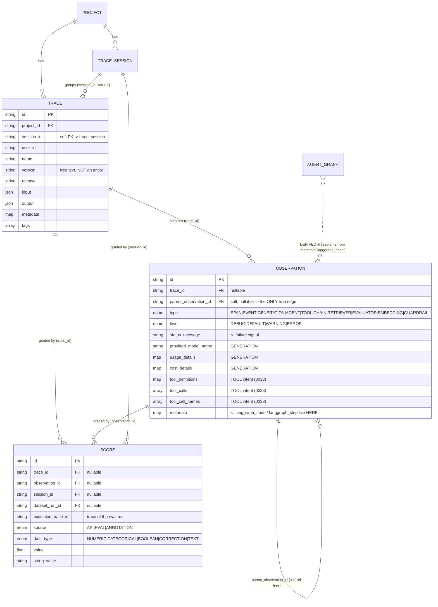
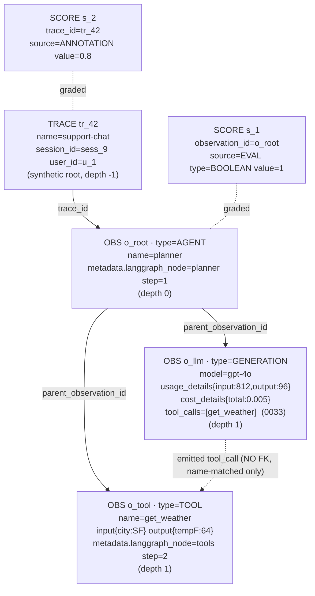

# Langfuse v3.177.1 Tracing Data Model: Trace / Observation / Score / Session

> **TL;DR.** Langfuse models everything observable as exactly **three primitives** — `Trace` (root container), `Observation` (the recursive work unit, with a 10-value `type` enum: `SPAN, EVENT, GENERATION, AGENT, TOOL, CHAIN, RETRIEVER, EVALUATOR, EMBEDDING, GUARDRAIL`), and `Score` (a measurement attached to any of trace/observation/session/dataset-run). An **LLM call** is an observation of type `GENERATION` carrying `model / usage_details / cost_details / model_parameters / completion_start_time`; a **tool call** is captured *two* ways — as a `TOOL`-typed observation, and/or as denormalized `tool_definitions` / `tool_calls` / `tool_call_names` columns on a parent GENERATION (migration `0033`). Nesting is a single self-referential edge: `parent_observation_id` + shared `trace_id`. **Crucially for Tracely: there are NO first-class `Agent`, `Agent Version`, `Conversation`, `Turn`, `Step`, or `Sub-Agent` entities.** A "Session" is a near-empty Postgres row (`trace_sessions`: id, bookmarked, public, environment), and an "agent graph" is reconstructed *at read time* from `metadata['langgraph_node']` / `metadata['langgraph_step']`. The trace tree is the only structure; every higher-level agent concept is derived or absent. **This gap is the Tracely thesis.**

This document reverse-engineers the actual local source. Every claim cites a file + line you can open.

---

## 0. Two coexisting physical models (read this first)

Langfuse is mid-migration between **two ClickHouse storage layouts** for the same logical data. Tracely should design against the *newer* one.

| | **Legacy 3-table model** (v3) | **New OTEL-native wide model** (v4, in progress) |
|---|---|---|
| Tables | `traces`, `observations`, `scores` | `events_full` (+ `events_core` projection) |
| DDL | `packages/shared/clickhouse/migrations/clustered/0001_traces.up.sql`, `0002_observations.up.sql`, `0003_scores.up.sql` | `packages/shared/clickhouse/scripts/dev-tables.sh:137` (`events_full`), `:285` (`events_core`) |
| Row identity | `traces.id`; `observations.id` + `parent_observation_id` | `span_id` + `parent_span_id` + `trace_id` (OTEL semantics) |
| Trace as row? | No — trace is its own table | **Yes** — trace becomes a synthetic span with `span_id = concat('t-', id)`, `parent_span_id = ''` (`definitions.ts:383` `convertTraceToStagingObservation`, `dev-tables.sh:521`) |
| Root detection | `parent_observation_id IS NULL` | `parent_span_id = '' OR is_app_root = true` (`eventsTable.ts:4` `eventsTableIsRootObservationSql`) |
| Engine | `ReplicatedReplacingMergeTree(event_ts, is_deleted)` | `ReplacingMergeTree(event_ts, is_deleted)` |

The Zod schemas for both live in `packages/shared/src/server/repositories/definitions.ts`: legacy = `observationRecordBaseSchema:34`, `traceRecordBaseSchema:127`, `scoreRecordBaseSchema:210`; new = `eventRecordBaseSchema:634` (one wide schema, ~90 columns).

Both models carry the **identical logical fields** below; the wide table just flattens trace attributes onto every span and adds OTEL instrumentation columns (`scope_name`, `service_name`, `telemetry_sdk_language`, …) and experiment columns. The domain layer that the UI/API consume (`packages/shared/src/domain/*`) is shared across both.

---

## 1. Trace

**Domain type** — `packages/shared/src/domain/traces.ts:12` (`TraceDomain`):

```
id, name, timestamp, environment, tags[], bookmarked, public, release,
version, input(json), output(json), metadata(record), createdAt, updatedAt,
sessionId, userId, projectId
```

**Physical (legacy)** — `clickhouse/migrations/clustered/0001_traces.up.sql:1`:

- Engine `ReplicatedReplacingMergeTree(event_ts, is_deleted)`, `PARTITION BY toYYYYMM(timestamp)`.
- `PRIMARY KEY (project_id, toDate(timestamp))`, `ORDER BY (project_id, toDate(timestamp), id)`.
- `input`/`output` are `Nullable(String) CODEC(ZSTD(3))` — raw JSON blobs, compressed.
- `metadata` is `Map(LowCardinality(String), String)` with bloom-filter indexes on both `mapKeys(metadata)` and `mapValues(metadata)` (`:21-22`).
- `tags` is `Array(String)`.

A trace is a **thin root container**: identity, IO, user/session pointers, tags, and aggregation anchors. It has **no `parent`, no `agent_id`, no `version`, no `turn`** — only `userId` (string) and `sessionId` (string) as soft grouping keys. Crucially the trace's `input`/`output` are *user-supplied*, not derived from child observations.

In the new model the trace doesn't exist as a distinct entity at all — it is materialized as a SPAN row `t-<id>` (`definitions.ts:389-393`).

---

## 2. Observation — the recursive work unit

This is the heart of the model. **Domain** — `packages/shared/src/domain/observations.ts:55` (`ObservationSchema`).

### 2.1 The type enum (10 values)

`observations.ts:5-30`:

```ts
export const ObservationType = {
  SPAN, EVENT, GENERATION,                          // the 3 "classic" types
  AGENT, TOOL, CHAIN, RETRIEVER, EVALUATOR,         // semantic subtypes (newer)
  EMBEDDING, GUARDRAIL,
} as const;
```

Physically `type` is a single `LowCardinality(String)` column (`0002_observations.up.sql:5`) — **not a separate table per type**. It is part of the legacy PRIMARY KEY: `ORDER BY (project_id, type, toDate(start_time), id)` (`0002_observations.up.sql:41-46`), so `type` is a first-class partitioning/sort dimension there.

**Key insight:** `AGENT`, `TOOL`, `CHAIN`, `RETRIEVER`, etc. are NOT new tables or new schemas. They are **enum tags on the same observation row**. `observations.ts:137-150` defines `GenerationLikeObservationTypes` = `[GENERATION, AGENT, TOOL, CHAIN, RETRIEVER, EVALUATOR, EMBEDDING, GUARDRAIL]` and `isGenerationLike()` — i.e. all 8 non-SPAN/EVENT types share the GENERATION column shape (they "could include LLM calls and potentially have similar input/output fields"). So an `AGENT` observation is structurally a generation that can also carry model/usage/cost.

### 2.2 The level enum

`observations.ts:32-44`: `ObservationLevel = { DEBUG, DEFAULT, WARNING, ERROR }`. Stored as `LowCardinality(String)` (`0002_observations.up.sql:11`). `ERROR`/`WARNING` + `status_message` is how failures are recorded on a span. The UI hides `DEBUG` via `removeHiddenNodes()` (`tree-building.ts:523`), ordering defined in `getObservationLevels()` (`tree-building.ts:59`).

### 2.3 Full observation field inventory

From `ObservationSchema` (`observations.ts:55-101`) + physical `0002_observations.up.sql`:

| Field group | Fields | Notes |
|---|---|---|
| Identity / tree | `id`, `traceId` (nullable!), `projectId`, `parentObservationId`, `type` | `parent_observation_id` is `Nullable(String)` (`0002:6`) |
| Timing | `startTime`, `endTime`, `completionStartTime` | `DateTime64(3)`; `completion_start_time` = time-to-first-token anchor |
| Core | `name`, `metadata`, `level`, `statusMessage`, `version`, `environment` | `metadata` = `Map(LowCardinality(String), String)` (`0002:10`) |
| IO | `input`, `output` | `Nullable(String) CODEC(ZSTD(3))` |
| **LLM/Generation** | `model`, `internalModelId`, `modelParameters`, `usageDetails`, `costDetails`, `providedUsageDetails`, `providedCostDetails`, `inputCost/outputCost/totalCost`, `inputUsage/outputUsage/totalUsage`, `usagePricingTierId/Name` | see §4 |
| Prompt link | `promptId`, `promptName`, `promptVersion` | links to prompt-management (out of Tracely scope) |
| **Tool** | `toolDefinitions` (`record<string,string>`), `toolCalls` (`string[]`), `toolCallNames` (`string[]`) | see §5; added in `0033` |
| Derived | `latency`, `timeToFirstToken` | computed, not stored on legacy table |

Note `traceId` is **nullable** on the observation (`observations.ts:57`) — observations can be ingested before/without their trace (a trace-null reconciliation path exists, `traceNullRecordInsertSchema:171`).

---

## 3. Nesting, depth, and tree reconstruction

**There is exactly one structural edge:** `parent_observation_id` (a `Nullable(String)` self-reference) scoped by shared `trace_id`. No `depth`, `level`, `path`, `lft/rgt`, or `materialized_path` column is stored. Depth is **always derived at read time.**

### 3.1 How depth/levels are computed (UI)

`web/src/components/trace/lib/tree-building.ts` builds the tree iteratively (explicitly "no recursion … 10k+ depth", `:5`):

1. `prepareObservations():80` — sorts by `startTime`, and **orphan-cleans**: if `parentObservationId` points to an id not in the set, it's nulled (`:89-94`) so the node floats up to root.
2. `buildDependencyGraph():110` — builds child lists; **roots = nodes where `!parentObservationId`** (`:140`), assigned `depth = 0`; BFS propagates `childNode.depth = currentNode.depth + 1` (`:155`).
3. `buildTreeNodesBottomUp():183` — topological sort (leaves first) to aggregate cost bottom-up: `totalCost = nodeCost + Σ children.totalCost` (`:238`). Also computes `startTimeSinceParentStart` (`:252`) and `childrenDepth` (subtree height, `:263`).
4. The legacy view wraps everything in a synthetic `type:"TRACE"` root node with **`depth: -1`** so real observations start at 0 (`:419-433`). The new events-based view returns the root observation(s) directly with no wrapper (`:386-398`) — note `roots` is an **array** because v4 traces can have **multiple roots**.

A second, simpler recursive nester exists at `web/src/components/trace/lib/helpers.ts:12` (`nestObservations`) used elsewhere, same orphan-cleaning logic (`:35-38`).

### 3.2 Depth semantics

- "Depth" / "level" = **distance from root in the parent_observation_id chain**, computed per-render. It is *purely structural* — depth carries no semantic meaning (depth-2 might be a tool, an LLM call, or a sub-step).
- There is **no notion of "turn depth" vs "step depth" vs "agent depth"** — it's one undifferentiated tree.

---

## 4. LLM Call = `GENERATION`

An LLM call is an observation with `type = "GENERATION"` (or any generation-like subtype). The LLM-specific payload (`observations.ts:71-96`, physical `0002_observations.up.sql:16-27`):

- `model` / `provided_model_name` (string the user sent) + `internal_model_id` (resolved Langfuse model row for pricing).
- `model_parameters` — `Nullable(String)` JSON (temperature, max_tokens, …).
- `provided_usage_details` & `usage_details` — `Map(LowCardinality(String), UInt64)` (`0002:19-20`). Keys like `input`, `output`, `total`, plus arbitrary provider keys (e.g. `cache_read_input_tokens`). `provided_*` = what the client sent; the non-prefixed = Langfuse-recomputed.
- `provided_cost_details` & `cost_details` — `Map(LowCardinality(String), Decimal64(12))` (`0002:21-22`). Aggregated to `inputCost/outputCost/totalCost` in the domain (`observations.ts:87-89`).
- `completion_start_time` (`0002:24`) — anchor for `timeToFirstToken = completion_start_time - start_time`.
- `usage_pricing_tier_id/name` — pricing tier (migration `0031`).

In the new wide table the same fields exist plus **materialized cost columns** computed by ClickHouse expression: `calculated_input_cost`, `calculated_output_cost`, `calculated_total_cost` via `arraySum(mapValues(mapFilter(... 'input'/'output' ..., cost_details)))` (`dev-tables.sh:181-184`), and `total_cost` as an `ALIAS` for `cost_details['total']`.

**OTEL → GENERATION mapping** is rich (`packages/shared/src/server/otel/ObservationTypeMapper.ts`): a span becomes `GENERATION` if `langfuse.observation.type=generation` (`:217`), or OpenInference `LLM` (`:241`), or GenAI `gen_ai.operation.name ∈ {chat, completion, generate_content, …}` (`:250`), or Vercel AI SDK `ai.generateText.doGenerate` + model info (`:284`), or a final model-based fallback (`:434`). Default if nothing matches: `SPAN` (`:483`).

---

## 5. Tool Call — represented TWO ways

This is subtle and important. Langfuse captures tool usage at **two granularities**:

### 5.1 As a dedicated `TOOL` observation

A tool execution can be its own observation row with `type = "TOOL"` (e.g. OTEL `gen_ai.operation.name = execute_tool` → `TOOL`, `ObservationTypeMapper.ts:265`; Vercel `ai.toolCall` → `TOOL`, `:389`; GenAI `gen_ai.tool.name`/`gen_ai.tool.call.id` → `TOOL`, `:399-410`; LiveKit `function_tool` → `TOOL`, `:428`). This is a normal node in the parent_observation_id tree, sibling to GENERATION calls.

### 5.2 As denormalized columns on a GENERATION (migration 0033)

`clickhouse/migrations/clustered/0033_add_tool_call_columns.up.sql`:

```sql
ALTER TABLE observations ADD COLUMN tool_definitions Map(String, String) DEFAULT map();
ALTER TABLE observations ADD COLUMN tool_calls Array(String) DEFAULT [];
ALTER TABLE observations ADD COLUMN tool_call_names Array(String) DEFAULT [];
```

Domain side (`observations.ts:98-100`):
- `toolDefinitions: record<string,string>` — the tool schemas *available* to the model on this call (name → JSON schema).
- `toolCalls: string[]` — the serialized tool-call requests the model *emitted*.
- `toolCallNames: string[]` — just the names (for fast filtering).

These are extracted from the LLM response during OTEL ingestion (`OtelIngestionProcessor.ts:368-378`, `:1537-1560` pulls `ai.response.toolCalls` / `ai.result.toolCalls`). The UI exposes them as filterable columns: "Available Tool Names" = `mapKeys(tool_definitions)`, "Called Tool Names" = `tool_call_names`, "Tool Calls" count = `length(tool_calls)` (`eventsTable.ts:313-342`).

**So:** the *intent to call a tool* lives on the GENERATION (what the model asked for), while the *actual tool execution* may be a separate `TOOL` child observation. The link between "GENERATION emitted tool_call X" and "TOOL observation that ran X" is **not a foreign key** — it's only implied by parent/child position and matching names. **Tracely will likely want an explicit edge here.**

---

## 6. Score — measurement attached to anything

**Domain** — `packages/shared/src/domain/scores.ts:124` (`ScoreSchema`). **Physical** — `0003_scores.up.sql`.

- A score references **one of**: `traceId`, `observationId`, `sessionId`, `datasetRunId` (all nullable; `scores.ts:115-119`, `definitions.ts:213-216`). So a score can grade a whole trace, a single observation/span, an entire session, or a dataset-run.
- `source` enum (`scores.ts:4-10`): `API | EVAL | ANNOTATION`. `EVAL` is reserved for internal evaluator outputs; external callers may only set `API`/`ANNOTATION` (`scores.ts:18-21`).
- `dataType` discriminated union (`scores.ts:46-61`, `124-132`): `NUMERIC | CATEGORICAL | BOOLEAN | CORRECTION | TEXT`. `value` (Float64) for numeric/boolean; `string_value` for categorical/text.
- `config_id` links to a score-config (rubric); `queue_id` links to an annotation queue; `execution_trace_id` (migration `0030`, `scores.ts:106`) points to the **trace of the eval run that produced the score** — i.e. evals are themselves traced.
- `AGGREGATABLE_SCORE_TYPES = [NUMERIC, BOOLEAN, CATEGORICAL]` (`scores.ts:148`) — what gets averaged in dashboards; `TEXT`/`CORRECTION` excluded.

Physical: `ReplicatedReplacingMergeTree(event_ts, is_deleted)`, `ORDER BY (project_id, toDate(timestamp), name, id)` (`0003_scores.up.sql:28-33`) — note `name` is in the sort key, so scores are queried by metric name efficiently.

**Relevance:** this is the closest thing Langfuse has to an evaluation primitive, and it's already trace/observation/session-addressable and self-tracing (`execution_trace_id`). It is **score-as-attachment**, not **eval-suite-as-entity**. There is no `EvaluationSuite`, `EvaluationCase`, or `FailureCluster` table anywhere.

---

## 7. Session — a near-empty grouping shell

**Postgres** — `packages/shared/prisma/schema.prisma:312` (`model TraceSession`, table `trace_sessions`):

```prisma
model TraceSession {
  id, createdAt, updatedAt, projectId, project,
  bookmarked Boolean @default(false),
  public     Boolean @default(false),
  environment String @default("default"),
  @@id([id, projectId])
}
```

That is the **entire** session entity: id + two UI flags + environment. A "session" is just a string key (`trace.sessionId`) that many traces share; the `trace_sessions` row exists only to hold bookmark/public state. **There is no turn list, no message array, no ordering, no conversation structure, no participant model.** Session-level metrics (total cost, trace count, duration) are *computed by aggregating the member traces at query time*, not stored.

`session.id` arrives via OTEL attribute `session.id` (`attributes.ts:5`, `TRACE_SESSION_ID`). On the new wide table `session_id` is denormalized onto every event row with a bloom-filter index (`dev-tables.sh:303, 388`).

---

## 8. THE TRACELY GAP: no first-class Agent / Conversation / Turn / Step / Sub-Agent

I verified this directly. The Prisma schema has **65 models** (`grep -cE "^model "` over `schema.prisma`). **Zero** of them are `Agent`, `AgentVersion`, `AgentRun`, `Conversation`, `Turn`, `Step`, `SubAgent`, or `FailureCluster` (confirmed: `grep -niE "^model (Agent|Turn|Conversation|Version|AgentRun|SubAgent|FailureCluster)"` returns nothing).

So where do "agent" concepts live in Langfuse? **They are reconstructed at read time from `metadata` + the parent tree:**

### 8.1 The "agent graph" is a derived view over metadata

`web/src/features/trace-graph-view/` renders a LangGraph-style node graph. Its data comes from `getAgentGraphData()` in `packages/shared/src/server/repositories/traces.ts:1572`:

```sql
SELECT id, parent_observation_id, type, name, start_time, end_time,
       metadata['langgraph_node'] AS node,     -- <-- pulled from the metadata Map
       metadata['langgraph_step'] AS step      -- <-- pulled from the metadata Map
FROM observations
WHERE project_id = {…} AND trace_id = {…}
```

The graph "nodes" and "steps" are **string/number values fished out of the `metadata` map** (keys `langgraph_node`, `langgraph_step`; constants at `trace-graph-view/types.ts:14-15`). The new events table does the same: `mapFromArrays(arrayReverse(metadata_names), arrayReverse(metadata_values))['langgraph_node']` (`repositories/events.ts:2832`). The graph builder (`buildStepData.ts`, `buildGraphCanvasData.ts`) groups observations by these metadata values and injects synthetic `__start__`/`__end__` nodes (`types.ts:16-19`). If `node` is absent, **no graph can be drawn** (`buildGraphCanvasData.ts:19`).

**Implication:** an "agent step" in Langfuse = `(an observation, its metadata['langgraph_node'], its position in the parent tree)`. It is framework-specific (LangGraph), opportunistic (only if the SDK set those metadata keys), and not modeled, not queryable as an entity, not versioned, not gradable on its own beyond a span-level score.

### 8.2 `AGENT` type exists but is just a label + IO shape

The `AGENT` observation type (`observations.ts:9`) carries the same columns as a GENERATION (`isGenerationLike` includes it, `:138`). There is **no agent-specific table, no agent identity, no agent registry, no agent version**. `invoke_agent`/`create_agent` OTEL ops simply tag a span `type='AGENT'` (`ObservationTypeMapper.ts:264`). A multi-agent handoff is just one `AGENT` span being the `parent_observation_id` of another `AGENT` span — there is no edge typed as "handoff", "delegation", or "sub-agent call".

### 8.3 `is_app_root` — the closest thing to "agent run boundary"

The new model adds `is_app_root Bool` (`dev-tables.sh:160`) and OTEL attr `langfuse.internal.is_app_root` (`attributes.ts:36`). Root detection becomes `parent_span_id = '' OR is_app_root = true` (`eventsTable.ts:4`). This lets a non-root span be flagged as a logical entry point (e.g. an agent invocation that's nested under infra spans) — but it's still just a boolean on a span, not an `AgentRun` entity.

### 8.4 Summary table — what exists vs what Tracely needs

| Tracely entity | Langfuse equivalent | Status |
|---|---|---|
| **Agent** | — | **ABSENT.** Inferred from `metadata` / span name / `AGENT` type only |
| **Agent Version** | `trace.version` / `observation.version` (free-text string) + `release` | **ABSENT as entity.** Just a string label, no version table, no lineage |
| **Agent Run** | A `Trace`, or an `is_app_root` span | **PARTIAL.** Trace ≈ run, but no run status/outcome/version FK |
| **Conversation** | `session_id` string + `trace_sessions` shell | **ABSENT.** No conversation entity, only a shared key |
| **Turn** | — | **ABSENT.** No turn ordering or boundaries; multi-turn = multiple traces sharing `session_id` |
| **Step** | An observation + `metadata['langgraph_step']` | **DERIVED.** Read-time only, LangGraph-specific |
| **Tool Call** | `TOOL` observation + `tool_calls`/`tool_definitions` cols | **PRESENT** (dual representation, §5), but no explicit call→execution edge |
| **LLM Call** | `GENERATION` observation | **PRESENT & strong** (§4) |
| **Sub-Agent Call** | nested `AGENT` span via `parent_observation_id` | **ABSENT as typed edge.** Just generic parent/child |
| **Evaluation Suite / Case** | — | **ABSENT.** Only `Score` (attachment) + dataset-run |
| **Failure Cluster** | — | **ABSENT.** Failures = `level=ERROR` + `status_message` on a span |

---

## 9. Entity diagram

### 9.1 Mermaid — logical model (legacy 3-table + derived views)



(`AGENT_GRAPH` is drawn dashed because it is **not a table** — it is computed by `getAgentGraphData()`, `traces.ts:1572`.)

### 9.2 ASCII — the new wide `events` model

```
events_full / events_core  (one row per span; trace = synthetic span 't-<id>')
+--------------------------------------------------------------------------+
| project_id | trace_id | span_id | parent_span_id | is_app_root           |
| type (SPAN|GENERATION|AGENT|TOOL|CHAIN|RETRIEVER|EVALUATOR|EMBEDDING|...) |
| start_time | end_time | completion_start_time                            |
| name | level | status_message | environment | version | release         |
| user_id | session_id | trace_name | tags[]   <- trace attrs FLATTENED     |
| provided_model_name | model_parameters | usage_details{} | cost_details{} |
| calculated_input_cost | calculated_output_cost | calculated_total_cost   |  (MATERIALIZED)
| tool_definitions{} | tool_calls[] | tool_call_names[]                     |
| input | output | metadata_names[] | metadata_values[]                     |
| experiment_id | experiment_item_id | experiment_item_root_span_id        |
| source | scope_name | service_name | telemetry_sdk_language             |  (OTEL instrumentation)
+--------------------------------------------------------------------------+
   ENGINE = ReplacingMergeTree(event_ts, is_deleted)
   ORDER BY (project_id, toStartOfMinute(start_time), xxHash32(trace_id), span_id, start_time)
   root iff: parent_span_id = '' OR is_app_root = true
   tree edge: parent_span_id -> span_id  (within same trace_id)
```

Source: `dev-tables.sh:137-281` (`events_full`), `:285-410` (`events_core`), `eventsTable.ts`.

---

## 10. Concrete nested trace example: Agent → LLM → Tool

A planner agent that calls an LLM (which requests a tool), then executes the tool.

### 10.1 ASCII tree (legacy `observations`, by `parent_observation_id`)

```
TRACE  id=tr_42  name="support-chat"  session_id="sess_9"  user_id="u_1"     (depth -1, synthetic wrapper)
└─ OBS  id=o_root  type=AGENT   name="planner"        parent=NULL            (depth 0, root observation)
   │     metadata={langgraph_node:"planner", langgraph_step:1}
   ├─ OBS id=o_llm  type=GENERATION name="gpt-4o call" parent=o_root          (depth 1)
   │        model="gpt-4o"
   │        usage_details={input:812, output:96, total:908}
   │        cost_details={input:0.004, output:0.001, total:0.005}
   │        tool_definitions={get_weather:"{schema...}"}      <- tools offered
   │        tool_calls=["{name:get_weather, args:{city:SF}}"] <- model asked  (0033 cols)
   │        tool_call_names=["get_weather"]
   └─ OBS id=o_tool type=TOOL    name="get_weather"     parent=o_root         (depth 1, sibling of o_llm)
            metadata={langgraph_node:"tools", langgraph_step:2}
            input={city:"SF"}   output={tempF:64}   level=DEFAULT
            └─ (could nest a GENERATION/SPAN here if the tool itself called an LLM)
SCORE id=s_1 observation_id=o_root name="trajectory_correct" source=EVAL data_type=BOOLEAN value=1
SCORE id=s_2 trace_id=tr_42       name="user_helpfulness"   source=ANNOTATION data_type=NUMERIC value=0.8
```

Note: the link "o_llm emitted tool_call `get_weather`" ↔ "o_tool executed `get_weather`" is **only implied** by sibling position + matching name. There is no FK. Depth values (`-1, 0, 1, 1`) are computed by `tree-building.ts`, not stored.

### 10.2 Mermaid — the same trace as a graph



---

## 11. Relevance to Tracely

**What to STEAL (the tracing/storage substrate is genuinely strong):**

1. **The wide OTEL-native `events` table is the right physical model** (`dev-tables.sh:137`). One immutable row per span keyed by `(project_id, time-bucket, hash(trace_id), span_id)`, `ReplacingMergeTree(event_ts, is_deleted)` for idempotent upserts/soft-deletes, materialized cost columns, ZSTD-compressed IO, and `xxHash32(trace_id)` sampling. Reuse this almost verbatim for storing agent runs.
2. **Trace-as-synthetic-span** (`convertTraceToStagingObservation`, `definitions.ts:383`, `span_id='t-<id>'`) lets root containers and children flow through one pipeline. Tracely's `Agent Run` can be the root span and still live in the same table as its steps.
3. **`parent_span_id` self-edge + read-time tree-building** (`tree-building.ts`) is proven to scale (iterative, 10k+ depth, orphan-tolerant). Reuse the algorithm; just enrich the node type.
4. **The 10-value observation `type` enum + `isGenerationLike`** (`observations.ts:5,138`) is a good vocabulary — `AGENT/TOOL/CHAIN/RETRIEVER/GUARDRAIL/EVALUATOR` already cover most agent-frameworks' span kinds, and the `ObservationTypeMapper` (`ObservationTypeMapper.ts`) is a ready-made ingestion adapter for OpenInference / GenAI / Vercel AI SDK / Genkit / Pydantic / LiveKit / LangGraph. **Steal the whole mapper registry.**
5. **`Score` addressing model** (trace/observation/session/dataset-run + `execution_trace_id` so evals are themselves traced; `scores.ts`) is reusable as the *output* sink for Tracely evals — but see below.
6. **`level=ERROR` + `status_message`** as the failure signal on any span — Tracely's failure detection can seed off exactly this.
7. **`is_app_root` boolean** (`dev-tables.sh:160`) — a cheap way to mark logical agent-run entry points without a new entity; Tracely can generalize this.

**What is the GAP Tracely must build (and exactly why Langfuse can't pivot here cheaply):**

1. **First-class `Agent`, `AgentVersion`, `AgentRun`, `Conversation`, `Turn`, `Step`, `SubAgentCall` entities.** Langfuse has **none** (§8, verified against all 65 Prisma models). "Version" is a free-text string on trace/observation; "agent step" is `metadata['langgraph_node']` pulled at query time (`traces.ts:1588`); a "conversation" is just a shared `session_id` with a 5-field shell row (`schema.prisma:312`). Tracely's primary entities map onto Langfuse's secondary derivations — so Tracely needs a real entity layer *on top of / beside* a Langfuse-style span store.
2. **Typed edges.** Langfuse only has one untyped `parent` edge. Tracely needs: `LLM_emitted → TOOL_executed` (currently name-matched, §5.2), `AGENT → SUB_AGENT` (handoff/delegation), `TURN → TURN` (ordering within a conversation). These should be explicit, not inferred from sibling order + metadata.
3. **Trajectory as a first-class, addressable object.** Langfuse can *render* a trajectory (the tree) but cannot *name, version, diff, or assert on* a trajectory. Tracely's "production trace → regression test" pipeline needs the trajectory (sequence of typed steps + tool calls + handoffs) to be a stored, comparable artifact — not just a render-time tree.
4. **Eval as suite/case, not score-as-attachment.** `Score` is the *result* primitive and is reusable as such. But there is no `EvaluationSuite`/`EvaluationCase`/`FailureCluster` entity (§6). Tracely's trace-first, multi-level (conversation/turn/step/tool/agent/multi-agent) eval needs these as real entities that *target* a span/turn/trajectory and produce Scores. Reuse `Score` + `execution_trace_id` (self-tracing evals) as the output; build the suite/case/cluster layer new.
5. **Turn/conversation structure for multi-turn.** Multi-turn in Langfuse = N traces sharing a string `session_id`, with no ordering, no turn boundaries, no per-turn IO contract. Tracely must model `Conversation → Turn[] → (Agent Run / Steps)` explicitly to do turn-level regression.

**Bottom line:** Langfuse's *tracing substrate* (wide events table, span tree, type enum, OTEL mappers, score sink, ReplacingMergeTree idempotency) is excellent and largely reusable. Its *semantic/agent layer* is essentially absent — agent/turn/step/conversation are strings-in-metadata and read-time reconstructions. **Tracely's defensible surface is exactly that missing semantic + evaluation entity layer**, sitting on a Langfuse-grade span store.
