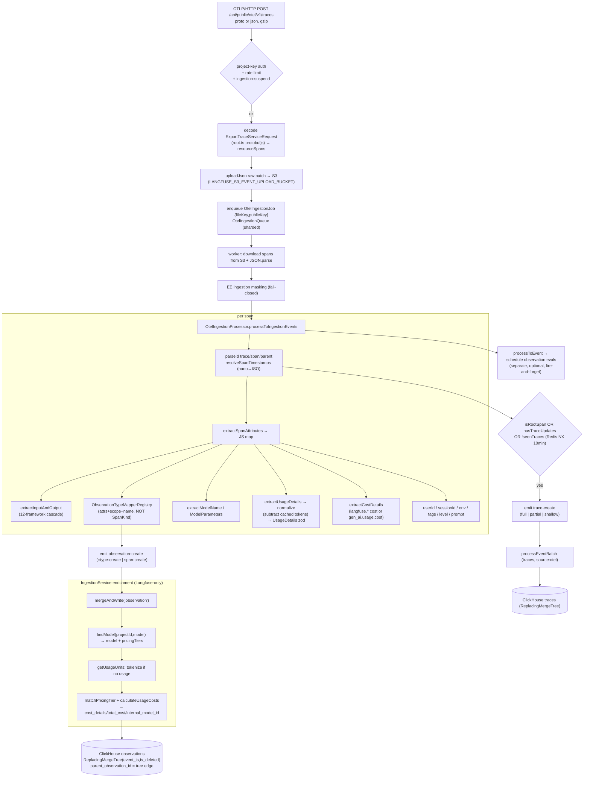

# Langfuse v3.177.1 — OpenTelemetry Ingestion & Mapping (OTLP → Traces + Observations)

**Subsystem owner doc.** Reverse-engineered by reading the actual local source, not docs.
Repo root: `/Users/julien/Documents/Repos/langfuse`. All paths below are repo-relative.

## TL;DR

Langfuse exposes a standard OTLP/HTTP trace endpoint (`web/src/pages/api/public/otel/v1/traces/index.ts`) that does *almost no mapping inline*: it authenticates the project, dumps the raw `resourceSpans` to S3, and enqueues a BullMQ job. The real work happens asynchronously in the worker (`worker/src/queues/otelIngestionQueue.ts` → `OtelIngestionProcessor`), which converts each OTLP span into **one observation event** plus (conditionally) a **trace-create event**, using a giant heuristic that understands ~12 instrumentation conventions (`gen_ai.*`, `llm.*` / OpenInference, `traceloop.*`, `logfire`, `langfuse.*`, Vercel `ai.*`, Genkit, MLflow, LiveKit, GCP Vertex ADK, Pydantic-AI, SmolAgents). Observation **type** is resolved by a priority-ordered `ObservationTypeMapperRegistry` that keys off *attributes and span name* — **not** the numeric OTLP `SpanKind`. Cost, usage normalization, prompt linkage, token counting, the score model, multi-tenant auth, and the merged "current state" tree are all **derived downstream** in `IngestionService` and ClickHouse `ReplacingMergeTree` tables; none of it is part of the OTLP spec. For Tracely the *transport + attribute-fan-in heuristic* is highly reusable; the *dataset/experiment/prompt/cost machinery bolted onto the same path* is Langfuse-specific noise.

---

## 1. The two-stage pipeline (API edge → worker)

### 1.1 API edge: parse, store, enqueue (no mapping)

`web/src/pages/api/public/otel/v1/traces/index.ts`:

- Route is `POST /api/public/otel/v1/traces`, wrapped in `createAuthedProjectAPIRoute({ name: "OTel Traces", rateLimitResource: "ingestion" })` (line 33-37). Auth is **multi-tenant via project API key** (`auth.scope.projectId/publicKey/orgId`), and ingestion can be hard-blocked: `if (auth.scope.isIngestionSuspended) throw new ForbiddenError(...)` (line 40-44). This auth layer has nothing to do with OTLP — it is Langfuse's key model.
- `bodyParser: false` (line 26-30); the raw body is read manually, gzip-decompressed if `content-encoding: gzip` (line 63-75).
- Content negotiation accepts **both** `application/x-protobuf` and `application/json` (line 80-113). Protobuf is decoded by `$root.opentelemetry.proto.collector.trace.v1.ExportTraceServiceRequest.decode(body)` then `.toObject(...)` (line 92-98) using the vendored protobufjs bundle at `web/src/pages/api/public/otel/otlp-proto/generated/root.ts` (a `// @ts-nocheck` generated file; defines `opentelemetry.proto.common.v1.AnyValue`, `Span.SpanKind` enum lines 3798-3815, etc.). JSON path is just `JSON.parse(body.toString()).resourceSpans` (line 107).
- Langfuse-specific headers steer a later write-path decision: `x-langfuse-sdk-name`, `x-langfuse-sdk-version`, `x-langfuse-ingestion-version` (read tolerant of hyphen/underscore by `getLangfuseHeader`, line 15-24, 136-144). `x-langfuse-ingestion-version > 4` is rejected (line 146-159).
- **No span→observation mapping happens here.** The handler ends with `processor.publishToOtelIngestionQueue(resourceSpans)` (line 187).

`OtelIngestionProcessor.publishToOtelIngestionQueue` (`packages/shared/src/server/otel/OtelIngestionProcessor.ts:182-219`):
- Uploads the raw batch to S3 at key `${LANGFUSE_S3_EVENT_UPLOAD_PREFIX}otel/${projectId}/${yyyy/mm/dd/hh/mm}/${uuid}.json` via `getS3EventStorageClient(env.LANGFUSE_S3_EVENT_UPLOAD_BUCKET).uploadJson(...)`.
- Adds a `QueueJobs.OtelIngestionJob` to `OtelIngestionQueue` (sharded; `shardingKey = ${projectId}-${fileKey}`). The payload carries only `{ fileKey, publicKey }` + an `authCheck.scope` + the SDK headers — **the spans themselves travel through S3, not Redis** (`packages/shared/src/server/redis/otelIngestionQueue.ts`). Queue shard count = `env.LANGFUSE_OTEL_INGESTION_QUEUE_SHARD_COUNT` (`packages/shared/src/env.ts:134`).
- `markProjectAsOtelUser(projectId)` flips a 24h Redis flag `langfuse:project:${projectId}:otel:active` *only if* `LANGFUSE_SKIP_FINAL_FOR_OTEL_PROJECTS === "true"` (`packages/shared/src/server/redis/otelProjectTracking.ts:11-26`). Used to tune ClickHouse `FINAL` behavior; irrelevant to mapping.
- The `/v1/metrics` endpoint is a **no-op stub**: `fn: async () => {}` (`web/src/pages/api/public/otel/v1/metrics/index.ts:17`). Langfuse ingests **only spans**, not OTel metrics.

### 1.2 Worker: convert, merge, enrich

`worker/src/queues/otelIngestionQueue.ts` (`otelIngestionQueueProcessorBuilder`, line 193-546):
1. Download raw spans from S3 (line 252-254), `JSON.parse` (line 266).
2. Optional EE **ingestion masking** (`applyIngestionMasking`, fail-closed drop on error, line 269-292).
3. `processor.processToIngestionEvents(parsedSpans)` (line 300) → flat list of `IngestionEventType` (trace-create + `<type>-create` events).
4. Split events: `getClickhouseEntityType(e.type) !== "observation"` → traces; observations are re-validated through `createIngestionEventSchema()` (line 303-323).
5. **Observations** go straight to `ingestionService.mergeAndWrite("observation", projectId, body.id, now, [obs], shouldForwardToEventsTable)` (line 408-419). **Traces** go through `processEventBatch(traces, auth, { source: "otel" })` (line 424-428).
6. A *second* pass `processor.processToEvent(parsedSpans)` (line 438) builds a flatter "EventInput" record used for (a) scheduling **observation-level evals** (`fetchObservationEvalConfigs` / `scheduleObservationEvals`, line 449-511) and (b) an experimental direct write to an `events` table. **This is the only place OTel ingestion touches evaluation, and it is fire-and-forget scheduling — not part of the OTLP→trace mapping.**

ASCII overview:

```
OTLP/HTTP POST (proto|json, gzip?)
        │  project-key auth, rate-limit, suspend-check
        ▼
[api/public/otel/v1/traces]  ──uploadJson──► S3 (raw resourceSpans)
        │                                         ▲
        └── enqueue OtelIngestionJob {fileKey} ───┘ (BullMQ, sharded by projectId-fileKey)
                         │
                         ▼
[worker/queues/otelIngestionQueue]  ── download raw spans from S3
                         │  (EE masking, fail-closed)
                         ▼
   OtelIngestionProcessor.processToIngestionEvents()
                         │
        ┌────────────────┴───────────────────┐
        ▼                                     ▼
  observations[]                          traces[]
   mergeAndWrite("observation")        processEventBatch(source:"otel")
        │                                     │
        ▼                                     ▼
   IngestionService.processObservationEventList   processTraceEventList
   (findModel → tokenize → calculateUsageCosts)
        │
        ▼
  ClickHouse `observations` / `traces` (ReplacingMergeTree)
                         │
                         ▼
   processToEvent() → schedule observation evals (separate, optional)
```

---

## 2. Span → events: the conversion contract

`processToIngestionEvents` → `processResourceSpan` → `processSpan` (`OtelIngestionProcessor.ts:521-815`). For **every span** it:

- Parses IDs: `parseId(span.traceId)` / `parseId(span.spanId)` / `parseId(span.parentSpanId)`. `parseId` (line 2841-2845) handles both wire formats: **JS SDK sends hex strings; Python SDK sends int arrays → `Buffer.from(data).toString("hex")`.**
- Resolves timestamps from `startTimeUnixNano`/`endTimeUnixNano` via `resolveSpanTimestamps` → `convertNanoTimestampToISO` (line 2851-2963). Handles string, number, and `{high, low}` Long forms; if one edge is missing it borrows the other; if both missing → `now()`. Emits failure metric `langfuse.ingestion.otel.conversion_failure`.
- Computes `isRootSpan = !parentObservationId || attributes["langfuse.internal.as_root"] === "true"` (line 769-771).
- Computes `hasTraceUpdates(attributes)` (line 1083-1116): true if any trace-level attribute is present (`langfuse.trace.*`, plus integration aliases `ai.telemetry.metadata.sessionId/userId/tags`, `tag.tags`, and any key prefixed `langfuse.trace.metadata`).

**Trace-create emission rule** (line 776): a `trace-create` event is emitted if `isRootSpan || hasTraceUpdates || !this.seenTraces.has(traceId)`.
- **Shallow trace** (only `{id, timestamp, environment}`) for a first-seen non-root span (line 833-837).
- **Full trace** for root spans (name/metadata/userId/sessionId/public/tags/input/output, line 842-883).
- **Partial trace update** for non-root spans carrying explicit `langfuse.trace.*` (line 885-918).
- `seenTraces` is seeded from Redis with `SET langfuse:project:${projectId}:trace:${traceId}:seen 1 EX 600 NX` (10-minute dedupe window, line 2793-2839). After processing, redundant shallow trace-creates are dropped if a full one exists for the same `traceId` (`filterRedundantShallowTraces`, line 600-651).

**Observation-create emission** (always, one per span): `createObservationEvent` (line 953-1081). The event `type` is computed as `${observationType}-create` if the mapped type is a known `ObservationTypeDomain`, else `"span-create"` (line 1059-1073).

Key consequence for Tracely: **the trace tree is not transmitted — it is reconstructed.** Parent linkage rides on `parentObservationId = parseId(parentSpanId)` stored on each observation; the "trace" entity is a synthesized roll-up. There is no explicit conversation/turn/agent entity in OTLP — Langfuse only has `trace` + `observation(type)`.

---

## 3. Attribute namespaces handled & field mapping

`extractSpanAttributes` flattens OTLP `KeyValue[]` to a JS map via `convertValueToPlainJavascript` (line 1138-1145, 1285-1317), which unwraps `stringValue/doubleValue/boolValue/intValue{high,low}/arrayValue`. Then a battery of `extract*` methods reads specific keys. Langfuse's *own* attribute names are the enum `LangfuseOtelSpanAttributes` (`packages/shared/src/server/otel/attributes.ts`).

### 3.1 Field-by-field mapping table

| Langfuse field | Source attribute keys (in precedence order) | Code |
|---|---|---|
| **observation.type** | resolved by `ObservationTypeMapperRegistry` (see §4) | `OtelIngestionProcessor.ts:1053`, `ObservationTypeMapper.ts` |
| **model** | `langfuse.observation.model.name` → `gen_ai.response.model` → `ai.model.id` → `gen_ai.request.model` → `llm.response.model` → `llm.model_name` → `model`; (+`genkit:name` if `genkit:metadata:subtype==model`) | `extractModelName` line 2159-2184 |
| **modelParameters** | `langfuse.observation.model.parameters` (JSON) → Genkit `genkit:input.config` → Vercel `ai.*`/`gen_ai.request.*` → `llm.invocation_parameters` → `model_config` → all `gen_ai.request.*` (minus `model`) | `extractModelParameters` line 2038-2142; sanitized to string/number map by `sanitizeModelParams` 2144-2157 |
| **usageDetails / providedUsageDetails** | `langfuse.observation.usage_details` (JSON) → Genkit `genkit:output.usage` → Vercel `ai`/`gen_ai.usage.*` + `ai.response.providerMetadata` (openai/anthropic/bedrock cache breakdown) → generic `gen_ai.usage.*` & `llm.token_count.*` | `extractUsageDetails` line 2186-2392; generic `extractGenericGenAiUsageDetails` 2394-2505 |
| **costDetails / providedCostDetails** | `langfuse.observation.cost_details` (JSON) → `gen_ai.usage.cost` → `{}` | `extractCostDetails` line 2507-2522 |
| **input / output** | huge per-framework cascade (see §3.2) | `extractInputAndOutput` line 1386-1848 |
| **promptName / promptVersion** | `langfuse.observation.prompt.name|version` → `langfuse.prompt.name|version` → Vercel `ai.telemetry.metadata.langfusePrompt` (JSON `{name,version}`) | line 423-437, 1033-1042; `parseLangfusePromptFromAISDK` 2757-2771 |
| **level** | `langfuse.observation.level` → ERROR if `span.status.code === 2` → DEBUG for `livekit-agents` debug span names → DEFAULT | line 406-415, 1012-1019 |
| **statusMessage** | `langfuse.observation.status_message` → `span.status.message` | line 416-421, 1020-1023 |
| **completionStartTime** | `langfuse.observation.completion_start_time` → Vercel `ai.response.msToFirstChunk`/`ai.stream.msToFirstChunk` (start + ms) | `extractCompletionStartTime` 2524-2560 |
| **parent linkage** | `parentObservationId = parseId(span.parentSpanId)`; trace via `parseId(span.traceId)` | line 750-753, 1001-1002 |
| **userId** | `langfuse.user.id` → `user.id` → `langfuse.observation.metadata.langfuse_user_id` → `langfuse.trace.metadata.langfuse_user_id` → `ai.telemetry.metadata.userId` | `extractUserId` 1997-2015 |
| **sessionId** | `langfuse.session.id` → `session.id` → `gen_ai.conversation.id` → `…metadata.langfuse_session_id` (obs/trace) → `ai.telemetry.metadata.sessionId` | `extractSessionId` 2017-2036 |
| **environment** | `langfuse.environment` → `deployment.environment.name` → `deployment.environment` (span then resource), else `"default"` | `extractEnvironment` 1897-1917 |
| **tags** | `langfuse.trace.tags` → `langfuse.tags` → `…metadata.langfuse_tags` → `ai.telemetry.metadata.tags` → `tag.tags` (CSV / JSON-array aware) | `extractTags` 2562-2603 |
| **version** | `langfuse.version` → resource `service.version` | line 398-401 |
| **release** | `langfuse.release` (span then resource) | line 467-472 |
| **name** | `gen_ai.tool.name` → `genkit:name` → `logfire.msg` → Vercel `ai.toolCall.name` / `ai.telemetry.functionId:ai.operationId` → raw span name | `extractName` 1919-1962 |
| **public** | `langfuse.trace.public`/`langfuse.public` (bool/"true") | `extractPublic` 936-945 |
| **metadata** | `langfuse.{observation,trace}.metadata` blob + prefixed `…metadata.*` + `ai.telemetry.metadata.*` (excluding userId/sessionId/tags/langfusePrompt) + always-attached `resourceAttributes` and `scope` | `extractMetadata` 1964-1995, assembled 987-993 |

Namespaces explicitly recognized: `langfuse.*`, `gen_ai.*` (OTel GenAI semconv), `llm.*` + `openinference.span.kind` (OpenInference), `traceloop.*`, `logfire.*` (`logfire.msg`, `events`, `all_messages_events`, `prompt`), Vercel `ai.*`, `genkit:*`, `mlflow.*`, `lk.*` (LiveKit), `gcp.vertex.agent.*` (Google ADK), `pydantic_ai.*`, SmolAgents `input.value`/`output.value`, `deployment.environment*`, `service.*`/`telemetry.sdk.*` (resource).

### 3.2 Input/output extraction cascade (most framework-specific code)

`extractInputAndOutput` (line 1386-1848) tries sources in this order and returns on first hit; it also strips all known I/O keys from `filteredAttributes` so they aren't double-stored in metadata (line 1401-1489):
1. **Langfuse** `langfuse.{trace,observation}.input/output`.
2. **Genkit** (`genkit-tracer`): `genkit:input.messages` / `genkit:output.message`.
3. **Vercel AI SDK** (scope `ai`): `ai.prompt.messages` / `ai.prompt` / `ai.toolCall.args` → `ai.response.text`(+`toolCalls`) / `ai.result.*` legacy.
4. **OTel GenAI events** (`span.events[]` named `gen_ai.system|user|assistant|tool.message` → input, `gen_ai.choice` → output) — role derived from event name (line 1567-1621). Note: GenAI prompt/completion bodies live in `span.events`, not attributes.
5. **Legacy semantic-kernel** `gen_ai.content.prompt` / `gen_ai.content.completion` events (recursive, 1623-1661).
6. **GCP Vertex ADK** `gcp.vertex.agent.llm_request/llm_response`, falling back to `tool_call_args/tool_response` when `{}` (1663-1677).
7. **Logfire** `prompt`/`all_messages_events`, or a single `events` array split on `event.name == gen_ai.choice` (1679-1723).
8. **MLflow** `mlflow.spanInputs/spanOutputs` (1725-1730).
9. **TraceLoop** `traceloop.entity.input/output` (1732-1737).
10. **SmolAgents** `input.value/output.value` (1739-1744).
11. **Pydantic / Pipecat** plain `input/output` (1746-1751).
12. **Pydantic-AI** (`pydantic-ai`): `pydantic_ai.all_messages` → input, `final_result` → output, with `gen_ai.system_instructions` prepended as a system message (1753-1766); tool spans via `tool_arguments/tool_response`.
13. **TraceLoop indexed attrs** `gen_ai.prompt.N.*` / `gen_ai.completion.N.*` → rebuilt into arrays via `convertKeyPathToNestedObject` (1775-1796).
14. **OpenInference** `llm.input_messages.N.*` / `llm.output_messages.N.*` → arrays (used by Agno, BeeAI; 1798-1825).
15. **OTel GenAI attrs** `gen_ai.input.messages` / `gen_ai.output.messages` (+ system instructions), and `gen_ai.tool.call.arguments` / `gen_ai.tool.call.result` (1827-1845).

`convertKeyPathToNestedObject` (line 1319-1384) rebuilds nested JSON from dotted keys with **prototype-pollution guards** (`__proto__/constructor/prototype` blocked, `Object.create(null)`).

---

## 4. Observation typing — `ObservationTypeMapperRegistry`

`packages/shared/src/server/otel/ObservationTypeMapper.ts`. A registry of mappers run in **priority order (lower = first)**; first non-null wins, default `"SPAN"` (line 462-484). It receives `(attributes, resourceAttributes, scope, spanName)` — **the numeric OTLP `SpanKind` is never passed in and is never consulted.** "Span kind" in Langfuse means the *attribute-encoded* kind (`openinference.span.kind`, `gen_ai.operation.name`), not OTLP `SPAN_KIND_SERVER/CLIENT/...`.

| Pri | Mapper | Trigger | Result |
|---|---|---|---|
| 0 | `PythonSDKv330Override` | `langfuse.observation.type == "span"` + scope `langfuse-sdk` + python + version ≤ 3.3.0 + has any generation-like attr | `GENERATION` (bug workaround #8682) |
| 1 | `LangfuseObservationTypeDirectMapping` | `langfuse.observation.type` ∈ {span,generation,event,embedding,agent,tool,chain,retriever,guardrail,evaluator} | that type |
| 2 | `OpenInference` | `openinference.span.kind` ∈ {CHAIN,RETRIEVER,LLM→GENERATION,EMBEDDING,AGENT,TOOL,GUARDRAIL,EVALUATOR} | mapped |
| 3 | `OTel_GenAI_Operation` | `gen_ai.operation.name` ∈ {chat/completion/text_completion/generate_content/generate→GENERATION, embeddings→EMBEDDING, invoke_agent/create_agent→AGENT, execute_tool→TOOL} | mapped |
| 4 | `Genkit` | `genkit:metadata:subtype` ∈ {model/background-model→GENERATION, embedder→EMBEDDING, tool/tool.v2→TOOL, retriever, evaluator} | mapped |
| 5 | `Vercel_AI_SDK_Operation_Generation_Like` | `operation.name`/`ai.operationId` ∈ generate/stream/embed ops **and** has model info | GENERATION / EMBEDDING |
| 6 | `Vercel_AI_SDK_Operation_Span_Like` | `ai.*` op without model info; `ai.toolCall` | TOOL else SPAN |
| 7 | `GenAI_Tool_Call` | `gen_ai.tool.name` or `gen_ai.tool.call.id` present | TOOL (covers Pydantic-AI) |
| 8 | `LiveKit_SpanName` | scope `livekit-agents` + spanName ∈ {agent_turn,start_agent_activity→AGENT, function_tool→TOOL} | mapped |
| 9 | `ModelBased` (fallback) | any of `langfuse.observation.model.name`/`gen_ai.request.model`/`gen_ai.response.model`/`llm.model_name`/`model` present | GENERATION |

The 10 valid types are `ObservationType` (`packages/shared/src/domain/observations.ts:5-29`): `SPAN, EVENT, GENERATION, AGENT, TOOL, CHAIN, RETRIEVER, EVALUATOR, EMBEDDING, GUARDRAIL`. `getClickhouseEntityType` (`packages/shared/src/server/clickhouse/schemaUtils.ts:17-50`) collapses *all* of these `<type>-create` events back to the single entity `"observation"` for storage — the fine-grained type is a column, not a table.

---

## 5. Usage normalization & cost — the heavy custom layer

### 5.1 Normalization at OTel time (in the processor)

`extractGenericGenAiUsageDetails` (line 2394-2505) is the canonical normalizer. It collects `gen_ai.usage.*` (minus `gen_ai.usage.cost`) and `llm.token_count.*`, then folds many vendor spellings into Langfuse's canonical keys:
- input: `prompt_tokens|input_tokens|prompt`; output: `completion_tokens|output_tokens|completion`; total: `total_tokens|total`.
- cache-read: `cache_read.input_tokens|cache_read_tokens|details.cache_read_*|prompt_details.cache_read` → `input_cached_tokens`.
- cache-creation: analogous → `input_cache_creation`.
- **Crucially it subtracts cached/creation tokens from `input` to avoid double counting**: `input = max(inputTokens − cacheRead − cacheCreation, 0)` (line 2481-2485). The Vercel-`ai` branch does the same plus anthropic 5m/1h cache-creation TTL splits and bedrock cache fields (line 2221-2384), and subtracts reasoning tokens from `output`.
- The result is validated against `UsageDetails` zod union (`packages/shared/src/server/ingestion/types.ts:217-223`): `OpenAICompletionUsageSchema | OpenAIResponseUsageSchema | RawUsageDetails`. The OpenAI schemas re-derive `input_*`/`output_*` detail keys and subtract them from input/output (lines 108-215). Invalid usage logs `Invalid usage details extracted from OTEL span` (line 362-366).

### 5.2 Model match, tokenization fallback, and cost (downstream, in worker)

This is **entirely Langfuse-proprietary** and lives in `worker/src/services/IngestionService/index.ts`, not in the OTLP path:
- `findModel({ projectId, model })` (`packages/shared/src/server/ingestion/modelMatch.ts:44`) resolves a **project-scoped model record + `pricingTiers`** with a 2-level cache (local TTL + Redis). Model matching is by name/regex against the project's model table.
- `getUsageUnits` (line 1144-1280): if a model is found **and** no usage was provided **and** level≠ERROR, it **tokenizes input/output itself** (`tokenCountAsync`/`tokenCount` with `model.tokenizerId`) to synthesize `{input, output, total}`. This is the "we'll count tokens for you" feature — independent of OTel.
- `matchPricingTier(...)` then `IngestionService.calculateUsageCosts(modelPrices, record, usageUnits)` (static, line 1282-1354): if the user provided *any* cost point, it trusts those (and sums input+output for total); otherwise it multiplies each usage unit by the matched `Decimal` price and sums. Output fields written: `cost_details`, `total_cost`, `internal_model_id`, `usage_pricing_tier_id`, `usage_pricing_tier_name`.

So **cost is never in the trace**; it is computed at ingest from a per-project price book. `gen_ai.usage.cost` is the only cost signal accepted from the wire, and only as `costDetails.total`.

---

## 6. The merge / event-log model & the derived tree

`mergeAndWrite` (`IngestionService/index.ts:148-194`) dispatches by entity to `processTraceEventList` / `processObservationEventList` / `processScoreEventList` / `processDatasetRunItemEventList`. Each OTLP span becomes an immutable *event*; the **current state is materialized by ClickHouse `ReplacingMergeTree`**:

`packages/shared/clickhouse/migrations/unclustered/0002_observations.up.sql`:
```sql
CREATE TABLE observations (
  id String, trace_id String, project_id String,
  type LowCardinality(String),
  parent_observation_id Nullable(String),       -- the tree edge
  start_time DateTime64(3), end_time Nullable(...),
  level LowCardinality(String), status_message Nullable(String),
  provided_usage_details Map(LowCardinality(String), UInt64),
  usage_details         Map(LowCardinality(String), UInt64),
  provided_cost_details Map(LowCardinality(String), Decimal64(12)),
  cost_details          Map(LowCardinality(String), Decimal64(12)),
  total_cost Nullable(Decimal64(12)),
  internal_model_id Nullable(String), prompt_id/prompt_name/prompt_version ...,
  event_ts DateTime64(3), is_deleted UInt8
) ENGINE = ReplacingMergeTree(event_ts, is_deleted)
  PARTITION BY toYYYYMM(start_time)
  ORDER BY (project_id, type, toDate(start_time), id);
```
- **The trace tree is *derived*, not stored as a tree.** It is reconstructed at read time by joining observations on `parent_observation_id` within a `trace_id`. There is no nested structure on the wire or at rest.
- Multiple partial events for the same `(project_id, type, start_time, id)` are merged by `ReplacingMergeTree` keeping the latest `event_ts`; `is_deleted` is a soft-delete tombstone. This is how OTLP "span start" + later "span end"/updates + the `processToEvent` direct write converge.
- **Scores are a separate entity** (`score-create`, `getClickhouseEntityType → "score"`). **They are never produced by the OTLP span path** — confirmed: no `score-create`/`SCORE_CREATE` reference exists anywhere in `packages/shared/src/server/otel/*` or in `worker/src/queues/otelIngestionQueue.ts`. Scores arrive via the ingestion API or are written by eval jobs. Tool calls/definitions *are* extracted from span I/O (`normalizeToolsForObservation`, `extractToolsBackend.ts:783`) and stored on the observation, not as separate entities.

---

## 7. Custom abstractions: replaceable vs. not

### Could be replaced by pure OTel + GenAI semconv
- **Transport**: OTLP/HTTP proto+json, gzip, `ExportTraceServiceRequest` decoding — already standard; the vendored `root.ts` could be swapped for `@opentelemetry/otlp-transformer`.
- **ID/timestamp handling**: hex vs int-array span IDs, nano `{high,low}` Long conversion — standard OTel concerns.
- **Core type signal**: `gen_ai.operation.name`, `openinference.span.kind`, `gen_ai.tool.*`, `gen_ai.{input,output}.messages`, `gen_ai.system_instructions`, `gen_ai.usage.*`, `gen_ai.conversation.id` (→session), `gen_ai.request.*` (→params), `service.*`/`telemetry.sdk.*` resource attrs. A spec-compliant emitter needs *none* of the `langfuse.*` keys.
- **session/user/environment**: map cleanly from `gen_ai.conversation.id`, `user.id`/`session.id`, `deployment.environment*`.

### Cannot be replaced (genuinely Langfuse-specific)
- **`langfuse.*` namespace** (`attributes.ts`): trace name/input/output/tags/public/metadata, observation type/level/status/model/params/usage/cost/prompt, experiment.* — these encode Langfuse's data model and have no OTel equivalent.
- **Cost computation** (`findModel` + pricing tiers + `calculateUsageCosts`): depends on a per-project price book; OTel carries at most `gen_ai.usage.cost`.
- **Usage normalization** (`extractGenericGenAiUsageDetails`, the cache-token subtraction, `UsageDetails` zod): the *canonicalization across vendor spellings and the cached-token math* is bespoke.
- **Server-side tokenization fallback** (`getUsageUnits` → `tokenCount`): synthesizes usage when absent.
- **Merge / event-log + `ReplacingMergeTree`** materialization and the **derived parent-linkage tree**: an architecture choice, not OTel.
- **Prompt linkage** (`promptService.getPrompt` by name+version): Langfuse prompt-management coupling.
- **Multi-tenant auth, rate-limit, ingestion-suspend, EE masking, S3 staging, sharded BullMQ, seen-trace Redis dedupe, write-path SDK-version gating** (`checkHeaderBasedDirectWrite`/`checkSdkVersionRequirements`): operational infrastructure.
- **Experiment/dataset fields** (`extractExperimentFields`, `langfuse.experiment.*`, `dataset_run_item`): the *dataset-first eval* coupling this team explicitly rejects.

---

## 8. Mermaid flow



---

## 9. Relevance to Tracely (agent-first, trace-first eval, regression-from-production, CI gates)

**Steal directly:**
- **The OTLP edge pattern** (auth → S3 stage → enqueue → async convert) decouples ingest spikes from processing and gives you a durable raw-span replay log — exactly what you want when *production traces become regression fixtures*. `processToEvent`'s output (the flattened EventInput with trace-level context folded in) is the natural shape for a regression case.
- **The attribute fan-in heuristic** (`extractInputAndOutput` + `ObservationTypeMapperRegistry`) is the single most valuable, hard-won artifact here: it already normalizes LangGraph/Agno (OpenInference `llm.*`), Vercel `ai.*`, Pydantic-AI, Genkit, GCP ADK, LiveKit, and raw OTel GenAI into one `{input, output, type}` shape. Tracely's agent entities (Agent/Tool/Sub-Agent/Generation) map almost 1:1 onto the `AGENT/TOOL/CHAIN/RETRIEVER/GENERATION/EMBEDDING/GUARDRAIL/EVALUATOR` type set — adopt these and the priority-mapper design.
- **`gen_ai.conversation.id` → session, `parent_observation_id` → tree, `gen_ai.{input,output}.messages` → trajectory**: this is enough to reconstruct multi-turn, multi-agent trajectories *from spec-compliant OTel alone*, which is the foundation for trajectory-level (not final-answer) eval.
- **Usage canonicalization** (vendor-spelling folding + cached-token subtraction) is reusable as a library even if you drop Langfuse's price book.

**Build differently (Langfuse's wrong-for-you parts):**
- **Drop the `langfuse.*` proprietary namespace as the primary contract.** Make Tracely **OTel-GenAI-native first**; treat any `tracely.*` attributes as optional sugar, not the main path. Langfuse's own SDK leans on `langfuse.observation.type` etc., which re-creates vendor lock-in.
- **Cost/tokenization/prompt-linkage**: these exist to serve observability + prompt-management, which you explicitly don't want. Keep cost as an *optional derived metric*, not a core ingest concern.
- **The trace→eval relationship is inverted from what you need.** Here, OTel ingest only *schedules* observation evals as a side effect (`scheduleObservationEvals`), and the eval/score model is dataset-first and lives elsewhere; scores are *never* derived from the span path. For Tracely the span path itself should be the source for **failure detection → regression case → CI gate**, with first-class entities for Agent Version / Agent Run / Evaluation Case that Langfuse simply does not have.
- **No first-class conversation/turn/agent-run entities** in Langfuse — everything is `trace` + typed `observation`. Tracely needs explicit Conversation/Turn/AgentRun tables so regression diffs and handoff/planner-executor analysis are queryable, rather than re-derived from `parent_observation_id` each read.

**Net:** the ingestion *transport + normalization* is a gift to reuse; the *cost/prompt/dataset/experiment machinery and the dataset-first eval coupling* are the distractions to leave behind.

---

### Source index (files opened)
- `web/src/pages/api/public/otel/v1/traces/index.ts`, `.../v1/metrics/index.ts`
- `web/src/pages/api/public/otel/otlp-proto/generated/root.ts`
- `packages/shared/src/server/otel/OtelIngestionProcessor.ts` (3004 lines)
- `packages/shared/src/server/otel/attributes.ts`, `ObservationTypeMapper.ts`, `utils.ts`
- `packages/shared/src/server/redis/otelIngestionQueue.ts`, `redis/otelProjectTracking.ts`
- `packages/shared/src/server/clickhouse/schemaUtils.ts`
- `packages/shared/src/server/ingestion/types.ts`, `extractToolsBackend.ts`, `modelMatch.ts`
- `packages/shared/src/domain/observations.ts`
- `packages/shared/clickhouse/migrations/unclustered/0002_observations.up.sql`
- `worker/src/queues/otelIngestionQueue.ts`, `worker/src/services/IngestionService/index.ts`
- `packages/shared/src/env.ts`
