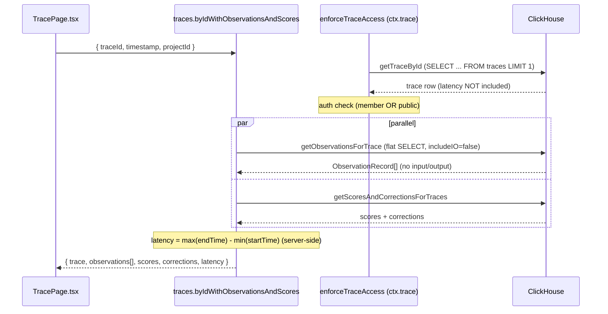
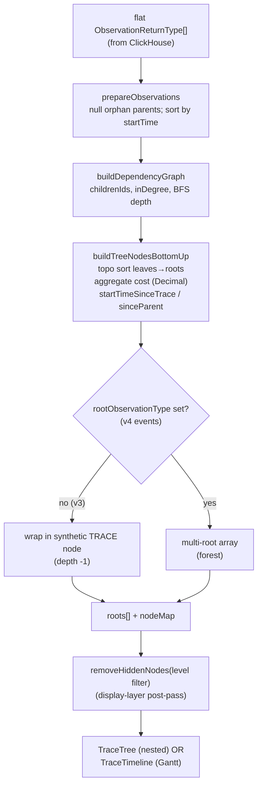
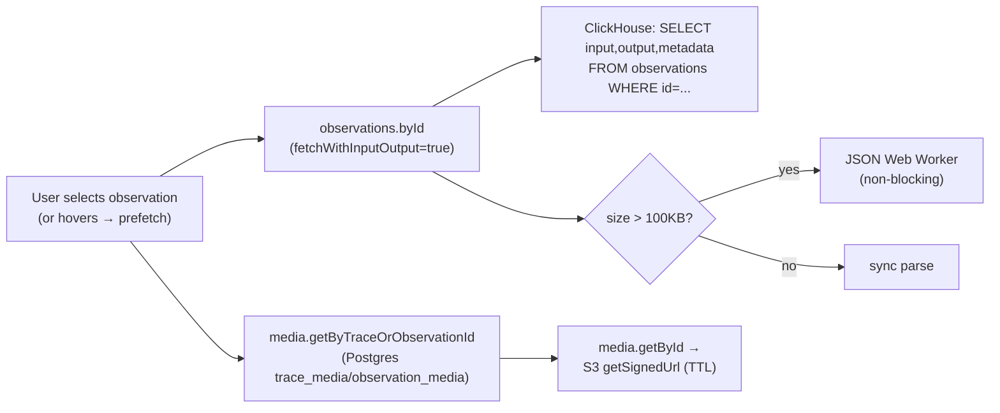

# Langfuse Frontend Trace Waterfall / Timeline (v3.177.1)

**TL;DR.** Langfuse's trace detail view fetches a single **flat list of observations** for a trace from ClickHouse (no JOINs, no server-side tree), ships it to the browser, and **reconstructs the tree entirely client-side** from `parent_observation_id` using an iterative topological sort (`buildTraceUiData` in `web/src/components/trace/lib/tree-building.ts`). The same `roots` tree drives two views — a nested **Tree** and a Gantt **Timeline** — both virtualized with `@tanstack/react-virtual`. Bars are positioned purely from `start_time`/`end_time` linearly scaled into a fixed 900px lane; there is **no clock-skew correction**. Large `input`/`output`/`metadata` blobs are **excluded from the bulk query** (`includeIO: false`) and lazily fetched per-observation on selection (`observations.byId`, 5-min cache, Web-Worker JSON parsing), with media resolved separately to S3 presigned URLs. A separate **agent graph view** re-derives a node/step DAG from the same observations (LangGraph metadata or inferred temporal "steps").

This is the canonical "fetch flat, assemble on client" pattern. Most of it is directly reusable for Tracely; the place an agent-first model diverges is the *meaning* of the tree (it should be a typed Agent/Turn/Step/ToolCall/SubAgent trajectory, not an untyped span DAG).

---

## 1. Entry points, routing, and data sourcing

The page route is thin:

- `web/src/pages/project/[projectId]/traces/[traceId].tsx` reads `traceId`/`timestamp` from the router and renders `<TracePage>`.
- `web/src/components/trace/TracePage.tsx:34-68` chooses the data source based on a beta flag `useV4Beta()`:
  - **Beta OFF (v3, the production path):** `api.traces.byIdWithObservationsAndScores.useQuery({ traceId, timestamp, projectId })` (TracePage.tsx:34-51).
  - **Beta ON (v4):** `useEventsTraceData(...)` (TracePage.tsx:54-59) which reads from a newer `events` table instead of `observations`.
- The fetched object (`trace.data`) — which already contains `observations`, `scores`, `corrections`, `latency` — is passed wholesale into `<Trace>` (TracePage.tsx:226-234). The `context` prop is `"peek"` vs `"fullscreen"` based on the `peek` query param.

There is also a **public REST API** at `web/src/pages/api/public/traces/[traceId].ts`, but the **detail UI does not use it** — it uses tRPC. The public API uses the *same* repository function `getObservationsForTrace` ([traceId].ts:75-81) and supports field-group selection (`io`, `observations`, `scores`, `metrics` via `TRACE_FIELD_GROUPS`), so the fetch shape is shared between UI and API.

### 1.1 The tRPC procedure and the ClickHouse queries it triggers

`web/src/server/api/routers/traces.ts:368-444` — `byIdWithObservationsAndScores`:

1. Runs on `protectedGetTraceProcedure` (trpc.ts:562-564 = `withOtelTracingProcedure → withErrorHandling → enforceTraceAccess`). The **`enforceTraceAccess` middleware (trpc.ts:464-560) already fetched the trace** via `getTraceById(...)` and stashed it on `ctx.trace` (trpc.ts:557), so the procedure does not re-fetch the trace row.
2. Fires **two queries in parallel** (traces.ts:385-397):
   - `getObservationsForTrace({ traceId, projectId, timestamp, includeIO: false })` — the flat observation list.
   - `getScoresAndCorrectionsForTraces({ projectId, traceIds: [traceId], timestamp })` — scores + corrections.
3. Computes **trace latency server-side** from observation min start / max end (traces.ts:410-426): `latencyMs = max(endTimes) − min(startTimes)`, falling back to `max(startTimes) − min(startTimes)` when no end times exist. This is divided by 1000 → `latency` in seconds (traces.ts:437).
4. Returns observations with `input`/`output` **explicitly set to `undefined`** (traces.ts:438-442) — they were never queried.

The actual ClickHouse query is in **`packages/shared/src/server/repositories/observations.ts:136-252`** (`getObservationsForTrace`):

```sql
SELECT
  id, trace_id, project_id, type, parent_observation_id, environment,
  start_time, end_time, name, level, status_message, version,
  -- input, output, metadata   ← ONLY when includeIO === true
  provided_model_name, internal_model_id, model_parameters,
  provided_usage_details, usage_details, provided_cost_details, cost_details,
  total_cost, usage_pricing_tier_id, usage_pricing_tier_name,
  completion_start_time, prompt_id, prompt_name, prompt_version,
  -- tool_definitions, tool_calls, tool_call_names  ← ONLY when includeIO === true
  created_at, updated_at, event_ts
FROM observations
WHERE trace_id = {traceId: String}
  AND project_id = {projectId: String}
  AND start_time >= {traceTimestamp: DateTime64(3)} - INTERVAL 1 HOUR   -- only if timestamp passed
ORDER BY event_ts DESC          -- skipped for OTEL projects
LIMIT 1 BY id, project_id       -- skipped for OTEL projects
```

Key facts:
- **No JOINs, no recursion, no tree** — it is a flat per-trace scan keyed on `(trace_id, project_id)`.
- **Deduplication** via `ORDER BY event_ts DESC` + `LIMIT 1 BY id, project_id` (observations.ts:187-188) collapses the ClickHouse `observations` table's multiple ingested versions of the same span to the latest. This is **skipped** when `shouldSkipObservationsFinal(projectId)` is true (observations.ts:148) — i.e. for OTEL projects whose spans are immutable (`packages/shared/src/server/queries/clickhouse-sql/query-options.ts:13-35`, gated by `LANGFUSE_API_CLICKHOUSE_DISABLE_OBSERVATIONS_FINAL` or Redis OTEL tracking). This is the "FINAL modifier" cost-avoidance pattern.
- **Partition pruning:** `start_time >= {traceTimestamp} - INTERVAL 1 HOUR` (`TRACE_TO_OBSERVATIONS_INTERVAL`, `packages/shared/src/server/repositories/constants.ts:6`) bounds the time range so ClickHouse can prune partitions. This assumes **all observations start within 1h of the trace timestamp** — a hard assumption Tracely should note for long-running agents.
- **Payload guard:** even with `includeIO: false`, metadata can be large; the server sums `input/output/metadata` string lengths and throws if `payloadSize >= LANGFUSE_API_TRACE_OBSERVATIONS_SIZE_LIMIT_BYTES` (default **80MB**, `packages/shared/src/env.ts:284-286`). See observations.ts:207-236.

`getTraceById` (`packages/shared/src/server/repositories/traces.ts:507-601`) is the trace-row query: `SELECT ... FROM traces WHERE id = ... AND project_id = ... ORDER BY event_ts DESC LIMIT 1`. It can `leftUTF8(input, LANGFUSE_SERVER_SIDE_IO_CHAR_LIMIT)`-truncate IO (default char limit **1000**, env.ts:397-401) or exclude it entirely (`excludeInputOutput`/`excludeMetadata`).



---

## 2. Client-side span/tree reconstruction (the core algorithm)

All reconstruction lives in **`web/src/components/trace/lib/tree-building.ts`**, entry point `buildTraceUiData(trace, observations)` (tree-building.ts:451-510). It is memoized once per `(trace, observations)` in `TraceDataContext` (`contexts/TraceDataContext.tsx:86-88`). The file header (tree-building.ts:1-20) explicitly states the design: **fully iterative (no recursion) to survive 10k+ deep trees without stack overflow**, O(N) time/space.

### 2.1 Phases

1. **`prepareObservations` (tree-building.ts:80-102):**
   - Builds a `Set` of all observation IDs.
   - **Orphan handling:** if `parentObservationId` points to an ID **not in the list**, it is **nulled out** (tree-building.ts:89-93), promoting that observation to a root. This is how missing parents are handled — they are silently re-rooted, never dropped.
   - Sorts all observations by `startTime` ascending.

2. **`buildDependencyGraph` (tree-building.ts:110-175):** four passes over the flat list:
   - create a `ProcessingNode` per observation;
   - wire `childrenIds` from `parentObservationId`;
   - **BFS depth assignment** from roots (depth 0) downward (tree-building.ts:137-158);
   - compute `inDegree = childrenIds.length` and collect leaf IDs (`inDegree === 0`).

3. **`buildTreeNodesBottomUp` (tree-building.ts:183-312):** **topological sort, leaves first**. Using an index-based queue (not `Array.shift()`, for O(1) dequeue — tree-building.ts:191-195), it processes a node once all children are done, then decrements the parent's in-degree. For each node it computes:
   - **Bottom-up cost aggregation** with `decimal.js`: node cost (from `totalCost`, or `inputCost+outputCost`) **plus** the sum of children `totalCost` (tree-building.ts:209-241). So every `TreeNode.totalCost` = subtree cost, computed once.
   - **Temporal fields:** `startTimeSinceTrace = obs.startTime − traceStartTime` (tree-building.ts:244-245) and `startTimeSinceParentStart = obs.startTime − parent.startTime` (tree-building.ts:249-255).
   - `depth` (precomputed) and `childrenDepth = max(children.childrenDepth)+1` (tree-building.ts:263-266).

4. **`buildTraceTree` roots (tree-building.ts:323-438):** roots are sorted by `startTime` (tree-building.ts:383). Two shapes:
   - **Traditional (v3):** wrap all root observations under a synthetic `TRACE` node `id: "trace-<id>"`, `type: "TRACE"`, `depth: -1` (so children render at depth 0), carrying `trace.latency` and aggregate cost (tree-building.ts:401-437).
   - **Events-based (v4, `rootObservationType` set):** return root observations directly as a **multi-root array** — no synthetic wrapper — and propagate `trace.latency` onto the primary root observation for the timeline (tree-building.ts:385-399). The data model **already supports multiple roots / forests.**

5. **`buildTraceUiData` flatten (tree-building.ts:486-509):** produces `searchItems`, a flattened pre-order list, via an **explicit stack** (children pushed in reverse for left-to-right DFS). It also computes `rootTotalCost` and `rootDuration` once for heatmap scaling.

### 2.2 Level filtering and node hiding

Level filtering (hide `DEBUG`/`WARNING` etc.) is deliberately **NOT** in tree building — it's a cheap post-pass `removeHiddenNodes(roots, isHidden)` (tree-building.ts:523-557) applied in `TraceDataContext` (TraceDataContext.tsx:91-116). It uses a single-pass stack that **promotes the children of a hidden node up to its parent's level**, keeping the tree connected. `getObservationLevels(minLevel)` (tree-building.ts:59-73) returns the allowed level set.

### 2.3 The TreeNode shape

`web/src/components/trace/lib/types.ts:15-48`: `TreeNode` unifies trace + observation: `id`, `type: "TRACE" | ObservationType`, `startTime/endTime`, `level`, `children[]`, usage/cost fields, precomputed `totalCost` (Decimal), `latency`, `parentObservationId`, plus the derived `startTimeSinceTrace`, `startTimeSinceParentStart`, `depth` (−1 for trace root), `childrenDepth`.



---

## 3. The two views: Tree and Timeline (Gantt)

`web/src/components/trace/components/_layout/TracePanelNavigation.tsx:25-45` selects the navigation view by the `?view` query param: **Search** (if a search query is present) > **Timeline** (`view === "timeline"`) > **Tree** (default). All three consume the same `roots` from `useTraceData()`.

### 3.1 Timeline (Gantt) — `components/TraceTimeline/`

`TraceTimeline/index.tsx`:
- **Trace duration** = `max(roots.map(r => r.latency ?? 0))` (index.tsx:35-38); **trace start** = earliest root start (index.tsx:40-44).
- **Flattening + metrics:** `flattenTreeWithTimelineMetrics(roots, collapsedNodes, traceStartTime, traceDuration, SCALE_WIDTH)` (index.tsx:52-60, `timeline-flattening.ts`). During the same DFS it **pre-computes per-row pixel geometry once** (timeline-flattening.ts:65-101):
  - `startOffset = ((nodeStart − traceStart)/1000 / totalScaleSpan) * SCALE_WIDTH` (`timeline-calculations.ts:24-33`).
  - `itemWidth = (durationSec / totalScaleSpan) * SCALE_WIDTH` (`timeline-calculations.ts:42-48`); duration = `(endTime − startTime)/1000`.
  - `firstTokenTimeOffset` — for streaming LLMs, the offset of `completionStartTime` (timeline-flattening.ts:83-94). `completionStartTime` is a real domain field (`packages/shared/src/domain/observations.ts:76`) selected in the bulk query (observations.ts:175).
  - Collapsed nodes prune children during flattening (timeline-flattening.ts:112-135); children re-sorted by `startTime`.
- **Fixed geometry:** `SCALE_WIDTH = 900`, `STEP_SIZE = 100` px (`timeline-calculations.ts:7-8`). The time axis step is picked from a hardcoded `PREDEFINED_STEP_SIZES` list (`timeline-calculations.ts:11-14`, 0.25s…500s) via `calculateStepSize` (timeline-calculations.ts:57-66). `TimelineScale.tsx` renders markers every `STEP_SIZE` px labeled `stepSize * index` seconds.
- **Virtualization:** `useVirtualizer({ count, estimateSize: () => 42, overscan: 500 })` (index.tsx:76-81) over `contentRef`. Only visible rows render; each is absolutely positioned via `transform: translateY(virtualRow.start)` (index.tsx:189-198).
- **Bar rendering:** `TimelineRow.tsx` draws tree-connector lines (12px/level, `TREE_INDENTATION`) + an expand chevron, then `TimelineBar.tsx` draws the actual bar at `marginLeft: startOffset`, `width: itemWidth || 10`. Streaming bars are split into a muted "first token" segment + completion segment (TimelineBar.tsx:37-123). Badges (duration, cost via `usdFormatter`, scores, comments) are toggled by `ViewPreferences`; optional **heatmap text color** scales each value against `parentTotalCost`/`parentTotalDuration` (`heatMapTextColor`, helpers.ts).
- **Scroll sync:** the sticky header lane and the content lane mirror each other's `scrollLeft` (index.tsx:111-121). Auto-scroll to the URL-selected node on first load via `scrollToIndex(..., { align: "center", behavior: "auto" })` in `useLayoutEffect` (index.tsx:87-108).

**Clock-skew / ordering note:** there is **no clamping of negative offsets**. If a child's `start_time` precedes the trace start (clock skew across services), `startOffset` is negative and the bar shifts left via negative `marginLeft`; the marker axis only renders `0…traceDuration`. Ordering everywhere is strictly by `startTime` (`prepareObservations`, root sort, child sort). Parent/child nesting is by `parent_observation_id` only — Langfuse does **not** infer nesting from time containment in the waterfall (that inference exists only in the *graph* view's `buildStepData`).

### 3.2 Tree — `components/TraceTree.tsx`

`TraceTree.tsx` composes `VirtualizedTree` (virtualization) + `VirtualizedTreeNodeWrapper` (indent/connector/chevron) + `SpanContent` (badge row). `VirtualizedTree` (`components/_shared/VirtualizedTree.tsx`) also uses `@tanstack/react-virtual` with default `overscan = 500`. It is the **default** view; the same `roots`/`nodeMap` feed it. Heatmap totals (`rootTotalCost`, `rootTotalDuration`) are recomputed here too (TraceTree.tsx:28-41) — the codebase has three copies of this aggregation, all flagged with a `TODO: Extract aggregation logic to shared utility` (tree-building.ts:466, TraceTimeline/index.tsx:33, TraceTree.tsx:26).

### 3.3 Contexts (state architecture)

`Trace.tsx:60-84` wraps everything in nested providers: `ViewPreferences → TraceData → TraceGraphData → Selection → Search → JsonExpansion`. Notable:
- **`TraceDataContext`** (read-only derived data: `roots`, `nodeMap`, `searchItems`, `mergedScores`) — memoized so tree rebuild only runs when `(trace, observations)` change (TraceDataContext.tsx:86-88).
- **`SelectionContext`** (SelectionContext.tsx): `selectedNodeId` is synced to the **`?observation` URL query param** (SelectionContext.tsx:78-81, 169-174); collapsed nodes are local `Set<string>` (SelectionContext.tsx:148-167); tab (`?traceTab`) and view pref (`?pref`) also URL-synced; search debounced 500ms.

---

## 4. Lazy loading of large I/O blobs and media (S3)

The bulk fetch deliberately omits `input`/`output`/`metadata`. They are loaded **only for the selected observation**:

- `ObservationDetailView.tsx:225-238` calls `useParsedObservation({ observationId, traceId, projectId, startTime, baseObservation })` (`web/src/hooks/useParsedObservation.ts`).
- **Fetch (v3):** `api.observations.byId.useQuery({ observationId, traceId, projectId, startTime })`, `staleTime: 5 min` (useParsedObservation.ts:211-222). The tRPC `observations.byId` (`web/src/server/api/routers/observations.ts:11-45`) calls `getObservationById({ ..., fetchWithInputOutput: true })` — i.e. the per-observation query **does** select `input/output`. Output is `parseIO(...)`-shaped by `verbosity` (`compact|truncated|full`, default `full`).
- **Parse off the main thread:** `parseObservationData` (useParsedObservation.ts:148-199) estimates size; below `PARSE_IN_WEBWORKER_THRESHOLD = 100_000` chars it parses synchronously, above it dispatches to a **singleton Web Worker** (`@/src/workers/json-parser.worker.ts`, useParsedObservation.ts:62-98) so deserializing large JSON doesn't freeze the UI. Both raw fetch **and** parsed result are independently cached by React Query (`staleTime: Infinity`, `gcTime: 10 min` for the parse query — useParsedObservation.ts:274-297).
- **Prefetch on hover:** `useHandlePrefetchObservation` (hooks/useHandlePrefetchObservation.ts) → `usePrefetchObservation` (api/usePrefetchObservation.ts:18-52) prefetches `observations.byId` (or `events.batchIO` in v4) on row hover with `staleTime: 5 min`, so the detail panel is warm by the time the user clicks. Hover is wired in `TraceTimeline/index.tsx:204` (`onHover`).

### 4.1 Media → S3 presigned URLs

`useMedia` (`components/trace/api/useMedia.ts`) → `api.media.getByTraceOrObservationId` (`web/src/server/api/routers/media.ts:65-...`). That procedure queries **Postgres** join tables `trace_media` / `observation_media` (raw SQL, media.ts:87-112) to find which media IDs are referenced. The actual bytes are served by `media.getById` (media.ts:17-64): it loads the `media` row, picks the bucket, and calls `mediaStorageClient.getSignedUrl(bucketPath, ttlSeconds, false)` returning a **presigned S3 URL** with TTL `LANGFUSE_S3_MEDIA_DOWNLOAD_URL_EXPIRY_SECONDS` (`web/src/env.mjs:331`). Media is cached client-side `staleTime: 50 min`. So large binary attachments never flow through the trace payload — only references → presigned URLs.



---

## 5. The separate Agent Graph view

This is the closest existing Langfuse feature to "agent trajectory" and is the most relevant to Tracely.

- **Availability + data fetch:** `TraceGraphDataContext.tsx`. It fetches once and shares (`agentGraphData`, `isGraphViewAvailable`). It **skips entirely** for traces with `>= MAX_NODES_FOR_GRAPH_UI = 5000` observations (TraceGraphDataContext.tsx:15, 56). It computes `[minStartTime, maxStartTime]` with an explicit loop (not `Math.min(...arr)`) precisely to avoid call-stack overflow on 10k+ observations (TraceGraphDataContext.tsx:58-77). Query cached `staleTime: 50 min`, no refetch on focus/mount/reconnect (TraceGraphDataContext.tsx:92-97).
- **tRPC:** `api.traces.getAgentGraphData` (v3) / `api.events.getAgentGraphData` (v4). The v3 procedure (traces.ts:610-679) runs a **minimal projection** ClickHouse query (`getAgentGraphData`, `packages/shared/src/server/repositories/traces.ts:1572-1608`):

  ```sql
  SELECT id, parent_observation_id, type, name, start_time, end_time,
         metadata['langgraph_node'] AS node,
         metadata['langgraph_step'] AS step
  FROM observations
  WHERE project_id = {projectId} AND trace_id = {traceId}
    AND start_time >= {chMinStartTime} AND start_time <= {chMaxStartTime}
  ```

  So LangGraph integration is detected by **`metadata['langgraph_node']` / `metadata['langgraph_step']`** map keys on the span. The procedure keeps rows that are either LangGraph (`step != null && node != null`) or any non-`EVENT` observation (treated as a degenerate one-step node), mapping each to `{ id, node, step, parentObservationId, name, startTime, endTime, observationType }` (traces.ts:639-678).
- **`isGraphViewAvailable`** (TraceGraphDataContext.tsx:116-141): true only if there is graphable structure — LangGraph step data, or observations whose type is **not** `SPAN`/`EVENT`/`GENERATION` (i.e. `AGENT`, `TOOL`, `CHAIN`, `RETRIEVER`, etc. → the agentic ones).
- **Two graph-building modes** in `web/src/features/trace-graph-view/`:
  1. **Native LangGraph** — `transformLanggraphToGeneralized` (buildGraphCanvasData.ts:16-84): use the provided `node`/`step`, map LangGraph's `__start__`/`__end__` to Langfuse system nodes, then `buildGraphFromStepData`.
  2. **Inferred steps (no LangGraph)** — `buildStepData` (buildStepData.ts:239-259) → `assignGlobalTimingSteps` (buildStepData.ts:92-198): it **groups observations into "steps" by temporal overlap** (`buildStepGroups`, buildStepData.ts:8-90 — observations that overlap in `[start,end]` are concurrent = same step), then enforces a **parent-step+1 constraint** so children always render after parents (buildStepData.ts:125-195, capped at `MAX_ITERATIONS = 1500`). This is a heuristic DAG layout derived purely from timing + parent links.
- **Edges:** `generateEdgesWithParallelBranches` (buildGraphCanvasData.ts:175-205) connects every node in step *i* to every node in step *i+1* (fan-out/fan-in for parallel branches), terminating at the synthetic `__end_lf__`.
- **Render:** `TraceGraphView.tsx` (`features/trace-graph-view/components/`) decides the mode (`hasStepData`) and passes the graph to `TraceGraphCanvas`; physics layout is disabled above `MAX_NODE_NUMBER_FOR_PHYSICS = 500` nodes (TraceGraphView.tsx:24, 70-71). Clicking a node cycles through that node's observations and updates the `?observation` URL param — i.e. the graph and the waterfall **share selection state via the URL**.

The graph view is overlaid alongside the navigation panel (`Trace.tsx:128-138`, `secondaryContent={<TraceGraphView/>}`), gated by `showGraph && isGraphViewAvailable`.

---

## 6. Performance optimizations (catalogue)

| Optimization | Where | Detail |
|---|---|---|
| Flat fetch, no server tree | observations.ts:150-188 | One `(trace_id, project_id)` scan; tree built client-side. |
| Exclude IO from bulk | traces.ts:390, observations.ts:164,179 | `includeIO: false` → no `input/output/metadata/tool_*` in list query. |
| ClickHouse dedup via `LIMIT 1 BY` | observations.ts:187-188 | `ORDER BY event_ts DESC LIMIT 1 BY id, project_id`; skipped for OTEL (immutable spans), query-options.ts:13-35. |
| Partition pruning | constants.ts:6; observations.ts:186 | `start_time >= timestamp − INTERVAL 1 HOUR`. |
| Payload size guard | observations.ts:207-236; env.ts:284 | Throws above `LANGFUSE_API_TRACE_OBSERVATIONS_SIZE_LIMIT_BYTES` (80MB). |
| Iterative tree build (no recursion) | tree-building.ts (whole) | Topo sort + explicit stacks → handles 10k+ depth, O(N). |
| Memoized reconstruction | TraceDataContext.tsx:86-116 | `buildTraceUiData` re-runs only on data change; level filter is cheap post-pass. |
| Bottom-up cost precompute | tree-building.ts:209-241 | `totalCost` computed once per node with `decimal.js`. |
| Pre-computed timeline geometry | timeline-flattening.ts:65-101 | `startOffset`/`itemWidth`/`firstTokenTimeOffset` computed once during flatten, not per frame. |
| Row virtualization | TraceTimeline/index.tsx:76-81; VirtualizedTree.tsx:55-62 | `@tanstack/react-virtual`, `estimateSize 42`, `overscan 500`. |
| Lazy per-observation IO | useParsedObservation.ts:211-222 | `observations.byId`, `staleTime 5 min`. |
| Web-Worker JSON parse | useParsedObservation.ts:44,148-199 | `>100KB` parsed off main thread; parsed result cached `staleTime: Infinity`. |
| Hover prefetch | usePrefetchObservation.ts:18-52 | Warms detail panel before click. |
| Media via presigned S3 URLs | media.ts:17-64 | Binary never in trace payload; TTL'd signed URLs, cached 50 min. |
| Graph skip for huge traces | TraceGraphDataContext.tsx:15,56 | No graph fetch above 5000 obs; physics off above 500 nodes. |
| Virtualization threshold (log view) | trace-view-config.ts:19 | Virtualize log view above **350** observations; JSON view disabled there. |
| Spread-free min/max | TraceGraphDataContext.tsx:58-77 | Loop instead of `Math.min(...arr)` to avoid stack overflow. |

Tunables centralized in `config/trace-view-config.ts`: `virtualizationThreshold 350`, row heights `{collapsed 28, expanded 150}`, `maxIndentDepth 5`, `indentPx 12`, prefetch `{rootMargin "100px", debounceMs 250}`, batch fetch `concurrency 10`.

---

## 7. Relevance to Tracely

**Reuse wholesale (this is the strong, agent-agnostic core):**
1. **"Fetch flat, assemble on client."** One time-bounded `(run_id/trace_id, project_id)` scan returning a flat step list; build the trajectory tree in the browser. Mirror `getObservationsForTrace`'s shape and the `includeIO: false` split (observations.ts:136-205).
2. **The iterative topological tree builder** (`tree-building.ts`) — orphan re-rooting, BFS depth, bottom-up cost/metric aggregation, `startTimeSinceTrace`/`startTimeSinceParentStart`, multi-root forests. Tracely runs (multi-agent, handoffs) are naturally forests — Langfuse's v4 multi-root path (tree-building.ts:385-399) is exactly the right primitive; **do not** assume a single root.
3. **Pre-computed timeline geometry + virtualization** (timeline-flattening.ts + `@tanstack/react-virtual`) — agent traces are deep and wide; this is the proven way to keep them at 60fps.
4. **Lazy IO + Web-Worker parse + hover prefetch + presigned-URL media.** Agent steps carry huge prompts/tool payloads; copy the per-step `byId` + worker-parse + S3-reference pattern verbatim.
5. **URL-as-selection-state** (`?observation`, `?view`, `?traceTab`) so waterfall, graph, and (for Tracely) the regression-test/eval panels stay linked and deep-linkable — critical when a CI gate links to "the failing step."
6. **ClickHouse `LIMIT 1 BY` dedup + OTEL-skip** (observations.ts:187-188, query-options.ts) — Tracely ingests OTEL; the immutable-span fast path applies directly.

**Where the agent-first model should change the tree (Langfuse-specific limitations to fix):**
1. **Type the tree, don't leave it as untyped spans.** Langfuse's `TreeNode.type` is `"TRACE" | ObservationType` (SPAN/GENERATION/EVENT/AGENT/TOOL…) (types.ts:17). Tracely's nodes should be **first-class** `Conversation → Turn → Step → {ToolCall, LLMCall, SubAgentCall}` with agent identity and **Agent Version** on each node, so the waterfall renders handoffs and planner/executor boundaries natively — not as generic spans you must squint at.
2. **Reconstruction is `parent_observation_id` only; no semantic edges.** The waterfall has no notion of handoff edges, sub-agent invocation, or planner→executor delegation — those only appear (heuristically) in the *graph* view via timing overlap (`buildStepData`). Tracely should make the **trajectory graph the primary object** (typed edges: `calls`, `hands_off_to`, `delegates_to`, `retries`), with the waterfall and the DAG being two renderings of the *same* typed graph, not two independently-derived structures (Langfuse derives them separately — see the duplicated aggregation TODOs).
3. **Trajectory-level metrics, not just cost/latency.** Langfuse precomputes only `totalCost`/duration bottom-up. Tracely's bottom-up pass should also aggregate **trajectory evaluation signals** (per-step pass/fail, tool-call validity, goal-completion, failure-cluster membership) so the waterfall can color/annotate **regression-relevant** steps — turning the waterfall into the diff surface for "production trace → regression test."
4. **Drop the 1-hour `TRACE_TO_OBSERVATIONS_INTERVAL` assumption** (constants.ts:6) for long-running / multi-turn agent sessions; Tracely runs can span minutes-to-hours of tool latency. Make the time bound a function of the run, not a constant.
5. **The "step" inference heuristic** (`assignGlobalTimingSteps`, buildStepData.ts) is a fallback Langfuse needs because frameworks don't emit structure. Tracely should require/derive **explicit step + agent boundaries at ingest** (from Agno/LangGraph/OTel semantic conventions) so layout is deterministic, not a 1500-iteration constraint solver.
6. **Selection/agent-graph share state via URL only.** Fine to keep, but Tracely will want richer cross-links (step ↔ eval case ↔ failure cluster ↔ the regression test it generated), which argues for a typed client store keyed by the trajectory graph, with URL params as the shareable projection.

**Distractions to ignore (consistent with the brief):** the v3/v4 beta dual-path (`useV4Beta`, events table) is migration scaffolding; prompt linkage (`prompt_id/name/version`) and the dataset/playground "Jump to playground" plumbing are not trace-first eval. The waterfall mechanics themselves, however, are squarely worth stealing.
