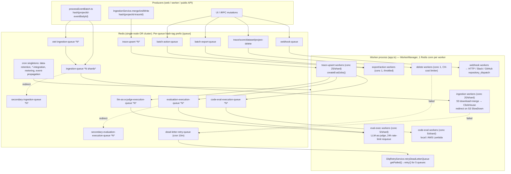

# Langfuse Queue & Worker Architecture (BullMQ / Redis / Sharding / DLQ)

**TL;DR.** Langfuse runs a single Node worker process (`worker/src/index.ts` → `worker/src/app.ts`) that registers ~30 BullMQ queues on Redis, each with its own dedicated Redis connection, concurrency, and rate-limiter. Heavy and hostile workloads are isolated by giving each one its *own queue* (ingestion vs eval vs export vs deletion) plus a "secondary" overflow queue for noisy-neighbor projects, and the hottest paths (ingestion, OTel ingestion, trace-upsert, eval execution) are additionally *sharded* into N BullMQ queues by a SHA-256 hash of `projectId-entityId`. There is no native BullMQ dead-letter queue; instead failed jobs stay in each queue's `failed` set (`removeOnFail: 100_000`) and a cron-driven `DeadLetterRetryQueue` re-`retry()`s them every 10 minutes for a hand-picked allowlist of queues.

All identifiers below are quoted from the local source at `/Users/julien/Documents/Repos/langfuse` (v3.177.1).

---

## 1. Process model: one worker, many in-process BullMQ Workers

There is a *single* worker container. Its entry point is `worker/src/index.ts`:

```ts
// worker/src/index.ts:1-8
import "./instrumentation";
import app from "./app";
export const server = app.listen(env.PORT, env.HOSTNAME, ...);
```

`worker/src/app.ts` is an Express app (health endpoint at `/`, API under `/api`) that, **as a side effect of being imported**, registers every queue consumer. Each `WorkerManager.register(...)` call (`worker/src/app.ts:128-634`) is gated behind a `QUEUE_CONSUMER_*_IS_ENABLED` env flag (all default `"true"` — see `worker/src/env.ts:188-209`), so a single image can be deployed multiple times with different flag sets to run *dedicated worker pools per queue* without code changes. This is the primary horizontal-scaling lever: e.g. run 10 replicas with only `QUEUE_CONSUMER_INGESTION_QUEUE_IS_ENABLED=true` and 2 with only the eval flags.

### `WorkerManager`: the thin BullMQ wrapper

`worker/src/queues/workerManager.ts` is the single chokepoint for creating BullMQ `Worker`s.

- **One dedicated Redis connection per worker.** `WorkerManager.register` calls `createNewRedisInstance(redisQueueRetryOptions)` for every queue (`workerManager.ts:138`). BullMQ requires `maxRetriesPerRequest: null` on worker connections, which `defaultRedisOptions` sets (`packages/shared/src/server/redis/redis.ts:8`).
- **Idempotent registration**: a static `workers: { [key: string]: Worker }` map prevents double-registration (`workerManager.ts:21,132-135`).
- **Metric wrapper.** Every processor is wrapped by `metricWrapper` (`workerManager.ts:41-110`), which records, per job: `*.request` / `*.rate{type:request}`, `*.wait_time` (= `Date.now() - job.timestamp`, i.e. queue latency), `*.processing_time`, and samples queue-depth gauges (`getWaitingCount`, `getFailedCount` → `*.dlq_length`, `getActiveCount`). For sharded queues these gauges are sampled at `LANGFUSE_QUEUE_METRICS_SAMPLE_RATE` (`worker/src/env.ts:462`) to cap metric cardinality.
- **Failure/error handlers** (`workerManager.ts:161-184`) call `traceException(err)` and increment `*.failed` / `*.error` counters. They do **not** decide retries — BullMQ's per-queue `attempts` does that.
- **Graceful shutdown.** `closeWorkers()` (`workerManager.ts:112-117`) awaits `worker.close()` on all; `app.ts:716-717` wires `SIGINT`/`SIGTERM` → `onShutdown`.

### Background loops that are NOT BullMQ queues

`app.ts` also starts several long-running in-process loops (not queue consumers), used for bulk ClickHouse cleanup:

- `BatchProjectCleaner` per table in `BATCH_DELETION_TABLES` (`app.ts:637-651`)
- `BatchDataRetentionCleaner` per table (`app.ts:654-668`)
- `MediaRetentionCleaner`, `BatchProjectMediaCleaner`, `BatchProjectBlobCleaner`, `BatchTraceDeletionCleaner` (`app.ts:670-706`)
- `QueueMetricsRunner` (`app.ts:709-714`)
- `BackgroundMigrationManager.run()` (`app.ts:114-119`)

These run on internal timers, independent of Redis/BullMQ. **Tracely should be aware these exist but treat them as Langfuse-specific data-lifecycle plumbing, not core queue architecture.**

---

## 2. The full queue catalog

The canonical list of queues is the `QueueName` enum (`packages/shared/src/server/queues.ts:324-361`); job-name constants are `QueueJobs` (`queues.ts:363-397`); per-queue payload typing is `TQueueJobTypes` (`queues.ts:399-578`). Non-sharded queue *instances* (producer side) are constructed via the `getQueue()` factory (`packages/shared/src/server/redis/getQueue.ts:33-107`); sharded queues are excluded from `getQueue` and use their own classes.

| Queue (`QueueName`) | Value | Purpose | Sharded? | Worker concurrency | Rate limiter |
|---|---|---|---|---|---|
| `IngestionQueue` | `ingestion-queue` | Process a single ingestion event with S3 download + merge → ClickHouse | **Yes** | `LANGFUSE_INGESTION_QUEUE_PROCESSING_CONCURRENCY` (default **20**) | none |
| `IngestionSecondaryQueue` | `secondary-ingestion-queue` | Overflow lane for noisy/slow projects redirected off the primary ingestion lane | **Yes** | `..._SECONDARY_..._CONCURRENCY` (default **5**) | none |
| `OtelIngestionQueue` | `otel-ingestion-queue` | Parse OTLP spans from S3 → ingestion events | **Yes** | `LANGFUSE_OTEL_INGESTION_QUEUE_PROCESSING_CONCURRENCY` (default **5**) | none |
| `OtelIngestionSecondaryQueue` | `secondary-otel-ingestion-queue` | OTel overflow lane | **Yes** | default **1** | none |
| `TraceUpsert` | `trace-upsert` | **On each trace upsert, create eval jobs** (the production-trace → eval bridge) | **Yes** | `LANGFUSE_TRACE_UPSERT_WORKER_CONCURRENCY` (default **25**) | none |
| `CreateEvalQueue` | `create-eval-queue` | UI-triggered "apply this evaluator to existing/new data" → fan out eval jobs | No | `LANGFUSE_EVAL_CREATOR_WORKER_CONCURRENCY` (default **2**) | max=concurrency / `LANGFUSE_EVAL_CREATOR_LIMITER_DURATION` (500ms) |
| `DatasetRunItemUpsert` | `dataset-run-item-upsert-queue` | Create eval jobs for dataset/experiment run items | No | default **2** (`LANGFUSE_EVAL_CREATOR_WORKER_CONCURRENCY`) | none |
| `EvaluationExecution` | `evaluation-execution-queue` | **Execute one LLM-as-judge eval** (trace/dataset target) | **Yes** | `LANGFUSE_EVAL_EXECUTION_WORKER_CONCURRENCY` (default **5**) | none |
| `EvaluationExecutionSecondaryQueue` | `secondary-evaluation-execution-queue` | Eval-execution overflow lane for high-throughput projects | **Yes** | default **5** | none |
| `LLMAsJudgeExecution` | `llm-as-a-judge-execution-queue` | Observation-level LLM-as-judge eval execution | **Yes** | default **5** | none |
| `CodeEvalExecution` | `code-eval-execution-queue` | Observation-level **code-based** eval execution (local / AWS Lambda) | **Yes** | default **5** | none |
| `BatchExport` | `batch-export-queue` | Export query results to CSV/JSON in S3 | No | **1** | max=1 / 5s |
| `BatchActionQueue` | `batch-action-queue` | Bulk actions (delete, add-to-dataset, add-to-annotation-queue, eval-create, batch-evaluation) | No | **1** | max=1 / 5s |
| `TraceDelete` | `trace-delete` | Delete traces from Postgres + ClickHouse (batched) | No | `LANGFUSE_TRACE_DELETE_CONCURRENCY` (default **1**) | max=conc / `..._TRACE_DELETION_..._MS` |
| `ScoreDelete` | `score-delete` | Delete scores | No | default **1** | max=conc / `..._TRACE_DELETION_..._MS` |
| `DatasetDelete` | `dataset-delete-queue` | Delete dataset run items | No | default **1** | max=conc / `..._DATASET_DELETION_..._MS` |
| `ProjectDelete` | `project-delete` | Delete an entire project's data | No | `LANGFUSE_PROJECT_DELETE_CONCURRENCY` (default **1**) | max=conc / `..._PROJECT_DELETION_..._MS` (default 10 min) |
| `DataRetentionQueue` | `data-retention-queue` | **Cron** (daily 03:15): find projects with retention, fan out | No | **1** | none |
| `DataRetentionProcessingQueue` | `data-retention-processing-queue` | Per-project retention deletion | No | **1** | max=`PROJECT_DELETE_CONCURRENCY` / 10 min |
| `ExperimentCreate` | `experiment-create-queue` | Materialize a dataset experiment run | No | `LANGFUSE_EXPERIMENT_CREATOR_WORKER_CONCURRENCY` (default **5**) | none |
| `WebhookQueue` | `webhook-queue` | **Deliver outbound webhooks / Slack / GitHub `repository_dispatch`** | No | `LANGFUSE_WEBHOOK_QUEUE_PROCESSING_CONCURRENCY` | none |
| `EntityChangeQueue` | `entity-change-queue` | Fan out entity-change events (e.g. prompt-version) to automations | No | `LANGFUSE_ENTITY_CHANGE_QUEUE_PROCESSING_CONCURRENCY` | none |
| `NotificationQueue` | `notification-queue` | In-app notifications (e.g. comment @mentions) | No | **5** | none |
| `DeadLetterRetryQueue` | `dead-letter-retry-queue` | **Cron** (every 10 min): re-`retry()` failed jobs of allowlisted queues | No | **1** | none |
| `EventPropagationQueue` | `event-propagation-queue` | **Cron** (every minute): propagate to staging `events` table (experiment) | No | **1** | none |
| `CloudUsageMeteringQueue` | `cloud-usage-metering-queue` | **Cron** (hourly :05): Stripe usage metering (cloud only) | No | **1** | max=1 / 30s |
| `CloudSpendAlertQueue` | `cloud-spend-alert-queue` | Per-org spend-alert evaluation (cloud only) | No | **20** | max=900 / 60s (Stripe limits) |
| `CloudFreeTierUsageThresholdQueue` | `cloud-free-tier-usage-threshold-queue` | **Cron** (hourly :35): free-tier threshold checks (cloud only) | No | **1** | max=1 / 30s |
| `PostHogIntegrationQueue` | `posthog-integration-queue` | **Cron**: find projects to sync to PostHog | No | **1** | none |
| `PostHogIntegrationProcessingQueue` | `posthog-integration-processing-queue` | Per-project PostHog export | No | **1** | max=1 / 10s |
| `MixpanelIntegrationQueue` / `...ProcessingQueue` | `mixpanel-integration-*` | Same pattern as PostHog, for Mixpanel | No | **1** | proc: max=1 / 10s |
| `BlobStorageIntegrationQueue` / `...ProcessingQueue` | `blobstorage-integration-*` | **Cron** (every 20 min): scheduled blob-storage exports | No | **1** | none |
| `CoreDataS3ExportQueue` | `core-data-s3-export-queue` | **Cron** (daily 03:15): export core Postgres tables to S3 | No | (default) | none |
| `MeteringDataPostgresExportQueue` | `metering-data-postgres-export-queue` | **Cron** (daily 02:30 UTC): export metering data | No | (default) | max=1 / 30s |

*(Concurrency env defaults: `worker/src/env.ts:70-149`, `355,447,453`. Limiter durations: `worker/src/env.ts:343-352`. Cron patterns: see §6.)*

> Note the "dual-queue cron" pattern used by integrations and retention: a **scheduler queue** (singleton, repeat-cron, concurrency 1) scans Postgres for work and enqueues per-project jobs onto a **processing queue** (rate-limited). E.g. `DataRetentionQueue` → `DataRetentionProcessingQueue` (`app.ts:558-579`); `PostHogIntegrationQueue` → `PostHogIntegrationProcessingQueue` (`app.ts:464-495`).

---

## 3. Sharded queues: what `shardedQueueRegistry` does and why ingestion is sharded

### The mechanism

A "sharded queue" is **not** one BullMQ queue with internal partitions. It is **N separate BullMQ queues** named `ingestion-queue`, `ingestion-queue-1`, `ingestion-queue-2`, … (shard 0 omits the suffix for backward-compat). The class `IngestionQueue` (`packages/shared/src/server/redis/ingestionQueue.ts:12-93`) holds a `Map<number, Queue>` of per-shard instances and exposes:

```ts
// ingestionQueue.ts:18-23
public static getShardNames() {
  return Array.from(
    { length: env.LANGFUSE_INGESTION_QUEUE_SHARD_COUNT },
    (_, i) => `${QueueName.IngestionQueue}${i > 0 ? `-${i}` : ""}`,
  );
}
```

**Producer side** picks the shard by hashing a key:

```ts
// ingestionQueue.ts:52-56  (shard selection)
const shardIndex =
  IngestionQueue.getShardIndexFromShardName(shardName) ??
  (env.REDIS_CLUSTER_ENABLED === "true" && shardingKey
    ? getShardIndex(shardingKey, env.LANGFUSE_INGESTION_QUEUE_SHARD_COUNT)
    : 0);
```

`getShardIndex` (`packages/shared/src/server/redis/sharding.ts:9-20`) is `SHA-256(key) → first 8 hex chars → int → % shardCount`. The sharding key is consistently `projectId-eventBodyId` (ingestion, `processEventBatch.ts:284`) or `projectId-traceId` (trace-upsert, `IngestionService/index.ts:717`). **Crucially, sharding only spreads across queues when `REDIS_CLUSTER_ENABLED === "true"`** — on single-node Redis everything goes to shard 0. So sharding exists to spread a hot keyspace across Redis-cluster hash slots, not to add parallelism on a single node.

**Consumer side** (`app.ts:362-374`): the worker iterates `IngestionQueue.getShardNames()` and registers **one `Worker` per shard name**, each with the same processor and concurrency. So with `LANGFUSE_INGESTION_QUEUE_SHARD_COUNT=8` and concurrency 20, one worker process runs 8 BullMQ workers × 20 = 160 concurrent ingestion jobs.

`worker/src/queues/shardedQueueRegistry.ts` is the registry that ties the two sides together: `SHARDED_QUEUES` (`shardedQueueRegistry.ts:23-76`) lists the 9 sharded base queues with their `getShardNames` / `getInstance` fns, `SHARDED_QUEUE_BASE_NAMES` is a `Set` for prefix matching, and `resolveQueueInstance(queueName)` (`shardedQueueRegistry.ts:87-108`) maps a concrete shard name like `"ingestion-queue-3"` back to the right `Queue` (used by `metricWrapper` to fetch depth gauges).

The **9 sharded queues** (`shardedQueueRegistry.ts:23-76`): `IngestionQueue`, `IngestionSecondaryQueue`, `OtelIngestionQueue`, `OtelIngestionSecondaryQueue`, `TraceUpsert`, `EvaluationExecution`, `EvaluationExecutionSecondaryQueue`, `LLMAsJudgeExecution`, `CodeEvalExecution`. All shard counts default to **1** (`packages/shared/src/env.ts:129-158,174`).

### Why ingestion is sharded

Ingestion is the highest-throughput path in Langfuse: every SDK/OTel event becomes one job. In Redis-cluster mode a single BullMQ queue lives on a single hash slot (the `getQueuePrefix` hash-tag forces all of a queue's keys onto one slot — `redis.ts:236-250`), which makes that one Redis node a bottleneck. Sharding by `projectId-eventBodyId` spreads jobs across N queues → N hash slots → N cluster nodes, while the deterministic hash keeps all events for a given `(project, entity)` on the *same* shard so the S3-merge step (`IngestionService.mergeAndWrite`) sees them in order.

---

## 4. Workload isolation: how ingestion / eval / export / deletion stay out of each other's way

Three layered mechanisms:

1. **Separate queues = separate worker pools.** Because every queue is independently `register`ed with its own Redis connection and its enable-flag, a heavy ingestion backlog cannot starve eval execution: they are different BullMQ queues, often run on different replicas. Deletion queues (`TraceDelete`, `ScoreDelete`, `ProjectDelete`, `DatasetDelete`) all run at **concurrency 1** with a token-bucket limiter scoped to ClickHouse deletion-cost windows (`app.ts:182-230`), deliberately throttling destructive ClickHouse mutations regardless of how many delete requests pile up.

2. **Rate limiters (token buckets) on cost-sensitive queues.** BullMQ `limiter: { max, duration }` is *global per queue* (across all workers on that queue): `BatchExport` = 1 job / 5s (`app.ts:309-318`); `CloudSpendAlert` = 900 / 60s tuned to Stripe's 100 ops/s shared across 3 regions (`app.ts:416-429`); deletion queues use `LANGFUSE_CLICKHOUSE_*_DELETION_CONCURRENCY_DURATION_MS` windows.

3. **Primary → Secondary "overflow" queues for noisy neighbors.** Ingestion, OTel ingestion, and eval execution each have a twin `*SecondaryQueue`. The *same processor* runs on both, but the primary processor is built with `enableRedirectToSecondaryQueue = true` and, before doing real work, checks whether the project should be shunted:

```ts
// worker/src/queues/ingestionQueue.ts:108-133 (abridged)
const shouldRedirectEnv = projectIdsToRedirectToSecondaryQueue.includes(projectId);
const shouldRedirectSlowdown = await hasS3SlowdownFlag(projectId);
if (enableRedirectToSecondaryQueue && (shouldRedirectEnv || shouldRedirectSlowdown)) {
  const shardingKey = `${projectId}-${job.data.payload.data.eventBodyId}`;
  const secondaryQueue = SecondaryIngestionQueue.getInstance({ shardingKey });
  await secondaryQueue.add(QueueName.IngestionSecondaryQueue, job.data);
  return; // hand off; do not process on the primary lane
}
```

Redirect triggers: (a) static allowlist `LANGFUSE_SECONDARY_INGESTION_QUEUE_ENABLED_PROJECT_IDS` (`worker/src/env.ts:89`); (b) **dynamic, self-healing** — if processing hits an S3 `SlowDown` (throttling) error, the catch block calls `markProjectS3Slowdown(projectId)` (`ingestionQueue.ts:287-295`), and subsequent jobs for that project auto-redirect to the lower-concurrency secondary lane until the flag expires. The secondary lane runs at lower concurrency (5 vs 20), so one abusive/throttled project is quarantined off the fast lane without a deploy. The eval queues use the same redirect pattern keyed on `LANGFUSE_SECONDARY_EVAL_EXECUTION_QUEUE_ENABLED_PROJECT_IDS` (`evalQueue.ts:118-157`).

```
                 ┌──────────────────── Producer (web/api) ────────────────────┐
                 │  processEventBatch → hash(projectId-eventBodyId) → shard    │
                 └───────────────────────────┬─────────────────────────────────┘
                                              ▼  delay = getDelay(15s)
                 IngestionQueue shards:  [q0][q1]...[qN]   (one BullMQ Worker each, conc 20)
                                              │
                       processor (enableRedirect=true)
                          │  project flagged (env) OR hasS3SlowdownFlag?
                  ┌───────┴────────┐ yes                    │ no
                  ▼                                          ▼
   SecondaryIngestionQueue shards (conc 5)        IngestionService.mergeAndWrite → ClickHouse
                                                            │ (if project has eval configs)
                                                            ▼  hash(projectId-traceId)
                                                  TraceUpsert shards (conc 25)
                                                            │  createEvalJobs(...)
                                                            ▼
                                          EvaluationExecution / LLMAsJudge / CodeEval shards
```

---

## 5. Retry policy

Two independent retry layers operate per queue.

### (a) BullMQ native retry (`attempts` + `backoff`)
Configured in each queue's `defaultJobOptions` at construction (producer side). Examples:

- **IngestionQueue**: `attempts: 6`, `backoff: { type: "exponential", delay: 5000 }`, `removeOnComplete: true`, `removeOnFail: 100_000` (`ingestionQueue.ts:73-81`). Secondary: `attempts: 5` (`ingestionQueue.ts:160-167`).
- **EvalExecutionQueue / Secondary**: `attempts: 10`, exponential `delay: 1000`, `removeOnFail: 10_000` (`evalExecutionQueue.ts:72-80,164-172`).
- **TraceUpsertQueue**: `attempts: LANGFUSE_TRACE_UPSERT_QUEUE_ATTEMPTS` (default **2**), a producer-side `delay: 30_000` (30s debounce so a trace's spans settle before evals run), `removeOnComplete: 100`, `removeOnFail: 100_000` (`traceUpsert.ts:76-85`).
- **DeadLetterRetryQueue**: `attempts: 5`, `removeOnFail: 100` (`dlqRetryQueue.ts:27-35`).

A processor that `throw`s lets BullMQ retry up to `attempts`. After the last attempt the job lands in the queue's `failed` set (kept because `removeOnFail` is a large number, not `true`).

### (b) Application-level "rate-limit" retry for LLM evals (decoupled from BullMQ `attempts`)
Eval execution failures get bespoke handling (`evalQueue.ts:178-269`, ASCII flow embedded in the source):

- If the error is an `LLMCompletionError` with `isRetryable` (429/5xx) **and** the job's DB record is < 24h old → schedule a *new delayed job* via `retryLLMRateLimitError` (`worker/src/features/utils/retry-handler.ts:49-173`) and set `jobExecution.status = DELAYED`. The retry carries `RetryBaggage { originalJobTimestamp, attempt }` (`queues.ts:317-322`) so the delay grows with `attempt` (`delayFn`) and total wait can be measured. This is a *self-requeue*, not a BullMQ `attempts` retry — it survives across the 24h budget independent of the 10-attempt cap.
- If > 24h old → set `status = ERROR`, stop.
- Non-retryable 4xx / `UnrecoverableError` → set `status = ERROR` and **return (no throw)** so BullMQ does not retry.
- Other (truly unexpected) errors → `throw` → BullMQ exponential retry.

`evalJobDatasetCreatorQueueProcessor` has an analogous custom path for `ObservationNotFoundError` via `retryObservationNotFound` (`evalQueue.ts:58-86`) — used when an eval fires before its observation has finished ingesting.

### Redis reconnect policy (transport-level)
`redisQueueRetryOptions.retryStrategy` retries Redis connections **forever**, waiting 1–20s (`redis.ts:16-24`); `reconnectOnError` treats cluster `MOVED` as normal and reconnects+retries on `READONLY` (`redis.ts:25-35`). Sockets use `keepAlive: 10s` and `socketTimeout: 30s` to free concurrency slots if `moveToCompleted` hangs (`redis.ts:10-11`).

---

## 6. Dead-letter queue + replay

Langfuse uses **no BullMQ dead-letter exchange**. Instead:

1. Failed jobs accumulate in each queue's native `failed` set (because `removeOnFail` is a count like `100_000`, not `true`).
2. `DeadLetterRetryQueue` is a singleton cron queue (`packages/shared/src/server/redis/dlqRetryQueue.ts`) that self-schedules a repeat job: `repeat: { pattern: "0 */10 * * * *" }` — **every 10 minutes** (`dlqRetryQueue.ts:50`).
3. Its processor is `DlqRetryService.retryDeadLetterQueue` (`worker/src/services/dlq/dlqRetryService.ts:18-63`). It iterates a hard-coded allowlist:

```ts
// dlqRetryService.ts:9-15
private static retryQueues = [
  QueueName.ProjectDelete,
  QueueName.TraceDelete,
  QueueName.ScoreDelete,
  QueueName.BatchActionQueue,
  QueueName.DataRetentionProcessingQueue,
] as const;
```

For each, it calls `queue.getFailed()` and `job.retry()` on every failed job, recording `langfuse.dlq_retry_delay` (= now − original timestamp) per project/queue. **Only these 5 deletion/bulk queues are auto-replayed**; e.g. ingestion and eval failures are *not* swept here — they rely on their own high `attempts` and (for evals) the bespoke rate-limit requeue.

There is also a **manual admin replay** path outside this cron: `web/src/pages/api/admin/ingestion-replay.ts` and a generic BullMQ admin endpoint `web/src/pages/api/admin/bullmq/index.ts` (both call `getInstance({ shardingKey })`) for operator-driven re-enqueue.

```
job throws → BullMQ retries `attempts` times → lands in queue `failed` set
                                                        │
        DeadLetterRetryQueue cron (every 10 min) ───────┤  (only 5 allowlisted queues)
                                                        ▼
                              getFailed() → job.retry()  → back to `waiting`
```

---

## 7. Scheduled / cron jobs

Cron jobs are **self-scheduling singleton queues**: when the worker instantiates the queue (e.g. `DataRetentionQueue.getInstance()` in `app.ts:560`), the class `.add(...)`s a repeatable job with a `repeat.pattern`. Full inventory (from `grep "repeat:"`):

| Queue | Pattern | Cadence | Source |
|---|---|---|---|
| `DeadLetterRetryQueue` | `0 */10 * * * *` | every 10 min (sec-precision) | `dlqRetryQueue.ts:50` |
| `EventPropagationQueue` | `* * * * *` | every minute | `eventPropagationQueue.ts:58` |
| `BlobStorageIntegrationQueue` | `*/20 * * * *` | every 20 min | `blobStorageIntegrationQueue.ts:64` |
| `CloudUsageMeteringQueue` | `5 * * * *` | hourly at :05 | `cloudUsageMeteringQueue.ts:60` |
| `CloudFreeTierUsageThresholdQueue` | `35 * * * *` | hourly at :35 | `cloudFreeTierUsageThresholdQueue.ts:65` |
| `MeteringDataPostgresExportQueue` | `30 2 * * *` | daily 02:30 UTC | `meteringDataPostgresExportQueue.ts:55` |
| `CoreDataS3ExportQueue` | `15 3 * * *` | daily 03:15 | `coreDataS3ExportQueue.ts:55` |
| `DataRetentionQueue` | `15 3 * * *` | daily 03:15 | `dataRetentionQueue.ts:50` |
| `PostHogIntegrationQueue` | `POSTHOG_SYNC_CRON_PATTERN` | configurable | `postHogIntegrationQueue.ts:52` |
| `MixpanelIntegrationQueue` | `MIXPANEL_SYNC_CRON_PATTERN` | configurable | `mixpanelIntegrationQueue.ts:52` |

The cloud-metering processors re-add their own repeat to preserve schedule across restarts (`worker/src/queues/cloudUsageMeteringQueue.ts:31`).

---

## 8. Worker topology (mermaid)



---

## 9. Relevance to Tracely

Tracely is trace-first, agent-first, regression-from-production with CI gates. Mapping Langfuse's queue/worker layer onto that:

### Reuse (steal)
- **The whole BullMQ-on-Redis + `WorkerManager` skeleton.** `register(queueName, processor, options)` with a metric wrapper, per-queue dedicated connections, and enable-flags-per-queue is a clean, proven pattern. Tracely can adopt it almost verbatim. *(`workerManager.ts`)*
- **The production-trace → eval bridge is exactly Tracely's core loop, already built.** Langfuse's `TraceUpsert` queue fires `createEvalJobs` *on every trace upsert*, gated by "does this project have eval configs?" (`IngestionService/index.ts:710-734`). That is precisely "production trace → failure detection." Tracely should keep this **TraceComplete → run regression suite** queue, and crucially keep the **producer-side `delay: 30_000`** debounce (`traceUpsert.ts:80`) so a multi-turn / multi-agent trace is *fully assembled* before trajectory evals run. For agents, the sharding/dedup key should become `projectId-conversationId` (or `agentRunId`) rather than `traceId`, so all turns/steps of one run land on one shard and one debounce window.
- **Primary/Secondary overflow lanes with self-healing redirect.** The "noisy neighbor → quarantine lane on detected throttling" pattern (`ingestionQueue.ts:108-133`, `markProjectS3Slowdown`) generalizes perfectly to Tracely: an agent run that triggers an expensive judge model or a flaky tool can be auto-shunted to a slow lane per-tenant without a deploy.
- **The 24h application-level rate-limit requeue with `RetryBaggage`** (`retry-handler.ts`, `evalQueue.ts:178-269`) is the right model for LLM-judge evals — decoupling "retry the judge call for up to a day" from BullMQ's attempt cap, with per-attempt growing delay. Tracely's judge-based and trajectory evals will hit the same 429/5xx reality; reuse this.
- **Per-queue token-bucket limiters for cost isolation** (deletion windows, Stripe limits). Tracely's deploy-gate evaluation against an LLM provider needs identical provider-rate-limit budgeting.
- **The cron-singleton pattern** (`getInstance()` self-`add`s a repeat job) is a tidy way to schedule periodic regression sweeps / failure-cluster recomputation without an external scheduler.
- **The webhook queue already speaks CI.** `webhookProcessor` supports GitHub `repository_dispatch` with HMAC signing and 64KB payload truncation (`webhooks.ts:38-46,480-570`) and `backOff` retries (`webhooks.ts:147,233`). This is the literal "→ CI/CD Gate" edge of Tracely's pipeline — reuse the dispatch + signing machinery for "regression result → GitHub Action gate."

### Simplify (don't copy wholesale)
- **Sharding only pays off on Redis Cluster** (`REDIS_CLUSTER_ENABLED === "true"` gate, `ingestionQueue.ts:54`). For an early-stage Tracely on single-node Redis, set all `*_SHARD_COUNT=1` and rely on per-queue `concurrency`. Keep the `getShardIndex`/registry abstraction in the design but don't operate N shards until throughput demands cluster.
- **Collapse the integration/metering/export sprawl.** ~12 of the ~30 queues (PostHog, Mixpanel, BlobStorage, CoreDataS3Export, MeteringDataPostgresExport, CloudUsageMetering, CloudSpendAlert, FreeTierThreshold, EventPropagation) are Langfuse-cloud billing/integration concerns irrelevant to Tracely's thesis. Ignore them.
- **The no-native-DLQ + cron-replay design is a deliberate trade-off worth revisiting.** Auto-replay covers only 5 deletion queues (`dlqRetryService.ts:9-15`); ingestion/eval failures just sit in `failed`. For Tracely, a **first-class DLQ with a typed replay UI per failure cluster** would be more on-thesis (failed regression runs are themselves signal). Keep the `getFailed()/retry()` primitive but make replay a product surface, not a 10-minute blind sweep.

### Tracely-specific (Langfuse has no equivalent)
- Multi-level eval (conversation / turn / step / tool / agent / multi-agent) means Tracely needs **multiple eval-execution queues keyed by scope level**, or a single queue whose payload carries the level + the trajectory slice. Langfuse only has trace-level and observation-level (`EvaluationExecution` vs `LLMAsJudgeExecution`); Tracely must extend `TQueueJobTypes` with agent-run / sub-agent-call payloads.
- A **deploy-gate queue** ("evaluate Agent Version N against the regression suite, block/allow the rollout") has no Langfuse analog — it sits between `EvaluationExecution` and `WebhookQueue` and is Tracely's headline primitive.

---

*Sources opened: `packages/shared/src/server/queues.ts`; `worker/src/app.ts`; `worker/src/index.ts`; `worker/src/queues/{workerManager,shardedQueueRegistry,ingestionQueue,evalQueue,traceDelete,webhooks}.ts`; `worker/src/services/dlq/dlqRetryService.ts`; `worker/src/services/IngestionService/index.ts`; `worker/src/features/utils/retry-handler.ts`; `worker/src/env.ts`; `packages/shared/src/env.ts`; `packages/shared/src/server/redis/{redis,getQueue,ingestionQueue,traceUpsert,evalExecutionQueue,dlqRetryQueue,sharding,otelIngestionQueue}.ts`; `packages/shared/src/server/ingestion/processEventBatch.ts`; plus `grep` over cron `repeat:` patterns.*
