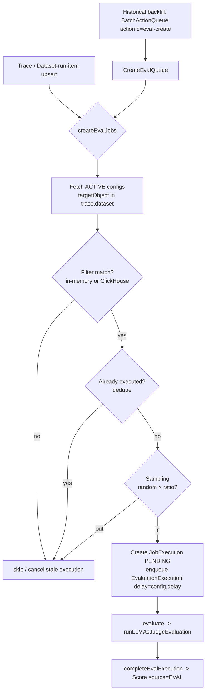
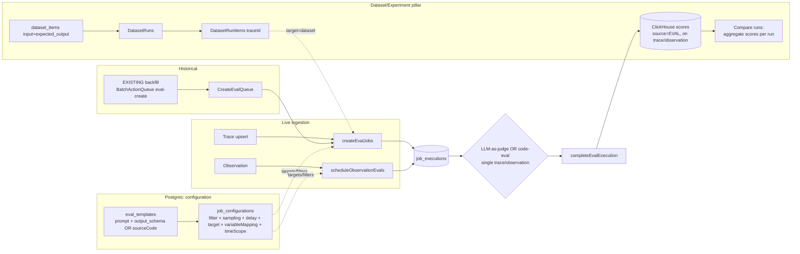

# Langfuse Evaluation, Dataset & Experiment Subsystem (v3.177.1)

> Reverse-engineered by reading the actual local source at `/Users/julien/Documents/Repos/langfuse` (version pinned in `package.json:3` → `3.177.1`). Every claim below cites a repo-relative path and, where load-bearing, a line number.

## TL;DR

Langfuse evaluation is **config-driven and target-by-filter**: a user creates an `EvalTemplate` (an LLM-as-judge prompt + a typed output schema, or a code snippet), then a `JobConfiguration` that says "for this project, target `trace` / `dataset` / `event` / `experiment` objects matching this **filter**, at this **sampling** ratio, after this **delay**, mapping these template variables to these object columns, writing a score named X." Trace/observation upserts (and a historical backfill queue) fan out into `JobExecution` rows, each of which runs **one** LLM-as-judge call or **one** sandboxed code-eval invocation over the input/output/metadata of **a single trace or a single observation**, and writes the result back as a `Score` (source = `EVAL`) onto that trace/observation in ClickHouse. The dataset/experiment flow is the second pillar: a `Dataset` of `DatasetItem`s (input + `expected_output`) is run by an experiment, producing a `DatasetRuns` row whose `DatasetRunItems` link generated traces back to items, and a compare table aggregates scores per run.

The genuinely reusable primitives for Tracely: **eval-as-async-job that writes scores back onto live traces**, **filter-based targeting with sampling**, **LLM-as-judge prompt templating with structured output**, and the **`Score` data model**. The structurally mis-aligned parts: the framing is **dataset-first / experiment-first**, evaluation is **single-object** (one trace or one observation, never a trajectory), there is **no multi-level / agent-aware / multi-agent** evaluation, and there is **no production-failure → regression-test loop** — the closest analog is a one-shot "apply this evaluator to historical traces" backfill, which is observability, not CI.

---

## 1. The data model (Postgres + ClickHouse split)

Evaluation **configuration and bookkeeping** live in Postgres; the **scores it produces** live in ClickHouse alongside traces/observations. This split matters for Tracely because it tells you exactly which parts are cheap transactional metadata vs. high-volume analytical data.

### 1.1 `eval_templates` — the judge definition

`packages/shared/prisma/schema.prisma:917-945`

```prisma
model EvalTemplate {
  id        String   @id @default(cuid())
  projectId String?  // NULL = global/managed template (e.g. Ragas)
  name    String
  version Int                               // append-only versioning, see @@unique below
  prompt  String?                           // LLM-as-judge prompt (mustache-style {{var}})
  type    EvalTemplateType @default(LLM_AS_JUDGE)   // LLM_AS_JUDGE | CODE
  partner String?                           // e.g. "ragas"
  model              String?
  provider           String?
  modelParams        Json?    @map("model_params")
  vars               String[] @default([])  // template variable names, e.g. ["query","output"]
  outputDefinition   Json?    @map("output_schema")           // the typed score contract (see §3)
  sourceCode         String?  @map("source_code") @db.VarChar(262144)  // CODE templates only, 256KB cap
  sourceCodeLanguage EvalTemplateSourceCodeLanguage?          // PYTHON | TYPESCRIPT
  @@unique([projectId, name, version])
  @@map("eval_templates")
}
```

Two template types (`EvalTemplateType` enum, `schema.prisma:947-950`): `LLM_AS_JUDGE` and `CODE`. Templates are **versioned by `(projectId, name, version)`** — editing creates a new version row rather than mutating. The `outputDefinition` JSON is the structured-output contract for LLM judges (§3); `sourceCode` (+ `sourceCodeLanguage`) holds Python/TypeScript for code evals.

### 1.2 `job_configurations` — the targeting rule

`packages/shared/prisma/schema.prisma:977-1004`

```prisma
model JobConfiguration {
  id        String   @id @default(cuid())
  projectId String
  jobType        JobType               @map("job_type")  // only EVAL exists today (see note below)
  status         JobConfigState        @default(ACTIVE)  // ACTIVE | INACTIVE
  blockedAt      DateTime?             @map("blocked_at") // auto-paused on bad LLM config
  blockReason    EvaluatorBlockReason? @map("block_reason")
  evalTemplateId String?               @map("eval_template_id")
  scoreName       String   @map("score_name")            // name the produced score gets
  filter          Json                                   // array<singleFilter> — WHAT to evaluate
  targetObject    String   @map("target_object")         // "trace" | "dataset" | "event" | "experiment"
  variableMapping Json     @map("variable_mapping")      // template var -> object column (see §2)
  sampling        Decimal                                // 0..1 probability
  delay           Int                                    // ms to wait before executing (let trace settle)
  timeScope       String[] @default(["NEW"]) @map("time_scope")  // ["NEW"] | ["EXISTING"] | both
  @@map("job_configurations")
}
```

This is the heart of the "evaluator" abstraction. Note `schema.prisma:957-961`: `JobType` has **only `EVAL`**, and a code comment warns that execution-count queries *assume all job_executions are EVAL*. The four enum-like `targetObject` values come from `packages/shared/src/features/evals/types.ts:28-33`:

```ts
export const EvalTargetObject = {
  TRACE: "trace", DATASET: "dataset", EVENT: "event", EXPERIMENT: "experiment",
} as const;
```

`time_scope` is the crucial knob for "historical vs live": `["NEW"]` evaluates only future data, `["EXISTING"]` triggers a backfill over past data (see §5.3). `JobConfigState` is `ACTIVE | INACTIVE` (`schema.prisma:963-966`); `EvaluatorBlockReason` (`schema.prisma:968-975`) auto-pauses evaluators on bad LLM connections / missing default model.

### 1.3 `job_executions` — one row per evaluation attempt

`packages/shared/prisma/schema.prisma:1014-1051`

```prisma
model JobExecution {
  id        String   @id @default(cuid())
  projectId String
  jobConfigurationId String         // FK -> the rule that spawned this
  jobTemplateId      String?        // snapshot of the template id at execution time
  status    JobExecutionStatus      // COMPLETED | ERROR | PENDING | CANCELLED | DELAYED
  startTime DateTime?
  endTime   DateTime?
  error     String?
  jobInputTraceId        String?    // target trace (ClickHouse, no FK)
  jobInputTraceTimestamp DateTime?
  jobInputObservationId  String?    // target observation (ClickHouse, no FK)
  jobInputDatasetItemId  String?    // target dataset item (Postgres)
  jobInputDatasetItemValidFrom DateTime?
  jobOutputScoreId String?          // the PRIMARY score this produced (back-pointer)
  executionTraceId String?          // the trace of the JUDGE's own LLM call (observability of evals)
  @@map("job_executions")
}
```

Each execution records its **input** (a trace / observation / dataset-item triple) and its **output** (`jobOutputScoreId`). `executionTraceId` is notable: the LLM-as-judge call is itself traced (so you can observe the evaluator), with a deterministic W3C trace id derived from the job execution id (`worker/src/features/evaluation/evalService.ts:860` via `createW3CTraceId`).

`JobExecutionStatus` (`schema.prisma:1006-1012`): `COMPLETED | ERROR | PENDING | CANCELLED | DELAYED`. There is no "FAILED-as-regression" status — `ERROR` means the evaluator infrastructure failed, not that the agent under test regressed.

### 1.4 Datasets — `datasets` / `dataset_items` / `dataset_runs` / `dataset_run_items`

`packages/shared/prisma/schema.prisma:586-683`

```prisma
model Dataset {              // a named collection
  id String; name String; description String?
  inputSchema  Json?  @map("input_schema")
  expectedOutputSchema Json? @map("expected_output_schema")
  remoteExperimentUrl String? @map("remote_experiment_url")    // webhook to trigger an external runner
  @@map("datasets")
}
model DatasetItem {         // one test case: input + golden output
  input          Json?
  expectedOutput Json?      @map("expected_output")            // the "ground truth"
  sourceTraceId       String? @map("source_trace_id")          // can be SEEDED from a production trace
  sourceObservationId String? @map("source_observation_id")
  validFrom DateTime; validTo DateTime?; isDeleted Boolean     // item-level versioning
  @@id([id, projectId, validFrom])
  @@map("dataset_items")
}
model DatasetRuns {          // one execution of a dataset (= one "experiment run")
  name String; description String?; metadata Json?            // metadata holds prompt_id/model/params
  @@unique([datasetId, projectId, name])
  @@map("dataset_runs")
}
model DatasetRunItems {      // links a run's item to the trace that was produced
  datasetRunId  String; datasetItemId String
  traceId       String      @map("trace_id")                  // the generated output's trace
  observationId String?     @map("observation_id")
  @@map("dataset_run_items")
}
```

The shape is classically **dataset-first**: `Dataset → DatasetItem(input, expected_output) → DatasetRuns → DatasetRunItems(traceId)`. A `DatasetItem` *can* be seeded from a production trace via `sourceTraceId`/`sourceObservationId` (`schema.prisma:617-618`) — this is the only thread connecting production data to evaluation, and it is a manual "add to dataset" action, not an automatic failure→regression pipeline.

### 1.5 `scores` — the universal evaluation output (ClickHouse)

Scores are **not in Postgres** (the Prisma `LegacyPrismaScore` at `schema.prisma:434` is legacy). The live table is ClickHouse `scores` (`packages/shared/clickhouse/migrations/clustered/0003_scores.up.sql`):

```sql
CREATE TABLE scores ON CLUSTER default (
    `trace_id` String,
    `observation_id` Nullable(String),
    `value` Float64,
    `source` String,                 -- "API" | "EVAL" | "ANNOTATION"
    `comment` Nullable(String),      -- judge reasoning lands here
    `config_id` Nullable(String),
    `data_type` String,              -- NUMERIC | CATEGORICAL | BOOLEAN | ...
    `string_value` Nullable(String), -- categorical label
    ...
) ENGINE = ReplicatedReplacingMergeTree(event_ts, is_deleted) Partition by toYYYYMM(timestamp)
```

A score is keyed by `(project_id, trace_id, observation_id)`. The score-source taxonomy is `packages/shared/src/domain/scores.ts:4-11`: `API | EVAL | ANNOTATION`; evaluator outputs are stamped `EVAL` (and external callers are *forbidden* from writing `EVAL`, see `PublicApiCreateScoreSourceDomain`, `scores.ts:18-21`). Data types: `NUMERIC | CATEGORICAL | BOOLEAN | CORRECTION | TEXT` (`scores.ts:46-59`).

> **Key takeaway for Tracely:** the score data model is clean, observation-grained, and source-tagged — this is directly reusable. But it is fundamentally **a single number/label attached to one trace or one observation**. There is no native notion of a score over a *trajectory*, a *turn*, a *conversation*, or a *multi-agent interaction* — only "trace" and "observation."

---

## 2. Variable mapping — how a judge "sees" the data

Both LLM-as-judge and code evals receive their inputs through a **variable mapping**: a declarative list saying "template variable `{{query}}` ← column `input` of the `trace` (optionally a JSON-path selector into it)."

`packages/shared/src/features/evals/types.ts:88-109`:

```ts
export const variableMapping = z.object({
  templateVariable: z.string(),          // {{name}} in the prompt
  objectName: z.string().nullish(),      // WHICH observation (by name) to pull from
  langfuseObject: langfuseObject,        // trace | span | generation | agent | tool | ... | dataset_item
  selectedColumnId: z.string(),          // input | output | metadata | expected_output
  jsonSelector: z.string().nullish(),    // optional JSONPath into the column
});
```

The set of `langfuseObjects` (`types.ts:69-82`) *looks* agent-aware — it includes `"agent"`, `"tool"`, `"chain"`, `"retriever"`, `"guardrail"` — **but these are merely observation `type` labels**, and the columns available for every one of them are the same three: `Input`, `Output`, `Metadata` (`observationCols`, `types.ts:122-198`). For datasets you additionally get `expected_output` (`availableDatasetEvalVariables`, `types.ts:200-220`).

Critically, the mapping selects **exactly one** observation, by name (`objectName`), and pulls **one column** from it. The extraction logic confirms this (`worker/src/features/evaluation/evalService.ts:1290-1349`): it calls `getObservationForTraceIdByName(...)` and `observations.shift()` — *"We only take the first match and ignore duplicate generation-names in a trace"* (`evalService.ts:1328`).

```
                         variableMapping (per template variable)
   ┌───────────────────────────────────────────────────────────────────┐
   │ {{query}}   ← trace.input            (langfuseObject="trace")        │
   │ {{answer}}  ← generation "final".output  (objectName="final")        │
   │ {{ctx}}     ← retriever "search".output.$.docs  (jsonSelector)       │
   └───────────────────────────────────────────────────────────────────┘
                                  │  one column, one named observation each
                                  ▼
                       ExtractedVariable[] { var, value }
                                  │
                                  ▼
              compileEvalPrompt() — mustache substitution into prompt string
```

For the newer **observation-scoped** path, the mapping is simpler still (`observationVariableMapping`, `types.ts:232-243`): no `objectName` (the observation is already chosen), just `selectedColumnId` + `jsonSelector`. The columns an observation eval can read are fixed (`packages/shared/src/features/evals/observationForEval.ts:148-212`): `input`, `output`, `metadata`, `toolCalls`, `toolDefinitions`, `toolCallNames`, and for experiments `experimentItemExpectedOutput` / `experimentItemMetadata`.

> **Key takeaway for Tracely:** mapping is per-variable, single-column, single-observation. To evaluate a *trajectory* (the ordered sequence of steps / tool calls / handoffs) you would have to either (a) cram the whole trajectory into one observation's `output`/`metadata`, or (b) build a fundamentally different extractor. Langfuse's extractor is **not trajectory-shaped**.

---

## 3. The LLM-as-judge output contract (structured scoring)

`packages/shared/src/features/evals/outputDefinition.ts`

An LLM judge does not return free text — it returns a **structured object validated against a per-template schema**, then normalized into a `Score`. Three data types are supported (`outputDefinition.ts:4-8`, `72-127`): `NUMERIC`, `BOOLEAN`, `CATEGORICAL` (categorical may allow multiple matches). Each definition has a `reasoning` description and a `score` description; categorical also carries a `categories` list (min 2, `outputDefinition.ts:25-29`).

The schema is compiled into a Zod schema that is handed to the LLM as a **structured-output / function-calling** contract (`buildResultSchemaForResolvedOutputDefinition`, `outputDefinition.ts:266-320`):

```ts
// numeric →
z.object({ reasoning: z.string().describe(...), score: z.number().describe(...) })
// boolean →
z.object({ reasoning: z.string().describe(...), score: z.boolean().describe(...) })
// categorical →
z.object({ reasoning: z.string().describe(...), score: z.enum([...categories]) })  // or z.array(enum) if multi-match
```

The execution path (`worker/src/features/evaluation/evalService.ts:735-961`, `runLLMAsJudgeEvaluation`):
1. `compileEvalPrompt(...)` — mustache substitution of extracted variables into `template.prompt` (`evalService.ts:784`; `evalRuntime.ts:14-26`).
2. `compilePersistedEvalOutputDefinition(...)` → the Zod output schema (`evalService.ts:811`).
3. `deps.callLLM({ messages, modelConfig, structuredOutputSchema, traceSinkParams })` — the judge call, itself traced under environment `LangfuseInternalTraceEnvironment.LLMJudge` (`evalService.ts:885-899`).
4. `validateEvalOutputResult(...)` then `toNormalizedScores(...)` → a `Score` whose `value` is the number / 0|1 / categorical label, and whose `comment` is the judge's `reasoning` (`evalService.ts:963-998`).

> **Reusable for Tracely:** the "judge returns `{reasoning, score}` validated against a typed schema, normalized to a score with the reasoning as the comment" pattern is excellent and directly portable. Note the **infinite-loop guard**: judge traces use a `langfuse-`-prefixed environment so they are skipped by eval-job creation (`evalService.ts:227-253`) — Tracely will need the same guard since its own eval runs will themselves emit traces.

---

## 4. Code-based evaluation (sandboxed custom evaluators)

Langfuse supports user-supplied **code** evaluators (Python/TypeScript), dispatched to an isolated runtime. This is the most "regression-test-like" primitive in the system, but it is still scoped to a single object.

### 4.1 Dispatcher selection (env-driven)

`packages/shared/src/server/evals/codeEvalDispatchers.ts:13-43`

```ts
export function resolveConfiguredCodeEvalDispatcher(): CodeEvalDispatcher | null {
  const dispatcherName =
    env.LANGFUSE_CODE_EVAL_DISPATCHER ??
    (env.NODE_ENV === "development" || env.NODE_ENV === "test" ? "insecure-local" : undefined);
  if (dispatcherName === "insecure-local") return new LocalCodeEvalDispatcher();      // runs in worker process
  if (dispatcherName === "aws-lambda")     return new AwsLambdaCodeEvalDispatcher({   // isolated, prod
    endpoint: env.LANGFUSE_CODE_EVAL_AWS_LAMBDA_ENDPOINT,
    functionNameByLanguage: { PYTHON: ..., TYPESCRIPT: ... },
  });
  return null;
}
```

- **`insecure-local`** (`localCodeEvalDispatcher.ts`): executes user code *in the worker process* — explicitly warned as insecure, dev/test only (`codeEvalDispatchers.ts:24-25`).
- **`aws-lambda`** (`awsLambdaCodeEvalDispatcher.ts`): synchronous `InvokeCommand` (`InvocationType: "RequestResponse"`) against per-language functions, defaulting to `code-based-eval-executor-python` / `code-based-eval-executor-node` (`awsLambdaCodeEvalDispatcher.ts:21-24`), with a 10s request timeout (`:27`) and a `TenantId` of `${organizationId}:${projectId}` (`:173`). Lambda function errors come back as HTTP 200 + `FunctionError` and are classified into typed dispatcher errors (timeout / OOM / user-code / config), with a retryable/non-retryable flag (`:240-305`).

### 4.2 The payload a code eval receives — single observation only

`packages/shared/src/server/evals/codeEvalExecution.ts:105-128` (`buildCodeEvalPayload`):

```ts
const payload: CodeEvalPayload = {
  observation: {
    input:    byName.get("input")    ?? null,
    output:   byName.get("output")   ?? null,
    metadata: byName.get("metadata") ?? null,
  },
};
if (params.hasExperimentContext) {
  payload.experiment = {
    itemExpectedOutput: byName.get("experimentItemExpectedOutput") ?? null,
    itemMetadata:       byName.get("experimentItemMetadata") ?? null,
  };
}
```

A code evaluator sees **one observation's `{input, output, metadata}`** (plus, in experiment mode, the dataset item's expected output/metadata). It must return `{ scores: [{ name, dataType, value, comment? }] }`. There are hard byte caps on source, payload, and result (`codeEvalExecution.ts:46-54`), and **network calls are forbidden** inside the evaluator (`:43-45`). Each invocation is wrapped in its own internal trace under `LangfuseInternalTraceEnvironment.CodeEval` (`:313`).

> **Key takeaway for Tracely:** the dispatcher pattern (env-selectable local-vs-isolated, typed retryable errors, per-tenant Lambda, byte caps, no-network sandbox, self-tracing) is a strong blueprint for "run an arbitrary assertion against a trace." **But** the contract is `(input, output, metadata) → scores`. A trajectory-level regression assertion ("the planner called `search` before `book`", "no tool was retried >3×", "the handoff to the refund agent happened") **cannot be expressed** here without reshaping the payload — the evaluator never sees the step sequence.

---

## 5. Execution pipeline — queues, fan-out, scoring

There are **two parallel pipelines**: the original **trace/dataset** pipeline (`createEvalJobs` → `EvaluationExecution`) and a newer **observation/event/experiment** pipeline (`scheduleObservationEvals` → `LLMAsJudgeExecution`). Both terminate in `completeEvalExecution` writing scores.

### 5.1 Queues and env vars

`packages/shared/src/server/queues.ts:325-353`

| Queue (`QueueName`) | Value | Role |
|---|---|---|
| `TraceUpsert` | `trace-upsert` | every trace write → eval-job creation |
| `DatasetRunItemUpsert` | `dataset-run-item-upsert-queue` | every dataset-run-item → eval-job creation |
| `CreateEvalQueue` | `create-eval-queue` | historical/batch eval-job creation |
| `EvaluationExecution` | `evaluation-execution-queue` | runs trace/dataset LLM-judge |
| `EvaluationExecutionSecondaryQueue` | `secondary-evaluation-execution-queue` | isolates high-throughput projects |
| `LLMAsJudgeExecution` | `llm-as-a-judge-execution-queue` | runs observation-scoped LLM-judge |
| `ExperimentCreate` | `experiment-create-queue` | prompt-experiment runner |
| `BatchActionQueue` | `batch-action-queue` | drives `EXISTING` backfills (actionId `eval-create`) |

Relevant env vars: `LANGFUSE_SECONDARY_EVAL_EXECUTION_QUEUE_ENABLED_PROJECT_IDS` (CSV of projects routed to the secondary queue, `worker/src/queues/evalQueue.ts:122-125`), `LANGFUSE_CODE_EVAL_DISPATCHER`, `LANGFUSE_CODE_EVAL_AWS_LAMBDA_ENDPOINT`, `LANGFUSE_CODE_EVAL_AWS_LAMBDA_{PYTHON,NODE}_FUNCTION_NAME`, `LANGFUSE_ENABLE_EVENTS_TABLE_UI`.

### 5.2 Job creation (`createEvalJobs`) — the filter+sampling fan-out

`worker/src/features/evaluation/evalService.ts:180-708`. For an incoming trace/dataset event:

1. Fetch all `ACTIVE`, non-blocked configs for the project with `targetObject ∈ {trace, dataset}` (`evalService.ts:192-208`). For trace/dataset-run-item events, `enforcedJobTimeScope: "NEW"` filters out `EXISTING`-only configs (`evalQueue.ts:33,54`).
2. Skip internal `langfuse-`-environment traces (infinite-loop guard, `evalService.ts:243-253`).
3. For each config: parse the `filter`, decide if the trace **matches** — in-memory against a cached trace when possible (`InMemoryFilterService.evaluateFilter`, `evalService.ts:420-438`), else a ClickHouse `checkTraceExistsAndGetTimestamp` lookup (`:453-467`).
4. **Deduplicate** against existing `JobExecution`s (`findMatchingJob`, `:363-374`); **cancel** executions whose trace no longer matches (a later trace event can "deselect" it, `:679-702`).
5. **Sample**: `if (Number(config.sampling) !== 1) { if (Math.random() > sampling) skip }` (`evalService.ts:621-629`).
6. Create a `JobExecution` (status `PENDING`) and enqueue `EvaluationExecution` with `delay: config.delay` ms (`evalService.ts:635-678`).



### 5.3 The historical / "production" path (`EXISTING` time scope)

When a config has `timeScope` including `EXISTING` for a `trace`/`dataset` target, `createJob` enqueues a `BatchActionProcessingJob` with `actionId: "eval-create"` and the config's filter, cutting off at "now" (`web/src/features/evals/server/router.ts:937-972`). That batch action walks historical traces and feeds them through `CreateEvalQueue` → `createEvalJobs` (with no enforced time scope, `evalQueue.ts:98-116`). **This is the entire extent of "evaluate production data" in Langfuse** — a one-shot backfill of an evaluator over past traces. It is not continuous, not failure-triggered, and produces scores (observability), not gated regression tests.

### 5.4 Execution and scoring (`completeEvalExecution`)

`worker/src/features/evaluation/evalService.ts:1038-1150` (`evaluate`) fetches the job/config/template, extracts variables (§2), runs `runLLMAsJudgeEvaluation` (§3), then `completeEvalExecution` (`worker/src/features/evaluation/evalCompletion.ts:21-95`):
- builds score-write payloads (`worker/src/features/evaluation/evalScoreEvent.ts:16-61`) — a `SCORE_CREATE` ingestion event with `source: ScoreSourceEnum.EVAL`, `value`, `dataType`, `comment` (= reasoning), and rich metadata (`job_execution_id`, `job_configuration_id`, `target_trace_id`, …) plus `executionTraceId` (the judge's own trace).
- **score ids are deterministic** (`buildDeterministicEvalScoreIds`, `packages/shared/src/server/evals/evalScoreIds.ts:6-38`): `uuidv5(["eval-score", jobExecutionId, scoreName, occurrenceIndex], NAMESPACE)` — so re-running an eval is idempotent (the same score id is overwritten in the `ReplacingMergeTree`).
- uploads + enqueues the score into the ingestion queue, then marks the `JobExecution` `COMPLETED` with `jobOutputScoreId` (`evalCompletion.ts:83-92`).

### 5.5 The observation-eval path (newer, `event`/`experiment`)

`worker/src/features/evaluation/observationEval/scheduleObservationEvals.ts` + `observationEvalProcessor.ts`. Here the unit is a **single observation** (an `ObservationForEval`, `observationForEval.ts:16+`). The scheduler filters configs by filter + sampling **in memory** (`scheduleObservationEvals.ts:50-83`), **uploads the observation to S3 once** (`:89-93`), then per matching config creates a `JobExecution` with a **deterministic id** `createW3CTraceId("${configId}:${span_id}")` (`:135-137`) and enqueues `LLMAsJudgeExecution`. The processor (`observationEvalProcessor.ts:94-267`) downloads the observation from S3, extracts variables (`extractObservationVariables`, §2), and runs **either** `runLLMAsJudgeEvaluation` **or** `executeCodeBasedEvaluation` based on template type (`:243-256`) — code evals only run on `event`/`experiment` targets (`router.ts:284-292`). Experiment configs additionally require the observation to be the experiment's root span (`scheduleObservationEvals.ts:176-201`).

---

## 6. The dataset / experiment flow (the second pillar)

This is the **dataset-first, experiment-centric** comparison loop — explicitly the "Dataset → Eval → Deploy" model the Tracely thesis rejects.

### 6.1 Creating an experiment = creating a dataset run

`web/src/features/experiments/server/router.ts:206-288` (`createExperiment`): the user picks a **prompt** (`promptId`), a **dataset** (`datasetId`, optional `datasetVersion`), and a **model config** (provider/model/params, optional `structuredOutputSchema`). The server creates a `DatasetRuns` row whose `metadata` records `{prompt_id, provider, model, model_params, experiment_name, ...}` (`:235-260`), then enqueues `ExperimentCreate` (`:262-280`). The worker (`worker/src/queues/experimentQueue.ts`, `worker/src/features/experiments/experimentServiceClickhouse.ts`) runs the prompt against each dataset item, producing traces linked back via `DatasetRunItems`.

```
Prompt (versioned) ─┐
Model config ───────┼──► createExperiment ──► DatasetRuns row (metadata: prompt_id, model)
Dataset (version) ──┘                                │
                                                     ▼  ExperimentCreate queue
                              for each DatasetItem: run prompt → produce Trace
                                                     │
                                                     ▼
                              DatasetRunItems(datasetItemId, traceId)  ←─ evaluators (target=dataset) score these
```

### 6.2 Comparison = aggregate scores per run

`web/src/features/datasets/server/dataset-router.ts:560-607` (`runsByDatasetIdMetrics`): for the selected runs it fetches per-run metrics from ClickHouse (`getDatasetRunsTableMetricsCh`) and **aggregates scores per run** — both trace-level scores (`getTraceScoresForDatasetRuns`) and run-level scores (`getScoresForExperiments`), via `aggregateScores(...)` (`:595-600`). The compare UI (`DatasetCompareRunsTable.tsx`, `DatasetRunAggregateColumnHelpers.tsx`) renders runs side-by-side with averaged scores. The mental model is **"run A vs run B vs baseline on a fixed dataset"** — `ExperimentBaselineControls.tsx` even adds a baseline selector for A/B comparison.

> **Key takeaway for Tracely:** this entire pillar is the *anti-pattern* relative to the thesis. The unit of truth is a **curated dataset of (input, expected_output) pairs**; quality is "average score across the dataset for this prompt/model version." There is no trajectory, no multi-turn conversation as a first-class run unit, no agent-version axis (the only versioned axis is the *prompt*), and no gate — comparison is a human eyeballing aggregate columns.

---

## 7. End-to-end picture



---

## 8. Critique: good-to-steal vs. mis-aligned

### 8.1 Genuinely good — steal these

| Primitive | Where | Why it's reusable for Tracely |
|---|---|---|
| **Eval-as-async-job that writes scores back onto live data** | `evalService.ts:635-678`, `evalCompletion.ts` | Decouples scoring from ingestion; scores live with the trace. Tracely's "regression test result" can be the same: an async job whose verdict attaches to the trace/run. |
| **Filter + sampling targeting** | `job_configurations.filter/sampling`, `createEvalJobs` `evalService.ts:402-629` | "Run this check on traces matching X, at rate Y" is exactly how Tracely should *select which production traces become candidate regression cases* and *which runs to gate on*. |
| **LLM-as-judge with typed structured output** | `outputDefinition.ts`, `runLLMAsJudgeEvaluation` | The `{reasoning, score}`-against-a-Zod-schema pattern, normalized to a typed score with reasoning-as-comment, is best-in-class. Reuse wholesale for Tracely's judge-based assertions. |
| **Deterministic, idempotent score ids** | `evalScoreIds.ts:6-38` | `uuidv5(jobExecutionId, scoreName, idx)` makes re-evaluation idempotent over a `ReplacingMergeTree`. Tracely re-runs regression suites constantly — idempotent verdict ids are a must. |
| **Code-eval dispatcher (sandboxed, env-selectable, typed errors)** | `codeEvalDispatchers.ts`, `awsLambdaCodeEvalDispatcher.ts` | The local-vs-Lambda dispatch, per-tenant isolation, byte caps, no-network sandbox, retryable error taxonomy, and self-tracing are a ready blueprint for "run an arbitrary assertion safely." |
| **Self-tracing evals + infinite-loop guard** | `evalService.ts:227-253,860-899` | Evals emit their own traces under a reserved `langfuse-` environment, skipped by job creation. Tracely's evals will also emit traces; copy this guard. |
| **`Score` data model (source-tagged, multi-type)** | `domain/scores.ts`, `0003_scores.up.sql` | `source ∈ {API,EVAL,ANNOTATION}` + `{NUMERIC,CATEGORICAL,BOOLEAN,...}` on `(trace_id, observation_id)` is a solid verdict store. Tracely extends it (see §9), not replaces it. |
| **Auto-blocking evaluators on bad config** | `EvaluatorBlockReason` `schema.prisma:968-975`, `blockEvaluatorConfigs` | Operational robustness: a misconfigured judge pauses itself instead of erroring forever. Worth keeping for CI gate reliability. |

### 8.2 Mis-aligned for an agent-first, trace-first, regression-from-production product — ignore / redesign

| Mis-alignment | Evidence | Consequence for Tracely |
|---|---|---|
| **Dataset-first framing** | `datasets`/`dataset_items(expected_output)`/`dataset_runs` (`schema.prisma:586-683`); `createExperiment` builds a `DatasetRuns` (`experiments/server/router.ts:248-260`) | The unit of truth is a curated `(input, expected_output)` dataset, not a production trace. Tracely inverts this: **the production trace is the test case**; `expected_output`/golden labels are *derived* from a captured-and-confirmed trace, not authored up front. |
| **Experiment-centric comparison** | `runsByDatasetIdMetrics` aggregates scores per run (`dataset-router.ts:560-607`); baseline A/B in `ExperimentBaselineControls.tsx` | Quality = "average score of prompt/model version on a fixed dataset." Tracely needs **run-vs-run on the same production-derived scenario with a pass/fail gate**, not a human comparing averaged columns. |
| **Single-object evaluation (no trajectory)** | judge/code see one trace or one named observation's `{input,output,metadata}` (`evalService.ts:1290-1349`; `codeEvalExecution.ts:105-128`) | **Cannot evaluate a trajectory.** No access to the ordered step/tool-call/handoff sequence. Tracely must build a trajectory-shaped extractor + assertion model (step order, tool-call correctness, retries, sub-agent handoffs). |
| **No multi-level evaluation** | scores key on `(trace_id, observation_id)` only (`0003_scores.up.sql`); targets are `trace`/`event` (`types.ts:28-33`) | No first-class **turn / conversation / agent / multi-agent** scope. Tracely's "evaluate at conversation/turn/step/tool/agent/multi-agent level" has no analog — the score model needs new scope dimensions. |
| **Prompt is the only versioned axis** | experiment metadata = `{prompt_id, model, model_params}` (`experiments/server/router.ts:235-246`) | There is **no Agent / Agent Version entity**. Tracely's `Agent`/`Agent Version`/`Agent Run` must be net-new; you cannot diff "agent v12 vs v13" in Langfuse. |
| **No production-failure → regression-test loop** | only `sourceTraceId` (manual "add to dataset", `schema.prisma:617`) and the `EXISTING` one-shot backfill (`router.ts:937-972`) connect production to evals | The core Tracely pipeline (Prod Trace → Failure Detection → Regression Test → CI Gate) **does not exist**. The backfill is observability ("score my old traces"), and failure clustering is absent entirely. |
| **No CI/CD gate semantics** | `JobExecutionStatus` is `COMPLETED|ERROR|...` (`schema.prisma:1006-1012`); scores are floats, no pass/fail verdict, no deploy hook | Nothing blocks a deploy. There is no "suite passed/failed," no gate, no GitHub-Actions-style status check. This is the single biggest gap — Tracely's reason to exist. |
| **Prompt-management coupling** | experiments require a `promptId` from Langfuse prompt management | The reader explicitly does not want prompt management. Tracely's "version under test" is an **Agent Version**, decoupled from any prompt registry. |

---

## 9. Relevance to Tracely

**Reuse (port with light changes):**
- The **async-job → write-verdict-back-onto-trace** spine (`createEvalJobs` → `JobExecution` → `completeEvalExecution`). Tracely's "regression case execution" is structurally identical; rename `Score(source=EVAL)` to a `RegressionVerdict`/typed evaluation result but keep the idempotent-id, self-tracing, write-back design.
- **Filter + sampling targeting** for *both* candidate-selection (which production traces become regression cases) and gate-scoping (which runs a suite covers).
- **LLM-as-judge typed-output engine** (`outputDefinition.ts` + `runLLMAsJudgeEvaluation`) essentially verbatim for judge-style assertions — extend the output schema with a `pass/fail` verdict alongside the numeric/categorical score.
- **Code-eval dispatcher** (`codeEvalDispatchers.ts` + Lambda dispatcher) verbatim as the safe execution layer for custom assertions — but **change the payload contract** from `{observation:{input,output,metadata}}` to a **trajectory object** (ordered steps, tool calls, sub-agent calls, turns).
- The **infinite-loop guard** and **deterministic score ids** are non-negotiable carryovers.

**Langfuse-specific / build net-new:**
- **Agent / Agent Version / Agent Run** entities — Langfuse has no agent-versioning axis at all (only prompt versions).
- **Trajectory-first extraction & multi-level scope** (conversation / turn / step / tool / agent / multi-agent) — the variable-mapping extractor and the `(trace_id, observation_id)` score key must be replaced/extended with trajectory and scope dimensions.
- **Failure detection + Failure Cluster** — entirely absent; this is the front of Tracely's pipeline.
- **Regression-test promotion loop** — "confirmed production failure → frozen regression case" replaces "manually add trace to dataset" + "one-shot backfill."
- **CI/CD gate** — a suite-level pass/fail verdict with a deploy-blocking status check; nothing in Langfuse models this.
- **Dataset/experiment pillar** (§6) — largely ignore. If anything, a "dataset" in Tracely is just a *materialized set of production-derived regression cases*, not an authored `(input, expected_output)` corpus, and "experiment" becomes "run agent version N against the regression suite," not "run prompt P against dataset D."

**Net:** Langfuse gives Tracely a battle-tested *execution + scoring substrate* (async jobs, filters, judge templating, sandboxed code, score store) and an *anti-pattern to avoid* (dataset-first, experiment-comparison, single-object, no gate). Build the trace-native, agent-aware, trajectory-level, production-to-regression-to-gate layer **on top of** the substrate; discard the dataset/experiment framing.
