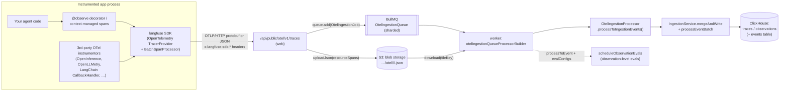
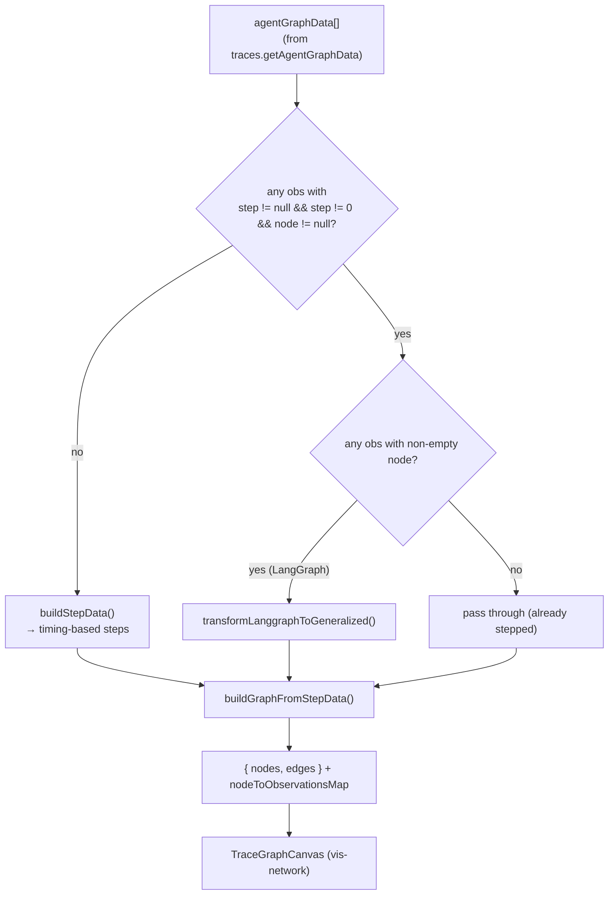

# Langfuse v3.177.1 — Framework Integrations, SDK Architecture & Agent-Graph Reconstruction

> **TL;DR.** In v3, Langfuse's Python/JS SDKs are thin **OpenTelemetry SDKs** that export OTLP spans to a single HTTP endpoint (`/api/public/otel/v1/traces`). Everything downstream is a giant *span-attribute interpreter*: one file — `OtelIngestionProcessor.ts` — sniffs ~15 framework conventions (Langfuse SDK, Vercel AI SDK, OpenInference/Arize, OpenLLMetry/Traceloop, OTel GenAI, Pydantic-AI/Logfire, Google ADK, MLflow, Genkit, LiveKit, SmolAgents…) to pull `input`/`output`/`model`/`usage`/`tools` out of heterogeneous spans, and `ObservationTypeMapper.ts` maps them to a fixed observation taxonomy (`AGENT`/`TOOL`/`GENERATION`/`CHAIN`/`RETRIEVER`/`EMBEDDING`/`GUARDRAIL`/`EVALUATOR`/`SPAN`/`EVENT`). The "agent graph" is **not** a first-class entity — it is *reconstructed at read time* in the browser from two LangGraph-specific metadata keys (`langgraph_node`, `langgraph_step`) or, failing that, from span start/end **timestamps**. This is the strongest reusable asset for Tracely and also the clearest place where Langfuse stops short of being agent-first.

This document is grounded entirely in the local source at `/Users/julien/Documents/Repos/langfuse` (paths below are repo-relative).

---

## 1. The v3 ingestion model: SDKs are OpenTelemetry exporters

### 1.1 One endpoint, OTLP in, S3 + queue out

The public OTel endpoint is a Next.js API route at `web/src/pages/api/public/otel/v1/traces/index.ts`. Key facts:

- It accepts **both** `application/x-protobuf` and `application/json` OTLP `ExportTraceServiceRequest` payloads, with optional gzip (`web/src/pages/api/public/otel/v1/traces/index.ts:63-113`). Protobuf is decoded with a generated decoder `$root.opentelemetry.proto.collector.trace.v1.ExportTraceServiceRequest` (`:92-98`).
- It reads three SDK-identifying headers — `x-langfuse-sdk-name`, `x-langfuse-sdk-version`, `x-langfuse-ingestion-version` (hyphen *or* underscore form, `:14-24`, `:136-144`). These headers later decide the write path (see §1.4).
- It does **not** process inline. It uploads the raw `resourceSpans` batch to S3 under `${LANGFUSE_S3_EVENT_UPLOAD_PREFIX}otel/${projectId}/yyyy/mm/dd/hh/mm/<uuid>.json` and enqueues an `OtelIngestionJob` onto a sharded BullMQ queue (`packages/shared/src/server/otel/OtelIngestionProcessor.ts:182-219`). The HTTP handler returns immediately (`web/.../v1/traces/index.ts:187`).
- `markProjectAsOtelUser(projectId)` is called on every request (`:47`) — Langfuse tracks OTel adoption per project.

So the ingestion path is **fully asynchronous and blob-backed**:



The worker side is `worker/src/queues/otelIngestionQueue.ts`: it downloads the file (`:252-254`), optionally applies EE **ingestion masking** with fail-closed semantics (`:269-292`), then calls `processor.processToIngestionEvents(parsedSpans)` (`:299-300`) to produce Langfuse ingestion events.

### 1.2 The OTLP span → Langfuse event shape

`OtelIngestionProcessor.processToEvent()` (`packages/shared/src/server/otel/OtelIngestionProcessor.ts:226-513`) walks `resourceSpans[].scopeSpans[].spans[]` and emits one enriched record per span. The structural OTLP nesting is preserved as three attribute scopes:

- **resource attributes** (`extractResourceAttributes`, `:1118-1127`) → `service.name`, `service.version`, `telemetry.sdk.language/name/version`.
- **scope attributes** (`extractScopeAttributes`, `:1129-1136`) and `scope.name` / `scope.version` — the **instrumentation scope name is the primary framework discriminator** (see §2).
- **span attributes** (`extractSpanAttributes`, `:1138-1145`) — flattened `key → value` where OTLP `AnyValue` is collapsed to plain JS by `convertValueToPlainJavascript` (`:1285-1317`, handles `stringValue`/`intValue{high,low}`/`doubleValue`/`boolValue`/`arrayValue`).

Each emitted event carries (`:381-501`): `traceId`, `spanId`, `parentSpanId`, `name`, `type` (observation type, §3), `startTimeISO`/`endTimeISO`, `level`/`statusMessage`, `modelName`/`modelParameters`/`completionStartTime`, `providedUsageDetails`/`providedCostDetails`, `input`/`output`, `metadata`, instrumentation fields (`scopeName`, `scopeVersion`, `telemetrySdkLanguage`…), and **tool fields** (`toolDefinitions`, `toolCalls`, `toolCallNames`).

`parentSpanId` is the OTLP parent — **this single field is the entire backbone of the trace tree.** There is no explicit "this span is a sub-agent of that agent" edge; hierarchy is pure OTel span parentage plus the derived `node`/`step` (§4).

### 1.3 Langfuse-native span attributes (the "first-party" convention)

When you use the Langfuse SDK directly (scope name starts with `langfuse-sdk`, `:266-267`), spans carry `langfuse.*` attributes enumerated in `packages/shared/src/server/otel/attributes.ts`:

- Trace-level: `langfuse.trace.name`, `langfuse.trace.input/output/metadata/tags/public`, `user.id`, `session.id` (`attributes.ts:2-9`).
- Observation-level: `langfuse.observation.type`, `langfuse.observation.input/output/metadata/level/status_message` (`:12-18`).
- Generation-specific: `langfuse.observation.model.name`, `…model.parameters`, `…usage_details`, `…cost_details`, `…completion_start_time`, `…prompt.name/version` (`:20-27`).
- Internal/structural: `langfuse.internal.as_root`, `langfuse.internal.is_app_root` (`:35-36`) — `as_root=true` forces a span to start a new trace even with a parent (`OtelIngestionProcessor.ts:769-771`).
- Experiment attributes: `langfuse.experiment.id/name/dataset.id/item.id/item.expected_output/…` (`:43-53`) — this is the **dataset-experiment** hook (Tracely should note: this is the dataset-first path Langfuse pushes; it is *not* what we want to copy).

Notably, for Langfuse-SDK spans the raw attribute bag is **not** stored in metadata (`metadata.attributes` is omitted, `OtelIngestionProcessor.ts:288-302`) because the SDK already populates clean `input`/`output`/`metadata`. For third-party scopes, the leftover attributes are stringified and kept under `metadata.attributes` (`:1482-1489`).

### 1.4 Two write paths gated on SDK version

`worker/src/queues/otelIngestionQueue.ts` chooses between a legacy **dual write** (staging table + batch job) and a **direct event write** (straight to the new `events` table):

- Header-based (priority 1): Python SDK ≥ `4.0.0`, JS SDK ≥ `5.0.0`, or `x-langfuse-ingestion-version >= 4` → direct (`checkHeaderBasedDirectWrite`, `:50-89`).
- Scope-based fallback (priority 2): scope name contains `"langfuse"`, environment `sdk-experiment`, Python ≥ `3.9.0` / JS ≥ `4.4.0` (`checkSdkVersionRequirements`, `:151-191`).

Ingestion versions `> 4` are rejected at the HTTP route (`web/.../v1/traces/index.ts:146-159`). For Tracely this matters only as evidence that **the SDK is just an OTLP producer with version-negotiated headers** — the contract is OTel, not a bespoke wire format.

### 1.5 External SDK architecture (v3 Python/JS — described from references, repos are external)

The `langfuse-python` and `langfuse-js` v3 SDKs are *not* in this repo, but their architecture is fully implied by the ingestion code and README:

- They are **OpenTelemetry SDKs**: a `TracerProvider` with a `BatchSpanProcessor` exporting OTLP to `${LANGFUSE_BASE_URL}/api/public/otel/v1/traces`, authenticating with the public/secret key pair (`README.md:181-211`).
- Manual instrumentation is the **`@observe()` decorator** (Python) / context-managed spans (`README.md:174-208`) — these create spans and set `langfuse.observation.*` attributes; **context propagation is standard OTel context** (parent span = enclosing decorated function), which is why `parentSpanId` reconstructs the call tree for free.
- The `langfuse.openai` drop-in (`README.md:194`) and the LangChain `CallbackHandler` are *auto-instrumentors* that emit child spans inside the active OTel context.
- Crucially, **third-party OTel instrumentors export to the same endpoint**. You can point any OpenInference or OpenLLMetry instrumentor's OTLP exporter at Langfuse and it ingests, because `OtelIngestionProcessor` understands their attribute conventions (§2). The Langfuse SDK is one producer among many.

---

## 2. Multi-framework span interpretation (`extractInputAndOutput`)

The single most important method for "how Langfuse ingests from agent frameworks" is `OtelIngestionProcessor.extractInputAndOutput()` (`packages/shared/src/server/otel/OtelIngestionProcessor.ts:1386-1848`). It is a **priority-ordered cascade** keyed mostly on the **instrumentation scope name** and on attribute-key presence. The order encodes precedence when multiple conventions coexist on one span.

| Order | Framework / convention | Discriminator | Input source → Output source | Source lines |
|---|---|---|---|---|
| pre | (all) pre-delete known I/O keys so leftovers don't pollute metadata | — | n/a | `:1399-1480` |
| 1 | **Langfuse SDK** | `langfuse.observation.input/output` (+ `trace.*` for trace domain) | `OBSERVATION_INPUT` → `OBSERVATION_OUTPUT` | `:1491-1503` |
| 2 | **Genkit** | `scope.name === "genkit-tracer"` | `genkit:input.messages` → `genkit:output.message` | `:1505-1522` |
| 3 | **Vercel AI SDK** | `scope.name === "ai"` | `ai.prompt.messages`/`ai.prompt`/`ai.toolCall.args` → `ai.response.text`(+`toolCalls`)/`ai.response.object`/… | `:1524-1565` |
| 4 | **OTel GenAI events** | span `events[]` named `gen_ai.{system,user,assistant,tool}.message` / `gen_ai.choice` | event attrs → choice event | `:1567-1621` |
| 5 | **Semantic Kernel (legacy)** | events `gen_ai.content.prompt`/`gen_ai.content.completion` | event attrs (recursively re-parsed) | `:1623-1661` |
| 6 | **Google Vertex ADK** | `gcp.vertex.agent.llm_request/llm_response` (+ `tool_call_args`/`tool_response`) | request → response | `:1663-1677` |
| 7 | **Logfire (Pydantic)** | `prompt` + `all_messages_events` | `prompt` → `all_messages_events` | `:1679-1684` |
| 8 | **LiveKit** | `lk.input_text`/`lk.user_transcript`/`lk.chat_ctx` | → `lk.function_tool.output`/`lk.response.text` | `:1686-1695` |
| 9 | **Logfire single `events` array** | `events` (JSON array of `event.name`) | non-choice events → `gen_ai.choice` | `:1697-1723` |
| 10 | **MLflow** | `mlflow.spanInputs`/`mlflow.spanOutputs` | direct | `:1725-1730` |
| 11 | **OpenLLMetry / Traceloop (entity)** | `traceloop.entity.input`/`output` | direct | `:1732-1737` |
| 12 | **SmolAgents (OpenInference)** | `input.value`/`output.value` | direct | `:1739-1744` |
| 13 | **Pydantic / Pipecat** | bare `input`/`output` | direct | `:1746-1751` |
| 14 | **Pydantic-AI agent span** | `scope.name === "pydantic-ai"` | `pydantic_ai.all_messages` (+ prepend `gen_ai.system_instructions`) → `final_result` | `:1753-1766` |
| 15 | **Pydantic-AI tool span** | `tool_arguments`/`tool_response` | direct | `:1768-1773` |
| 16 | **OpenLLMetry / Traceloop (indexed)** | keys `gen_ai.prompt.*` / `gen_ai.completion.*` | un-flattened via `convertKeyPathToNestedObject` | `:1775-1796` |
| 17 | **OpenInference (Arize)** | keys `llm.input_messages.*` / `llm.output_messages.*` *(explicitly "used by Agno, BeeAI, etc.")* | un-flattened to message arrays | `:1798-1825` |
| 18 | **OTel GenAI spec (attribute form)** | `gen_ai.input.messages`/`gen_ai.output.messages` (+ system instructions) | direct | `:1827-1838` |
| 19 | **OTel GenAI tool** | `gen_ai.tool.call.arguments`/`gen_ai.tool.call.result` | direct | `:1840-1845` |

Two helpers make the indexed conventions work:

- **`convertKeyPathToNestedObject(input, prefix)`** (`:1319-1384`) reconstructs nested objects/arrays from dotted-indexed OTel keys. E.g. OpenInference emits `llm.input_messages.0.message.role = "user"`, `llm.input_messages.0.message.content = "..."`; this rebuilds `[{message:{role,content}}]`. It also blocklists `__proto__`/`constructor`/`prototype` against prototype pollution (`:1330-1331`).
- **`prependSystemInstructions`** (`:1855-1880`) injects `gen_ai.system_instructions` as a leading `{role:"system"}` message for OTel-GenAI/Pydantic-AI.

**Model name** (`extractModelName`, `:2159+`) reads `gen_ai.response.model` → `gen_ai.request.model` → `llm.response.model` → `llm.model_name` (OpenInference) and more. **Usage** (`extractUsageDetails`, `:2186+`) has framework-specific branches for Genkit, Vercel AI (`gen_ai.usage.{input,output,prompt,completion}_tokens`), Pydantic-AI, and a generic `gen_ai.usage.*` collector. The point for Tracely: **token/cost accounting is per-convention and messy** — there is no single normalized usage attribute across frameworks.

---

## 3. Observation-type taxonomy: how a span becomes an Agent / Tool / LLM call

`ObservationTypeMapperRegistry` (`packages/shared/src/server/otel/ObservationTypeMapper.ts:165-489`) is a **priority-ordered list of mappers**; first match wins, default `SPAN` (`:483`). The output enum is `SPAN | GENERATION | EVENT | EMBEDDING | AGENT | TOOL | CHAIN | RETRIEVER | GUARDRAIL | EVALUATOR` (`:217-232`).

| Priority | Mapper | Signal | Notable mappings | Lines |
|---|---|---|---|---|
| 0 | `PythonSDKv330Override` | bug fix: `langfuse.observation.type=span` + langfuse-sdk + python ≤3.3.0 but has model/usage attrs | → `GENERATION` | `:171-214` |
| 1 | `LangfuseObservationTypeDirectMapping` | `langfuse.observation.type` | `agent→AGENT`, `tool→TOOL`, `chain→CHAIN`, `retriever→RETRIEVER`, `guardrail→GUARDRAIL`, `evaluator→EVALUATOR`, `embedding→EMBEDDING` | `:217-233` |
| 2 | **OpenInference** | `openinference.span.kind` | `LLM→GENERATION`, `AGENT→AGENT`, `TOOL→TOOL`, `CHAIN→CHAIN`, `RETRIEVER→RETRIEVER`, `EMBEDDING→EMBEDDING`, `GUARDRAIL→GUARDRAIL`, `EVALUATOR→EVALUATOR` | `:236-247` |
| 3 | **OTel GenAI operation** | `gen_ai.operation.name` | `chat/completion/text_completion/generate_content→GENERATION`, `embeddings→EMBEDDING`, `invoke_agent/create_agent→AGENT`, `execute_tool→TOOL` | `:250-268` |
| 4 | **Genkit** | `genkit:metadata:subtype` | `model→GENERATION`, `tool→TOOL`, `retriever→RETRIEVER`, `evaluator→EVALUATOR`, `embedder→EMBEDDING` | `:271-281` |
| 5 | **Vercel AI SDK (gen-like)** | `operation.name`/`ai.operationId` startsWith + model info present | `ai.generateText.doGenerate`/`streamText.doStream`/…→`GENERATION`, `ai.embed*→EMBEDDING` | `:284-343` |
| 6 | **Vercel AI SDK (span-like)** | `operation.name` startsWith `ai.`, no model info | `ai.toolCall→TOOL` | `:346-394` |
| 7 | **GenAI tool call** | `gen_ai.tool.name` or `gen_ai.tool.call.id` present (Pydantic-AI tools omit `operation.name`) | → `TOOL` | `:399-410` |
| 8 | **LiveKit span name** | `scope.name==="livekit-agents"` + span name | `agent_turn`/`start_agent_activity→AGENT`, `function_tool→TOOL` | `:412-431` |
| 9 | **Model-based fallback** | any model attr (`gen_ai.request.model`, `llm.model_name`, `model`, …) | → `GENERATION` | `:434-448` |

**This is the closest Langfuse comes to "agent-aware" structure.** The taxonomy already has `AGENT` and `TOOL` and can detect them from OpenInference (`AGENT`), OTel GenAI (`invoke_agent`/`create_agent`/`execute_tool`), Vercel AI, LiveKit, and the native `langfuse.observation.type`. But — critically — **these types are per-observation labels. There is no Agent entity, no Agent Version, no notion of a sub-agent call as a typed edge.** A multi-agent handoff appears only as a parent/child span tree where some nodes happen to be typed `AGENT`.

---

## 4. Agent-graph reconstruction — derived at read time, not stored

This is the part most relevant to Tracely's "agent graph" ambitions, and it is surprisingly thin and **client-side**.

### 4.1 The only persisted graph signal: two LangGraph metadata keys

The graph data comes from a dedicated ClickHouse query, `getAgentGraphData` (`packages/shared/src/server/repositories/traces.ts:1572-1608`):

```sql
SELECT id, parent_observation_id, type, name, start_time, end_time,
       metadata['langgraph_node'] AS node,
       metadata['langgraph_step'] AS step
FROM observations
WHERE project_id = {projectId} AND trace_id = {traceId}
  AND start_time >= {chMinStartTime} AND start_time <= {chMaxStartTime}
```

The same two keys are reconstructed from the newer `events` table's parallel arrays (`packages/shared/src/server/repositories/events.ts:2832-2833`, `mapFromArrays(...)['langgraph_node']`). **That is the entire structured graph contract: `langgraph_node` and `langgraph_step`, both LangGraph-specific, both stored as ordinary observation metadata.** They are set by the external LangChain/LangGraph callback handler as span metadata and flattened into the ClickHouse `metadata` Map at ingestion; the constants live in `web/src/features/trace-graph-view/types.ts:14-15` (`LANGGRAPH_NODE_TAG = "langgraph_node"`, `LANGGRAPH_STEP_TAG = "langgraph_step"`).

The tRPC procedure `traces.getAgentGraphData` (`web/src/server/api/routers/traces.ts:610-679`) post-processes rows:
- If `step != null && node != null` → it's a **LangGraph** observation; pass through `node`/`step` (`:647-660`).
- Else if `type !== "EVENT"` → synthesize `node = name, step = 0` for **every other observation** (`:661-672`).
- `EVENT`-type observations are dropped (`:648`, `:674`).

So *non-LangGraph* traces still get a "graph" — but only as a flat list of nodes (all `step = 0`) named after their span names, to be re-stepped by timing on the client.

### 4.2 Client-side path selection

`web/src/features/trace-graph-view/components/TraceGraphView.tsx:46-64` chooses between two reconstruction strategies:



There is even a code comment admitting the heuristic is weak: `// TODO: make detection more robust based on metadata` (`TraceGraphView.tsx:58`).

### 4.3 LangGraph-native reconstruction (`transformLanggraphToGeneralized`)

`web/src/features/trace-graph-view/buildGraphCanvasData.ts:16-84`:
- Drops observations without a `node` (`:20-22`).
- Maps LangGraph's reserved nodes `__start__`/`__end__` (`LANGGRAPH_START_NODE_NAME`/`LANGGRAPH_END_NODE_NAME`, `types.ts:16-17`) onto Langfuse system nodes (`:32-38`), and synthesizes `__start__`/`__end__` system nodes if absent (`:43-81`), typed `LANGGRAPH_SYSTEM`.
- `buildGraphFromStepData` (`:86-173`) groups observations by `step` into a `stepToNodesMap`, builds the `node → [observationIds]` map for click-through navigation, and draws **edges between consecutive steps** via `generateEdgesWithParallelBranches` (`:175-205`) — every node at step *N* connects to every node at step *N+1* (this is how parallel LangGraph branches render as a fan-out/fan-in). Edges are derived purely from step ordering, **not** from any recorded transition.

### 4.4 Timing-based fallback (`buildStepData`) — the generic agent path

For everything that is *not* LangGraph, `web/src/features/trace-graph-view/buildStepData.ts` invents steps from **span timestamps**:
- `buildStepGroups` (`:8-90`) greedily groups observations whose execution intervals overlap into the same "step" (concurrent spans share a step), recursing on the remainder.
- `assignGlobalTimingSteps` (`:92-198`) sorts by `startTime`, assigns step indices, sets `node = name` (`:120-121`), then enforces a **parent-before-child** constraint: any child must be at `parent.step + 1`, pushing later steps forward (capped at `MAX_ITERATIONS = 1500`, `:129-135`). `EVENT` observations are filtered out (`:244-250`).
- `addLangfuseSystemNodes` (`:200-237`) bolts on synthetic `__start__`/`__end__` nodes.

This is genuinely useful: it means *any* OTel trace (Agno, OpenAI Agents, a custom framework) gets a serviceable left-to-right graph **without** any framework cooperation, purely from span nesting + timing. But it is heuristic, lossy (true conditional edges and loops are flattened to time order), and recomputed on every render.

---

## 5. ChatML adapters — how heterogeneous messages get rendered

Separate from ingestion, the **display** layer normalizes `input`/`output` JSON into ChatML for the trace UI and the "jump to playground" feature. The adapters live in `packages/shared/src/utils/chatml/adapters/` and are re-exported to the web app via `@langfuse/shared` (`web/src/utils/chatml/adapters/index.ts:1-14`). The registry order is **detection-priority** (`packages/shared/src/utils/chatml/adapters/index.ts:11-21`):

```
langgraph → aisdk → openai → gemini → microsoft-agent → pydantic-ai → semantic-kernel → generic(fallback)
```

`selectAdapter(ctx)` (`:23-38`) honors an explicit `ctx.framework` override, else returns the first adapter whose `detect()` returns true. The adapter contract (`packages/shared/src/utils/chatml/types.ts:25-34`) is just `{ id, detect(ctx), preprocess(data, kind, ctx), extractToolEvents?(message) }` over a `NormalizerContext = { metadata, observationName, framework?, data? }`.

### 5.1 The LangGraph adapter (representative)

`packages/shared/src/utils/chatml/adapters/langgraph.ts` is the richest adapter and shows exactly what span metadata signals LangGraph:

- **Detection** (`detect`, `:273-397`): explicit `ctx.framework === "langgraph"`; then **rejections** for AI SDK (`scope.name === "ai"`), OpenAI Agents (`scope.name` includes `openai_agents`), Semantic Kernel (`Microsoft.SemanticKernel*`), Pydantic-AI (`scope.name === "pydantic-ai"`), and Vercel-style `operation.name`/`ai.operationId` starting `ai.`; then **hints**: presence of `langgraph_step` / `langgraph_node` / `langgraph_path` / `langgraph_checkpoint_ns` in metadata, `framework === "langgraph"`, a `langgraph` tag, or any `ls_`-prefixed key (LangSmith/LangChain ecosystem). Finally **structural** Zod schemas detect LangChain message arrays (`type ∈ {human,ai,tool,system}`) or LangGraph messages with `additional_kwargs.tool_calls` (`:15-46`).
- **Preprocessing** (`preprocessData`, `:220-268`): converts LangChain `type`→`role` (`human→user`, `ai→assistant`, `:108-121`), lifts `additional_kwargs.tool_calls` to top-level `tool_calls` and flattens OpenAI-nested `{function:{name,arguments}}` into flat `{name, arguments}` (`:123-190`), extracts inline tool *definitions* (`role:"tool"`, `content.type==="function"` without `tool_call_id`, `:58-101`) and attaches them to messages.

The same `langgraph_*` keys that drive the **graph view** (§4.1) thus also drive **message rendering** (`openai.ts:377-379` rejects LangGraph by the same keys to avoid mis-detection). This confirms `langgraph_node`/`langgraph_step`/`langgraph_path`/`langgraph_checkpoint_ns` are *the* LangGraph fingerprint across the codebase.

### 5.2 Tool extraction across conventions

`web/src/utils/chatml/extractTools.ts` pulls tool *definitions* from many shapes for the playground:
- AI SDK: `attributes["ai.prompt.tools"]` (`:66`).
- Microsoft Agent / OTel GenAI: `attributes["gen_ai.tool.definitions"]` (`:70-73`).
- Pydantic-AI: `attributes.model_request_parameters.function_tools` (`:76-82`).
- **OpenInference indexed**: `llm.tools.{N}.tool.json_schema` (regex `^llm\.tools\.(\d+)\.tool\.json_schema$`, `:84-99`).
- LangChain `additional.tools`, OpenAI `input.tools`, and tool-definition messages (`:121-177`).

On the ingestion side, the equivalent normalization is `normalizeToolsForObservation` / `normalizeToolsForObservation` producing `toolDefinitions` / `toolCalls` / `toolCallNames` on each event (`OtelIngestionProcessor.ts:303-307`, `:368-379`, `:497-500`).

---

## 6. What span metadata signals agent/graph structure *today* (summary)

| Structural question | Signal Langfuse uses | Where |
|---|---|---|
| Is this span an agent? | `langfuse.observation.type=agent`; `openinference.span.kind=AGENT`; `gen_ai.operation.name ∈ {invoke_agent,create_agent}`; LiveKit `agent_turn` | `ObservationTypeMapper.ts:217-431` |
| Is this a tool call? | `langfuse.observation.type=tool`; `openinference.span.kind=TOOL`; `gen_ai.operation.name=execute_tool`; `gen_ai.tool.name`/`gen_ai.tool.call.id`; `ai.toolCall`; LiveKit `function_tool` | `ObservationTypeMapper.ts` (priorities 1-8) |
| Parent/child / sub-agent nesting | OTLP `parentSpanId` only | `OtelIngestionProcessor.ts:751-753` |
| Is this a new trace root? | no parent, or `langfuse.internal.as_root=true` | `OtelIngestionProcessor.ts:769-771` |
| Graph node identity | `metadata['langgraph_node']` (LangGraph) else span `name` | `traces.ts:1588`, `traces.ts:664` |
| Graph step / ordering | `metadata['langgraph_step']` (LangGraph) else **derived from timestamps** | `traces.ts:1589`, `buildStepData.ts` |
| Graph edges | **inferred** between consecutive steps; never recorded | `buildGraphCanvasData.ts:175-205` |
| Conversation / session | `session.id` / `gen_ai.conversation.id` / `langfuse.session.id` | `OtelIngestionProcessor.ts:2017-2036` |

**The gap, stated plainly:** Langfuse persists *types* (agent/tool/llm) and *parentage*, plus two LangGraph-only metadata keys. It does **not** persist: agent identity/version, typed handoff edges, planner→executor relationships, sub-agent-call edges, or turn/step boundaries for non-LangGraph systems. Graphs for everything except LangGraph are an *ephemeral, timing-derived, client-side rendering artifact*, not data.

---

## 7. Relevance to Tracely

**Steal (reusable, framework-agnostic, battle-tested):**

1. **The OTLP ingestion contract.** A single `/otel/v1/traces` endpoint accepting protobuf+JSON+gzip, blob-staged to S3, then processed off a sharded queue (`web/.../v1/traces/index.ts`, `OtelIngestionProcessor.ts:182-219`, `worker/.../otelIngestionQueue.ts`). This decouples ingest latency from processing and lets *any* OTel producer feed Tracely. Adopt verbatim; it is the right backbone for "production traces become tests."
2. **`extractInputAndOutput`'s convention cascade** (`OtelIngestionProcessor.ts:1386-1848`) and **`convertKeyPathToNestedObject`** (`:1319-1384`). Supporting OpenInference (`llm.input_messages.*`, used by **Agno** and others — `:1798`), OpenLLMetry/Traceloop (`gen_ai.prompt.*`, `traceloop.entity.*`), and OTel-GenAI (`gen_ai.input.messages`) out of the box is exactly the "custom-OTel-compatible" requirement. This is months of normalization work we should not re-derive.
3. **`ObservationTypeMapperRegistry`** (`ObservationTypeMapper.ts`). The priority-ordered, scope-aware classifier that already emits `AGENT`/`TOOL`/`CHAIN`/`RETRIEVER`/`GUARDRAIL`/`EVALUATOR` is the seed of Tracely's typed-step model. We extend it (not replace it) so that `AGENT`/`TOOL`/`SUB_AGENT_CALL`/`LLM_CALL` become **first-class entities**, not just labels.
4. **The ChatML adapter pattern** (`utils/chatml/adapters/`). The `{detect, preprocess}` registry with explicit reject-then-hint-then-structural detection (`langgraph.ts:273-397`) is a clean, testable way to onboard new frameworks. Reuse the interface; LangGraph/Agno/custom-OTel adapters slot straight in.

**Promote from derived-to-stored (this is the Tracely thesis):**

5. **Make the agent graph a persisted, queryable entity, not a read-time render.** Langfuse reconstructs graphs in the browser from `langgraph_node`/`langgraph_step` or timestamps (`TraceGraphView.tsx:46-68`). For regression testing we need stable node identity, recorded edges (handoffs, planner→executor, sub-agent calls), and turn/step boundaries persisted at ingest — so a graph can be *diffed* across Agent Versions and *asserted on* in a CI gate. Generalize `langgraph_node`/`langgraph_step` into a framework-neutral `(agent, turn, step, node, edge)` model captured for **all** frameworks, not just LangGraph.
6. **Adopt the timing-based stepper as a universal fallback** (`buildStepData.ts`) but run it **once at ingest** and store the result, rather than recomputing per render — and augment it with the typed `AGENT`/`TOOL` signals so derived steps are semantically labeled.

**Ignore (Langfuse-specific / wrong-direction for us):**

7. **The experiment/dataset attribute surface** (`attributes.ts:43-53`, `langfuse.experiment.dataset.id`, `…item.expected_output`). This is the dataset-first evaluation path we explicitly reject. Tracely's eval cases are *derived from failing production traces*, so we do not need (and should not lead with) dataset-experiment span attributes.
8. **Per-convention usage/cost extraction sprawl** (`extractUsageDetails`/`extractCostDetails`) is necessary for an observability/billing product ("Datadog for LLMs") but is *not* core to trace-as-test. Keep a minimal version; do not treat token accounting as a headline feature.
9. **Dual-write vs direct-write SDK version gating** (`otelIngestionQueue.ts:50-191`) is migration scaffolding for Langfuse's own SDK rollout — irrelevant to a greenfield platform. Start with direct writes to one events store.

**Open design implications for Tracely's graph model:** Langfuse proves edges can be *inferred* (timing + parentage) when frameworks don't emit them, but also proves that inference is lossy (loops/conditionals collapse to time order). For trustworthy regression diffs, Tracely should (a) record edges natively when the framework exposes them (LangGraph transitions, Agno/handoff events), and (b) fall back to the timing heuristic only with an explicit "inferred" provenance flag, so a CI gate never fails on a phantom edge.
