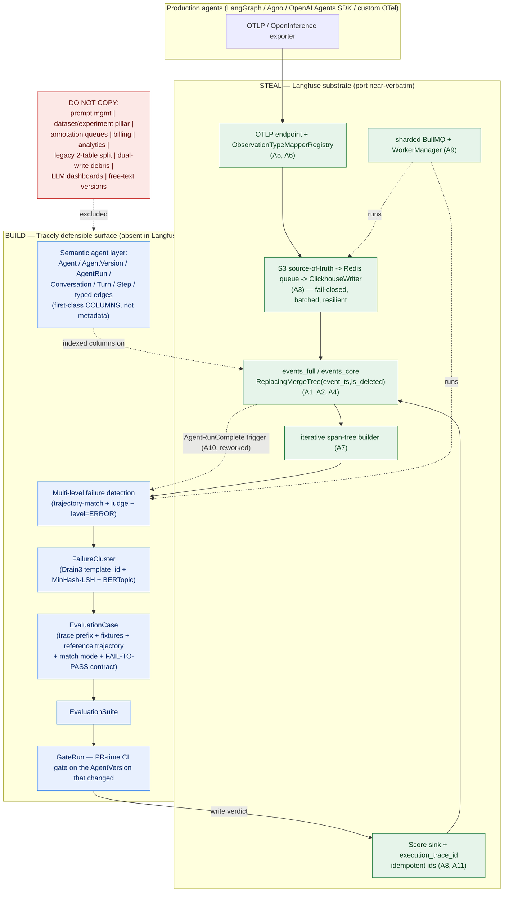

# 01 — "Steal Aggressively" and "Do Not Copy"

> **Purpose.** Part 1 scattered ~30 "Relevance to Tracely" notes across the reverse-engineering docs. This document consolidates and sharpens them into two opinionated, implementation-grade lists, so a founding engineer building V1 knows — at file:line precision — exactly which Langfuse machinery to port verbatim and which to leave on the floor.
>
> **The one-sentence thesis (proven by the rest of this doc):** Langfuse's *tracing + storage substrate* (wide OTel span table, S3-source-of-truth async write path, `ReplacingMergeTree` idempotency, the OpenInference/GenAI mapper registry, the span-tree builder, the self-tracing Score sink) is excellent and reusable almost verbatim; its *semantic agent layer + trace-first evaluation/CI* is essentially absent — agent/turn/step/conversation live only as strings-in-metadata, evaluation is dataset-first, and there is no CI gate — **and that absence is Tracely's defensible surface.**
>
> Conventions: canonical entities (Agent, AgentVersion, AgentRun, Trace, Conversation, Turn, Step, ToolCall, LLMCall, SubAgentCall, EvaluationSuite, EvaluationCase, FailureCluster, Score, GateRun) per the product vision. Citations are `file:line` into `/Users/julien/Documents/Repos/langfuse` (v3.177.1) or into `92-langfuse-verified-facts.md`. Author opinions are marked **[Synthesis]**.

---

## Part A — STEAL AGGRESSIVELY

Twelve mechanisms to port. For each: **(a)** what it is + Langfuse `file:line`; **(b)** why it is valuable; **(c)** exactly how Tracely uses it.

### A1. The wide, OTel-native `events_full` span table — the canonical store

**(a) What.** One immutable wide row **per span**, OTel-shaped, defined in `packages/shared/clickhouse/scripts/dev-tables.sh:137-281`. Identity columns `project_id, trace_id, span_id, parent_span_id` (`dev-tables.sh:139-143`); `is_app_root Bool` marks the root span (`:160`); microsecond `start_time DateTime64(6)` (`:144`). Trace-level attributes (`trace_name, user_id, session_id, tags, bookmarked, public, release`) are **denormalized onto every span row** (`:153-164`), so any span self-describes its trace. Tool calls are first-class columns: `tool_definitions Map(String,String)`, `tool_calls Array(String)`, `tool_call_names Array(String)` (`:189-193`; added to legacy via migration `0033`). Engine/layout: `ReplacingMergeTree(event_ts, is_deleted)`, `PARTITION BY toYYYYMM(start_time)`, `ORDER BY (project_id, toStartOfMinute(start_time), xxHash32(trace_id), span_id, start_time)`, `SAMPLE BY xxHash32(trace_id)` (`:268-273`). The in-code comment is explicit: *"We expect this to be fully immutable and eventually replace observations"* (`dev-tables.sh:132-134`).

**(b) Why.** The sort key `xxHash32(trace_id), span_id` **co-locates every span of a trace as a contiguous range** — reconstructing a full agent trajectory is one range scan, not a fan-out. The `parent_span_id` self-edge already encodes the trajectory DAG: a planner→executor edge, a handoff, a sub-agent call are all just parent links. Tool definitions/calls are queryable without JSON parsing (`has(tool_call_names, 'search')`). `SAMPLE BY` enables cheap approximate quality metrics over billions of spans. This is, structurally, the table Tracely would have designed.

**(c) How Tracely uses it.** This is **the** store. Adopt `events_full` near-verbatim and **add Tracely first-class semantic columns** (detailed in the schema sibling doc, but fixed here): `agent_id`, `agent_version_id`, `agent_run_id`, `conversation_id`, `turn_id`, `turn_index`, `step_id`, plus typed-edge columns — `tool_call_id` (linking an `LLMCall`'s tool-call request to the `ToolCall` span that executed it), and handoff `caller_agent_id`/`callee_agent_id` for `SubAgentCall`. These become low-cardinality indexed columns, **not** metadata strings — that single change is the core schema gap vs Langfuse (§B6). A `Trace` is the set of spans sharing `trace_id`; an `AgentRun` is the root span (`is_app_root = true`); a `Conversation` is the set of traces sharing `conversation_id` ordered by `turn_index`. The dataset `experiment_*` columns (`:204-216`) are **dropped** and **replaced** by *new* Tracely provenance columns — `evaluation_case_id` / `gate_run_id` / `failure_cluster_id` folded onto the span row — so a regression replay's result trace self-identifies (canonical §5 / doc 09: drop the `experiment_*` block, add the provenance columns; §B2 explains we keep the denormalization *trick*, not the dataset-run *columns or meaning*).

```sql
-- Tracely events_full = Langfuse events_full (dev-tables.sh:137-281) + these columns:
agent_id           LowCardinality(String),
agent_version_id   LowCardinality(String),
agent_run_id       String,
conversation_id    String,
turn_id            String,
turn_index         UInt32,
step_id            String,
tool_call_id       String,             -- typed edge: LLMCall tool-request  ->  ToolCall span
caller_agent_id    LowCardinality(String),  -- handoff edge (SubAgentCall)
callee_agent_id    LowCardinality(String),
INDEX idx_agent_run agent_run_id   TYPE bloom_filter(0.01) GRANULARITY 1,
INDEX idx_conv      conversation_id TYPE bloom_filter(0.01) GRANULARITY 1
-- keep ReplacingMergeTree(event_ts, is_deleted); extend ORDER BY prefix with agent_id if desired
```

### A2. `events_full` + `events_core` two-tier read split

**(a) What.** `events_core` (`dev-tables.sh:285-411`) is the **same schema** as `events_full` but with plain (uncompressed) `input`/`output`, populated automatically by a materialized view `events_core_mv` that truncates I/O and metadata values to 200 chars: `leftUTF8(input, 200)`, `arrayMap(v -> leftUTF8(v, 200), metadata_values)` (`:414-482`, verbatim in `92-langfuse-verified-facts.md:201`). Writes hit **only `events_full`**; the MV fills `events_core`. Reads default to `events_core` and **escalate to `events_full` only when full I/O/search is needed**: `event-query-builder.ts:851-854` returns `this.needsFullTable() ? "events_full" : "events_core"`. `events_core` carries extra query-tuned skip indexes the full table omits (`idx_provided_model_name`, `idx_experiment_id`, `idx_metadata_names`, `92-langfuse-verified-facts.md:197-199`).

**(b) Why.** Trace-list / dashboard / cluster-browse queries scan a fraction of the bytes; full I/O is paid for only on detail/replay. One write target, zero dual-write bookkeeping.

**(c) How.** Keep the split verbatim. Tracely's high-traffic surfaces (FailureCluster browser, GateRun list, trace search) read `events_core`; trajectory replay, RCA sub-trace reads, and judge inputs escalate to `events_full`. The 200-char truncation is also exactly the right granularity for cheap Drain3 template extraction and "find traces like this" (§A3 + the failure-clustering sibling).

### A3. The async write path: S3-source-of-truth → Redis queue → batched `ClickhouseWriter`

**(a) What.** Trace data is **never written synchronously**. Pipeline (`processEventBatch.ts:104`): validate + auth (Zod) → group by `eventBodyId` (key `${entityType}-${body.id}`, `:192-221`) → **blocking S3 PutObject, fail-closed**: if any upload rejects the whole batch throws and nothing is enqueued (`:268-272`) → enqueue **pointer-only** job (`{type, eventBodyId, fileKey, skipS3List, forwardToEventsTable}`, no bodies, `:329-335`) with a delay (`getDelay`, `:62-82`). The worker (`ingestionQueue.ts:29`) re-downloads all S3 blobs for the entity (concurrency `LANGFUSE_S3_CONCURRENT_READS`=50, `92-langfuse-verified-facts.md:1126`), read-then-merges against the current ClickHouse row, and hands off to `ClickhouseWriter` (`worker/src/services/ClickhouseWriter/index.ts`) — a **singleton in-memory buffer, one queue array per table**, flushed when a buffer hits `LANGFUSE_INGESTION_CLICKHOUSE_WRITE_BATCH_SIZE` **or** the interval timer fires. The writer is battle-hardened: fixed-100ms backoff retries (`index.ts:477-479`, `92-langfuse-verified-facts.md:1118`), **split-batch-in-half on JS string-length errors**, **truncate oversized fields** on CH "json object too large", `clampDecimal64Fields` on every record (`index.ts:280-354`). Server forces `async_insert=1, wait_for_async_insert=1` at the client level (`client.ts:203-204`).

**(b) Why.** The "blob first, never queue unless durable" rule (`:268-272`) makes ClickHouse a **rebuildable index over S3**. For Tracely this is load-bearing, not incidental: *if production traces are your regression corpus, you must be able to replay and recompute them* when an evaluator, a trajectory-match mode, or the schema changes. The batched writer absorbs ingestion spikes without backpressuring the API.

**(c) How.** Port the entire path verbatim — S3 PutObject fail-closed, pointer-only enqueue, worker read-then-merge, `ClickhouseWriter` batch buffer with all four resilience behaviors. **[Synthesis]** Promote two things Langfuse leaves as scripts/TODOs to first-class product surfaces, because *they are the product*: (1) "recompute evals/metrics/clusters over trace range X" as an API that replays from the S3 log (Langfuse has only `scripts/replayIngestionEvents/`); (2) a **reconciliation loop** that detects derived-store gaps and rebuilds from S3 — Langfuse drops rows after max attempts (`ClickhouseWriter/index.ts:516` TODO) and never auto-retries the ingestion failed-set, which for a CI/CD-gate product means **silent holes in regression coverage**. Add `agent_run` as a grouped entity type alongside trace/observation/score.

### A4. `ReplacingMergeTree(event_ts, is_deleted)` + `FINAL` / `LIMIT 1 BY` dedup discipline

**(a) What.** Every hot table uses `(Replicated)ReplacingMergeTree(event_ts, is_deleted)`: dedup by sort key keeping max `event_ts`, `is_deleted=1` = tombstone. Because RMT only dedups on background merges, reads use one of three strategies (`92-langfuse-verified-facts.md:429-435`): `FINAL` for correctness-critical single-row reads (`traces.ts:1295`); `ORDER BY event_ts DESC LIMIT 1 BY id, project_id` when skip-indexes must still fire (`observations.ts:69-77`, with the explicit comment *"skip FINAL → use skip indexes"* at `:1206`); and `argMaxIf(col, event_ts, predicate) GROUP BY` for read-time trace-level aggregation on the events tables (`event-query-builder.ts:442-480`). Root-span detection: `parent_span_id = '' OR is_app_root = true`.

**(b) Why.** Gives **upsert + soft-delete on an append-only OLAP store** with no `UPDATE` statements. Re-ingesting a span (latest `event_ts` wins) is idempotent — exactly what "replay a production trace as a regression test" needs, where the same span id is written repeatedly.

**(c) How.** Reuse verbatim for spans and for `Score`. **[Synthesis]** Adopt the deterministic-id discipline (§A11) so re-running a suite over the same fixtures produces the same row ids and RMT collapses them. Default Tracely reads to `LIMIT 1 BY span_id, project_id` (keeps bloom indexes live); reserve `FINAL` for the few correctness-critical single-trace fetches (replay, RCA).

### A5. The OTLP + OpenInference ingestion endpoint

**(a) What.** A dedicated OTLP/HTTP endpoint, `web/src/pages/api/public/otel/v1/traces/index.ts` — protobuf **and** JSON, gzip, content-type `application/x-protobuf` or `application/json`, **no gRPC** (`92-langfuse-verified-facts.md:497`). It does **no mapping inline**: raw `resourceSpans` are uploaded to S3 and an `OtelIngestionJob` is enqueued (sharding key `${projectId}-${fileKey}`, `:516`), keeping the edge cheap. `getDelay` gives OTel ingestion **zero artificial delay** (vs ~5s for the native API), except near UTC midnight (`:492`).

**(b) Why.** This is the framework-agnostic front door. Any OpenTelemetry-compatible producer — LangGraph, Agno, OpenAI Agents SDK, custom OTel — speaks OTLP. Building ingestion on this (not a proprietary SDK) is how Tracely stays agent-framework-agnostic, which the competitive landscape (`90-competitive-landscape.md:131`) flags as a key wedge.

**(c) How.** Port the OTLP edge verbatim. **[Synthesis]** Make **OTel-GenAI + OpenInference the *primary* contract**; treat any `tracely.*` attributes as optional sugar, not the main path (the inverse of Langfuse, which leans on its `langfuse.*` namespace — §B-note). The agent-identity columns from A1 are populated from OTel attributes during conversion.

### A6. The `ObservationTypeMapper` registry — the framework-agnostic adapter

**(a) What.** `ObservationTypeMapperRegistry` (`packages/shared/src/server/otel/ObservationTypeMapper.ts:165`) is a **priority-ordered chain of mappers** (lower number = higher priority; `sortedMappersCache` at `:455-456`) that resolves any span's semantic type from its attributes. Ten mappers, evaluated `(attributes, resourceAttributes, scope, spanName)` — OTLP numeric `SpanKind` is never consulted (`:462-484`); default when none fire is `"SPAN"` (`:483`). The chain (full table in `92-langfuse-verified-facts.md:585-600`): Priority 0 PythonSDK override → 1 `langfuse.observation.type` direct → 2 **OpenInference** `openinference.span.kind` → 3 OTel GenAI `gen_ai.operation.name` → 4 Genkit → 5/6 Vercel AI SDK → 7 GenAI tool-call → 8 LiveKit → 9 model-based fallback. It already normalizes LangGraph/Agno, Vercel `ai.*`, Pydantic-AI, Genkit, GCP ADK, LiveKit, and raw OTel GenAI into one type. The target enum has **10 values**: `SPAN, EVENT, GENERATION, AGENT, TOOL, CHAIN, RETRIEVER, EVALUATOR, EMBEDDING, GUARDRAIL` (`observations.ts:5-16`).

**(b) Why.** This is the single most valuable hard-won artifact in the codebase. It is years of accumulated framework-quirk handling. The type vocabulary maps almost 1:1 onto Tracely's entities: `AGENT/TOOL/CHAIN/RETRIEVER/GENERATION/EMBEDDING/GUARDRAIL/EVALUATOR` already cover most agent frameworks' span kinds.

**(c) How.** **Steal the whole registry.** Adopt the 10-value type enum as Tracely's `Step` kind taxonomy. **[Synthesis]** Add Tracely-specific high-priority mappers for what Langfuse can't yet express as first-class: a `SubAgentCall` detector (LangGraph handoff edges, OpenAI Agents SDK `handoff` spans, Agno team spans) that fills `caller_agent_id`/`callee_agent_id`, and a `Turn`-boundary detector keyed on `gen_ai.conversation.id` + message-role transitions. The registry's priority-chain shape makes adding these a localized change, not a rewrite.

### A7. The `parent_span_id` span tree + iterative tree-builder

**(a) What.** Trajectories are encoded by the `parent_span_id` self-edge. The read-time tree builder (`web/src/components/trace/lib/tree-building.ts`) is **fully iterative (no recursion) to avoid stack overflow on 10k+ deep trees** (`:5,17`: *"O(N) time, O(N) space — handles unlimited depth"*), **orphan-tolerant** (`cleanOrphanedParentReferences`, `:77`), computes depth via BFS (`:137-155`), and flattens via an explicit-stack pre-order traversal (`:12`).

**(b) Why.** Multi-agent / planner-executor / deep-recursion agent traces are exactly the deep, sometimes-orphaned trees this algorithm is built for. Proven at scale.

**(c) How.** Reuse the algorithm verbatim; enrich each `ProcessingNode` with Tracely's typed-edge info (tool_call linkage, handoff caller/callee, turn ordering) so the rendered/serialized tree *is* the trajectory object that EvaluationCases assert against. **[Synthesis]** The same flattened, ordered node stream is the input to trajectory-match (the `agentevals` taxonomy in `91-techniques-references.md:42-47`): a `Step`/`ToolCall` stream *is* the trajectory; a confirmed-good AgentRun *is* the reference trajectory.

### A8. The `Score` addressing model + `execution_trace_id` self-tracing evals

**(a) What.** `Score` is a flat per-row table (`0003_scores.up.sql`, full schema `92-langfuse-verified-facts.md:315-352`) keyed by `name`, where a row attaches to **exactly one** address: `trace_id` (whole-trace), `session_id` (session/conversation, migration `0012`), `observation_id` (single span), or `dataset_run_id` (`0017`) — nullable address fields, `definitions.ts:210-231`. Plus **`execution_trace_id Nullable(String)`** (migration `0030`): the trace of the LLM-judge call *itself*, so **evals are themselves traced**. `source ∈ {API, EVAL, ANNOTATION}` (`EVAL` internal-only); `data_type ∈ {NUMERIC, CATEGORICAL, BOOLEAN, CORRECTION, TEXT}`. Self-tracing uses a reserved environment prefix with an infinite-loop guard: `createEvalJobs` skips traces whose environment `startsWith("langfuse")` (`evalService.ts:243-253`), and `executionTraceId = createW3CTraceId(jobExecutionId)` is deterministic (`evalService.ts:860`).

**(b) Why.** A clean, multi-scope verdict sink that already supports trace/observation/session/run addressing and makes every eval auditable as a trace (you can debug a flaky judge by opening its execution trace). The infinite-loop guard is non-negotiable once your evals emit traces into the same store.

**(c) How.** Reuse `Score` as the **output sink** for all Tracely evaluation results, and **extend the addressing** to Tracely's scopes: a Score targets any of conversation/turn/step/tool/run/trace + `execution_trace_id` (per the EVAL decision). Keep `execution_trace_id` and the `langfuse-`-style reserved-environment infinite-loop guard verbatim (rename prefix to `tracely-`). **[Synthesis]** Add a `verdict ∈ {pass, fail, skip}` dimension alongside the numeric/categorical value — Langfuse's Score has no pass/fail (§B-gate), and GateRun semantics need it.

### A9. Sharded BullMQ + `WorkerManager` + the metric wrapper

**(a) What.** `QueueName` has 35 values (`queues.ts:324-361`); **9 are sharded** (`shardedQueueRegistry.ts:23-76`): the ingestion/OTel queues plus `TraceUpsert`, `EvaluationExecution`, `LLMAsJudgeExecution`, `CodeEvalExecution`. Shard index = `SHA-256(key) % shardCount`, **active only when `REDIS_CLUSTER_ENABLED`** else everything lands on shard 0 (`sharding.ts:9-20`, `ingestionQueue.ts:52-56`); sharding key `${projectId}-${eventBodyId}` (serializes per-entity processing). `WorkerManager.register` (`workerManager.ts:127`) creates one dedicated Redis connection per worker, wraps the processor in `metricWrapper` (`:41-110`, `:147`) which records request/failure/error rates, wait/processing time, queue length, DLQ length, and active gauges, attaches `failed`/`error` handlers, and guards idempotent registration via a static `workers` map (`:21`). Job payloads are Zod-validated discriminated schemas (`queues.ts`); retry-prone jobs carry `RetryBaggage {originalJobTimestamp, attempt}` (`:317-322`).

**(b) Why.** A clean, observable, horizontally-scalable async-worker framework with per-entity serialization (no two events for the same entity processed concurrently) and full queue-depth observability out of the box.

**(c) How.** Port `WorkerManager` + `metricWrapper` + the sharding helpers verbatim. Tracely's queues map directly: keep `IngestionQueue`/`OtelIngestionQueue`, **rename** `TraceUpsert` → `AgentRunComplete` as the eval trigger (§A10), and add `ReplayQueue`, `ClusteringQueue`, and `GateRunQueue` queues (canonical §4). Reuse the per-entity sharding key (extended to `${projectId}-${agentRunId}`) so an agent run's spans serialize.

### A10. The production-trace → eval trigger (`TraceUpsert`)

**(a) What.** After **every** trace upsert, the worker enqueues a `TraceUpsert` job (`IngestionService/index.ts:723-729`), gated by `hasNoEvalConfigsCache` (`:706`) so projects with no evaluators skip the work entirely. The consumer (`evalQueue.ts:25-44`) calls `createEvalJobs({sourceEventType: "trace-upsert", enforcedJobTimeScope: "NEW"})`, which fetches Postgres `JobConfiguration` rows, evaluates each config's `filter` + `sampling` against the trace, dedups, and schedules `EvaluationExecution` jobs (`evalService.ts:180-389`). Sampling: `if (Math.random() > sampling) continue` (`:621-629`).

**(b) Why.** Langfuse already fires evaluation **off production trace upserts, not off a dataset import** — this is the literal seed of Tracely's "production trace → regression test." The trigger plumbing (sharded queue, `hasNoEvalConfigsCache` short-circuit, filter + sampling targeting, retry baggage, dedup) is directly reusable.

**(c) How.** Reuse the trigger shell + the filter/sampling targeting verbatim, but **fan out at every trajectory level** instead of one trace-level hook. **[Synthesis]** On `AgentRunComplete`, Tracely (1) runs **failure detection** over the trajectory (level=ERROR spans, trajectory-match against a reference, judge rubrics) at conversation/turn/step/tool/agent scope; (2) routes detected failures into **FailureCluster** assignment (ingest-time Drain3 `template_id` + MinHash-LSH dedup); (3) selects candidate traces for regression-case promotion using the **same filter+sampling mechanism** Langfuse uses to scope evals (`evalService.ts:402-629`) — "capture traces matching X at rate Y" is exactly candidate selection. Replace the config-fetch-and-filter *core* (which targets one trace/observation) with trajectory-level detection; keep the *shell*.

### A11. Deterministic, idempotent score/verdict ids

**(a) What.** Eval score ids are `uuidv5(JSON.stringify(["eval-score", jobExecutionId, scoreName, occurrenceIndex]), NAMESPACE)` with a fixed `NAMESPACE` (`evalScoreIds.ts:1-38`, `92-langfuse-verified-facts.md:780`). Categorical evals emit one score row per match; boolean normalizes to `value = score ? 1 : 0`; `comment = outputResult.reasoning` (`evalService.ts:963-998`).

**(b) Why.** Re-running an eval over `ReplacingMergeTree` is idempotent — the same logical verdict gets the same id, so RMT collapses re-runs instead of accumulating duplicates. Tracely re-runs regression suites constantly (every PR), so idempotent verdict ids are mandatory, not optional.

**(c) How.** Reuse the uuidv5 formula verbatim, keyed on `(gate_run_id, evaluation_case_id, score_name, occurrence)`. Reuse `comment = reasoning` so every verdict stores the judge's chain-of-thought for auditability (the bias-mitigation requirement in `91-techniques-references.md:90`). Reuse the LLM-as-judge typed-output engine (`runLLMAsJudgeEvaluation`: mustache compile → Zod structured output → `{reasoning, score}` → normalized Score) essentially verbatim, extended with a `verdict` field.

### A12. The trace-as-synthetic-span trick + read-replica split + durable-payload-first

**(a) What.** Three smaller-but-load-bearing patterns. **(i) Trace-as-synthetic-span**: `convertTraceToStagingObservation` turns a trace into a span with `id = "t-${traceRecord.id}"`, `type = "SPAN"`, `parent_observation_id = undefined` (root), so a container and its children flow through one pipeline and live in one table (`definitions.ts:383-443`, `92-langfuse-verified-facts.md:26`). **(ii) Read-replica split**: `ClickHouseClientManager` routes reads to `CLICKHOUSE_READ_ONLY_URL` / `CLICKHOUSE_EVENTS_READ_ONLY_URL` via `preferredClickhouseService: "ReadOnly"` (`client.ts:109-125`; three logical services `ReadWrite`/`ReadOnly`/`EventsReadOnly`), keeping heavy dashboard reads off the write node. **(iii) Durable-payload-first**: every upsert writes full JSON to S3 *before* the row, with an optional synchronous `blob_storage_file_log` entry (`repositories/clickhouse.ts:155-205`).

**(b) Why.** (i) One pipeline, one table for root + children — Tracely's `AgentRun` (the root) lives alongside its `Step`s. (ii) Read/write isolation is how you keep a CI gate's heavy replay/aggregation reads from starving the ingestion write path. (iii) Reinforces "ClickHouse is a rebuildable index over S3," enabling re-derivation of every eval/cluster/regression-case without re-instrumenting.

**(c) How.** Reuse the `t-${id}` synthetic-root convention for `AgentRun` containers. Wire the read-replica split from day one (CI replays are read-heavy and bursty). Keep durable-payload-first as the foundation of the replay/recompute API (§A3c).

---

## Part B — DO NOT COPY

For each: what it is + why it is a distraction or wrong-altitude for an agent-first, trace-first product. The rule of thumb: if it serves *prompt management*, *dataset-first evaluation*, *observability dashboards*, or *cloud billing*, it is not Tracely's mission.

### B1. Prompt management (`PromptService`, `prompt_id/name/version` enrichment)

**What.** A full prompt registry: `prompt_id`, `prompt_name`, `prompt_version Nullable(UInt16)` columns on `events_full` (`dev-tables.sh`) and legacy observations; `PromptService` lookups in the merge path (`IngestionService/index.ts:1021-1054, 226-238`); experiments *require* a `promptId` from this registry (`experiments/server/router.ts:235-246`). **Why not.** Tracely is **explicitly not a prompt manager** (product vision). The "version under test" is an **AgentVersion**, decoupled from any prompt registry — you must be able to diff "agent v12 vs v13," which a prompt-id cannot express. **Action:** drop the prompt columns and `PromptService` lookups entirely; the three `prompt_*` columns are dead weight on the Tracely span row.

### B2. Dataset-first experiments (`dataset_run_items_rmt`, `ExperimentCreate`, the Dataset pillar)

**What.** The entire dataset→experiment model: `Dataset/DatasetItem(expected_output)/DatasetRuns/DatasetRunItems` Postgres pillar (`schema.prisma:586-683`); `dataset_run_items_rmt` ClickHouse table with denormalized run+item snapshots (`0024`, `92-langfuse-verified-facts.md:389-410`); `ExperimentCreate` queue (`queues.ts:341`); `createExperiment` builds a `DatasetRuns` (`experiments/server/router.ts:248-260`); comparison is "average score of prompt/model version on a fixed dataset" (`runsByDatasetIdMetrics`, `dataset-router.ts:560-607`). **Why not.** This is the **dataset-first mental model the entire market has converged on and that Tracely explicitly rejects** (`90-competitive-landscape.md:7`). The unit of truth is a curated `(input, expected_output)` corpus authored up front; Tracely **inverts** this — the production trace *is* the test case, and golden references are *derived* from a captured-and-confirmed trace, not authored. **Action:** do **not** build a Dataset/Experiment surface. The denormalization *trick* (folding run context into the row) is reusable (§A1c); the *role* is not. The one salvageable hook — `DatasetItem.sourceTraceId` (`schema.prisma:617`) — is manual-only ("add to dataset"); Tracely replaces it with an **automatic failure-cluster → EvaluationCase promotion** pipeline. **[Synthesis]** If a "dataset" exists in Tracely at all, it is just a *materialized set of production-derived EvaluationCases*; an "experiment" becomes "run AgentVersion N against the EvaluationSuite," not "run prompt P against dataset D."

### B3. Annotation queues as a core surface

**What.** `AnnotationQueue` / `AnnotationQueueItem` Postgres models with object types `TRACE | OBSERVATION | SESSION`, status `PENDING | COMPLETED`, locking, and `Score.queueId` linkage (`schema.prisma:507-573`, `92-langfuse-verified-facts.md:1057-1071`). **Why not.** Human annotation queues are an **observability/labeling surface**, not the trace→regression→gate spine. Tracely's human-in-the-loop need is narrower and different: confirming/naming a **FailureCluster** and approving a candidate **EvaluationCase** for promotion (the open/axial-coding step, `91-techniques-references.md:151-156`). **Action:** do not port `AnnotationQueue` as a general surface. Build a focused **cluster-review / case-promotion** UI instead. (The `Score.source = ANNOTATION` value can stay as a verdict provenance tag; the *queue machinery* should not.)

### B4. Billing / metering / spend-alert queues

**What.** Cloud-only queues: `CloudUsageMeteringQueue`, `CloudSpendAlertQueue`, `CloudFreeTierUsageThresholdQueue`, `MeteringDataPostgresExportQueue` (`queues.ts`), Stripe wiring (`worker/src/app.ts:390-452`). **Why not.** Pure SaaS commercial plumbing — orthogonal to "production trace → regression test → CI gate." **Action:** omit entirely from V1.

### B5. PostHog / Mixpanel product analytics integrations

**What.** `PostHogIntegrationQueue`/`...ProcessingQueue`, `MixpanelIntegrationQueue`/`...ProcessingQueue`, `BlobStorageIntegrationQueue` (`queues.ts`, `92-langfuse-verified-facts.md:1180-1186`). **Why not.** Product-analytics export is observability adjacency, not the spine. **Action:** omit from V1. (A webhook/GitHub-status integration *is* in scope, but that is the GateRun → PR surface, not analytics export.)

### B6. The legacy `traces` + `observations` two-table split

**What.** The original model: a `traces` table (`0001`) + a separate `observations` table (`0002`) joined at read time, with trace-level attributes living only on the `traces` row and agent/turn/step reconstructed from `metadata[langgraph_node]` / `metadata[langgraph_step]` at query time (`traces.ts:1588`, `:1633`). **Why not.** It is the pre-`events_full` design, and it forces a join + a read-time reconstruction of exactly the semantic structure (agent/turn/step) that Tracely needs to be **first-class and indexed**. Critically, in Langfuse **agent/turn/step are strings-in-metadata reconstructed at read time** — *this is the core gap vs Langfuse* (per the SPAN MODEL decision). **Action:** **start ONLY on the `events_full` model** (A1). Skip the legacy split entirely; do not create `traces`/`observations` tables. Tracely's agent-identity columns make the read-time reconstruction unnecessary.

### B7. The in-progress dual-write migration baggage

**What.** Langfuse is mid-migration *from* the two-table model *to* `events_full`, leaving transitional debris: `observations_batch_staging` (3-minute partitions, 12h TTL, used to batch traces→events, `dev-tables.sh:81-130`); a vestigial `TracesNull` writer queue whose target table was **dropped** (`0028`/`0029`, `ClickhouseWriter/index.ts:51,607`); the abandoned `traces_null` + three `AggregatingMergeTree` rollups (`0023`, dropped) — an **anti-pattern** they tried and reverted (`03-database-clickhouse.md:321`); `forwardToEventsTable` / `LANGFUSE_EXPERIMENT_INSERT_INTO_EVENTS_TABLE` env gates; `EventPropagationQueue` (default off). **Why not.** This is migration scaffolding for a transition Tracely never makes — it starts on `events_full`. Copying it imports dead complexity. **Action:** **skip all of it.** No `observations_batch_staging`, no `traces_null`, no AMT rollups, no dual-write gates, no `EventPropagationQueue`. **[Synthesis]** Heed the explicit lesson: *don't pre-aggregate the trace via AggregatingMergeTree* — keep events flat and aggregate at read time (`argMaxIf` / `LIMIT 1 BY`) or via `events_core`. The one staging *pattern* worth remembering (micro-partition + whole-partition-drop TTL, `ttl_only_drop_parts=1`) is a generic technique, not something to wire into the trace path.

### B8. Generic "LLM dashboards" / "Datadog-for-LLMs" framing

**What.** `analytics_*` plain VIEWs (counts / hasX per hour), the dropped `project_environments` AMT, and the broad observability-dashboard surface (`03-database-clickhouse.md:541`). **Why not.** "Datadog for LLMs" is precisely the framing the product vision rejects ("Think GitHub Actions + Langfuse + Agent Testing, NOT Datadog for LLMs"). Token-count / cost / pricing-tier enrichment (`getGenerationUsage`, `calculateUsageCosts`, `findModel`, Decimal64 clamping, `05-ingestion-pipeline.md:381`) serves observability + billing, not regression. **Action:** do **not** build usage dashboards as a core surface. Keep cost/usage as **optional derived metrics**, computed lazily, never on the ingest hot path. The cost-map columns can stay on the schema (cheap), but the enrichment pipeline and the dashboards are out of scope. (Usage *canonicalization* — vendor-spelling folding + cached-token subtraction, `92-langfuse-verified-facts.md:641-650` — is reusable as a small library if needed, decoupled from a price book.)

### B9. Free-text version / release strings as the versioning story

**What.** `version String` and `release String` columns on every span (`events_full`, `dev-tables.sh`), set from `langfuse.version` / `langfuse.release` OTel attributes — free-text, with no entity behind them. In Langfuse "version" is a string on trace/observation and there is **no Agent/AgentVersion entity** (`06-tracing-model.md:396`). **Why not.** A free-text version string cannot be diffed, cannot anchor a FAIL-TO-PASS contract ("must fail on the version that produced the failure, pass on the fix"), and cannot gate a PR. The whole CI thesis requires a **real `AgentVersion` entity**. **Action:** keep `version`/`release` as optional free-text *metadata* for compatibility, but make **`agent_version_id` (FK to a Postgres `AgentVersion` registry) the load-bearing versioning axis**. EvaluationCase provenance (`agent_version_first_failed`) and GateRun ("does AgentVersion N+1 pass the suite that AgentVersion N failed?") reference the entity, never the string.

---

## Coherence map — Langfuse mechanism → Tracely entity/decision

| Langfuse mechanism (file:line) | Verdict | Tracely entity / use |
|---|---|---|
| `events_full` wide span table (`dev-tables.sh:137-281`) | **STEAL** | Canonical store for Trace/Step/ToolCall/LLMCall/SubAgentCall + agent-identity columns |
| `events_core` + truncating MV (`dev-tables.sh:285-482`) | **STEAL** | Default read tier; escalate to `events_full` for replay/judge |
| S3-first async write path (`processEventBatch.ts:104-347`) | **STEAL** | Ingest spine + replay/recompute API + reconciliation loop |
| `ReplacingMergeTree`+`FINAL`/`LIMIT 1 BY` (`92-...:429-435`) | **STEAL** | Idempotent span/Score upserts under constant suite re-runs |
| OTLP endpoint (`otel/v1/traces:79-187`) | **STEAL** | Framework-agnostic front door (OTel-GenAI/OpenInference primary) |
| `ObservationTypeMapperRegistry` (`ObservationTypeMapper.ts:165`) | **STEAL** | Step-kind taxonomy + add SubAgentCall/Turn mappers |
| Iterative span-tree builder (`tree-building.ts:5-181`) | **STEAL** | Trajectory object for EvaluationCase assertions |
| `Score` addressing + `execution_trace_id` (`0030`, `definitions.ts:210-231`) | **STEAL** | Multi-scope verdict sink; self-tracing evals; add `verdict` |
| Sharded BullMQ + `WorkerManager` (`workerManager.ts:127`) | **STEAL** | Ingestion + ReplayQueue + ClusteringQueue + GateRunQueue (canonical §4) |
| `TraceUpsert` eval trigger (`IngestionService:723-729`) | **STEAL (rework core)** | `AgentRunComplete` → multi-level failure detection + candidate selection |
| Deterministic score ids (`evalScoreIds.ts:1-38`) | **STEAL** | Idempotent GateRun verdicts; reasoning-as-comment |
| Trace-as-synthetic-span / read-replica / blob-first (`definitions.ts:383`, `client.ts:109-125`) | **STEAL** | AgentRun root container; CI read isolation; rebuildable index |
| Prompt management (`PromptService`, `prompt_*`) | **DO NOT COPY** | — (drop columns + lookups) |
| Dataset/Experiment pillar (`schema.prisma:586-683`, `dataset_run_items_rmt`) | **DO NOT COPY** | Replaced by FailureCluster → EvaluationCase promotion |
| Annotation queues (`schema.prisma:507-573`) | **DO NOT COPY** | Replaced by cluster-review / case-promotion UI |
| Billing/metering/spend (`app.ts:390-452`) | **DO NOT COPY** | — (omit V1) |
| PostHog/Mixpanel (`queues.ts:1180-1186`) | **DO NOT COPY** | — (omit V1) |
| Legacy `traces`+`observations` split (`0001`,`0002`) | **DO NOT COPY** | Start ONLY on `events_full` |
| Dual-write migration debris (`traces_null`, AMT, `0023/28/29`) | **DO NOT COPY** | Skip; aggregate at read time |
| "Datadog-for-LLMs" dashboards / cost enrichment (`analytics_*`) | **DO NOT COPY** | Cost = optional derived metric, off hot path |
| Free-text `version`/`release` strings | **DO NOT COPY** | `agent_version_id` FK is the versioning axis |

---

## Diagram — the boundary: substrate to reuse vs. the layer Tracely builds



---

## Thesis

Langfuse's tracing and storage substrate is, line for line, the best open-source starting point for Tracely: the wide OTel-shaped `events_full` table already makes the trajectory explicit in `parent_span_id` and co-locates a whole run for cheap reads; the S3-source-of-truth → Redis-queue → batched-`ClickhouseWriter` write path is precisely the durable, replayable ingest a regression-from-production product requires; `ReplacingMergeTree(event_ts, is_deleted)` + `FINAL`/`LIMIT 1 BY` gives idempotent upserts under constant suite re-runs; the `ObservationTypeMapperRegistry`, the orphan-tolerant 10k-deep span-tree builder, and the self-tracing `Score` sink are years of hard-won, framework-agnostic engineering we should port near-verbatim. **What Langfuse does not have — and cannot cheaply pivot to — is the semantic agent layer and the trace-first evaluation/CI spine: Agent/AgentVersion/AgentRun/Conversation/Turn/Step are strings-in-metadata reconstructed at read time, evaluation is dataset-first and single-object, versioning is a free-text string, and there is no failure clustering, no production→regression promotion, and no PR gate.** Tracely's bet is to build exactly that missing layer — first-class agent entities as indexed columns on a Langfuse-grade span store, multi-level trajectory failure detection, automatic clustering into EvaluationCases, and a FAIL-TO-PASS GateRun that blocks the pull request changing an AgentVersion — on top of a substrate we steal aggressively and a pile of prompt/dataset/billing/dashboard machinery we deliberately do not copy.
