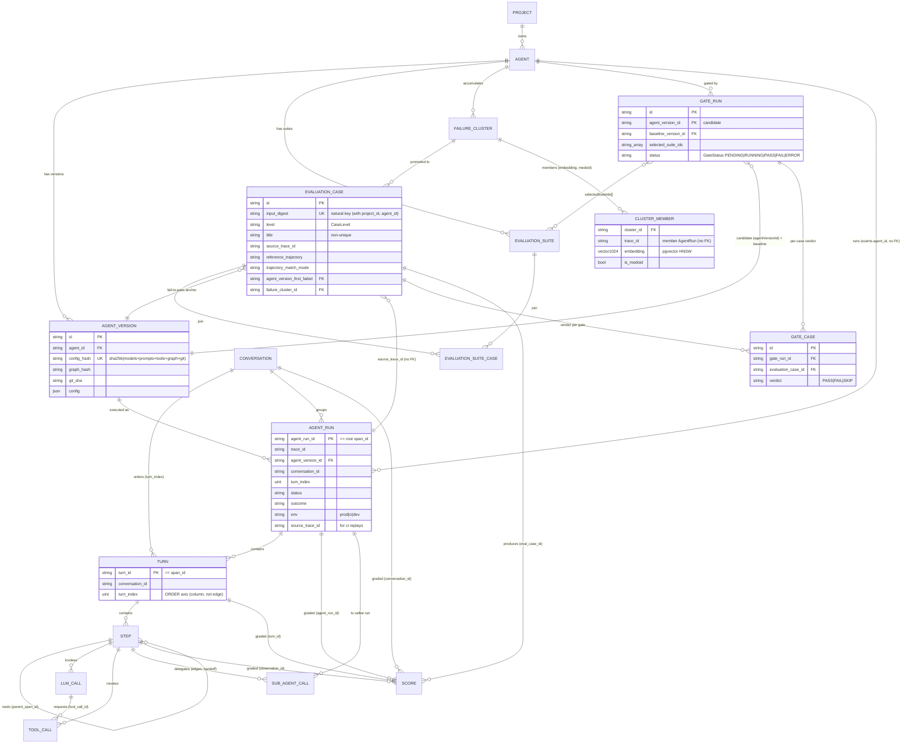
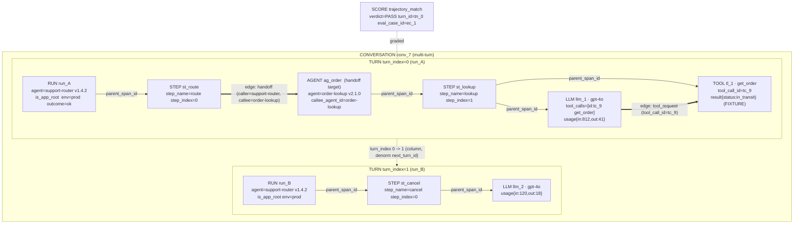

# Tracely — Doc 03: Agent Data Model + Trace Data Model (FOUNDATION)

> This is the **foundation document**. Doc 09 (DB schema) builds directly on the field lists, edge decisions, and column choices made here; doc 04 (eval model), doc 05 (failure clustering), and doc 06 (CI gate) all address the entities defined here. Every entity name, column name, and OTel attribute name in this doc is **canonical and load-bearing** — siblings must reuse them verbatim.
>
> **Thesis recap.** The trace is the source of truth. Tracely's wedge over Langfuse is a **first-class agent + trajectory entity layer** sitting on a Langfuse-grade wide span store. In Langfuse, `Agent`/`Conversation`/`Turn`/`Step` live only as `metadata['langgraph_node']` / `metadata['langgraph_step']` strings reconstructed at read time (verified: `traces.ts:1572` `getAgentGraphData`, facts §sdk-frontend). Tracely makes them **columns and edges**, so a trajectory can be named, versioned, diffed, and asserted on — which is what "production trace → regression test → CI gate" requires.
>
> **Storage substrate (shared by all docs).** ONE wide immutable OTel-shaped span table modeled on Langfuse `events_full` (`ReplacingMergeTree(event_ts, is_deleted)` + `FINAL`/`LIMIT 1 BY` reads), Postgres for OLTP registry, ClickHouse for OLAP spans + scores, pgvector for clustering embeddings, S3 for raw blobs + replay fixtures. We **reuse `events_full` almost verbatim** (facts §data-model `dev-tables.sh:137-281`) and **add a small, fixed set of Tracely semantic columns + one typed-edge table**.

---

## 0. Reading guide & the two-layer split

Tracely has **two storage layers**, and the central design decision of this doc is *which entity lives in which layer*:

| Layer | Store | Holds | Why |
|---|---|---|---|
| **Registry (OLTP)** | Postgres (Prisma) | `Agent`, `AgentVersion`, `EvaluationSuite`, `EvaluationCase`, `FailureCluster`, `GateRun` | Low cardinality, mutable, relational, FK-enforced, transactionally updated by the web app and CI. These are *config and curated artifacts*, not telemetry. |
| **Telemetry (OLAP)** | ClickHouse `events` (wide span table) + `scores` + `edges` | `AgentRun`, `Conversation`, `Turn`, `Step`, `ToolCall`, `LLMCall`, `SubAgentCall`, `Score` | High cardinality, append-mostly, immutable-per-version, OTel-shaped. These *are* the trace. |

[Synthesis] The split mirrors Langfuse exactly: Langfuse keeps `Dataset`/`EvalTemplate`/`JobConfiguration` in Postgres (facts §eval-dataset `schema.prisma`) and traces/observations/scores in ClickHouse. We keep the same split and add `Agent`/`AgentVersion`/`FailureCluster`/`EvaluationSuite`/`EvaluationCase`/`GateRun` to Postgres, and `AgentRun`/`Conversation`/`Turn`/`Step`/`ToolCall`/`LLMCall`/`SubAgentCall` as **typed projections of span rows** in ClickHouse.

The critical consequence: **`AgentRun`, `Turn`, `Step`, `ToolCall`, `LLMCall`, `SubAgentCall` are NOT separate ClickHouse tables.** They are all rows in the single wide `events` span table, distinguished by `span_kind` + the Tracely semantic columns (`agent_run_id`, `turn_id`, `step_id`, …). `Conversation` is the only telemetry entity that is *also* a thin Postgres shell (like Langfuse `trace_sessions`), because it needs mutable curation state (bookmark, label) but its content is purely aggregated spans.

---

# PART A — Agent Data Model

Each entity below: **purpose · identity/keys · full field list with types · relationships · lifecycle · Langfuse contrast** (PRESENT / DERIVED / ABSENT, per doc 06 §8.4).

Conventions: Postgres types are Prisma; `cuid()` for registry PKs; ClickHouse IDs are W3C-style hex (`trace_id` 32-hex, `span_id` 16-hex) to stay OTel-native. `project_id` scopes everything (multi-tenant), exactly as Langfuse (`events_full.project_id` is the first PK column, facts §data-model).

---

## A1. Agent

**Purpose.** The stable, human-named unit of *a thing under test*. "support-router", "research-supervisor", "sql-executor". An Agent is the GitHub-repo-equivalent: long-lived, owns a version history, owns evaluation suites, accumulates failure clusters. CI gates are scoped to an Agent.

**Identity / keys.** PK `id` (cuid). Natural key `@@unique([projectId, slug])` — `slug` is the stable handle the SDK sends on the wire (`tracely.agent.id`). One Agent per logical agent *or* per multi-agent system root (a supervisor and its sub-agents may each be Agents; see A9 SubAgentCall for how cross-Agent edges are typed).

**Fields.**

```prisma
model Agent {
  id            String   @id @default(cuid())
  projectId     String   @map("project_id")
  slug          String                                  // wire id: tracely.agent.id (e.g. "support-router")
  displayName   String   @map("display_name")
  description   String?
  kind          AgentKind @default(SINGLE)              // topology: SINGLE | MULTI_AGENT | WORKFLOW
  role          AgentRole @default(GENERIC)             // role in a multi-agent system (separate from kind); impact analysis branches on role===SUPERVISOR (doc 06)
  framework     String?                                 // "langgraph" | "agno" | "openai-agents" | "custom" | ...
  defaultEnv    String   @default("prod") @map("default_env")
  currentVersionId String? @map("current_version_id")  // FK -> AgentVersion.id; the "live" version
  archived      Boolean  @default(false)
  metadata      Json?
  createdAt     DateTime @default(now()) @map("created_at")
  updatedAt     DateTime @updatedAt @map("updated_at")
  @@unique([projectId, slug])
  @@index([projectId, archived])
}
enum AgentKind { SINGLE MULTI_AGENT WORKFLOW }      // topology / shape of the system
enum AgentRole { SUPERVISOR WORKER PLANNER EXECUTOR GENERIC }  // role within a multi-agent system (separate axis from kind)
```

**Relationships.** `Agent 1──N AgentVersion`; `Agent 1──N EvaluationSuite`; `Agent 1──N FailureCluster`; `Agent 1──N GateRun`; `Agent 1──N AgentRun` (the latter is the join `events.agent_id → Agent.id`, no DB FK because runs live in ClickHouse — same no-FK pattern as Langfuse `JobExecution.jobInputTraceId`, facts §eval-dataset `schema.prisma:913`).

**Lifecycle.** Created on first ingest of a span carrying an unseen `tracely.agent.id` (auto-registration, worker upsert), or explicitly via API/UI. `currentVersionId` advances as new `AgentVersion`s are produced by CI. Soft-archived, never hard-deleted (so historical runs keep resolving).

**Langfuse contrast: ABSENT.** Langfuse has no Agent entity; "agent" is inferred from span name / `AGENT` type / `metadata['langgraph_node']` (doc 06 §8.2, verified `observations.ts:9`).

---

## A2. AgentVersion

**Purpose.** THE entity CI gates. An **immutable, content-addressed configuration snapshot** of an agent at a point in time: model(s) + prompt refs + tool schemas + agent-graph topology + git sha. Two runs with the same `config_hash` are the same agent. A PR that changes any of these produces a new `AgentVersion`; the gate asserts "the regression suite that failed on version A passes on version B".

**Identity / keys.** PK `id` (cuid). Content key `@@unique([agentId, configHash])` — `configHash` is a deterministic SHA-256 over the *normalized* config (see below). Also carries a human `label` (e.g. `v1.4.2` or the git short-sha) and `gitSha`.

**`configHash` definition.** [Synthesis] The hash is the spine of the gate, so it must be deterministic and exclude noise:

```ts
// hashable config snapshot — order-normalized, whitespace-stripped, then sha256
interface AgentVersionConfig {
  models:       Record<string /*role*/, { provider: string; model: string; params: Record<string, unknown> }>;
  prompts:      Array<{ ref: string; sha256: string }>;      // prompt content hashes, not bodies
  tools:        Array<{ name: string; schemaSha256: string }>; // tool JSON-schema hashes, sorted by name
  graphHash:    string;   // sha256 of the agent-graph topology (nodes + typed edges); see A2.graph
  framework:    string;
  schemaVersion: number;  // bump => all hashes recompute (migration safety)
}
// configHash = sha256(canonicalJson(sortDeep(config)))   // RFC8785-style canonical JSON
```

`graphHash` captures multi-agent topology: the set of `(node, kind)` plus typed edges `(caller, callee, edge_type)` (handoff/delegation/tool), sorted. Reordering parallel branches that are genuinely parallel must NOT change `graphHash` (sort by node id), but adding/removing a sub-agent or a tool MUST. This is what makes the gate fire on the right PRs.

**Fields.**

```prisma
model AgentVersion {
  id          String   @id @default(cuid())
  projectId   String   @map("project_id")
  agentId     String   @map("agent_id")              // FK -> Agent.id
  configHash  String   @map("config_hash")           // sha256 — the content address
  label       String?                                 // "v1.4.2" / git short sha / SDK-supplied
  gitSha      String?  @map("git_sha")
  gitRef      String?  @map("git_ref")               // branch/tag for the gate's context
  config      Json                                    // the full AgentVersionConfig (above)
  graphHash   String   @map("graph_hash")            // duplicated out for cheap topology diffing
  modelsSummary String? @map("models_summary")       // denormalized "gpt-4o,claude-3-5" for UI
  createdAt   DateTime @default(now()) @map("created_at")
  firstSeenAt DateTime @default(now()) @map("first_seen_at")  // first prod run on this version
  // NO updatedAt — versions are immutable
  @@unique([agentId, configHash])
  @@index([projectId, agentId, createdAt])
  @@index([projectId, gitSha])
}
```

**Relationships.** `AgentVersion N──1 Agent`; `AgentVersion 1──N AgentRun` (`events.agent_version_id → AgentVersion.id`); referenced by `EvaluationCase.agentVersionFirstFailed` and by `GateRun.agentVersionId` / `baselineVersionId`. The FAIL-TO-PASS contract (doc 04) binds an `EvaluationCase` to the `AgentVersion` it must fail on.

**Lifecycle.** Created at ingest time when a span carries an unseen `(agent_id, tracely.agent.version | config_hash)` pair, or explicitly registered by CI *before* a deploy (preferred: CI computes `configHash` from the repo and POSTs the version, so the gate can run pre-merge against recorded fixtures). Immutable once created. `firstSeenAt` is set on first prod `AgentRun`.

**Langfuse contrast: ABSENT as entity.** Langfuse's `trace.version` / `observation.version` is a free-text string with no lineage, no hash, no graph, no git linkage (doc 06 §8.4, verified). This is the single biggest gap Tracely closes: **a content-addressed, gate-able version**.

---

## A3. AgentRun

**Purpose.** ONE execution of an agent — the **trace root** (`is_app_root` span). Carries status/outcome/cost/latency/env. This is the atomic unit of production telemetry and the thing a regression test is *derived from* (the captured trace) and *replayed as* (a new run in `env=ci`).

**Identity / keys.** A `AgentRun` **is a span row** in the wide `events` table where `is_app_root = true`. Its identity is `(project_id, trace_id, agent_run_id)` where `agent_run_id == span_id` of that root span. We surface a registry-free view; **AgentRun is ClickHouse-only — there is NO Postgres `AgentRun` model** (it lives in ClickHouse, exactly as Langfuse traces do; canonical: 00-canonical-decisions.md). Run-level facts are read-time aggregates over spans: attributes are read off the root span via `argMaxIf(col, event_ts, parent_span_id = '')` (the Langfuse root-attr read pattern, facts §data-model `event-query-builder.ts:442-480`).

**Fields** (all are columns on the root span row in `events`; see Part B for the full column catalog):

| Field | Type (CH) | Source / meaning |
|---|---|---|
| `agent_run_id` | `String` | == root `span_id`; OTel `trace_id` ≈ run, but we name the root span explicitly |
| `trace_id` | `String` | W3C 32-hex; groups all spans of the run |
| `agent_id` | `String` | FK→Agent.slug-resolved id; from `tracely.agent.id` |
| `agent_version_id` | `String` | FK→AgentVersion.id; from `tracely.agent.version`/`config_hash` |
| `conversation_id` | `String` | from `gen_ai.conversation.id` / `tracely.conversation.id`; '' if single-shot |
| `turn_index` | `UInt32` | which turn of the conversation this run realized (0 for single-turn) |
| `status` | `LowCardinality(String)` | `running \| succeeded \| failed \| errored \| cancelled` |
| `outcome` | `LowCardinality(String)` | semantic verdict: `ok \| task_incomplete \| wrong_answer \| tool_error \| timeout \| guardrail_block` (derived by failure detection, doc 05) |
| `env` | `LowCardinality(String)` | the gating axis `prod \| staging \| ci \| dev` — a **distinct Tracely enum column** (default `prod`); Langfuse free-string `environment` is also kept for OTel compat (canonical: 00-canonical-decisions.md §3, §5) |
| `start_time` / `end_time` | `DateTime64(6)` | run wall-clock |
| `latency_ms` | `UInt64` (derived) | `end_time - start_time` |
| `total_cost` | `Decimal(18,12)` ALIAS | reuses Langfuse `cost_details['total']` aggregation |
| `error_type` | `String` | first-failing-step error class (doc 05 RCA) |
| `first_failing_span_id` | `String` | localized root-cause span (doc 05); '' if none |
| `source_trace_id` | `String` | for CI replays: the prod trace this run reproduces; '' for prod |

**Relationships.** `AgentRun N──1 AgentVersion`; `AgentRun N──1 Conversation` (via `conversation_id`); `AgentRun 1──N Turn` (usually 1; a run realizes exactly one turn in the common case, but a single autonomous run can span multiple turns — see A5); `AgentRun 1──N Step/ToolCall/LLMCall/SubAgentCall` (its descendant spans, by `parent_span_id` within `trace_id`). `Score` can target the run (`agent_run_id`).

**Lifecycle.** `running` on first span ingest → `succeeded`/`failed`/`errored` when the root span closes (end_time set) → `outcome` enriched asynchronously by the failure-detection worker (doc 05). Immutable spans, but run-level mutable status uses the `ReplacingMergeTree` upsert path (read-then-merge, set new `event_ts`) — verified Langfuse update mechanism (facts §ingestion-otel async write-path).

**Langfuse contrast: PARTIAL.** A Langfuse `Trace` ≈ an AgentRun, and `is_app_root` exists (doc 06 §8.3, `dev-tables.sh:160`). But Langfuse has **no run status, no outcome, no version FK, no env-typed prod/ci/dev semantics for replay**. Tracely adds `agent_run_id`, `agent_version_id`, `status`, `outcome`, `source_trace_id` as first-class columns.

---

## A4. Conversation

**Purpose.** The multi-turn container: an ordered sequence of `Turn`s sharing a `conversation_id`. Maps to a chat thread / session. The unit at which *conversation-level* regression tests assert (e.g. "across these 5 turns the agent never re-asks for the order id").

**Identity / keys.** ClickHouse: `conversation_id` (`String`, from `gen_ai.conversation.id`). Postgres: a thin shell `Conversation` row keyed `@@id([id, projectId])` holding only curation state — directly modeled on Langfuse `trace_sessions` (doc 06 §7, verified `schema.prisma:312`).

**Fields.**

```prisma
model Conversation {              // thin shell, like Langfuse trace_sessions
  id          String              // == conversation_id on the wire
  projectId   String   @map("project_id")
  agentId     String?  @map("agent_id")     // the primary agent of the conversation
  env         String   @default("prod")
  bookmarked  Boolean  @default(false)
  public      Boolean  @default(false)
  label       String?                        // human label for curated conversations
  createdAt   DateTime @default(now()) @map("created_at")
  @@id([id, projectId])
  @@index([projectId, agentId])
}
```

Aggregate fields (turn count, total cost, duration, last outcome) are **computed at query time** from member runs/turns — NOT stored — exactly as Langfuse computes session metrics (doc 06 §7).

**Relationships.** `Conversation 1──N Turn`; `Conversation 1──N AgentRun`. `Score` can target a conversation (`conversation_id`).

**Lifecycle.** Shell row lazily created on first turn with a new `conversation_id`. Curation flags set in UI.

**Langfuse contrast: ABSENT (only a shared key).** Langfuse "Session" is a string + a 5-field shell; **no turn list, no ordering, no conversation structure** (doc 06 §7, verified). Tracely adds explicit `Turn` ordering (A5) so multi-turn is a real, assertable structure.

---

## A5. Turn

**Purpose.** One user-input → agent-response cycle within a Conversation. The boundary for *turn-level* trajectory regression ("on turn 3, given this user message and this prior context, the agent must call `lookup_order` before answering"). The bridge between conversational evals and the trajectory inside a single response.

**Identity / keys.** A Turn is a **span row** (`span_kind = TURN`) — or, when a framework doesn't emit an explicit turn span, a **synthesized grouping** keyed `turn_id = uuidv5(conversation_id + ":" + turn_index)`. Identity `(project_id, conversation_id, turn_id)`, ordered by `turn_index`.

**Decision: Turn ordering is stored as a column, not an edge.** `turn_index UInt32` (monotonic per conversation). [Synthesis] Justification: turn ordering is a *total order on a single axis* (time within one conversation), which a dense integer column expresses perfectly and indexes/sorts cheaply (`ORDER BY conversation_id, turn_index`). An edge table would add a join for zero expressive gain. Contrast handoffs (A9), which are a *many-to-many typed graph* and DO warrant an edge table. We additionally store `prev_turn_id`/`next_turn_id` as denormalized String columns for O(1) neighbor lookup without a self-join — but `turn_index` is the source of truth.

**Fields** (columns on the TURN span row):

| Field | Type | Meaning |
|---|---|---|
| `turn_id` | `String` | == span_id of the TURN span, or synthesized uuidv5 |
| `conversation_id` | `String` | parent conversation |
| `turn_index` | `UInt32` | **0-based monotonic order within the conversation** |
| `prev_turn_id` / `next_turn_id` | `String` | denormalized neighbors (derived; '' at ends) |
| `agent_run_id` | `String` | the run that produced this turn (1:1 in common case) |
| `role` | `LowCardinality(String)` | `user \| agent \| system` (turn initiator) |
| `input` / `output` | `String CODEC(ZSTD(3))` | the user message in / agent message out for the turn |
| `status` / `outcome` | `LowCardinality(String)` | same vocab as AgentRun, scoped to the turn |
| `start_time` / `end_time` | `DateTime64(6)` | turn timing |

**Relationships.** `Turn N──1 Conversation`; `Turn N──1 AgentRun` (a run may contain ≥1 turn if the agent autonomously continues; typically 1); `Turn 1──N Step/ToolCall/LLMCall/SubAgentCall` (descendant spans whose `turn_id == this.turn_id`). `Score` targets a turn (`turn_id`).

**Lifecycle.** Emitted by SDK (preferred) or synthesized by the ingest worker by grouping a run's spans under the run's `turn_index`. Immutable.

**Langfuse contrast: ABSENT.** "Multi-turn = multiple traces sharing `session_id`, with no ordering, no turn boundaries" (doc 06 §8.4, verified). Tracely's `turn_id` + `turn_index` is net-new.

---

## A6. Step

**Purpose.** A logical unit of agent work within a turn — a planner node, a reasoning step, a graph node execution. The generic non-leaf span that groups `LLMCall`/`ToolCall`/`SubAgentCall` children. Maps to LangGraph `langgraph_node`/`langgraph_step`, OpenAI Agents SDK agent loop iterations, Agno steps.

**Identity / keys.** A Step is a **span row** (`span_kind = STEP`, or a typed subtype). Identity `(project_id, trace_id, step_id)` where `step_id == span_id`. Ordered within a turn by `step_index` (and by `start_time`).

**Fields** (columns on a STEP span row):

| Field | Type | Meaning |
|---|---|---|
| `step_id` | `String` | == span_id |
| `step_name` | `String` | the node/step name (e.g. "planner", "tools") — first-class column, NOT `metadata['langgraph_node']` |
| `step_index` | `UInt32` | order within the turn (the first-class version of `langgraph_step`) |
| `step_kind` | `LowCardinality(String)` | `plan \| act \| observe \| route \| reflect \| other` (semantic role) |
| `turn_id` | `String` | parent turn |
| `agent_run_id` / `agent_id` / `agent_version_id` | `String` | run/agent context (denormalized onto every span) |
| `parent_span_id` | `String` | tree edge (a Step nests under a Turn or another Step) |
| `level` | `LowCardinality(String)` | reuses Langfuse `DEBUG\|DEFAULT\|WARNING\|ERROR` |
| `status_message` | `String` | failure signal (reuses Langfuse semantics) |

**Decision: `step_name` + `step_index` are columns, not metadata.** This is *the* core gap vs Langfuse, which stores these only in the `metadata` map and reconstructs them at read time (doc 06 §8.1, verified `traces.ts:1588` `metadata['langgraph_node']`). Making them columns means a trajectory is a cheap `ORDER BY turn_id, step_index` scan, and clustering/diffing operate on a typed sequence, not a JSON fish-out.

**Relationships.** `Step N──1 Turn`; `Step 1──N Step` (nested steps via `parent_span_id`); `Step 1──N LLMCall/ToolCall/SubAgentCall`. `Score` targets a step (`step_id`).

**Lifecycle.** Emitted/synthesized at ingest. Immutable.

**Langfuse contrast: DERIVED (read-time, LangGraph-specific).** "an 'agent step' = (an observation, its `metadata['langgraph_node']`, its position in the parent tree)... not modeled, not queryable as an entity" (doc 06 §8.1). Tracely promotes it to columns.

---

## A7. ToolCall

**Purpose.** A tool execution — the leaf of agent action, and the primary surface for trajectory matching (tool name + args sequence). The single most important entity for regression fixtures: a recorded tool *output* is the fixture that makes replay hermetic/deterministic.

**Identity / keys.** A ToolCall is a **span row** (`span_kind = TOOL`, reusing Langfuse `ObservationType.TOOL`). Identity `(project_id, trace_id, span_id)`. The **request→execution link** is carried by `tool_call_id` (see Part B typed-edge decision).

**Fields** (columns on a TOOL span row):

| Field | Type | Meaning |
|---|---|---|
| `span_id` | `String` | the TOOL execution span |
| `tool_call_id` | `String` | **the OTel `gen_ai.tool.call.id`** — links this execution to the LLM request that emitted it |
| `tool_name` | `String` | `gen_ai.tool.name` |
| `tool_args` | `String CODEC(ZSTD(3))` | the arguments the tool was invoked with (JSON) |
| `tool_result` | `String CODEC(ZSTD(3))` | the tool output (== span `output`); **this is the replay fixture** |
| `tool_error` | `String` | error if the tool failed (drives TRAJECT-Bench failure modes, doc 05) |
| `emitting_llm_span_id` | `String` | denormalized: the `LLMCall` span_id that requested this tool (resolved from `tool_call_id`) |
| `step_id` / `turn_id` / `agent_run_id` | `String` | hierarchy context |

We **reuse Langfuse's dual tool representation** (doc 06 §5): the *intent* lives on the LLMCall as `tool_calls[]`/`tool_call_names[]` (Langfuse cols, migration 0033, verified), and the *execution* is this TOOL span. Tracely's addition is the **explicit `tool_call_id` join key** so the link is a real edge, not name-matching (doc 06 §5.2 calls this gap out: "the link... is not a foreign key... Tracely will likely want an explicit edge here").

**Relationships.** `ToolCall N──1 Step`; `ToolCall 1──1 LLMCall` (the emitter, via `tool_call_id`); a `ToolCall` may have descendant spans (a tool that itself calls an LLM). `Score` targets a tool call (`span_id`).

**Lifecycle.** Emitted at ingest. The fixture (`tool_result`) is what doc 04 copies into an `EvaluationCase` for hermetic replay.

**Langfuse contrast: PRESENT (dual rep), but no explicit request→execution edge.** Tracely adds `tool_call_id` linkage (Part B).

---

## A8. LLMCall

**Purpose.** A model inference step — `gen_ai.operation.name = chat`. Carries model/usage/cost/params and the **tool-call requests** the model emitted. The unit for cost accounting and for the "did the model ask for the right tool with the right args" check.

**Identity / keys.** A span row (`span_kind = LLM`, reusing Langfuse `ObservationType.GENERATION`). Identity `(project_id, trace_id, span_id)`.

**Fields** (reuses the entire Langfuse generation column shape, facts §data-model — we add nothing here, just inherit):

| Field | Type | Meaning |
|---|---|---|
| `span_id` | `String` | the GENERATION/LLM span |
| `provided_model_name` | `String` | model sent (Langfuse col) |
| `model_parameters` | `String` | JSON params (Langfuse col) |
| `usage_details` / `provided_usage_details` | `Map(LC(String), UInt64)` | tokens (Langfuse cols) |
| `cost_details` / `calculated_*_cost` | `Map / Decimal(18,12)` | cost (Langfuse cols + materialized) |
| `completion_start_time` | `Nullable(DateTime64(6))` | TTFT anchor (Langfuse col) |
| `tool_definitions` | `Map(String, String)` | tools offered to the model (Langfuse col, 0033) |
| `tool_calls` | `Array(String)` | tool-call requests emitted (Langfuse col, 0033) — JSON `{id,arguments,type,index}` |
| `tool_call_names` | `Array(String)` | parallel names array (Langfuse col, 0033) |
| `input` / `output` | `String CODEC(ZSTD(3))` | messages in / out (Langfuse cols) |

**Relationships.** `LLMCall N──1 Step`; `LLMCall 1──N ToolCall` (emitted requests link by `tool_call_id` — each entry in `tool_calls[]` has an `id` that matches a downstream `ToolCall.tool_call_id`). `Score` targets an LLM call (`span_id`).

**Lifecycle.** Emitted at ingest. For hermetic replay, doc 04 optionally records the `output` as a fixture (so the LLM doesn't re-run).

**Langfuse contrast: PRESENT & strong.** "LLM Call = GENERATION observation — PRESENT & strong" (doc 06 §8.4). We reuse it verbatim, including the 0033 tool columns.

---

## A9. SubAgentCall

**Purpose.** A handoff / delegation from one agent to another — the multi-agent edge. Supervisor → worker, planner → executor, agent-A hands off to agent-B. This is what makes Tracely *agent-first* for multi-agent systems: the edge is **typed**, not a generic parent/child.

**Identity / keys.** Represented TWO ways (mirroring how Langfuse handles tool calls dual-representation, deliberately): (1) a **span row** for the callee agent invocation (`span_kind = AGENT`, reusing Langfuse `ObservationType.AGENT`), nested under the caller; AND (2) a **row in the `edges` typed-edge table** (Part B) with `edge_type = handoff|delegation`, `caller_agent_id`, `callee_agent_id`. The span gives you the work + timing + cost; the edge gives you the typed, directly-queryable graph.

**Fields** (on the AGENT span row, plus the edge row):

| Field | Type | Where | Meaning |
|---|---|---|---|
| `span_id` | `String` | span | callee agent invocation span |
| `agent_id` | `String` | span | the callee agent (the sub-agent's own Agent id) |
| `agent_version_id` | `String` | span | callee's version |
| `caller_agent_id` | `String` | edge + span col | the agent that initiated the handoff (`gen_ai.agent.id` of parent) |
| `callee_agent_id` | `String` | edge + span col | == `agent_id` of this span |
| `edge_type` | `LowCardinality(String)` | edge | `handoff \| delegation \| tool_as_agent \| spawn` |
| `parent_span_id` | `String` | span | tree edge (callee nests under caller's step) |
| `handoff_reason` | `String` | span | optional: why the handoff happened (for RCA) |

**Decision: SubAgentCall = typed edge table + span.** [Synthesis] Handoffs form a *many-to-many directed labeled graph* (agent A can hand off to B and C; B can hand back to A) that you must query by edge type ("show all delegations into `sql-executor`", "find handoff loops"). A self-referential `parent_span_id` cannot express the *type* of the relationship, and cross-Agent handoffs may even cross trace boundaries (a remote sub-agent service is its own trace). An explicit `edges` table indexed by `(caller_agent_id, callee_agent_id, edge_type)` is the right structure. See Part B for the full edge-table DDL and the columns-vs-edge-table justification matrix.

**Relationships.** `SubAgentCall` connects a caller `Step`/`AgentRun` to a callee `AgentRun`/`Step`. The callee's spans share the same `trace_id` for in-process handoffs, or carry a `linked_trace_id` for cross-service remote agents (OTel span links). `Score` targets the handoff span (`span_id`).

**Lifecycle.** Emitted at ingest; the worker materializes the `edges` row from `gen_ai.agent.id` (caller, read off parent span) + this span's `agent_id` (callee).

**Langfuse contrast: ABSENT as typed edge.** "A multi-agent handoff is just one AGENT span being the `parent_observation_id` of another AGENT span — there is no edge typed as 'handoff', 'delegation', or 'sub-agent call'" (doc 06 §8.2, verified). Tracely's `edges` table + `edge_type` is the fix.

---

## A10. EvaluationSuite

**Purpose.** A named, ordered collection of `EvaluationCase`s for an Agent — the regression test suite that a CI gate runs. "support-router/core-regressions". The GitHub-Actions-workflow equivalent.

**Identity / keys.** Postgres PK `id` (cuid); `@@unique([agentId, slug])`.

**Fields.**

```prisma
model EvaluationSuite {
  id          String   @id @default(cuid())
  projectId   String   @map("project_id")
  agentId     String   @map("agent_id")           // FK -> Agent.id
  slug        String                                // "core-regressions"
  displayName String   @map("display_name")
  description String?
  gateMode    GateMode @default(BLOCK_ON_FAIL)     // BLOCK_ON_FAIL | WARN | OFF
  passThreshold Float   @default(1.0) @map("pass_threshold") // fraction of cases that must pass
  archived    Boolean  @default(false)
  createdAt   DateTime @default(now()) @map("created_at")
  updatedAt   DateTime @updatedAt @map("updated_at")
  @@unique([agentId, slug])
  @@index([projectId, agentId])
}
enum GateMode { BLOCK_ON_FAIL WARN OFF }
```

**Relationships.** `EvaluationSuite N──1 Agent`; `EvaluationSuite N──N EvaluationCase` (via the `EvaluationSuiteCase` join — canonical: 00-canonical-decisions.md); referenced by `GateRun.selectedSuiteIds[]`. (Full eval semantics — match modes, judge rubrics — live in doc 04; this doc fixes only the entity + keys.)

**Lifecycle.** Created in UI/API; cases added by promoting `FailureCluster`s (doc 05). Mutable membership.

**Langfuse contrast: ABSENT.** "There is no `EvaluationSuite`... entity" (doc 06 §6, verified). The nearest is Langfuse `Dataset`, which is dataset-first, not trace-derived (facts §eval-dataset).

---

## A11. EvaluationCase

**Purpose.** ONE regression test = a captured trace prefix + recorded fixtures + reference trajectory + match mode + optional judge rubric + the FAIL-TO-PASS contract + provenance. This is Tracely's core derived artifact. (Doc 04 owns the field-level eval semantics; this doc fixes the entity, its identity, its provenance keys, and how it points back into the trace.)

**Identity / keys.** Postgres PK `id` (cuid); content key `@@unique([projectId, agentId, inputDigest])` (`inputDigest` is a hash of the captured input prefix — the case's natural identity). No `slug`; uses a non-unique human `title`. Carries a `level CaseLevel` scoping what the case asserts on.

**Fields** (entity-level; the eval-execution detail is doc 04):

```prisma
model EvaluationCase {
  id          String   @id @default(cuid())
  projectId   String   @map("project_id")
  suiteId     String?  @map("suite_id")             // optional direct FK; canonical membership is the EvaluationSuiteCase join (00-canonical-decisions.md)
  agentId     String   @map("agent_id")
  title       String                                  // non-unique human label (replaces slug; canonical: 00-canonical-decisions.md)
  inputDigest String   @map("input_digest")          // hash of the captured input prefix — the case's natural key
  level       CaseLevel                               // scope the case asserts on (CONVERSATION|TURN|STEP|TOOL_CALL|AGENT_RUN|MULTI_AGENT); used by the gate to scope replay
  // --- the captured trace + fixtures (replay inputs) ---
  sourceTraceId String @map("source_trace_id")      // the prod AgentRun (ClickHouse, no FK)
  inputPrefix Json     @map("input_prefix")         // captured trace input / turn prefix
  fixturesS3Path String @map("fixtures_s3_path")    // recorded tool outputs (+ optional LLM outputs)
  referenceTrajectory Json @map("reference_trajectory") // ordered steps/tool calls/handoffs
  // --- match config (agentevals taxonomy; detail in doc 04) ---
  trajectoryMatchMode String @map("trajectory_match_mode") // strict|unordered|subset|superset
  toolArgsMatchMode   String @map("tool_args_match_mode")  // exact|ignore|subset|superset
  toolArgsOverrides   Json?  @map("tool_args_overrides")
  judgeRubric Json?   @map("judge_rubric")          // optional G-Eval CoT rubric
  // --- FAIL-TO-PASS contract ---
  agentVersionFirstFailed String @map("agent_version_first_failed") // FK -> AgentVersion.id; MUST fail here
  // --- provenance ---
  failureClusterId String? @map("failure_cluster_id")  // FK -> FailureCluster.id
  origin      CaseOrigin @default(PROMOTED_CLUSTER) @map("origin") // PROMOTED_CLUSTER|MANUAL|GENERATED
  status      CaseStatus @default(DRAFT)            // DRAFT|PROMOTED|QUARANTINED|ARCHIVED|UNREPRODUCIBLE
  createdAt   DateTime @default(now()) @map("created_at")
  updatedAt   DateTime @updatedAt @map("updated_at")
  @@unique([projectId, agentId, inputDigest])
  @@index([projectId, agentId, status])
  @@index([projectId, failureClusterId])
}
enum CaseLevel  { CONVERSATION TURN STEP TOOL_CALL AGENT_RUN MULTI_AGENT }
enum CaseOrigin { PROMOTED_CLUSTER MANUAL GENERATED }
enum CaseStatus { DRAFT PROMOTED QUARANTINED ARCHIVED UNREPRODUCIBLE }
```

**Relationships.** `EvaluationCase N──1 EvaluationSuite`; `EvaluationCase N──1 FailureCluster` (provenance); `EvaluationCase → AgentVersion` (the fail-to-pass anchor); `sourceTraceId → AgentRun` (ClickHouse, no FK — same pattern as Langfuse `DatasetItem.sourceTraceId`, facts §eval-dataset `schema.prisma:1034`). Each run of the case produces `Score`s addressed to the replay's `execution_trace_id`.

**Lifecycle.** `DRAFT` when auto-generated from a cluster (doc 05 test-gen) → validated against fail-to-pass (must fail on `agentVersionFirstFailed`) → `PROMOTED` once a human confirms (per the techniques doc: "auto-generated tests as candidate drafts a human confirms"); the gate selects `PROMOTED` cases. A case that cannot be reproduced becomes `UNREPRODUCIBLE`; muted cases become `QUARANTINED`. Mutable config; immutable provenance.

**Langfuse contrast: ABSENT.** Langfuse `DatasetItem.sourceTraceId` is the *only* hook and is manual-only (facts §eval-dataset REPLACE note). Tracely makes promotion the automatic failure→test pipeline.

---

## A12. FailureCluster

**Purpose.** A group of similar production failures (Drain3 template + MinHash dedup + BERTopic semantic clustering, doc 05). The unit a human reviews and promotes into an `EvaluationCase`. Carries a representative (medoid) trace and a human-legible label seeded from MAST/TRAJECT-Bench taxonomies.

**Identity / keys.** Postgres PK `id` (cuid); `@@unique([projectId, agentId, clusterKey])` where `clusterKey` is the stable cluster identity, derived as `clusterKey = drainTemplateId + ':' + (bertopicTopicId ?? 'none')` (both source columns are kept).

**Fields.**

```prisma
model FailureCluster {
  id          String   @id @default(cuid())
  projectId   String   @map("project_id")
  agentId     String   @map("agent_id")
  clusterKey  String   @map("cluster_key")          // = drainTemplateId + ':' + (bertopicTopicId ?? 'none')
  label       String                                 // human-legible (MAST/TRAJECT seed -> refined)
  taxonomy    String?                                // MAST bucket | TRAJECT mode | custom
  drainTemplateId  String? @map("drain_template_id")     // Drain3 ingest-time log template (clusterKey source)
  bertopicTopicId  String? @map("bertopic_topic_id")     // BERTopic batch topic id (clusterKey source)
  representativeTraceId String @map("representative_trace_id") // medoid AgentRun (ClickHouse)
  exemplarTraceIds String[] @map("exemplar_trace_ids")        // medoid + 2-3 diverse boundary cases
  // NOTE: per-failure embeddings live on ClusterMember (vector(1024)); no centroid/FailureEmbedding table (canonical: 00-canonical-decisions.md §6)
  firstSeenAt DateTime @map("first_seen_at")
  lastSeenAt  DateTime @map("last_seen_at")
  occurrences Int      @default(0)                   // dedup-counted (MinHash)
  agentVersionFirstFailed String? @map("agent_version_first_failed") // earliest failing version
  status      ClusterStatus @default(OPEN)           // OPEN|PROMOTED|IGNORED|MERGED
  promotedCaseId String? @map("promoted_case_id")    // FK -> EvaluationCase.id if promoted
  createdAt   DateTime @default(now()) @map("created_at")
  updatedAt   DateTime @updatedAt @map("updated_at")
  @@unique([projectId, agentId, clusterKey])
  @@index([projectId, agentId, status])
}
enum ClusterStatus { OPEN PROMOTED IGNORED MERGED }

// Membership join (the single embedding store; pgvector HNSW). Holds the per-trace
// failure embedding + the medoid flag. No separate FailureEmbedding table.
model ClusterMember {
  clusterId   String   @map("cluster_id")            // FK -> FailureCluster.id
  traceId     String   @map("trace_id")              // member AgentRun (ClickHouse, no FK)
  projectId   String   @map("project_id")
  embedding   Unsupported("vector(1024)") @map("embedding") // pgvector, HNSW index
  isMedoid    Boolean  @default(false) @map("is_medoid")
  distance    Float?                                  // distance to medoid/centroid
  createdAt   DateTime @default(now()) @map("created_at")
  @@id([clusterId, traceId])
  @@index([projectId, clusterId])
}
```

**Relationships.** `FailureCluster N──1 Agent`; `FailureCluster 1──N EvaluationCase` (promotions); `FailureCluster 1──N ClusterMember` (membership + per-trace embeddings, pgvector); `representativeTraceId`/`exemplarTraceIds → AgentRun` (ClickHouse, no FK). Member runs are linked back via a `cluster_id` column on the failing `events` rows (so a run knows its cluster) — see Part B.

**Lifecycle.** `OPEN` on creation by the clustering worker → `PROMOTED` when an `EvaluationCase` is generated; near-duplicate clusters collapse to `MERGED`, manually-dismissed ones to `IGNORED`. `occurrences`/`lastSeenAt` updated continuously by ingest-time dedup.

**Langfuse contrast: ABSENT.** "Failures = `level=ERROR` + `status_message` on a span" (doc 06 §8.4). No cluster entity exists.

---

## A13. Score (eval result)

**Purpose.** The result primitive — a measurement attached to any trace entity. **Reused almost verbatim from Langfuse** (facts §eval-dataset, doc 06 §6), extended with Tracely addressing. Lives in ClickHouse `scores`.

**Identity / keys.** ClickHouse row keyed `(project_id, toDate(timestamp), name, id)` (Langfuse `scores` ORDER BY, verified `0003_scores.up.sql`). Deterministic id via Langfuse's `uuidv5(["eval-score", jobExecutionId, scoreName, occurrenceIndex])` formula (facts §eval-dataset `evalScoreIds.ts`) — reused so verdict writes are idempotent into `ReplacingMergeTree`.

**Fields** (Langfuse `scores` columns + Tracely address columns):

| Field | Type | Source |
|---|---|---|
| `id`, `timestamp`, `project_id`, `name`, `value`, `string_value`, `comment`, `source`, `data_type`, `config_id`, `metadata`, `event_ts`, `is_deleted` | (Langfuse cols, verified) | reuse verbatim |
| `source` | enum | reuse `API\|EVAL\|ANNOTATION` (`EVAL` internal-only) |
| `data_type` | enum | reuse `NUMERIC\|CATEGORICAL\|BOOLEAN\|CORRECTION\|TEXT` verbatim. Gate/regression results use `BOOLEAN` (1/0) for the numeric value **plus** the first-class `verdict` column below — do NOT add a `PASS_FAIL` `data_type` value (canonical: 00-canonical-decisions.md §3) |
| `execution_trace_id` | `Nullable(String)` | reuse (Langfuse 0030) — evals are themselves traced |
| `trace_id` | `Nullable(String)` | reuse (whole-run grade) — Tracely uses as `agent_run_id` target |
| `observation_id` | `Nullable(String)` | reuse → targets any span: `step_id`/`tool span_id`/`llm span_id` |
| `session_id` | `Nullable(String)` | reuse → Tracely `conversation_id` target |
| **`turn_id`** | `Nullable(String)` | **NEW** — turn-level score target |
| **`agent_run_id`** | `Nullable(String)` | **NEW** — explicit run target (== trace_id of run) |
| **`eval_case_id`** | `Nullable(String)` | **NEW** — links a score to the EvaluationCase that produced it |
| **`verdict`** | `LowCardinality(String)` | **NEW** — `PASS\|FAIL\|SKIP` alongside `value` (gate needs this; canonical: 00-canonical-decisions.md §3) |

**Decision: extend Score addressing, don't replace it.** [Synthesis] Langfuse's "score targets one of trace/observation/session/dataset-run" model (doc 06 §6) is exactly right; we keep all of it and add `turn_id`, `agent_run_id`, `eval_case_id`, and `verdict`. `dataset_run_id` is dropped (no datasets), replaced conceptually by `eval_case_id`.

**Relationships.** A Score targets exactly one of: `agent_run_id` / `conversation_id` / `turn_id` / `step_id` (`observation_id`) / tool/llm span (`observation_id`); plus `execution_trace_id` (the eval judge's own trace) and `eval_case_id`. Produced by the eval worker (doc 04).

**Lifecycle.** Written by evals (`source=EVAL`), annotations (`source=ANNOTATION`), or API (`source=API`). Idempotent via deterministic id. Reuses Langfuse's self-tracing-eval and infinite-loop-guard patterns (facts §eval-dataset `LangfuseInternalTraceEnvironment`).

**Langfuse contrast: PRESENT (reused), extended with turn/run/case addressing + verdict.**

---

## A14. GateRun

**Purpose.** One CI gate execution against a candidate `AgentVersion` (the PR) vs a baseline, running the selected `EvaluationSuite`s. Produces a pass/fail decision that blocks or allows the PR. The "GitHub Actions run" of Tracely.

**Identity / keys.** Postgres PK `id` (cuid). Carries CI context (`gitSha`, `prNumber`, `runUrl`). Per-case verdicts live in the child `GateCase` table (below), keyed `@@unique([gateRunId, evaluationCaseId])`.

**Fields.**

```prisma
model GateRun {
  id          String   @id @default(cuid())
  projectId   String   @map("project_id")
  agentId     String   @map("agent_id")
  agentVersionId    String   @map("agent_version_id")     // FK -> AgentVersion.id (the candidate / PR; canonical: 00-canonical-decisions.md)
  baselineVersionId String?  @map("baseline_version_id")  // FK -> AgentVersion.id (baseline = prod deploy)
  selectedSuiteIds  String[] @map("selected_suite_ids")   // EvaluationSuite.id[] the gate ran (canonical: 00-canonical-decisions.md)
  // CI context
  gitSha      String?  @map("git_sha")
  gitRef      String?  @map("git_ref")
  prNumber    Int?     @map("pr_number")
  runUrl      String?  @map("run_url")              // GitHub Actions run URL
  triggeredBy String?  @map("triggered_by")
  // outcome
  status      GateStatus @default(PENDING)          // PENDING|RUNNING|PASS|FAIL|ERROR (canonical: 00-canonical-decisions.md §3)
  decision    GateDecision? @map("decision")        // ALLOW|BLOCK|WARN (PR-comment surface; additive)
  casesTotal  Int      @default(0) @map("cases_total")
  casesPassed Int      @default(0) @map("cases_passed")
  casesFailed Int      @default(0) @map("cases_failed")
  casesSkipped Int     @default(0) @map("cases_skipped")
  executionTraceId String? @map("execution_trace_id") // the gate run is itself traced
  startedAt   DateTime? @map("started_at")
  finishedAt  DateTime? @map("finished_at")
  createdAt   DateTime @default(now()) @map("created_at")
  @@index([projectId, agentId, createdAt])
  @@index([projectId, agentVersionId])
  @@index([projectId, gitSha])
}
enum GateStatus { PENDING RUNNING PASS FAIL ERROR }   // canonical: 00-canonical-decisions.md §3
enum GateDecision { ALLOW BLOCK WARN }

// Per-case verdict/cost/latency for the decision engine + PR comment. The detailed
// scores also land in ClickHouse `scores` (with gate_run_id); this is the curated child row.
model GateCase {
  id          String   @id @default(cuid())
  projectId   String   @map("project_id")
  gateRunId   String   @map("gate_run_id")           // FK -> GateRun.id
  evaluationCaseId String @map("evaluation_case_id") // FK -> EvaluationCase.id
  verdict     Verdict                                 // PASS | FAIL | SKIP
  costUsd     Decimal? @map("cost_usd")
  latencyMs   Int?     @map("latency_ms")
  executionTraceId String? @map("execution_trace_id") // the case replay's own trace (env=ci)
  createdAt   DateTime @default(now()) @map("created_at")
  @@unique([gateRunId, evaluationCaseId])
  @@index([projectId, gateRunId])
}
enum Verdict { PASS FAIL SKIP }                        // canonical: 00-canonical-decisions.md §3
```

**Relationships.** `GateRun N──N EvaluationSuite` (via `selectedSuiteIds[]`); `GateRun → AgentVersion` ×2 (candidate `agentVersionId` + `baselineVersionId`); `GateRun 1──N GateCase` (one curated per-case verdict row per selected `EvaluationCase`); each case replay is an `AgentRun` in `env=ci`, joined by the gate's `execution_trace_id` / a `gate_run_id` column on those runs (Part B). Produces aggregate `Score`s.

**Lifecycle.** `PENDING` (CI POST) → `RUNNING` (worker replays each selected case in `env=ci`, writing a `GateCase` row per case) → `PASS`/`FAIL` per the regression fail-to-pass rule (+ configurable eval/cost/latency deltas) → `decision` per `gateMode`. Reuses Langfuse's `JobExecution` lifecycle shape (facts §eval-dataset `schema.prisma:903`) generalized to a suite.

**Langfuse contrast: ABSENT.** Langfuse `JobExecution` is per-trace eval, has no `PASS/FAIL` verdict and no gate/PR concept (facts §eval-dataset REPLACE note). GateRun is net-new.

---

## A15. Entity ER diagram (registry + telemetry)



(Registry entities = solid Postgres FKs. Telemetry entities = ClickHouse rows joined by id columns, **no DB FK**, exactly as Langfuse joins `JobExecution.jobInputTraceId` to ClickHouse traces.)

---

# PART B — Trace Data Model (mapping entities onto ONE wide span table)

## B1. The base: reuse `events_full` verbatim

Tracely's span table is **Langfuse `events_full` (facts §data-model `dev-tables.sh:137-281`) plus a fixed set of Tracely columns + a `cluster_id`/`gate_run_id` pair.** We keep:

- Engine `ReplacingMergeTree(event_ts, is_deleted)`; `PARTITION BY toYYYYMM(start_time)`; `PRIMARY KEY (project_id, toStartOfMinute(start_time), xxHash32(trace_id))`; `ORDER BY (..., span_id, start_time)`; `SAMPLE BY xxHash32(trace_id)` — verbatim (facts §data-model). Root detection `parent_span_id = '' OR is_app_root = true` (verified `eventsTable.ts:4`).
- All identity/timing/IO/model/usage/cost/tool/metadata/OTel-source columns verbatim (the §data-model DDL). In particular `tool_definitions Map(String,String)`, `tool_calls Array(String)`, `tool_call_names Array(String)` (0033) are reused for the LLMCall tool-intent representation.
- The async write path verbatim: SDK/OTLP → S3 (source of truth) → Redis ingestion queue → worker read-then-merge → batched ClickHouse insert; `FINAL`/`LIMIT 1 BY` reads (facts §ingestion-otel).

We **rename** `events_full` → `events` in Tracely's namespace but the DDL is otherwise the §data-model DDL with the additions in B2. (`events_core` truncated mirror is reused as-is for fast list queries.)

## B2. The Tracely semantic columns (exact additions)

These are the columns that make Agent/Conversation/Turn/Step first-class instead of metadata strings. **All are first-class typed columns on every span row** (denormalized down the tree, like Langfuse denormalizes trace attrs onto every span, facts §data-model "Trace attributes... denormalized... on every row").

```sql
-- ============ TRACELY SEMANTIC COLUMNS (added to the events_full DDL) ============
-- Agent / version / run identity (denormalized onto EVERY span in the run)
    agent_id            String,                       -- FK-by-value -> Agent (resolved from tracely.agent.id)
    agent_version_id    String,                       -- FK-by-value -> AgentVersion (from tracely.agent.version/config_hash)
    agent_run_id        String,                       -- == root span_id; the run this span belongs to
    env                 LowCardinality(String) DEFAULT 'prod',  -- the gating axis {prod,staging,ci,dev}; distinct from Langfuse free-string `environment` (kept for OTel compat). canonical: 00-canonical-decisions.md §5

-- Conversation / turn (multi-turn structure)
    conversation_id     String,                       -- gen_ai.conversation.id / tracely.conversation.id
    turn_id             String,                       -- TURN span_id or synthesized uuidv5(conv:index)
    turn_index          UInt32      DEFAULT 0,        -- 0-based monotonic order within conversation
    prev_turn_id        String,                       -- denormalized neighbor (derived)
    next_turn_id        String,                       -- denormalized neighbor (derived)
    turn_role           LowCardinality(String),       -- user|agent|system

-- Step (logical work unit) -- FIRST-CLASS, replacing metadata['langgraph_node'/'langgraph_step']
    step_id             String,                       -- STEP span_id
    step_name           String,                       -- node/step name (was metadata['langgraph_node'])
    step_index          UInt32      DEFAULT 0,        -- order within turn (was metadata['langgraph_step'])
    step_kind           LowCardinality(String),       -- plan|act|observe|route|reflect|other

-- Span kind -- Tracely's typed projection over Langfuse's `type` enum
    span_kind           LowCardinality(String),       -- RUN|TURN|STEP|LLM|TOOL|AGENT|RETRIEVER|GUARDRAIL|EVENT|SPAN

-- Typed-edge inline keys (the cheap half; see B3 for the edge TABLE)
    tool_call_id        String,                       -- gen_ai.tool.call.id: links TOOL span <-> emitting LLM request
    emitting_llm_span_id String,                      -- denormalized: which LLMCall emitted this TOOL (resolved)
    caller_agent_id     String,                       -- handoff caller (gen_ai.agent.id of parent agent)
    callee_agent_id     String,                       -- handoff callee (== agent_id of an AGENT span)
    edge_type           LowCardinality(String),       -- '' | handoff | delegation | tool_as_agent | spawn
    linked_trace_id     String,                       -- OTel span-link: remote sub-agent's trace (cross-service)

-- Run outcome / RCA (run-level, on the root span; replicated for query convenience)
    run_status          LowCardinality(String),       -- running|succeeded|failed|errored|cancelled
    run_outcome         LowCardinality(String),       -- ok|task_incomplete|wrong_answer|tool_error|timeout|guardrail_block
    first_failing_span_id String,                     -- doc 05 first-failing-step localization
    source_trace_id     String,                       -- CI replay -> the prod trace it reproduces

-- Failure-intelligence / gate linkage
    template_id         String,                       -- Drain3 ingest-time log template (doc 05)
    cluster_id          String,                       -- FK-by-value -> FailureCluster (set on failing runs)
    eval_case_id        String,                       -- if this run is a case replay
    gate_run_id         String,                       -- if this run is part of a GateRun (env=ci)

-- Skip indexes for the new high-selectivity columns (bloom_filter like Langfuse's)
    INDEX idx_agent_id        agent_id         TYPE bloom_filter(0.01) GRANULARITY 1,
    INDEX idx_agent_version   agent_version_id TYPE bloom_filter(0.01) GRANULARITY 1,
    INDEX idx_agent_run_id    agent_run_id     TYPE bloom_filter(0.01) GRANULARITY 1,
    INDEX idx_conversation_id conversation_id  TYPE bloom_filter(0.01) GRANULARITY 1,
    INDEX idx_turn_id         turn_id          TYPE bloom_filter(0.01) GRANULARITY 1,
    INDEX idx_step_name       step_name        TYPE bloom_filter(0.01) GRANULARITY 1,
    INDEX idx_tool_call_id    tool_call_id     TYPE bloom_filter(0.01) GRANULARITY 1,
    INDEX idx_cluster_id      cluster_id       TYPE bloom_filter(0.01) GRANULARITY 1,
    INDEX idx_gate_run_id     gate_run_id      TYPE bloom_filter(0.01) GRANULARITY 1
```

`span_kind` is Tracely's typed projection: it is derived at ingest from Langfuse's `type` (`ObservationType` enum, verified 10 values) plus the Tracely role. Mapping: `is_app_root → RUN`; explicit turn span → `TURN`; `AGENT → AGENT` (handoff target); `GENERATION → LLM`; `TOOL → TOOL`; `RETRIEVER/GUARDRAIL/CHAIN/EVALUATOR/EMBEDDING` pass through; `SPAN` with a `step_name` → `STEP`; else `SPAN`/`EVENT`. We keep the original `type` column too (so the Langfuse `ObservationTypeMapper` registry — facts §sdk-frontend, all 10 priority mappers — is reused verbatim at ingest, and `span_kind` is a thin post-pass).

## B3. The typed-edge table (the expensive half)

```sql
-- ============ TRACELY EDGES (typed graph relations not expressible as parent_span_id) ============
CREATE TABLE edges (
    project_id        String,
    trace_id          String,
    edge_id           String,                          -- uuidv5(src_span_id + dst_span_id + edge_type)
    edge_type         LowCardinality(String),          -- handoff|delegation|tool_request|tool_as_agent|turn_succ
    src_span_id       String,                          -- caller / requester / predecessor
    dst_span_id       String,                          -- callee / executor / successor
    src_agent_id      String,                          -- caller_agent_id (for handoff/delegation)
    dst_agent_id      String,                          -- callee_agent_id
    tool_call_id      String,                          -- for tool_request edges (== gen_ai.tool.call.id)
    src_trace_id      String,                          -- usually == trace_id
    dst_trace_id      String,                          -- != trace_id for cross-service remote sub-agents
    agent_run_id      String,
    turn_id           String,
    attributes        Map(LowCardinality(String), String),
    event_ts          DateTime64(6),
    is_deleted        UInt8,
    INDEX idx_edge_src (src_span_id) TYPE bloom_filter(0.01) GRANULARITY 1,
    INDEX idx_edge_dst (dst_span_id) TYPE bloom_filter(0.01) GRANULARITY 1,
    INDEX idx_edge_agents (src_agent_id, dst_agent_id) TYPE bloom_filter(0.01) GRANULARITY 1
) ENGINE = ReplacingMergeTree(event_ts, is_deleted)
PARTITION BY toYYYYMM(toDateTime(event_ts))
ORDER BY (project_id, trace_id, edge_type, src_span_id, dst_span_id);
```

## B4. Columns-vs-edge-table decision matrix (the core Part B justification)

| Typed relation | Cardinality / shape | Decision | Justification [Synthesis] |
|---|---|---|---|
| **Turn ordering** | total order on one axis (time within a conversation) | **Column** `turn_index` (+ denorm `prev/next_turn_id`) | A dense int over one axis sorts/filters in the existing `ORDER BY`; an edge adds a join for no expressive gain. |
| **Parent/child (span tree)** | tree, 1 parent | **Column** `parent_span_id` (reuse Langfuse) | Proven to scale (iterative tree-build, 10k+ depth, facts §sdk-frontend). One untyped tree edge is enough for nesting. |
| **LLM tool-request → TOOL execution** | 1 request → 1 execution, *same trace* | **Column** `tool_call_id` on both spans (+ `emitting_llm_span_id` denorm) AND a `tool_request` edge row | The 1:1 same-trace link is cheaply resolved by matching `tool_call_id` (the LLMCall's `tool_calls[i].id` == the TOOL span's `tool_call_id`). We also write an `edges` row so "all tool requests" is one indexed scan and so it's uniform with handoffs. Column is the fast path; edge is the query path. |
| **Sub-agent handoff / delegation** | many-to-many directed *labeled* graph, may cross traces | **Edge table** (+ inline `caller/callee_agent_id`, `edge_type` for cheap filters) | The relationship has a *type*, is many-to-many, can form loops, and can cross trace boundaries (remote agent = own trace). `parent_span_id` cannot carry the type or cross traces. The edge table indexed by `(src_agent_id, dst_agent_id, edge_type)` answers "show all delegations into X", "find handoff cycles". |
| **Turn → next Turn (succession)** | total order, redundant with `turn_index` | **Column** (`turn_index`), edge optional | Stored as `turn_index`; an optional `turn_succ` edge only if a non-linear conversation graph is ever needed (out of v1 scope). |

Rule [Synthesis]: **store on a column when the relation is 1:1/total-order and same-trace; use the edge table when it is typed, many-to-many, or cross-trace.** This keeps the hot path (trajectory scans, tool linking) index-only and reserves joins for the genuinely graph-shaped handoff layer.

## B5. Full column catalog by entity (which span_kind populates which columns)

| Column group | RUN | TURN | STEP | LLM | TOOL | AGENT(handoff) |
|---|:--:|:--:|:--:|:--:|:--:|:--:|
| `trace_id/span_id/parent_span_id` (Langfuse) | ✓ | ✓ | ✓ | ✓ | ✓ | ✓ |
| `is_app_root=true` | ✓ | | | | | |
| `agent_id/agent_version_id/agent_run_id` | ✓ | ✓ | ✓ | ✓ | ✓ | ✓ |
| `conversation_id/turn_id/turn_index` | ✓ | ✓ | ✓ | ✓ | ✓ | ✓ |
| `step_id/step_name/step_index/step_kind` | | | ✓ | ✓* | ✓* | ✓* |
| `run_status/run_outcome/source_trace_id` | ✓ | | | | | |
| `provided_model_name/usage_details/cost_details` (Langfuse gen cols) | | | | ✓ | | ✓† |
| `tool_definitions/tool_calls/tool_call_names` (Langfuse 0033) | | | | ✓ | | |
| `tool_call_id/emitting_llm_span_id` | | | | | ✓ | |
| `caller_agent_id/callee_agent_id/edge_type/linked_trace_id` | | | | | | ✓ |
| `input/output` (Langfuse, ZSTD) | ✓ | ✓ | ✓ | ✓ | ✓ | ✓ |
| `level/status_message` (Langfuse failure signal) | ✓ | ✓ | ✓ | ✓ | ✓ | ✓ |

(* a child carries its parent `step_id` for context. † AGENT spans are `isGenerationLike` in Langfuse — verified `observations.ts:138` — so they may carry model/usage/cost if the agent itself reasoned.)

## B6. TypeScript projection types (read-time, derived from span rows)

```ts
// One span row, fully typed (the wide events row Tracely reads). Reuses Langfuse's
// EventRecord shape + Tracely semantic columns.
interface SpanRow {
  // Langfuse identity/timing (verbatim)
  projectId: string; traceId: string; spanId: string; parentSpanId: string;
  startTime: number; endTime: number | null;
  name: string; type: ObservationType;                  // Langfuse 10-value enum (reused)
  environment: string; level: ObservationLevel; statusMessage: string;
  isAppRoot: boolean;
  input: string; output: string;
  // Langfuse generation cols (reused on LLM/AGENT spans)
  providedModelName: string; modelParameters: string;
  usageDetails: Record<string, number>; costDetails: Record<string, number>;
  toolDefinitions: Record<string, string>; toolCalls: string[]; toolCallNames: string[];
  // ---- Tracely semantic columns ----
  spanKind: SpanKind;                                    // RUN|TURN|STEP|LLM|TOOL|AGENT|...
  env: EnvKind;                                          // gating axis: prod|staging|ci|dev (distinct from `environment`)
  agentId: string; agentVersionId: string; agentRunId: string;
  conversationId: string; turnId: string; turnIndex: number; turnRole: TurnRole;
  stepId: string; stepName: string; stepIndex: number; stepKind: string; // step_kind column: plan|act|observe|route|reflect|other (distinct from the trajectory StepKind enum)
  toolCallId: string; emittingLlmSpanId: string;
  callerAgentId: string; calleeAgentId: string; edgeType: EdgeType; linkedTraceId: string;
  runStatus: RunStatus; runOutcome: RunOutcome; firstFailingSpanId: string; sourceTraceId: string;
  templateId: string; clusterId: string; evalCaseId: string; gateRunId: string;
}

type SpanKind = "RUN"|"TURN"|"STEP"|"LLM"|"TOOL"|"AGENT"|"RETRIEVER"|"GUARDRAIL"|"EVENT"|"SPAN";
type EdgeType = ""|"handoff"|"delegation"|"tool_request"|"tool_as_agent"|"spawn"|"turn_succ";
type RunStatus = "running"|"succeeded"|"failed"|"errored"|"cancelled";
type RunOutcome = "ok"|"task_incomplete"|"wrong_answer"|"tool_error"|"timeout"|"guardrail_block";
type EnvKind = "prod"|"staging"|"ci"|"dev";              // the gating axis (canonical §3)
type TurnRole = "user"|"agent"|"system";
type MatchMode = "strict"|"unordered"|"subset"|"superset";   // trajectory match (canonical §3)
type ArgsMode  = "exact"|"ignore"|"subset"|"superset";       // tool-args match (canonical §3)

// ============ CANONICAL Trajectory type (00-canonical-decisions.md §7.2) ============
// Defined identically here and in the canonical file; docs 04/05/06 reference THIS shape.
// buildTrajectory(spans): Trajectory is the single builder; the matcher is
// diffTrajectory(produced: Trajectory, reference: ReferenceTrajectory): TrajectoryDiff.
type StepKind = "llm" | "tool" | "agent" | "subagent" | "step" | "retriever" | "guardrail" | "other";

type ToolCallView = { name: string; argsCanonical: unknown; argsHash: string };

type TrajectoryStep = {
  spanId: string;
  parentSpanId: string | null;
  kind: StepKind;
  name: string;                  // tool name / model name / node name
  toolCalls?: ToolCallView[];    // tool-call REQUESTS emitted by an llm step
  output?: unknown;
  status: "ok" | "error";
  level: "DEBUG" | "DEFAULT" | "WARNING" | "ERROR";
  startTime: string; endTime?: string;
  agentId?: string; turnId?: string; stepId?: string;
};

type Trajectory = { traceId: string; agentRunId: string; steps: TrajectoryStep[] };

type ReferenceTrajectory = Trajectory & {
  matchMode: MatchMode;          // strict | unordered | subset | superset
  toolArgsMode: ArgsMode;        // exact | ignore | subset | superset
  perToolOverrides?: Record<string, ArgsMode>;
};
```

`buildTrajectory(spans)` produces this canonical (flat, `parentSpanId`-linked) `Trajectory` from a single `events` scan `WHERE agent_run_id = ? ORDER BY turn_index, step_index, start_time` plus an `edges` scan `WHERE agent_run_id = ?` (handoffs/tool-request edges become `agent`/`subagent` steps and `toolCalls[]` requests). This is the assertable artifact doc 04 matches (via `diffTrajectory`) against a `ReferenceTrajectory`.

---

# PART C — OpenTelemetry mapping

## C1. What the SDK/instrumentation must emit

Tracely speaks **`gen_ai.*` (latest experimental) on the wire** and ingests **OpenInference** as a first-class second input (doc 12 recommendation), reusing Langfuse's `LangfuseOtelSpanAttributes` + the full `ObservationTypeMapper` registry (facts §sdk-frontend, all 10 priority mappers verbatim). Tracely adds a thin **`tracely.*`** namespace only for what OTel does not model. Every column in B2 is populated from these attributes:

| Tracely column | Primary OTel attr (native) | Tracely override | Compat fallbacks (reuse Langfuse precedence) |
|---|---|---|---|
| `agent_id` | `gen_ai.agent.id` | `tracely.agent.id` | `langfuse.observation.metadata.*` |
| `agent_version_id` | `gen_ai.agent.version` | `tracely.agent.version` / `tracely.agent.config_hash` | `langfuse.version` / `service.version` |
| `agent_run_id` | (root `span_id`) | `tracely.agent.run.id` | `is_app_root` / `parent_span_id=''` (verified `eventsTable.ts:4`) |
| `conversation_id` | `gen_ai.conversation.id` | `tracely.conversation.id` | `session.id` → `langfuse.session.id` (Langfuse sessionId precedence, facts §ingestion-otel) |
| `turn_id` | `tracely.turn.id` | `tracely.turn.id` | synthesized `uuidv5(conversation_id:turn_index)` |
| `turn_index` | `tracely.turn.index` | `tracely.turn.index` | derived (count of prior turns in conversation) |
| `step_id/step_name/step_index` | `tracely.step.id` / `.name` / `.index` | same | `gen_ai.agent.name` / span name / `metadata['langgraph_node']`+`['langgraph_step']` (back-compat with Langfuse derivation) |
| `span_kind` | `gen_ai.operation.name` + `openinference.span.kind` | `langfuse.observation.type` | full `ObservationTypeMapper` cascade (reused) |
| `tool_call_id` | `gen_ai.tool.call.id` | — | `gen_ai.tool.name` co-presence |
| `tool_name` | `gen_ai.tool.name` | — | `ai.toolCall.name` |
| `caller_agent_id` | parent span's `gen_ai.agent.id` | `tracely.handoff.caller` | parent AGENT span `agent_id` |
| `callee_agent_id` | this span's `gen_ai.agent.id` | `tracely.handoff.callee` | this AGENT span `agent_id` |
| `edge_type` | (inferred: nested `invoke_agent` ⇒ `handoff`) | `tracely.handoff.type` | default `delegation` for nested agent spans |
| `model/usage/cost` | `gen_ai.request.model` / `gen_ai.usage.*` | `langfuse.observation.*` | full Langfuse precedence + cache-token folding (facts §ingestion-otel) |
| `linked_trace_id` | OTel span `link.trace_id` | `tracely.handoff.linked_trace_id` | — |
| `env` | `deployment.environment.name` | `tracely.environment` | `langfuse.environment` (verified precedence) |

`tracely.*` reserved namespace (additive — a Tracely trace stays a valid OTel GenAI trace, doc 12 §5): `tracely.agent.id`, `tracely.agent.version`, `tracely.agent.config_hash`, `tracely.turn.id`, `tracely.turn.index`, `tracely.step.id/.name/.index/.kind`, `tracely.handoff.caller/.callee/.type/.linked_trace_id`, plus CI-derived (doc 04/05/06): `tracely.failure.cluster.id`, `tracely.eval.case.id`, `tracely.eval.suite.id`, `tracely.gate.run.id`, `tracely.gate.decision`.

**Native correlation keys mean zero-custom-instrumentation onboarding** (doc 12 §7.4): a stock OTel SDK emitting `gen_ai.agent.id` + `gen_ai.agent.version` + `gen_ai.conversation.id` populates `agent_id`, `agent_version_id`, `conversation_id` with no Tracely-specific code. `tracely.turn.*` and `tracely.step.*` are the only attributes that benefit from (optional) explicit instrumentation; absent them, the worker synthesizes `turn_index`/`step_index` from span ordering (the §sdk-frontend `buildStepData` timing-grouping fallback, reused).

## C2. The four cases all reduce to the same span rows

The whole point: **single/multi-agent × single/multi-turn are the same wide table, differing only in which Tracely columns are non-empty.**

| Case | `agent_run_id` | `conversation_id` / `turn_index` | `edges`? | What differs |
|---|---|---|---|---|
| **Single-agent, single-turn** | 1 run | `''` / `0` | none | One root RUN span + STEP/LLM/TOOL children; conversation empty. |
| **Single-agent, multi-turn** | N runs (1 per turn) | shared `conversation_id` / `0..N-1` | none | Same agent_id across runs; `turn_index` orders them; `prev/next_turn_id` chain. |
| **Multi-agent, single-turn** | 1 run, ≥2 agents | `''` / `0` | `handoff` rows | Supervisor RUN span + AGENT child spans (sub-agents) + `edges(handoff)`; `caller/callee_agent_id` populated. |
| **Multi-agent, multi-turn** | N runs, ≥2 agents | shared `conversation_id` / `0..N-1` | `handoff` rows | Union of the two above — the worked example below. |

No schema branch, no per-case table — exactly the Langfuse virtue ("single wide row per span") extended with semantic columns.

## C3. Worked example — multi-agent + multi-turn (supervisor → sub-agent handoff → LLM → tool)

Scenario: a 2-turn support conversation `conv_7`. Turn 0: user asks "where's my order?"; the **supervisor** agent (`support-router` v1.4.2) handles turn 0 by **handing off** to the **order-agent** (`order-lookup` v2.1.0), which makes an **LLM call** that requests a tool, then **executes** the `get_order` tool. Turn 1: user says "cancel it"; supervisor handles directly with one LLM call.

### C3.1 ASCII span tree (new Tracely columns populated)

```
CONVERSATION conv_7   (Postgres shell row; aggregates below are query-time)
│
├─ TURN turn_id=tn_0  turn_index=0  role=user   input="where's my order?"   next_turn_id=tn_1
│   span_kind=TURN  conversation_id=conv_7  agent_run_id=run_A
│   └─ RUN  agent_run_id=run_A  span_id=run_A  is_app_root=true  parent_span_id=''
│         agent_id=support-router  agent_version_id=ver_sr_142  turn_index=0  env=prod
│         run_status=succeeded  run_outcome=ok  trace_id=trc_aaa
│      └─ STEP step_id=st_route  step_name="route"  step_index=0  step_kind=route   parent=run_A
│         │   span_kind=STEP  agent_id=support-router
│         └─ AGENT span_id=ag_order  span_kind=AGENT  parent=st_route        <-- the handoff (callee invocation)
│               agent_id=order-lookup  agent_version_id=ver_ol_210
│               caller_agent_id=support-router  callee_agent_id=order-lookup  edge_type=handoff
│               turn_index=0  conversation_id=conv_7  agent_run_id=run_A
│            ├─ STEP step_id=st_lookup step_name="lookup" step_index=1 step_kind=act parent=ag_order
│            │  └─ LLM span_id=llm_1  span_kind=LLM  parent=st_lookup  agent_id=order-lookup
│            │        provided_model_name="gpt-4o"
│            │        usage_details={input:812,output:41,total:853}  cost_details={total:0.0049}
│            │        tool_definitions={get_order:"{schema...}"}
│            │        tool_calls=["{id:tc_9,arguments:{order_id:A123},type:function}"]   <-- request
│            │        tool_call_names=["get_order"]
│            └─ TOOL span_id=tl_1  span_kind=TOOL  parent=st_lookup  agent_id=order-lookup
│                  tool_call_id=tc_9   emitting_llm_span_id=llm_1          <-- LINKED (not name-matched)
│                  tool_name="get_order"  tool_args={order_id:A123}
│                  tool_result={status:"in_transit",eta:"2026-06-04"}      <-- replay FIXTURE
│
└─ TURN turn_id=tn_1  turn_index=1  role=user   input="cancel it"   prev_turn_id=tn_0
    span_kind=TURN  conversation_id=conv_7  agent_run_id=run_B
    └─ RUN  agent_run_id=run_B  span_id=run_B  is_app_root=true  parent_span_id=''
          agent_id=support-router  agent_version_id=ver_sr_142  turn_index=1  env=prod
          run_status=succeeded  run_outcome=ok  trace_id=trc_bbb
       └─ STEP step_id=st_cancel step_name="cancel" step_index=0 step_kind=act parent=run_B
          └─ LLM span_id=llm_2 span_kind=LLM parent=st_cancel  provided_model_name="gpt-4o"
                usage_details={input:120,output:18,total:138}

edges table:
  edge_id=e1  edge_type=handoff  src_span_id=st_route  dst_span_id=ag_order
              src_agent_id=support-router  dst_agent_id=order-lookup
              trace_id=trc_aaa  agent_run_id=run_A  turn_id=tn_0
  edge_id=e2  edge_type=tool_request  src_span_id=llm_1  dst_span_id=tl_1
              tool_call_id=tc_9  trace_id=trc_aaa  agent_run_id=run_A  turn_id=tn_0

scores (ClickHouse):
  trajectory_match  verdict=PASS  data_type=BOOLEAN  value=1  turn_id=tn_0  eval_case_id=ec_1  source=EVAL
  conversation_quality  value=0.9  data_type=NUMERIC  conversation_id=conv_7  source=ANNOTATION
```

Contrast Langfuse: turn 0 and turn 1 would be **two unrelated traces** sharing only `session_id=conv_7` with no `turn_index`; the handoff `support-router→order-lookup` would be a generic `parent_observation_id` with **no `edge_type`**; the link `llm_1 → tl_1` would be **name-matched only** (`tool_call_names` vs `TOOL.name`), not the `tool_call_id=tc_9` FK; and `step_name="route"/"lookup"` would be `metadata['langgraph_node']` strings fished out at read time (doc 06 §8, all verified).

### C3.2 Mermaid graph (same trace)



Bold (`==>`) edges are typed `edges`-table rows (handoff, tool_request); thin (`-->`) edges are the reused Langfuse `parent_span_id` tree; the dotted turn link is the `turn_index` column (no edge row in v1).

---

## C4. Per-entity Langfuse contrast (consolidated)

| Tracely entity | Langfuse status | How Tracely closes it | Verified ref |
|---|---|---|---|
| **Agent** | ABSENT | Postgres `Agent` + `tracely.agent.id`/`agent_id` column | doc 06 §8.2 |
| **AgentVersion** | ABSENT (free-text `version`) | Postgres `AgentVersion` + `config_hash` (content address) + `graph_hash` + git | doc 06 §8.4 |
| **AgentRun** | PARTIAL (Trace + `is_app_root`) | `agent_run_id` + `run_status`/`run_outcome`/`source_trace_id` cols | doc 06 §8.3, `dev-tables.sh:160` |
| **Conversation** | ABSENT (shared `session_id` + shell) | `conversation_id` + Postgres shell + ordered turns | doc 06 §7, `schema.prisma:312` |
| **Turn** | ABSENT | `turn_id` + `turn_index` (column) + `prev/next_turn_id` | doc 06 §8.4 |
| **Step** | DERIVED (`metadata['langgraph_node/step']`) | `step_id`/`step_name`/`step_index`/`step_kind` columns | doc 06 §8.1, `traces.ts:1588` |
| **ToolCall** | PRESENT (dual rep, no link FK) | reuse dual rep + `tool_call_id` edge | doc 06 §5.2 |
| **LLMCall** | PRESENT & strong | reuse `GENERATION` cols + 0033 tool cols verbatim | doc 06 §4, §5.2 |
| **SubAgentCall** | ABSENT as typed edge | `edges(handoff/delegation)` + `caller/callee_agent_id`/`edge_type` | doc 06 §8.2 |
| **EvaluationSuite/Case** | ABSENT | Postgres entities; trace-derived; fail-to-pass + provenance | doc 06 §6 |
| **FailureCluster** | ABSENT | Postgres entity + `cluster_id`/`template_id` span cols | doc 06 §8.4 |
| **Score** | PRESENT (reused) | reuse + add `turn_id`/`agent_run_id`/`eval_case_id`/`verdict` ({PASS,FAIL,SKIP}; data_type stays BOOLEAN, no PASS_FAIL value — canonical §3) | doc 06 §6, facts §eval-dataset |
| **GateRun** | ABSENT | Postgres entity (generalized `JobExecution` + pass/fail) | facts §eval-dataset REPLACE |

---

## C5. Assumptions sibling docs MUST honor

1. **`agent_run_id == root span_id`**, and `trace_id` groups the run. Doc 09 must add the B2 columns to the `events_full`-derived DDL exactly as named; doc 04/06 join by `agent_run_id`.
2. **Turn ordering is `turn_index` (a column), not an edge.** Handoffs/delegations are the `edges` table (`edge_type`). Doc 05 (clustering) and doc 04 (trajectory match) read trajectories via `ORDER BY turn_index, step_index, start_time` + the `edges` scan.
3. **`config_hash` is the version identity the gate keys on** (sha256 of normalized models+prompts+tools+`graph_hash`+git). Doc 06 (gate) compares candidate vs baseline `AgentVersion` by id; doc 04's fail-to-pass binds `EvaluationCase.agentVersionFirstFailed`.
4. **Score is extended, not replaced**: keep Langfuse's `source`/`data_type`/`execution_trace_id`/addressing; add `turn_id`/`agent_run_id`/`eval_case_id`/`verdict` ({PASS,FAIL,SKIP}). Gate/regression verdicts use `data_type=BOOLEAN` for the numeric value plus the `verdict` column — no `PASS_FAIL` `data_type` value (canonical §3). Reuse the deterministic `uuidv5` score-id formula and self-tracing-eval pattern (facts §eval-dataset).
5. **Wire format = `gen_ai.*` + OpenInference, mapped behind the reused Langfuse `ObservationTypeMapper`; `tracely.*` is additive-only.** Doc 09/ingestion must reuse the Langfuse async write path verbatim (S3→Redis→worker read-then-merge→batched CH insert; `ReplacingMergeTree` + `FINAL`/`LIMIT 1 BY`) and add a thin post-pass that derives `span_kind`, resolves `tool_call_id`→`emitting_llm_span_id`, materializes `edges`, and synthesizes `turn_index`/`step_index` when not emitted.
6. **Registry entities (Agent/AgentVersion/EvaluationSuite/EvaluationCase/FailureCluster/GateRun) are Postgres with FKs; telemetry entities (AgentRun/Turn/Step/Tool/LLM/SubAgent/Score) are ClickHouse rows joined by id columns with NO DB FK** (Langfuse pattern). Cross-store links (`source_trace_id`, `representative_trace_id`, `cluster_id`) are by-value.
