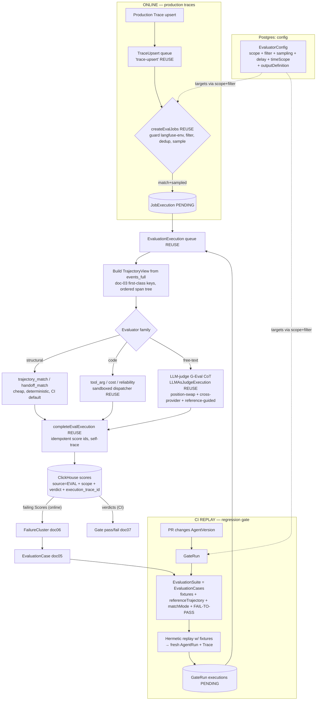

# DOC 04 — Multi-Level Evaluation Architecture (trace-first, NOT dataset-first)

> Tracely evaluation. The **trace is the source of truth**; every Score is *derived* from a trace. This document defines evaluation at **six levels** (Conversation, Turn, Step, Tool, Agent, Multi-Agent), the **three evaluator families** (structural matchers, code assertions, LLM-as-judge), the **execution model** (online TraceUpsert path reusing Langfuse `evalQueue`/`EvaluationExecution`, plus the CI replay path), and the concrete artifacts a V1 engineer needs (TypeScript `Evaluator` interface, three real evaluators, a JSON multi-level result, a mermaid pipeline). It obeys the canonical entities — `Agent, AgentVersion, AgentRun, Trace, Conversation, Turn, Step, ToolCall, LLMCall, SubAgentCall, EvaluationSuite, EvaluationCase, FailureCluster, Score, GateRun` — and the storage decision in doc 03 (one wide `events_full`-shaped span table + a `scores` table).
>
> Read alongside: doc 03 (data model / span addressing), Part 1 doc 10 (Langfuse evals, what to reuse vs. discard), Part 2 doc 91 (metric definitions, G-Eval, judge-bias mitigations), Part 2 doc 92 (code-verified Langfuse facts cited below as `file:line`).

---

## 0. The one-paragraph thesis vs. Langfuse

Langfuse evaluation is **config-first + single-object**: a `JobConfiguration` says "for `targetObject ∈ {trace,dataset,event,experiment}` matching this filter, run one judge over *one trace or one observation's* `{input,output,metadata}`, write a Score" (Part 1 doc 10 §1.2, §2; `schema.prisma:977-1004`). It can never see a **trajectory** — the extractor does `getObservationForTraceIdByName(...).shift()` and explicitly "only takes the first match" (`evalService.ts:1328`). Its quality story is **dataset-first**: `Dataset → DatasetItem(input, expected_output) → DatasetRuns → compare averaged scores per run` (Part 1 doc 10 §6). Tracely **inverts both**: (1) the unit scored is a **level of a production trace** — a Conversation, Turn, Step, ToolCall, AgentRun, or multi-agent interaction — not a dataset row; (2) the **default** evaluator is a **deterministic structural trajectory matcher**, not an LLM judge; (3) `expected_output`/reference trajectory is **derived from a captured-and-confirmed trace** (an `EvaluationCase`, doc 05), never authored up front. We **reuse Langfuse's execution substrate verbatim** (async-job → write Score back onto the trace, idempotent score ids, self-tracing judges, filter+sampling fan-out, `evalQueue`/`EvaluationExecution`, the typed `{reasoning, score}` LLM-judge engine) and **replace** the extractor (trajectory-shaped) and the score-addressing (multi-level).

**Decision [Synthesis]:** Evaluation is **TRACE-FIRST**. An `EvaluationCase` is a *frozen trace slice + reference trajectory + match config + optional rubric* (doc 05). Evaluators run on **two surfaces with one code path**: (a) **online** over live production traces (continuous quality + failure detection), and (b) **CI replay** over a deterministically re-executed trace (the regression gate). Same `Evaluator`, same `Score` output, different driver.

---

## 1. The Six Evaluation Levels

Every level binds to a **first-class span addressing key** from doc 03 (`agent_id`, `agent_version_id`, `agent_run_id`, `conversation_id`, `turn_id`, `step_id`, plus typed-edge columns `tool_call_id`, `caller_agent_id`/`callee_agent_id`). This is the core advantage over Langfuse, where agent/turn/step live only in `metadata[langgraph_node]/[langgraph_step]` and are reconstructed at read time. In Tracely the level a Score targets is a **column lookup**, not a string-parse.

A Score therefore extends Langfuse's `(trace_id, observation_id)` addressing (`0003_scores.up.sql`; Part 1 doc 10 §1.5) with a **`scope`** discriminator + the matching id column. The Langfuse `scores` columns we keep verbatim: `value Float64`, `string_value`, `comment` (judge reasoning), `data_type`, `source` (=`EVAL`), `config_id`, `execution_trace_id` (migration `0030`; doc 92 facts:eval-dataset). We **add**: `scope`, `agent_run_id`, `conversation_id`, `turn_id`, `step_id`, `tool_call_id`, and a `verdict` (`pass|fail|skip`) — the gate semantics Langfuse lacks (`JobExecutionStatus` is only `COMPLETED|ERROR|...`, no pass/fail; doc 92 REUSE/REPLACE summary).

| Level | Unit being scored (doc 03 key) | Concrete metrics | Evaluator family (default) | How it becomes a `Score` |
|---|---|---|---|---|
| **Conversation** | the whole `Conversation` (`conversation_id`); all turns | **goal_completion** (0/1 or 0–1), **user_satisfaction** (1–5 or proxy from sentiment), **resolution_rate** (resolved/escalated), turn_count, conversation_cost | LLM-judge (reference-guided when an `EvaluationCase` exists) + code (resolution from terminal-turn signal) | `scope="conversation"`, `conversation_id=…`, one Score per metric; `value` numeric, `comment` = judge CoT |
| **Turn** | one `Turn` (`turn_id`): user message → agent response | **relevance** (response addresses the turn), **groundedness** (claims supported by retrieved `Step` outputs), **correctness** (vs. reference turn) | LLM-judge (G-Eval CoT) for free-text; code for format/schema turns | `scope="turn"`, `turn_id=…`; categorical (`good/partial/bad`) → one Score row per match (Langfuse pattern, `evalService.ts:963-998`) |
| **Step** | one `Step` (`step_id`): a planner/reasoning/retrieval unit | **planning_quality** (plan is coherent & sufficient), **tool_selection_quality** (right tool chosen for the sub-goal — TRAJECT-Bench "similar-tool confusion"), **retrieval_quality** (recall@k / context relevance of retriever Steps) | code (tool-selection vs. allowed set) + LLM-judge (planning quality) | `scope="step"`, `step_id=…`; numeric or boolean |
| **Tool** | one `ToolCall` (`tool_call_id`) and its linked `TOOL` span | **success/failure** (status), **latency** (`end_time-start_time`), **arg_correctness** (args match expected, per-tool mode), TRAJECT-Bench 4 modes | **structural/code** (no LLM — cheapest, unbiased) | `scope="tool_call"`, `tool_call_id=…`; boolean `verdict` + numeric latency Score |
| **Agent** | one `AgentRun` (`agent_run_id`) of a single `AgentVersion` | **task_completion** (end-to-end goal met), **cost** (sum `cost_details` over run), **reliability** (error-free step ratio; tool retry count) | code (cost/reliability from span aggregates) + structural trajectory matcher (task path) | `scope="agent_run"`, `agent_run_id=…`, `agent_version_id` denormalized for version-diffing |
| **Multi-Agent** | a set of `AgentRun`s + `SubAgentCall` edges in one Trace | **coordination_quality** (MAST "inter-agent misalignment"), **handoff_quality** (right callee, correct payload at each `caller_agent_id→callee_agent_id` edge), **end_to_end_success** | structural (handoff-edge matcher over typed edges) + LLM-judge (coordination) | `scope="multi_agent"`, keyed on root `agent_run_id` + `trace_id`; handoff Scores keyed per edge via `tool_call_id`-style edge id |

**Seed taxonomy [Synthesis]:** failure labels attached to failing Scores draw from **TRAJECT-Bench's 4 tool-failure modes** (similar-tool confusion, parameter-blind selection, redundant calling, hard-query intent misinterpretation; doc 91 §1.3) and **MAST's 3 multi-agent buckets** (spec/system-design ~42%, inter-agent misalignment ~37%, task-verification ~21%; doc 91 §1.3). These become `Score.metadata.failure_mode` and feed the clustering pipeline (doc 06).

**Trajectory mandate:** the system MUST evaluate **trajectories, not just final answers**. The Step/Tool/Agent/Multi-Agent levels operate on the *ordered span tree* (the trajectory), not on a single output column. This is the structural gap vs. every dataset-first incumbent (doc 90: even LangSmith's `agentevals` is "a scoring function you point at a dataset," not a production-trajectory gate).

---

## 2. The Three Evaluator Families

Tier the evaluators by **cost, bias, and decisiveness**, exactly per doc 91 §1.5: deterministic structure first, LLM judge last.

### 2.1 Family A — Deterministic STRUCTURAL trajectory matchers (CI default)

**Steal the `agentevals` taxonomy wholesale** (doc 91 §1.2; doc 90 recommendation #3). A Tracely trajectory = the ordered `Step`/`ToolCall` stream of an `AgentRun` (read straight from `events_full` ordered by `(turn_id, start_time)` — doc 03). The reference trajectory = the same stream from the confirmed `EvaluationCase` trace.

- **`trajectory_match_mode`** (per-`EvaluationCase`): `strict` (same tool calls, same order) | `unordered` (same calls, any order) | `subset` (no extra tools beyond reference) | `superset` (all reference tools present, extras OK).
- **`tool_args_match_mode`**: `exact` | `ignore` | `subset` | `superset`, with **per-tool `tool_args_match_overrides`** (a mode, a field list requiring exact match, or a comparator).
- **Default = `unordered` + `superset`** [Synthesis], because TRAJECT-Bench shows **Inclusion consistently exceeds Exact-Match** — agents reach valid outcomes via re-ordered-but-correct paths, and strict ordering *manufactures false regressions* (doc 91 §1.3, §1.5). Order-sensitivity is a per-`EvaluationCase` opt-in flag.

**When to use:** Tool level (always), Step tool-selection, Agent task-path, Multi-Agent handoff-edge matching. **Cheap, deterministic, unbiased, runs on every PR.** No LLM cost, no flakiness — the property the CI gate (doc 07) depends on.

### 2.2 Family B — CODE evaluators (assertions over span fields)

A sandboxed function receiving a **trajectory object** (not Langfuse's `{observation:{input,output,metadata}}` — that contract "cannot express" trajectory assertions, Part 1 doc 10 §4.2) and returning typed scores. **Reuse Langfuse's dispatcher blueprint verbatim** (`codeEvalDispatchers.ts`, `awsLambdaCodeEvalDispatcher.ts`; Part 1 doc 10 §4.1): env-selectable `insecure-local` (dev) vs. `aws-lambda` (prod, per-tenant `TenantId=${orgId}:${projectId}`, 10s timeout, byte caps, **no-network sandbox**, typed retryable errors, self-traced). The **only change**: the payload contract becomes a `TrajectoryView` (§3).

**When to use:** anything decidable by a deterministic rule over span fields — Tool latency thresholds, retry counts, cost ceilings (Agent reliability/cost), format/schema validation (Turn), "planner called `search` before `book`", "no tool retried >3×". Cheap, deterministic, expressive; the workhorse for objective metrics.

### 2.3 Family C — LLM-AS-JUDGE (G-Eval CoT) — reserved for free-text quality

**Reuse Langfuse's typed-output judge engine essentially verbatim** (Part 1 doc 10 §3; `outputDefinition.ts`, `runLLMAsJudgeEvaluation` at `evalService.ts:735-961`): the judge returns a **structured `{reasoning, score}` validated against a per-template Zod schema**, normalized to a Score with `reasoning` → `comment`. Supported output types: `NUMERIC | BOOLEAN | CATEGORICAL` (`outputDefinition.ts:72-127`); categorical emits one Score row per match (`evalService.ts:963-998`). The judge call is itself traced under a reserved environment (`LangfuseInternalTraceEnvironment.LLMJudge = "langfuse-llm-as-a-judge"`, `llm/types.ts:527-530`) and **skipped by job creation** via the `"langfuse-"`-prefix infinite-loop guard (`evalService.ts:243-253`) — a **non-negotiable carryover** since Tracely's eval runs also emit traces.

**Prompt recipe = G-Eval** (doc 91 §1.4): generate chain-of-thought evaluation steps, then score via form-filling. **Built-in bias mitigations as defaults** (doc 91 §1.4 — the difference between a trustworthy gate and a flaky one):
1. **Position-swap & average** for any pairwise comparison (>10% accuracy swing from order otherwise).
2. **Reference-guided grading** whenever the `EvaluationCase` carries a confirmed reference trace (turns an open task into a near-closed one).
3. **Cross-provider judge** (judge from a different model family than the agent under test — mitigates self-preference / family bias).
4. **Store the judge CoT** (`comment`) always, for auditability.
5. **Prefer low-cardinality rubrics** (binary/`good-partial-bad`) over fine scalar scores (judges are overconfident & miscalibrated).

**When to use:** ONLY where structure cannot decide — Conversation goal-completion/satisfaction, Turn relevance/groundedness/correctness, Step planning quality, Multi-Agent coordination quality. **Never** for Tool success/args (structure decides those for free). **Cost note** (doc 90 #3): per-PR multi-level replay is only economically viable with cheap small judges (à la Galileo Luna-2, sub-200ms); reserve big judges for offline depth.

### 2.4 Selection rule [Synthesis]

```
can a deterministic rule over span fields decide it?
  ├─ yes, and it's a tool/trajectory shape  → Family A (structural matcher)
  ├─ yes, arbitrary assertion               → Family B (code eval)
  └─ no, it's free-text quality             → Family C (LLM-judge, reference-guided + cross-provider)
```

---

## 3. The TypeScript `Evaluator` Interface

The core contract. Every evaluator — structural, code, or judge — implements this. Inputs are a **`TrajectoryView`** (the trace slice for the target level) + a **`ReferenceView`** (from the `EvaluationCase`, may be `null` for online reference-free scoring). Output is `Score[]` (multi-metric evaluators emit several).

```typescript
// ── Addressing: which level + which entity (mirrors doc 03 span columns) ──
export type EvalScope =
  | "conversation" | "turn" | "step" | "tool_call" | "agent_run" | "multi_agent";

export interface EvalTarget {
  scope: EvalScope;
  projectId: string;
  traceId: string;
  // exactly the doc-03 first-class keys relevant to `scope`; nulls otherwise:
  conversationId?: string;
  turnId?: string;
  stepId?: string;
  toolCallId?: string;     // typed edge: links an LLMCall tool-request to its TOOL span
  agentRunId?: string;
  agentVersionId?: string; // denormalized for version-diffing & FAIL-TO-PASS contract
}

// ── The trajectory the evaluator sees (replaces Langfuse {input,output,metadata}) ──
// NOTE: the canonical wire/matcher shape is `Trajectory`/`TrajectoryStep`/`ToolCallView`/
// `ReferenceTrajectory` defined once in 00-canonical-decisions.md §7.2 (and doc 03). The
// `TrajectoryView`/`SpanNode`/`ReferenceView` types below are the evaluator-facing projection
// of that canonical type (richer per-span fields for the six scopes); they MUST be built from
// the canonical `Trajectory` via `buildTrajectory(spans)` and stay field-compatible with it.
// `trajectoryMatchMode`/`toolArgsMatchMode` are the canonical MatchMode/ArgsMode enums (§3).
export interface SpanNode {
  spanId: string; parentSpanId: string;
  type: "SPAN"|"GENERATION"|"AGENT"|"TOOL"|"CHAIN"|"RETRIEVER"|"EVALUATOR"|"EMBEDDING"|"GUARDRAIL"|"EVENT";
  name: string;
  turnId?: string; stepId?: string; agentRunId?: string;
  input: unknown; output: unknown; metadata: Record<string, unknown>;
  level: "DEBUG"|"DEFAULT"|"WARNING"|"ERROR"; statusMessage: string;
  startTime: string; endTime?: string; latencyMs?: number;
  costDetails: Record<string, number>; usageDetails: Record<string, number>;
}
export interface ToolCallView {        // one entry of the trajectory's tool stream
  toolCallId: string; name: string; arguments: unknown;   // parsed JSON
  resultSpanId?: string; resultOutput?: unknown;          // linked TOOL span (typed edge)
  success: boolean; latencyMs?: number;
}
export interface HandoffEdge {         // multi-agent typed edge
  callerAgentId: string; calleeAgentId: string; payload: unknown; turnIndex: number;
}
export interface TrajectoryView {
  target: EvalTarget;
  spans: SpanNode[];                   // ordered by (turnId, startTime); the span tree
  toolCalls: ToolCallView[];          // ordered tool stream for this scope
  handoffs: HandoffEdge[];            // populated only for multi_agent scope
  turns?: { turnId: string; index: number; userInput: unknown; agentOutput: unknown }[];
  finalOutput?: unknown;
}

// ── Reference (from a confirmed EvaluationCase; null = reference-free online eval) ──
export interface ReferenceView {
  caseId: string; sourceTraceId: string;
  referenceTrajectory: TrajectoryView;
  trajectoryMatchMode: "strict"|"unordered"|"subset"|"superset";
  toolArgsMatchMode: "exact"|"ignore"|"subset"|"superset";
  toolArgsMatchOverrides?: Record<string, "exact"|"ignore"|"subset"|"superset"|{ exactFields: string[] }>;
  expectedOutput?: unknown;
}

// ── The verdict: extends Langfuse Score with scope + pass/fail gate semantics ──
export interface Score {
  scope: EvalScope;
  name: string;                                  // e.g. "tool_selection_quality"
  dataType: "NUMERIC"|"CATEGORICAL"|"BOOLEAN";   // ScoreDataType (no PASS_FAIL value); gate uses BOOLEAN + verdict
  value: number;                                 // numeric / 0|1 boolean
  stringValue?: string;                          // categorical label
  verdict?: "pass"|"fail"|"skip";                // first-class verdict column; persisted as {PASS,FAIL,SKIP} (canonical: 00-canonical-decisions.md §3/§5)
  comment?: string;                              // judge CoT / matcher diff (Langfuse: reasoning → comment)
  configId?: string;                             // FK to evaluator config
  failureMode?: string;                          // TRAJECT-Bench / MAST label
  metadata?: Record<string, string>;
}

export interface EvalContext {
  callJudge: (args: JudgeCallArgs) => Promise<{ reasoning: string; score: unknown }>; // reuse fetchLLMCompletion
  runCode: (args: CodeEvalArgs) => Promise<{ scores: Score[] }>;                       // reuse dispatcher
  now: () => Date;
}

export interface Evaluator {
  readonly key: string;                          // registry key, e.g. "structural.trajectory_match"
  readonly family: "structural" | "code" | "llm_judge";
  readonly scopes: EvalScope[];                  // which levels it can score
  evaluate(
    trajectory: TrajectoryView,
    reference: ReferenceView | null,
    ctx: EvalContext,
  ): Promise<Score[]>;
}
```

---

## 4. Three Concrete Evaluator Implementations

### 4.1 Structural trajectory matcher (Family A) — the CI default

Ports the `agentevals` match-mode taxonomy onto `TrajectoryView`. Pure, deterministic, no LLM.

```typescript
export const trajectoryMatchEvaluator: Evaluator = {
  key: "structural.trajectory_match",
  family: "structural",
  scopes: ["agent_run", "step", "multi_agent"],

  async evaluate(traj, ref): Promise<Score[]> {
    if (!ref) return [{ scope: traj.target.scope, name: "trajectory_match",
      dataType: "BOOLEAN", value: 0, verdict: "skip",
      comment: "no reference trajectory (online reference-free run)" }];

    const got = traj.toolCalls.map(t => t.name);
    const want = ref.referenceTrajectory.toolCalls.map(t => t.name);
    const gotSet = new Set(got), wantSet = new Set(want);

    let namesOk: boolean, why: string;
    switch (ref.trajectoryMatchMode) {
      case "strict":    namesOk = got.length === want.length && got.every((n,i)=>n===want[i]);
                        why = "exact tool sequence + order"; break;
      case "unordered": namesOk = gotSet.size===wantSet.size && [...wantSet].every(n=>gotSet.has(n));
                        why = "same tool set, any order"; break;
      case "subset":    namesOk = [...gotSet].every(n=>wantSet.has(n));   // no extra tools
                        why = "no tools beyond reference set"; break;
      case "superset":  namesOk = [...wantSet].every(n=>gotSet.has(n));   // all critical present
                        why = "all reference tools present (extras allowed)"; break;
    }

    // tool-arg matching with per-tool overrides (paired positionally for strict, by name otherwise)
    const argMismatches: string[] = [];
    for (const wantCall of ref.referenceTrajectory.toolCalls) {
      const mode = (typeof ref.toolArgsMatchOverrides?.[wantCall.name] === "string"
        ? ref.toolArgsMatchOverrides[wantCall.name] : ref.toolArgsMatchMode) as string;
      if (mode === "ignore") continue;
      const gotCall = traj.toolCalls.find(t => t.name === wantCall.name);
      if (!gotCall) { argMismatches.push(`${wantCall.name}: missing`); continue; }
      const override = ref.toolArgsMatchOverrides?.[wantCall.name];
      const exactFields = typeof override === "object" ? override.exactFields : undefined;
      if (!argsMatch(gotCall.arguments, wantCall.arguments, mode, exactFields))
        argMismatches.push(`${wantCall.name}: args differ (${mode})`);
    }

    const pass = namesOk && argMismatches.length === 0;
    return [{
      scope: traj.target.scope, name: "trajectory_match", dataType: "BOOLEAN",
      value: pass ? 1 : 0, verdict: pass ? "pass" : "fail",
      failureMode: !namesOk ? "redundant_or_missing_tool" : argMismatches.length ? "parameter_blind_selection" : undefined,
      comment: pass ? `match (${why})` : `FAIL — names_ok=${namesOk} (${why}); arg_issues=[${argMismatches.join("; ")}]`,
      metadata: { mode: ref.trajectoryMatchMode, args_mode: ref.toolArgsMatchMode,
                  got: JSON.stringify(got), want: JSON.stringify(want) },
    }];
  },
};
// argsMatch(got, want, mode, exactFields?): deterministic deep-compare per mode
// exact = deep-equal; subset = want ⊆ got; superset = got ⊆ want; exactFields = only those keys must deep-equal
```

### 4.2 Tool-arg correctness checker (Family B / code) — per-tool, with type checks

Scores **arg-correctness** at the Tool level (TRAJECT-Bench "Usage" metric, doc 91 §1.1) using schema/format/value checks — runs in the sandboxed dispatcher, no LLM.

```typescript
export const toolArgCorrectnessEvaluator: Evaluator = {
  key: "code.tool_arg_correctness",
  family: "code",
  scopes: ["tool_call"],

  async evaluate(traj, ref): Promise<Score[]> {
    const out: Score[] = [];
    for (const call of traj.toolCalls) {
      const refCall = ref?.referenceTrajectory.toolCalls.find(t => t.name === call.name);
      const issues: string[] = [];

      // 1. structural success of the linked TOOL span (typed edge tool_call_id → TOOL span)
      if (!call.success) issues.push("tool execution errored");

      // 2. arg presence + JSON-validity
      if (call.arguments == null || typeof call.arguments !== "object")
        issues.push("arguments missing / not an object");

      // 3. value-match vs reference (when a confirmed case exists) — format/value checks
      if (refCall?.arguments && typeof refCall.arguments === "object") {
        for (const [k, v] of Object.entries(refCall.arguments as Record<string, unknown>)) {
          const gotV = (call.arguments as Record<string, unknown>)?.[k];
          if (gotV === undefined) issues.push(`missing arg '${k}'`);
          else if (typeof gotV !== typeof v) issues.push(`arg '${k}' type ${typeof gotV}≠${typeof v}`);
        }
      }

      const pass = issues.length === 0;
      out.push({
        scope: "tool_call", name: "tool_arg_correctness", dataType: "BOOLEAN",
        value: pass ? 1 : 0, verdict: pass ? "pass" : "fail",
        failureMode: pass ? undefined : "parameter_blind_selection",
        comment: pass ? `ok: ${call.name}` : `${call.name}: ${issues.join("; ")}`,
        metadata: { tool: call.name, tool_call_id: call.toolCallId, latency_ms: String(call.latencyMs ?? "") },
      });
      // also emit the deterministic latency Score the dashboard aggregates
      if (call.latencyMs != null)
        out.push({ scope: "tool_call", name: "tool_latency_ms", dataType: "NUMERIC",
                   value: call.latencyMs, metadata: { tool: call.name, tool_call_id: call.toolCallId } });
    }
    return out;
  },
};
```

### 4.3 LLM-judge (Family C) — Turn groundedness, G-Eval CoT + bias mitigations

Reuses Langfuse's `{reasoning, score}` typed-output engine (`runLLMAsJudgeEvaluation`, `outputDefinition.ts`). Reference-guided when a case exists; cross-provider judge by default.

```typescript
export const turnGroundednessJudge: Evaluator = {
  key: "llm_judge.turn_groundedness",
  family: "llm_judge",
  scopes: ["turn"],

  async evaluate(traj, ref, ctx): Promise<Score[]> {
    const turn = traj.turns?.[0];
    const retrievedContext = traj.spans
      .filter(s => s.type === "RETRIEVER")
      .map(s => JSON.stringify(s.output)).join("\n---\n");

    const { reasoning, score } = await ctx.callJudge({
      // cross-provider judge (mitigates self-preference/family bias, doc 91 §1.4):
      model: { provider: "anthropic", model: "claude-judge-small", crossProviderOf: traj.target.agentVersionId },
      // structured output contract = Langfuse outputDefinition.ts categorical schema:
      structuredOutputSchema: {
        reasoning: "step-by-step grounding analysis (G-Eval CoT)",
        score: { type: "CATEGORICAL", categories: ["grounded", "partially_grounded", "unsupported"] },
      },
      messages: GEVAL_GROUNDEDNESS_PROMPT({
        userInput: turn?.userInput, agentResponse: turn?.agentOutput,
        retrievedContext,
        // reference-guided grading turns the open task near-closed (doc 91 §1.4 mitigation #2):
        referenceAnswer: ref?.expectedOutput,
      }),
    });

    const label = String(score);
    const value = label === "grounded" ? 1 : label === "partially_grounded" ? 0.5 : 0;
    return [{
      scope: "turn", name: "groundedness", dataType: "CATEGORICAL",
      value, stringValue: label,
      verdict: value >= 0.5 ? "pass" : "fail",
      failureMode: label === "unsupported" ? "hallucination" : undefined,
      comment: reasoning,                          // judge CoT stored for audit (mitigation #4)
      metadata: { judge_model: "claude-judge-small", reference_guided: String(!!ref?.expectedOutput) },
    }];
  },
};
```

Example **G-Eval CoT judge prompt** (low-cardinality rubric per doc 91 §1.4 mitigation #5; CoT-before-score per G-Eval, doc 91 §1.4):

```text
SYSTEM: You are a strict, calibrated grader of agent-turn GROUNDEDNESS. Reason step by step
BEFORE assigning a label. Penalize unsupported claims even if fluent (ignore verbosity).

EVALUATION STEPS (chain-of-thought, fill in for each):
  1. List every factual claim in AGENT_RESPONSE.
  2. For each claim, mark SUPPORTED / NOT-SUPPORTED using ONLY RETRIEVED_CONTEXT
     (and REFERENCE_ANSWER if provided).
  3. Count unsupported claims; note any contradiction with the context.

LABEL RULES:
  - "grounded": every claim supported by the context.
  - "partially_grounded": ≥1 unsupported claim but the core answer holds.
  - "unsupported": the central claim is unsupported or contradicts the context.

USER_INPUT: {{userInput}}
RETRIEVED_CONTEXT: {{retrievedContext}}
REFERENCE_ANSWER (optional, authoritative when present): {{referenceAnswer}}
AGENT_RESPONSE: {{agentResponse}}

Return JSON: { "reasoning": "<your step-by-step analysis>", "score": "<grounded|partially_grounded|unsupported>" }
```

---

## 5. Execution Model

### 5.1 The Evaluator Registry

A typed registry maps `EvaluatorConfig` (the Tracely analog of Langfuse `JobConfiguration` + `EvalTemplate`) to a concrete `Evaluator`. Configs live in **Postgres** (cheap OLTP metadata — same split as Langfuse, Part 1 doc 10 §1). We **reuse** Langfuse's `EvalTemplate.outputDefinition` (the typed score contract) and `JobConfiguration`'s `filter`+`sampling`+`delay`+`timeScope` fields verbatim, and **extend** `targetObject` from `{trace,dataset,event,experiment}` to the six `EvalScope` values.

```typescript
interface EvaluatorConfig {
  id: string; projectId: string;
  evaluatorKey: string;                 // → registry → Evaluator
  scope: EvalScope;                     // replaces Langfuse targetObject (trace|dataset|event|experiment)
  filter: TraceFilter;                  // REUSE Langfuse filter syntax (createEvalJobs filter match)
  sampling: number;                     // 0..1 — REUSE Math.random() gate (evalService.ts:621-629)
  delayMs: number;                      // REUSE — let the trace settle (DEFAULT_TRACE_JOB_DELAY=10_000, types.ts:222)
  timeScope: ("NEW"|"EXISTING")[];      // REUSE NEW=online, EXISTING=backfill
  outputDefinition?: OutputDefinition;  // REUSE outputDefinition.ts for judge configs
  enabled: boolean; blockedAt?: Date; blockReason?: string;   // REUSE EvaluatorBlockReason auto-pause
}

const REGISTRY: Record<string, Evaluator> = {
  "structural.trajectory_match": trajectoryMatchEvaluator,
  "code.tool_arg_correctness":   toolArgCorrectnessEvaluator,
  "llm_judge.turn_groundedness": turnGroundednessJudge,
  "code.agent_cost":             agentCostEvaluator,        // sum cost_details over agent_run
  "code.agent_reliability":      agentReliabilityEvaluator, // error-free step ratio + retry count
  "structural.handoff_match":    handoffMatchEvaluator,     // multi_agent typed-edge matcher
  "llm_judge.conversation_goal": conversationGoalJudge,     // reference-guided when EvaluationCase exists
  // … one entry per (level × metric); families are pluggable
};
```

### 5.2 Targeting a specific span / turn / run (via doc 03)

An evaluator binds to a level by reading the matching **first-class column** from `events_full` (doc 03), not by parsing metadata strings. The `TrajectoryView` builder is the **replacement** for Langfuse's single-observation extractor (`evalService.ts:1290-1349`, which `.shift()`s the first match). It issues one `events_full` read scoped by the level key and assembles the ordered trajectory:

```sql
-- TrajectoryView builder for scope="agent_run": the ordered span tree of one AgentRun.
-- Reads doc-03 first-class columns directly (NOT metadata[langgraph_node]).
SELECT span_id, parent_span_id, type, name,
       turn_id, step_id, agent_run_id, tool_call_id,
       input, output, metadata_names, metadata_values,
       level, status_message, start_time, end_time,
       (toUnixTimestamp64Milli(end_time) - toUnixTimestamp64Milli(start_time)) AS latency_ms,
       cost_details, usage_details, tool_calls, tool_call_names
FROM   events_full
WHERE  project_id = {projectId:String}
  AND  agent_run_id = {agentRunId:String}
ORDER BY turn_id, start_time         -- trajectory order
LIMIT 1 BY span_id                   -- dedup ReplacingMergeTree (doc 92 dedup mechanics)
SETTINGS final = 1;
-- tool stream: parse tool_calls[] (JSON) + parallel tool_call_names[]; resolve each
-- tool_call_id to its executed TOOL span (typed edge) for ToolCallView.resultOutput.
```

The level → key mapping is mechanical: `conversation`→`conversation_id`, `turn`→`turn_id`, `step`→`step_id`, `tool_call`→`tool_call_id`, `agent_run`→`agent_run_id`, `multi_agent`→root `agent_run_id` + the `caller_agent_id/callee_agent_id` edges in the trace.

### 5.3 Online path (production traces) — reuse Langfuse `evalQueue`/`EvaluationExecution`

Reuse the Langfuse spine **verbatim**, adding one `sourceEventType` arm (doc 92 REUSE summary). On every production trace write, the trigger queue (Langfuse `TraceUpsert` / `"trace-upsert"`, `queues.ts`; the Tracely trigger is `AgentRunComplete` — canonical §4) → `createEvalJobs`:

1. Fetch `enabled`, non-blocked `EvaluatorConfig`s for the project whose `scope` is in-scope for the event, with `enforcedJobTimeScope="NEW"` (`evalQueue.ts:33`).
2. **Infinite-loop guard**: skip traces whose environment `startsWith("langfuse")` / `tracely` (`evalService.ts:243-253`) — our own eval traces.
3. **Filter match** in-memory (`InMemoryFilterService.evaluateFilter`) or via ClickHouse lookup.
4. **Dedup** against existing executions; **cancel** executions whose trace no longer matches.
5. **Sample**: `if (sampling !== 1) { if (Math.random() > sampling) skip }` (`evalService.ts:621-629`).
6. Create an execution row (status `PENDING`) and enqueue `EvaluationExecution` (`"evaluation-execution-queue"`) with `delay: config.delayMs`.
7. Worker `evaluate`: build `TrajectoryView` (§5.2), run the `Evaluator` (judges via `LLMAsJudgeExecution`, code via `CodeEvalExecution` dispatcher), then `completeEvalExecution` → write `Score`.

**Online runs are reference-free by default** (`ReferenceView = null`): they compute quality metrics and detect failures (a failing Score → candidate for `FailureCluster`, doc 06 → `EvaluationCase`, doc 05). This is the front of the pipeline: **Production Trace → Failure Detection**.

### 5.4 CI replay path (the regression gate)

The CI path **reuses the same `Evaluator`s** but a different driver (doc 07 owns the gate; this doc owns how the eval is invoked). On a PR that changes an `AgentVersion`, a `GateRun`:

1. Loads the `EvaluationSuite` = a set of `EvaluationCase`s (doc 05: each = frozen trace prefix + recorded **fixtures** (tool/LLM outputs for hermetic replay) + `referenceTrajectory` + match config + optional rubric + **FAIL-TO-PASS contract**).
2. **Deterministically replays** each case against the new `AgentVersion` using the recorded fixtures (no live tools/LLMs → hermetic, fast, cheap), producing a fresh `AgentRun` + Trace.
3. Builds a `TrajectoryView` from the replay trace and a `ReferenceView` from the case, runs the case's evaluators (structural matcher first; judge only if the rubric demands it).
4. Aggregates `Score.verdict`s into a suite verdict; enforces the **FAIL-TO-PASS contract** — the case MUST fail on the version that produced the failure and pass on the fix (doc 91 §3.2). A case that passes on the *broken* version is flaky and quarantined.

CI runs are **reference-guided** (a confirmed reference always exists) and **structural-first** — the property that makes per-PR gating cheap and non-flaky (doc 90 #3).

### 5.5 Idempotency & self-tracing (reuse verbatim)

- **Deterministic, idempotent Score ids** (`evalScoreIds.ts`; doc 92): `uuidv5(JSON.stringify(["eval-score", jobExecutionId, scoreName, occurrenceIndex]), NAMESPACE)` with `NAMESPACE="52b93de0-1d6c-4fb3-9f65-e5173184b1cb"`. Re-running an evaluator overwrites the same row in the `scores` `ReplacingMergeTree(event_ts, is_deleted)` — Tracely re-runs suites constantly, so idempotent verdict ids are mandatory.
- **Self-tracing**: every evaluator run is itself a trace. `execution_trace_id = createW3CTraceId(jobExecutionId)` (`evalService.ts:860`), stored on both the execution row and the `Score.execution_trace_id` column (migration `0030`). Evals are first-class traced artifacts — you can debug a flaky judge by opening its own trace. The `"langfuse-"`/`"tracely-"` environment prefix keeps these out of the eval-creation loop (§5.3 step 2).
- **Verdict write** mirrors `completeEvalExecution` (`evalCompletion.ts`): `source=EVAL`, `comment=reasoning`, boolean normalized `value = pass ? 1 : 0`, categorical → one Score row per match (`evalService.ts:963-998`).

### 5.6 Pipeline diagram



---

## 6. A Multi-Level Eval Result (JSON)

One `AgentRun` (a 3-turn support conversation, agent version `av_v13`) evaluated at all six levels. Each entry is one persisted `Score`; `execution_trace_id` makes every verdict itself traceable.

```json
{
  "agentRunId": "ar_7f3c9a",
  "traceId": "tr_9b21e4",
  "agentVersionId": "av_v13",
  "gateRunId": "gate_551",
  "scores": [
    {
      "scope": "conversation", "conversationId": "cv_001",
      "name": "goal_completion", "dataType": "BOOLEAN", "value": 1, "verdict": "pass",
      "comment": "User asked to change shipping address; agent confirmed update in turn 3. CoT: goal stated t1, resolved t3.",
      "configId": "cfg_conv_goal", "execution_trace_id": "exec_aa01",
      "metadata": { "judge_model": "claude-judge-small", "reference_guided": "true" }
    },
    {
      "scope": "turn", "turnId": "tn_002",
      "name": "groundedness", "dataType": "CATEGORICAL", "value": 0.5, "stringValue": "partially_grounded",
      "verdict": "pass", "failureMode": null,
      "comment": "2 claims: delivery-window SUPPORTED by retriever; loyalty-discount NOT-SUPPORTED.",
      "configId": "cfg_turn_ground", "execution_trace_id": "exec_aa02"
    },
    {
      "scope": "step", "stepId": "st_004",
      "name": "tool_selection_quality", "dataType": "BOOLEAN", "value": 0, "verdict": "fail",
      "failureMode": "similar_tool_confusion",
      "comment": "Planner chose `search_orders` but sub-goal required `search_shipments` (TRAJECT-Bench similar-tool confusion).",
      "configId": "cfg_step_toolsel", "execution_trace_id": "exec_aa03"
    },
    {
      "scope": "tool_call", "toolCallId": "tc_0007",
      "name": "tool_arg_correctness", "dataType": "BOOLEAN", "value": 0, "verdict": "fail",
      "failureMode": "parameter_blind_selection",
      "comment": "update_address: missing arg 'postal_code'; arg 'country' type number≠string.",
      "configId": "cfg_tool_args", "execution_trace_id": "exec_aa04",
      "metadata": { "tool": "update_address", "tool_call_id": "tc_0007" }
    },
    {
      "scope": "tool_call", "toolCallId": "tc_0007",
      "name": "tool_latency_ms", "dataType": "NUMERIC", "value": 842,
      "configId": "cfg_tool_args", "execution_trace_id": "exec_aa04",
      "metadata": { "tool": "update_address" }
    },
    {
      "scope": "agent_run", "agentRunId": "ar_7f3c9a",
      "name": "trajectory_match", "dataType": "BOOLEAN", "value": 0, "verdict": "fail",
      "failureMode": "parameter_blind_selection",
      "comment": "FAIL — names_ok=true (same tool set, any order); arg_issues=[update_address: args differ (exact)]",
      "configId": "cfg_traj_match", "execution_trace_id": "exec_aa05",
      "metadata": { "mode": "unordered", "args_mode": "exact",
                    "got": "[\"search_orders\",\"update_address\"]", "want": "[\"search_shipments\",\"update_address\"]" }
    },
    {
      "scope": "agent_run", "agentRunId": "ar_7f3c9a",
      "name": "agent_cost_usd", "dataType": "NUMERIC", "value": 0.0143,
      "configId": "cfg_agent_cost", "execution_trace_id": "exec_aa06"
    },
    {
      "scope": "multi_agent", "agentRunId": "ar_7f3c9a",
      "name": "handoff_quality", "dataType": "BOOLEAN", "value": 1, "verdict": "pass",
      "comment": "Edge orchestrator→shipping_agent: correct callee, payload {order_id} complete.",
      "configId": "cfg_handoff", "execution_trace_id": "exec_aa07",
      "metadata": { "caller_agent_id": "ag_orch", "callee_agent_id": "ag_ship", "mast_bucket": "inter_agent_misalignment" }
    }
  ],
  "gateVerdict": "fail",
  "gateReason": "2 failing verdicts: step.tool_selection_quality, tool_call.tool_arg_correctness (FAIL-TO-PASS case fto_88 reproduced the prod failure on av_v13)"
}
```

---

## 7. How This Differs from Langfuse (config-first / dataset-first)

| Dimension | Langfuse (verified) | Tracely (this doc) |
|---|---|---|
| **Starting unit** | A `Dataset` of `(input, expected_output)` rows; production feeds *into* datasets (Part 1 doc 10 §6) | A **level of a production trace** (`EvalScope`); `expected_output` is *derived* from a confirmed `EvaluationCase` |
| **What's scored** | One trace **or** one named observation's `{input,output,metadata}`; extractor `.shift()`s the first match (`evalService.ts:1328`) | A **`TrajectoryView`** — the ordered span tree / tool stream / handoff edges of the target level |
| **Trajectory eval** | None — "cannot be expressed" (Part 1 doc 10 §4.2) | First-class; structural matchers are the **default** family |
| **Levels** | `(trace_id, observation_id)` only (`0003_scores.up.sql`) | **Six**: conversation/turn/step/tool/agent/multi-agent, each a doc-03 first-class column |
| **Default evaluator** | LLM-judge or code, config-driven | **Deterministic structural matcher** (cheap, unbiased, CI-safe); judge reserved for free-text |
| **Versioned axis** | The **prompt** (`promptId`) | The **`AgentVersion`** (no prompt-management coupling) |
| **Gate semantics** | `JobExecutionStatus = COMPLETED\|ERROR` — no pass/fail (doc 92) | `Score.verdict = pass\|fail\|skip` + **FAIL-TO-PASS contract** → `GateRun` blocks the PR |
| **Production→regression** | Manual "add to dataset" (`sourceTraceId`) + one-shot `EXISTING` backfill (observability) | **Failure detection → cluster → `EvaluationCase` → suite → forever** (the spine) |
| **CI artifact** | A dataset experiment ("avg score didn't drop") | A **hermetic replay** of a production-failure case against the changed `AgentVersion` |

**Reused verbatim** (the substrate is excellent): async-job → write-Score-back-onto-trace; `TraceUpsert`→`createEvalJobs` filter+sampling fan-out (`evalService.ts:402-678`); `EvaluationExecution`/`LLMAsJudgeExecution`/`CodeEvalExecution` queues; the `{reasoning, score}` typed-output judge engine (`outputDefinition.ts`, `runLLMAsJudgeEvaluation`); the sandboxed code-eval dispatcher (`codeEvalDispatchers.ts`); deterministic idempotent score ids (`evalScoreIds.ts`); self-tracing + `"langfuse-"`-prefix infinite-loop guard (`evalService.ts:243-253`); the `scores` ClickHouse table + `execution_trace_id` (`0030`).
**Replaced/extended**: the single-observation extractor → `TrajectoryView` builder; `targetObject {trace,dataset,event,experiment}` → six `EvalScope`s; score addressing → +`scope`/`agent_run_id`/`conversation_id`/`turn_id`/`step_id`/`tool_call_id`; +`verdict` for gate semantics; the entire dataset/experiment pillar → production-derived `EvaluationCase` store (doc 05).

---

## 8. V1 Build Order [Synthesis]

1. **Score model + addressing** — extend the `scores` table with `scope` + level-id columns + `verdict` (doc 03 owns the DDL; this doc owns the semantics). Idempotent ids + self-tracing carried over day one.
2. **`TrajectoryView` builder** — the §5.2 reader. Everything else depends on it. This is the single highest-leverage net-new component (it replaces the part of Langfuse that "cannot do trajectories").
3. **Family A structural matcher** (§4.1) — unlocks the CI gate cheaply and unblocks doc 07. `unordered`+`superset` default.
4. **Online path** — wire `EvaluatorConfig` into the reused `createEvalJobs`/`EvaluationExecution` spine; emit failing Scores into the clustering pipeline (doc 06).
5. **Family B code evals** (§4.2) — tool-arg/cost/reliability via the reused dispatcher.
6. **Family C judges** (§4.3) — last, for free-text levels, with all bias mitigations as defaults.

---

## 9. Assumptions Sibling Docs Must Honor

- **doc 03 (data model):** must expose `events_full` first-class columns `conversation_id, turn_id, step_id, agent_run_id, agent_version_id, tool_call_id, caller_agent_id, callee_agent_id` and a `scores` table extended with `scope EvalScope`, the level-id columns above, and `verdict (pass|fail|skip)`. The `TrajectoryView` SQL in §5.2 assumes these are queryable columns, not metadata strings.
- **doc 05 (eval cases / regression tests):** an `EvaluationCase` must materialize exactly the `ReferenceView` shape — `referenceTrajectory`, `trajectoryMatchMode`, `toolArgsMatchMode`, `toolArgsMatchOverrides`, `expectedOutput`, plus fixtures and the FAIL-TO-PASS contract this doc's CI path (§5.4) consumes.
- **doc 06 (failure clustering):** consumes online failing `Score`s carrying `failureMode` drawn from the TRAJECT-Bench/MAST seed taxonomy (§1).
- **doc 07 (CI/CD gate):** owns the `GateRun` driver and PR status check; it invokes this doc's evaluators over hermetic replays and aggregates `Score.verdict`s. The `gateVerdict` in §6 is produced there, not here.
- **All docs:** evaluators are themselves traced (`execution_trace_id`), and the `"tracely-"`/`"langfuse-"` environment-prefix guard must be respected so eval traces never re-trigger evaluation.
