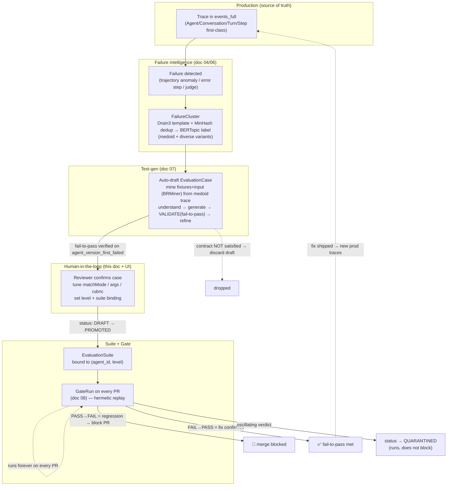

# Doc 05 — Regression Testing Architecture (the spine: Production Trace → Regression Test)

> **The spine.** This document specifies the single most important artifact in Tracely: the **`EvaluationCase`** — a regression test that is *fully derived from one production trace*. It defines the case structure (fixtures, reference trajectory, assertions, fail-to-pass contract, provenance), the two replay modes (hermetic record-replay and live re-execution), trajectory diffing semantics (agentevals taxonomy), flakiness handling, and the promotion workflow from `FailureCluster` → confirmed `EvaluationCase` → `EvaluationSuite` → CI gate. It leans on Part 2 doc 91 (fail-to-pass, agentevals, BRMiner) and reuses Langfuse infrastructure verbatim where possible (cited `file:line`).
>
> **Canonical entities** (verbatim, shared across all docs): Agent, AgentVersion, AgentRun, Trace, Conversation, Turn, Step, ToolCall, LLMCall, SubAgentCall, EvaluationSuite, EvaluationCase, FailureCluster, Score, GateRun.
>
> **Scope boundary.** Failure *detection* and *clustering* are doc 04/06; *auto-drafting* a case from a cluster (test-gen: understand→generate→validate→refine, BRMiner input mining) is **doc 07**; the *CI gate execution & PR UX* (`GateRun`) is **doc 08**. This doc owns the **EvaluationCase data model, the replay runner, trajectory diffing, and the promotion lifecycle**.

---

## 0. Thesis: a regression test is a trace, not a dataset row

Every incumbent bottoms out at `Dataset → Experiment → Scorer` (doc 90). A dataset row is `{input, expected_output}` — it throws away the *trajectory*, the *tool outputs*, the *intermediate state*, and the *agent version that failed*. Tracely's `EvaluationCase` is the opposite: it is a **frozen slice of one production trace**, replayable hermetically, that asserts on the *path* the agent takes — not just the final string.

| Dimension | Dataset-row test (incumbents) | Tracely `EvaluationCase` (trace-native) |
|---|---|---|
| Unit | `{input, expected_output}` JSON | A captured `Trace` prefix + recorded fixtures |
| What is asserted | final output similarity | full **reference trajectory** (Steps/ToolCalls/handoffs) + optional output rubric |
| Determinism | re-runs hit live tools/LLMs → flaky, expensive | **hermetic replay** from recorded fixtures → deterministic, cheap |
| Provenance | none (hand-authored or scraped) | `source_trace_id`, `failure_cluster_id`, `agent_version_first_failed` |
| Correctness contract | "score didn't drop on average" | **fail-to-pass**: must FAIL on the version that broke, PASS on the fix |
| Binding | dataset (version-agnostic) | bound to `(agent_id, level)`; knows which `AgentVersion` regressed |
| Origin | dataset-first (curate, then test) | **trace-first** (prod failure → cluster → draft → confirm → forever) |

The dataset model cannot express "the exact failure trajectory we saw last Tuesday must not recur." The `EvaluationCase` is *defined* by that trajectory.

---

## 1. `EvaluationCase` — the complete structure

An `EvaluationCase` is metadata in **Postgres** (registry/OLTP, reused Langfuse pattern) plus **immutable blobs in S3/MinIO** (fixtures + reference trajectory, keyed by case id). Verdicts produced by running it are **`Score` rows in ClickHouse** reusing Langfuse addressing (`scores` table, `events_full` for the replay's own trace). This mirrors Langfuse's split exactly: Postgres for the definition (cf. `EvalTemplate`/`JobConfiguration`, `schema.prisma:917-1004`), ClickHouse for results (`scores`, `0003_scores.up.sql` + `0030`), S3 for large/immutable payloads (cf. ingestion S3 source-of-truth, `processEventBatch.ts:237`).

### 1.1 The five parts

```
EvaluationCase
├── (a) FIXTURES            captured input + trace prefix + recorded tool/LLM outputs  → S3, keyed by case id
├── (b) REFERENCE TRAJECTORY  ordered Steps/ToolCalls/handoffs + match mode + tool_args mode + per-tool overrides
├── (c) ASSERTIONS          structural (trajectory diff) + optional LLM-judge rubric (G-Eval CoT)
├── (d) FAIL-TO-PASS CONTRACT  must fail on agent_version_first_failed; expected to pass on the fix
└── (e) PROVENANCE          source_trace_id, failure_cluster_id, agent_version_first_failed, created_by, …
```

### 1.2 Prisma model (Postgres registry — `[Synthesis]`, modeled on `JobConfiguration`/`EvalTemplate`)

```prisma
// Catalog of regression tests. Definition only — fixtures/refs live in S3, verdicts in ClickHouse.
model EvaluationCase {
  id            String   @id @default(cuid())
  projectId     String   @map("project_id")

  // ── binding (what this case guards) ──────────────────────────────
  agentId       String   @map("agent_id")            // FK → Agent
  level         CaseLevel                              // conversation|turn|step|tool_call|agent_run
  name          String                                 // human label, e.g. "refund>$500 must call escalate_to_human"
  description   String?

  // ── (a) FIXTURES (pointer; bytes in S3) ──────────────────────────
  fixtureS3Path   String  @map("fixture_s3_path")     // s3://…/cases/<id>/fixtures/<fixtureVersion>.json
  fixtureVersion  Int     @default(1) @map("fixture_version")
  fixtureSha256   String  @map("fixture_sha256")      // integrity / dedup
  inputDigest     String  @map("input_digest")        // sha256 of canonicalized case input — fast dedup vs cluster

  // ── (b) REFERENCE TRAJECTORY (pointer + match policy inline) ──────
  referenceS3Path     String         @map("reference_s3_path")   // s3://…/cases/<id>/reference/<refVersion>.json
  referenceVersion    Int            @default(1) @map("reference_version")
  trajectoryMatchMode TrajectoryMatchMode @default(UNORDERED)    // agentevals taxonomy
  toolArgsMatchMode   ToolArgsMatchMode   @default(EXACT)
  toolArgsOverrides   Json?          @map("tool_args_overrides") // { [toolName]: ToolArgRule }

  // ── (c) ASSERTIONS ───────────────────────────────────────────────
  assertions    Json                                   // Assertion[]  (see §1.4)

  // ── (d) FAIL-TO-PASS CONTRACT ────────────────────────────────────
  agentVersionFirstFailed String  @map("agent_version_first_failed")  // must FAIL here
  failToPassVerified      Boolean @default(false) @map("fail_to_pass_verified") // validated at draft time (doc 07)
  failToPassEvidence      Json?   @map("fail_to_pass_evidence")       // {failedOnVersion, failedGateRunId, …}

  // ── (e) PROVENANCE ───────────────────────────────────────────────
  sourceTraceId    String   @map("source_trace_id")    // ClickHouse trace_id (no FK)
  failureClusterId String?  @map("failure_cluster_id") // FK → FailureCluster (null = manually authored)
  createdBy        String   @map("created_by")          // userId | "tracely-autodraft"
  createdByKind    CaseOrigin @default(GENERATED) @map("created_by_kind")

  // ── lifecycle / flakiness ────────────────────────────────────────
  status        CaseStatus @default(DRAFT)             // DRAFT|PROMOTED|QUARANTINED|ARCHIVED|UNREPRODUCIBLE
  replayMode    ReplayMode @default(RECORD_REPLAY)     // RECORD_REPLAY | LIVE
  flakeRuns     Int     @default(1)  @map("flake_runs")      // N-run majority (1 = single run)
  flakeTolerance Float  @default(0.0) @map("flake_tolerance") // tolerance band for numeric scores

  createdAt     DateTime @default(now()) @map("created_at")
  updatedAt     DateTime @updatedAt @map("updated_at")

  suiteMemberships EvaluationSuiteCase[]

  @@index([projectId, agentId, level, status])
  @@index([projectId, failureClusterId])
  @@unique([projectId, agentId, inputDigest])          // one case per (agent, canonical input)
}

enum CaseLevel          { CONVERSATION TURN STEP TOOL_CALL AGENT_RUN MULTI_AGENT }
enum TrajectoryMatchMode{ STRICT UNORDERED SUBSET SUPERSET }          // agentevals (doc 91 §1.2)
enum ToolArgsMatchMode  { EXACT IGNORE SUBSET SUPERSET }
enum CaseStatus         { DRAFT PROMOTED QUARANTINED ARCHIVED UNREPRODUCIBLE }
enum ReplayMode         { RECORD_REPLAY LIVE }
enum CaseOrigin         { PROMOTED_CLUSTER MANUAL GENERATED }
```

**Design notes.** `level` reuses Tracely's first-class span columns (`turn_id`, `step_id`, `tool_call_id`) — the case knows whether it asserts on a whole conversation, one turn, one step, or one tool call, because Tracely promoted Agent/Conversation/Turn/Step to first-class columns (the core gap vs Langfuse, where these live only in `metadata[langgraph_node]` and are reconstructed at read time). `@@unique([projectId, agentId, inputDigest])` is the dedup that prevents one flaky bug from generating 10 000 identical cases — it mirrors how MinHash-LSH dedup feeds the cluster (doc 91 §2.4), but here at the *case* level on the canonicalized input.

### 1.3 (b) Reference trajectory + match policy — the wire shape

The reference trajectory is stored in S3 (not Postgres) because it can be large and is **immutable per `referenceVersion`**. It uses the **canonical `Trajectory` type (00-canonical-decisions.md §7.2 / doc 03)** — `Trajectory = { traceId, agentRunId, steps: TrajectoryStep[] }` with `TrajectoryStep = { spanId, parentSpanId, kind: StepKind, name, toolCalls?: ToolCallView[], output?, status, level, startTime, endTime?, agentId?, turnId?, stepId? }` — so diffing is symmetric (a replay run *produces* the same type). The S3 blob is the canonical `ReferenceTrajectory` (= `Trajectory & { matchMode: MatchMode; toolArgsMode: ArgsMode; perToolOverrides? }`) wrapped in a small S3 envelope; **do not redefine the step shape with different field names** (canonical: 00-canonical-decisions.md §7.2):

```ts
// s3://…/cases/<caseId>/reference/<refVersion>.json
interface ReferenceTrajectoryBlob {
  caseId: string;
  refVersion: number;
  level: CaseLevel;
  trajectory: Trajectory;        // canonical §7.2: { traceId, agentRunId, steps: TrajectoryStep[] }
  // match policy denormalized here so the runner needs only the S3 blob (canonical ReferenceTrajectory fields)
  matchMode: MatchMode;          // strict | unordered | subset | superset
  toolArgsMode: ArgsMode;        // exact | ignore | subset | superset
  perToolOverrides?: Record<string, ToolArgRule>;
}

// per-tool override rule (agentevals `tool_args_match_overrides`, doc 91 §1.2; canonical ArgsMode + per-field exact lists + custom comparator)
type ToolArgRule =
  | ArgsMode                                       // "exact" | "ignore" | "subset" | "superset" (canonical §3)
  | { fields: string[] }                          // only these arg fields must match exactly
  | { comparator: "numeric_tolerance"; tolerance: number }   // built-in comparators (no arbitrary code in CI)
  | { comparator: "case_insensitive" };
```

> **`[Synthesis]` — steal the `agentevals` taxonomy wholesale** (doc 91 §1.2): `STRICT | UNORDERED | SUBSET | SUPERSET` × `EXACT | IGNORE | SUBSET | SUPERSET` args, with per-tool overrides. **Default `UNORDERED` + `EXACT`** because empirically *Inclusion > Exact-Match* (TRAJECT-Bench, doc 91 §1.1) — strict ordering manufactures false regressions on legitimately re-ordered-but-correct runs. We restrict the override `comparator` to a **closed enum of built-ins** (no arbitrary user code) so the CI runner stays hermetic and safe.

### 1.4 (c) Assertions — structural + judge, tiered

```ts
type Assertion =
  // Tier 1 — deterministic, cheap, CI-default. The trajectory diff (§4) IS this assertion.
  | { kind: "trajectory_match" }   // uses matchMode/toolArgsMode from the case
  | { kind: "tool_called"; toolName: string; mustHappen: boolean }
  | { kind: "tool_not_called"; toolName: string }
  | { kind: "tool_arg_equals"; toolName: string; jsonPath: string; expected: Json }
  | { kind: "no_error_steps" }                       // no Step with level=ERROR
  | { kind: "final_output_regex"; pattern: string }
  | { kind: "max_steps"; n: number }                 // path-efficiency / no runaway loops
  | { kind: "handoff"; from: string; to: string; mustHappen: boolean }  // SubAgentCall edge
  // Tier 2 — LLM-judge (G-Eval CoT + bias mitigations), for free-text quality only
  | {
      kind: "llm_judge";
      rubric: string;                 // G-Eval style; CoT eval steps generated then form-filled (doc 91 §1.4)
      scoreName: string;
      dataType: "BOOLEAN" | "NUMERIC" | "CATEGORICAL";  // reuse Langfuse ScoreDataType (scores.ts:46-59)
      passIf: { op: ">=" | "<=" | "==" | "in"; value: number | string[] };
      // bias mitigations (doc 91 §1.4) — defaults ON
      referenceGuided: boolean;       // feed reference output → near-closed task
      crossProviderJudge: boolean;    // judge from a different family than the generator
      positionSwap: boolean;          // pairwise: swap-and-average
    };
```

**Tiering rule `[Synthesis]`:** deterministic structural assertions (Tier 1) decide first — they are cheap, unbiased, reproducible, and CI-friendly. Reserve the `llm_judge` (Tier 2) for free-text turn/conversation quality where structure cannot decide. Always persist the judge's chain-of-thought into the `Score.comment` (Langfuse reuses `comment = outputResult.reasoning`, `evalService.ts:970`) for auditability.

### 1.5 (a) FIXTURES — the hermetic-replay payload

Fixtures are everything needed to replay the case **without touching the live world**. Stored as one JSON blob in S3 keyed by case id (immutable per `fixtureVersion`); large per-call payloads (huge tool outputs) may be sharded into sub-keys but v1 inlines them.

```ts
// s3://…/cases/<caseId>/fixtures/<fixtureVersion>.json
interface CaseFixtures {
  caseId: string;
  fixtureVersion: number;
  sourceTraceId: string;
  capturedAt: string;                 // ISO

  // 1) the trigger input — the exact input that started the (sub)trajectory
  input: {
    level: CaseLevel;
    conversationPrefix?: Turn[];      // for TURN/CONVERSATION cases: prior turns replayed verbatim
    turnInput?: Json;                 // the user/message that begins the asserted turn
    runInput?: Json;                  // for AGENT_RUN cases: the run's root input
    seed?: number;                    // RNG seed if the agent accepts one (best-effort determinism)
  };

  // 2) recorded TOOL outputs — keyed for deterministic lookup by the replay shim (§3)
  //    key = `${toolName}::${argsCanonicalHash}`  (falls back to call order if args drift)
  toolFixtures: Array<{
    lookupKey: string;
    toolName: string;
    requestArgs: Json;
    response: Json;                   // recorded result, replayed verbatim
    isError: boolean;
    callOrderIndex: number;           // fallback matcher when args vary run-to-run
    latencyMsRecorded?: number;
  }>;

  // 3) recorded LLM outputs — OPTIONAL. Present → fully hermetic (cheapest, fully deterministic).
  //    Absent → "tool-hermetic": tools mocked, LLM live (catches model-version regressions).
  llmFixtures?: Array<{
    lookupKey: string;                // `${model}::${messagesCanonicalHash}`
    model: string;
    requestMessages: Json;            // the prompt that was sent
    response: Json;                   // recorded completion incl. tool_calls
    callOrderIndex: number;
  }>;

  // 4) provenance copy (also denormalized to Postgres for query)
  provenance: {
    sourceTraceId: string;
    failureClusterId?: string;
    agentVersionFirstFailed: string;
  };
}
```

**Why S3 keyed by case id.** This reuses Langfuse's "S3 is the source of truth; large blobs never live in the OLTP row" pattern (native ingestion key `${PREFIX}${projectId}/${entityType}/${entityId}/…`, `processEventBatch.ts:237`). Tracely's analog: `${PREFIX}cases/${caseId}/fixtures/${fixtureVersion}.json` and `…/reference/${refVersion}.json`. Immutability-per-version means a re-recorded fixture bumps `fixtureVersion` and never mutates history — exactly the ReplacingMergeTree discipline applied to blobs.

**Mining the fixtures from the trace `[Synthesis]`.** Doc 07 (test-gen) populates `toolFixtures`/`llmFixtures`/`input` by reading the failing sub-trace from `events_full`: tool requests/results come from the typed `tool_call_id` edge linking an `LLMCall` tool-request to the executing `TOOL` span; args/outputs come from `tool_calls`/`input`/`output` columns (extraction contracts at `extractToolsBackend.ts`). This *is* BRMiner's "mine literal inputs from the report" specialized to a trace, which carries strictly more signal than a text issue (doc 91 §3.2).

---

## 2. `EvaluationSuite` — collection + selection rules + case versioning

A suite is a **named, version-bound collection** of cases plus **selection rules** so it can also pull in cases dynamically (e.g. "all PROMOTED cases for agent X at turn level").

```prisma
model EvaluationSuite {
  id          String   @id @default(cuid())
  projectId   String   @map("project_id")
  agentId     String   @map("agent_id")              // a suite guards exactly one Agent
  name        String                                  // e.g. "checkout-agent :: turn gate"
  level       CaseLevel                               // the gate level this suite runs at
  description String?

  // selection: static members (join table) UNION dynamic rule
  selectionRule Json?  @map("selection_rule")         // { status?: CaseStatus[], clusterIds?: string[], tags?: string[] }

  // gate policy (consumed by doc 08 GateRun)
  blockOn      SuiteBlockPolicy @default(ANY_FAIL)    // ANY_FAIL | THRESHOLD
  threshold    Float?                                  // for THRESHOLD: min pass-rate to allow merge
  defaultReplayMode ReplayMode @default(RECORD_REPLAY)

  status      SuiteStatus @default(ACTIVE)            // ACTIVE | PAUSED
  createdAt   DateTime @default(now()) @map("created_at")
  updatedAt   DateTime @updatedAt @map("updated_at")

  cases       EvaluationSuiteCase[]
  @@unique([projectId, agentId, name])
  @@index([projectId, agentId, level, status])
}

model EvaluationSuiteCase {
  suiteId     String @map("suite_id")
  caseId      String @map("case_id")
  // case versioning: pin a specific case version OR float to latest (canonical: 00-canonical-decisions.md)
  pinnedCaseVersion Int? @map("pinned_case_version")
  addedAt     DateTime @default(now()) @map("added_at")
  @@id([suiteId, caseId])
}

enum SuiteBlockPolicy { ANY_FAIL THRESHOLD }
enum SuiteStatus      { ACTIVE PAUSED }
```

**Case versioning `[Synthesis]`.** A case's *fixtures* and *reference trajectory* are independently versioned (`fixtureVersion`, `referenceVersion`) and **immutable** — re-recording bumps the version, never edits in place (the same valid-from/valid-to discipline Langfuse uses for `DatasetItem.validFrom`, `schema.prisma:613`, but blob-shaped). A suite membership may **pin** a case version via `pinnedCaseVersion` (frozen gate) or **float** to latest (track upstream fixes) by leaving it null. Default: float (so a refined reference improves the gate); pinning freezes the recorded fixtures + reference so they don't silently change what "the failure" was. This is the knob that decides "does fixing the reference change the gate retroactively."

---

## 3. Two replay modes

### 3.1 Mode 1 — RECORD-REPLAY (hermetic) — **the CI default**

Mock every tool (and optionally every LLM) from the recorded fixtures. Deterministic, cheap, no external dependencies, runs in seconds, safe to run on **every PR**. This is the only economically viable mode for "runs forever in CI" (doc 90 §3: trace-native gating *requires* this cost structure or it won't run on every PR).

**How Tracely intercepts calls — the replay shim** (interface per canonical §7.4). Tracely ships a thin SDK shim per supported framework. The shim sits at the *tool-dispatch* and *model-client* boundary and, when installed in `replay` mode, intercepts outbound calls and returns the recorded fixture instead of hitting the network. Fixtures are passed as a `FixtureBundle` (the on-disk `CaseFixtures` toolFixtures/llmFixtures map onto it):

```ts
interface FixtureEntry { keyHash: string; request: unknown; response: unknown; stream?: unknown[] }
interface FixtureBundle { tools: Record<string /*toolName*/, FixtureEntry[]>; llm: FixtureEntry[] }

interface ReplayShim {
  install(opts: { fixtures: FixtureBundle; mode: "record" | "replay" }): Disposable;
}

function canonicalHash(args: unknown): string; // RFC8785 canonical JSON → sha256
```

- **Lookup key = `canonicalHash(args)`.** Each tool/LLM call hashes its canonical args and consumes the next `FixtureEntry` from that key's **per-key queue**, so N identical or concurrent calls within a step each get the right successive fixture. Returns `response` (or raises the recorded error). No real tool runs.
- **LLM interception.** If `llm` fixtures are present, the shim intercepts the model client the same way and returns the recorded completion → **fully hermetic, fully deterministic**. If absent, the LLM runs live → **tool-hermetic** mode, which catches model-version regressions while keeping tools deterministic.
- **Streaming.** A streamed LLM response is replayed by **concatenating the entry's `stream[]` chunks** (and re-emitting them as a stream if the caller streams).
- **Framework adapters `[Synthesis]`.** One adapter per framework (LangGraph ships first): **LangGraph** wraps `ToolNode` + `BaseChatModel.invoke/stream`; **OpenAI Agents SDK** patches the tool executors + the model client; **Agno** wraps the tool + model callables; **custom** frameworks use the Tracely SDK's `wrapTool()` / `wrapModel()` or an OTLP-aware HTTP proxy. The shim emits its *own* OTel spans so the replay produces a real Trace in `events_full` — the run is observable exactly like production.
- **record mode** captures fixtures live (used to build a case from a trace when raw IO wasn't retained); **replay mode** is the CI default.

Hermeticity tiers, choose per case via `llmFixtures` presence:

| Tier | Tools | LLM | Determinism | Cost | Use for |
|---|---|---|---|---|---|
| **Fully hermetic** | mocked | mocked | total | ~0 | tool-routing / trajectory regressions, format/arg bugs |
| **Tool-hermetic** | mocked | live | high (tools fixed) | 1× LLM | catch model-version drift while controlling tools |

### 3.2 Mode 2 — LIVE RE-EXECUTION

Invoke the **real `AgentVersion` endpoint** (registered in `tracely.yaml`, see §3.3). Tools and LLMs run for real. Non-deterministic, slower, costs real money. Use it for:

- **Non-determinism-tolerant** checks where mocking would hide the bug (e.g. retrieval freshness, external API contract changes).
- **End-to-end / smoke** checks before a production deploy (a few high-value cases, not the whole suite).
- **Fixture re-recording**: a live run *produces* a new candidate fixture set (bump `fixtureVersion`).

Live mode pairs naturally with **flakiness handling** (§5): run N times, majority/tolerance-band verdict.

### 3.3 `tracely.yaml` — the AgentVersion endpoint registry

```yaml
# tracely.yaml — committed at repo root; binds agents to runnable endpoints + suites
version: 1
project: checkout-prod
agents:
  - id: checkout-agent
    framework: langgraph                 # langgraph | openai-agents | agno | otel-custom
    # how a LIVE re-execution invokes this version
    endpoint:
      type: http                          # http | python_entry | docker
      url: https://staging.internal/agents/checkout/invoke
      headers: { authorization: "Bearer ${TRACELY_AGENT_TOKEN}" }
    # how RECORD-REPLAY loads the agent in-process (for the shim)
    entrypoint: "app.agents.checkout:build_graph"
    suites:                               # which suites gate this agent, at which level
      - name: "checkout-agent :: turn gate"
        level: turn
        block_on: any_fail
      - name: "checkout-agent :: e2e smoke"
        level: agent_run
        block_on: threshold
        threshold: 0.95
        replay_mode: live                 # smoke runs live
gate:
  default_replay_mode: record_replay      # CI default = hermetic
  flake_runs: 1
```

---

## 4. Trajectory diffing — what counts as a regression

A replay run produces a **produced trajectory** (the canonical `Trajectory` type, sourced from the replay's own `events_full` spans). Diffing is `diffTrajectory(produced: Trajectory, reference: ReferenceTrajectory)` per **canonical §7.3** (agentevals semantics, doc 91 §1.2).

### 4.1 The algorithm

1. **Extract** the produced trajectory from the replay's spans, scoped to `level` (a `Turn`/`Step`/`ToolCall` subtree; multi-turn ordered by `turnIndex`).
2. **Align produced vs reference by LCS over the identity key `(kind, name, argsHash-for-tools)`** (canonical §7.3): `kind` from `StepKind`, `name` = tool/model/node name, and the tool-call `argsHash` (= `canonicalHash(args)`) for tool steps. Matched pairs feed the per-step arg/output checks below.
3. **Mode semantics per `matchMode`** (canonical `MatchMode`):
   - `strict` — same steps, same order, allowing content diffs.
   - `unordered` — same tool-call multiset, any order.
   - `subset` — no extra tools beyond the reference.
   - `superset` — all reference tools present, extras allowed.
4. **`argsMatch` per `toolArgsMode` + `perToolOverrides`** (canonical §7.3): for each matched tool step, `exact` = deep-equal of canonical JSON, `ignore` = `true`, `subset` = produced ⊇ reference, `superset` = reference ⊇ produced; the `numeric_tolerance` comparator is `|a−b| ≤ tol`. Per-tool override and per-field exact lists apply before the mode.
5. **Run the explicit `Assertion[]`** (tool_called, tool_arg_equals, handoff, max_steps, no_error_steps, llm_judge…).
6. **Verdict** = `PASS` iff structural match AND `argsMatch` AND all assertions pass (within `flakeTolerance` for numeric judge scores). `diffTrajectory` reports `{ missingSteps, extraSteps, argMismatches, outputFailures }`.

### 4.2 What counts as a regression

A **regression** is: this case **passed on the baseline `AgentVersion`** (the version currently in prod, or the PR's merge-base) **but FAILS on the candidate `AgentVersion`** (the PR head). The gate (doc 08) compares candidate-verdict vs baseline-verdict per case:

| Baseline | Candidate | Classification |
|---|---|---|
| FAIL | FAIL | known failure (expected until fixed) — does **not** block unless suite policy says so |
| FAIL | PASS | **fix confirmed** (fail-to-pass satisfied) ✅ |
| PASS | FAIL | **REGRESSION** — blocks the PR 🚫 |
| PASS | PASS | green |

This is the operationalization of the **fail-to-pass contract** (doc 91 §3.2): the case was *born* failing on `agent_version_first_failed`; once a fix flips it to PASS, any future candidate that flips it back to FAIL is a regression.

### 4.3 Rendering the diff (`DiffReport`)

```ts
interface TrajectoryDiffReport {
  caseId: string;
  verdict: "PASS" | "FAIL" | "SKIP";        // canonical Verdict (§3)
  matchMode: MatchMode;                       // canonical §3: strict | unordered | subset | superset
  // step-aligned diff (LCS over identity key (kind,name,argsHash), canonical §7.3), GitHub-PR-style
  steps: Array<{
    op: "match" | "missing" | "extra" | "reordered" | "arg_mismatch";
    reference?: TrajectoryStep;
    produced?: TrajectoryStep;
    argDiff?: Array<{ jsonPath: string; expected: Json; actual: Json }>;
  }>;
  assertionResults: Array<{ assertion: Assertion; passed: boolean; detail?: string; judgeComment?: string }>;
  firstFailingStepId?: string;   // bridges to RCA (doc 06): the earliest divergence
}
```

`firstFailingStepId` is the **first-failing-step** localization (doc 91 §3.1) — the earliest divergence on the span tree, the cheap high-leverage RCA hook. The diff is rendered as a step-aligned, two-column view (reference | produced) with arg-level highlights, posted as a PR comment by the gate (doc 08), echoing Braintrust's proven per-case-delta UX (doc 90 §3).

---

## 5. Flakiness handling

Hermetic replay is deterministic, so **fully-hermetic cases are flake-free by construction** — that is the whole point of recording LLM outputs. Flakiness only enters with **tool-hermetic** (live LLM) and **LIVE** modes.

- **N-run majority.** `flakeRuns = N` (odd) → run the case N times; verdict = majority. Stored per-run; the gate sees the aggregate.
- **Tolerance bands.** For numeric judge scores, `flakeTolerance` widens the pass region (e.g. `passIf >= 0.8` with `flakeTolerance 0.05` passes at `≥0.75`). Mitigates judge miscalibration (doc 91 §1.4).
- **Bias-mitigated judging as default** (position-swap, cross-provider, reference-guided) — the difference between a trustworthy gate and a flaky one (doc 91 §1.4).
- **Quarantine.** A case whose verdict oscillates across runs is auto-moved to `status = QUARANTINED`: it still **runs and reports** but does **not block** the PR. Quarantine trigger `[Synthesis]`: variance over the last K gate runs exceeds a threshold (e.g. flips ≥2× in 5 runs). Surface quarantined cases for human attention (tighten the rubric, add `llmFixtures` to make it hermetic, or relax the match mode). This is the standard CI flaky-test playbook applied to trajectory tests.

```ts
function aggregateFlaky(runs: TrajectoryDiffReport[], c: EvaluationCase):
  { verdict: "PASS"|"FAIL"|"QUARANTINE", passRate: number } {
  const passes = runs.filter(r => r.verdict === "PASS").length;
  const passRate = passes / runs.length;
  const flips = countFlips(runs.map(r => r.verdict));            // PASS↔FAIL transitions
  if (flips >= QUARANTINE_FLIP_THRESHOLD) return { verdict: "QUARANTINE", passRate };
  return { verdict: passRate > 0.5 ? "PASS" : "FAIL", passRate };
}
```

---

## 6. The replay runner — pseudo-code & infra

### 6.1 Where it runs (reused Langfuse infra)

The runner is a **BullMQ worker** in the Express worker service, structurally identical to Langfuse's eval execution path (`createEvalJobs` → `JobExecution(PENDING)` → enqueue → `runLLMAsJudgeEvaluation` → `completeEvalExecution`, doc 92 §eval-dataset "REUSE"). We add a new queue and reuse the verdict-write-back machinery verbatim.

```ts
// new queues (mirror QueueName style, queues.ts:324-361)
ReplayQueue = "replay-queue"   // one job per (caseId, agentVersionId, runIndex)
GateRunQueue          = "gate-run-queue"             // doc 08: fans out a suite into replay jobs

// job payload (mirrors EvalExecutionEvent, queues.ts:97-101)
interface RegressionReplayJob {
  projectId: string;
  caseId: string;
  agentVersionId: string;        // candidate (or baseline) version under test
  replayMode: ReplayMode;
  runIndex: number;              // 0..flakeRuns-1
  gateRunId?: string;           // links to the GateRun (doc 08)
  fixtureVersion: number;       // pinned or latest
  referenceVersion: number;
}
```

Reused defaults: sharded queue + `RetryBaggage` (`queues.ts:317-322`), per-queue Redis instance via `WorkerManager.register` (`workerManager.ts:127-185`), `metricWrapper` metrics. Verdicts are written through `completeEvalExecution` (`evalCompletion.ts:21`) producing `Score` rows with deterministic ids `uuidv5(["eval-score", jobExecutionId, scoreName, occurrenceIndex], NAMESPACE)` (`evalScoreIds.ts:4-20`) so re-runs are idempotent into `ReplacingMergeTree`. The replay's own trace is captured under `executionTraceId = createW3CTraceId(jobExecutionId)` (`evalService.ts:860`) — **evals are themselves traced** — and stored on `Score.execution_trace_id` (`0030_add_eval_execution_trace_id_to_scores.up.sql:1`). Replay traces are tagged with the internal environment prefix so the `traceEnvironment.startsWith("langfuse")`/`"tracely"` infinite-loop guard (`evalService.ts:243-253`) prevents a replay from triggering its own evals.

### 6.2 The runner

```ts
async function runRegressionReplay(job: RegressionReplayJob): Promise<TrajectoryDiffReport> {
  const c        = await prisma.evaluationCase.findUniqueOrThrow({ where: { id: job.caseId }});
  const fixtures = await s3.getJson<CaseFixtures>(c.fixtureS3Path, job.fixtureVersion);
  const refBlob  = await s3.getJson<ReferenceTrajectoryBlob>(c.referenceS3Path, job.referenceVersion);
  const refTraj: ReferenceTrajectory =        // canonical §7.2: Trajectory & { matchMode, toolArgsMode, perToolOverrides }
    { ...refBlob.trajectory, matchMode: refBlob.matchMode, toolArgsMode: refBlob.toolArgsMode, perToolOverrides: refBlob.perToolOverrides };
  const jobExec  = await prisma.jobExecution.create({ data: {                 // reuse JobExecution
    projectId: job.projectId, status: "PENDING",
    jobInputTraceId: c.sourceTraceId,          // provenance back to the origin trace
    /* + Tracely extensions: jobInputCaseId, jobInputAgentVersionId */ }});
  const executionTraceId = createW3CTraceId(jobExec.id);   // evalService.ts:860 — replay is traced

  // 1) STAND UP the agent under the chosen mode -------------------------------
  let producedSpans: Span[];
  if (job.replayMode === "RECORD_REPLAY") {
    // hermetic: load the AgentVersion in-process; install the replay shim (canonical §7.4)
    const agent  = await loadAgentVersion(job.agentVersionId);    // via tracely.yaml entrypoint
    const shim   = getReplayShim(resolveFramework(job.agentVersionId)); // adapter: LangGraph/OpenAI-Agents/Agno/custom (tracely.yaml)
    const bundle = toFixtureBundle(fixtures);                     // CaseFixtures → FixtureBundle (per-key queues, §3.1)
    using _ = shim.install({ fixtures: bundle, mode: "replay" }); // bundle.llm absent → tool-hermetic (live LLM)
    producedSpans = await withTraceCapture(executionTraceId, () => agent.invoke(buildInput(fixtures.input)));
  } else {
    // LIVE: hit the registered endpoint; tools + LLM run for real
    const ep = resolveEndpoint(job.agentVersionId);               // tracely.yaml
    producedSpans = await invokeAndCollectTrace(ep, buildInput(fixtures.input), executionTraceId);
  }

  // 2) EXTRACT produced trajectory, scoped to the case level --------------------
  const produced = extractTrajectory(producedSpans, c.level, refTraj);   // §4.1 step 1-2

  // 3) STRUCTURAL DIFF (canonical §7.3: LCS over (kind,name,argsHash); refTraj carries matchMode/toolArgsMode/perToolOverrides)
  const structural = diffTrajectory(produced, refTraj);                   // §4.1 step 2-4

  // 4) EXPLICIT ASSERTIONS (Tier1 deterministic, Tier2 llm_judge) ---------------
  const assertionResults = [];
  for (const a of c.assertions as Assertion[]) {
    if (a.kind === "llm_judge") {
      // reuse runLLMAsJudgeEvaluation verbatim (evalService.ts:735-961):
      //   G-Eval CoT → typed {reasoning, score} → bias mitigations (position-swap/cross-provider/ref-guided)
      const r = await runLLMAsJudgeEvaluation({ rubric: a.rubric, produced, reference: refTraj,
                                                referenceGuided: a.referenceGuided,
                                                crossProviderJudge: a.crossProviderJudge,
                                                positionSwap: a.positionSwap });
      assertionResults.push({ assertion: a, passed: passes(a.passIf, r.score), judgeComment: r.reasoning });
    } else {
      assertionResults.push(evalDeterministicAssertion(a, produced, structural));
    }
  }

  // 5) VERDICT + write back as Score (source=EVAL), idempotent id ---------------
  const verdict = (structural.matched && assertionResults.every(x => x.passed)) ? "PASS" : "FAIL";
  await completeEvalExecution({                                           // evalCompletion.ts:21
    projectId: job.projectId, jobExecutionId: jobExec.id, traceId: c.sourceTraceId,
    result: { scores: toRegressionScores(verdict, structural, assertionResults),   // {name,dataType,value,comment}
              executionTraceId,
              metadata: { case_id: c.id, agent_version_id: job.agentVersionId,
                          gate_run_id: job.gateRunId ?? "", run_index: String(job.runIndex),
                          replay_mode: job.replayMode } },
  });
  return renderDiffReport(c, verdict, structural, assertionResults);
}
```

**Verdict score shape `[Synthesis]`.** Langfuse `JobExecution` has no PASS/FAIL — only `COMPLETED|ERROR` (doc 92 §eval-dataset "REPLACE"). Tracely writes the verdict as a `Score` with `dataType = "BOOLEAN"` (`value = 1` PASS / `0` FAIL) **plus** the first-class `verdict` column `{PASS,FAIL,SKIP}` (canonical §3/§5 — no `PASS_FAIL` `data_type` value is introduced) under a reserved `scoreName = "tracely.regression.verdict"`, plus auxiliary numeric scores (e.g. `tracely.trajectory.inclusion`) — all reusing the ClickHouse `scores` table and the `EVAL` source. The `Score` targets the **case's level entity** (turn/step/tool/run/trace) via Langfuse's existing addressing (`trace_id`/`observation_id`/`session_id`), and `execution_trace_id` points at the replay's own trace.

---

## 7. Promotion workflow: FailureCluster → EvaluationCase → EvaluationSuite → forever

This is the spine made operational. Detection/clustering is doc 04/06; auto-drafting is doc 07; the gate is doc 08. This doc owns the **state machine of an `EvaluationCase`** as it moves from a clustered failure to a permanent CI guard.



### 7.1 The state machine

1. **DRAFT (auto).** Doc 07 mines fixtures + input from the cluster's **medoid** trace (doc 91 §2.5), generates a reference trajectory + match policy + assertions, and **validates the fail-to-pass contract** by running a hermetic replay against `agent_version_first_failed` — the draft is kept **only if it FAILS there** (`failToPassVerified = true`). Drafts that can't reproduce the failure are marked `UNREPRODUCIBLE` (this is the "is this a real, non-flaky regression test?" gate, doc 91 §3.2).
2. **Human confirm.** A reviewer (the "benevolent dictator", doc 91 §2.5) sees the medoid + 2–3 diverse variants, the proposed match mode/args/rubric, and the diff. They tune (relax order, set per-tool arg rules, edit rubric), choose the `level`, and bind to a suite. Promotion (`DRAFT → PROMOTED`) is a deliberate human act — we do **not** auto-promote, matching Braintrust's "ambiguous outputs go through human review before becoming a permanent regression case" (doc 90 §1), but with everything pre-filled.
3. **PROMOTED.** The case joins an `EvaluationSuite` bound to `(agent_id, level)` and **runs forever** in CI: every `GateRun` (doc 08) on a PR that changes the agent replays it hermetically. A `PASS→FAIL` flip blocks the merge.
4. **QUARANTINED.** Flaky verdict → runs but does not block (§5).
5. **ARCHIVED.** The behavior is intentionally retired (the tool was removed, the requirement changed). Archived cases are excluded from selection but retained for provenance/audit.
6. **UNREPRODUCIBLE.** A draft whose fail-to-pass contract could not be reproduced against `agent_version_first_failed`; retained for audit, excluded from selection.

High-confidence clusters (large, tight, deterministic, fail-to-pass cleanly verified) **may auto-promote** behind a project setting — but the safe default is human-confirm.

---

## 8. Worked example — a concrete `EvaluationCase` JSON

A real refund agent that *stopped escalating high-value refunds* after a prompt change. Production trace `tr_9f2c…` showed it auto-approving a $900 refund (should escalate). Clustered with 41 similar failures (`fc_refund_escalation`). Auto-drafted, human-confirmed, now a PROMOTED turn-level gate.

```jsonc
// EvaluationCase (Postgres row, expanded with its S3 blobs inlined for illustration)
{
  "id": "case_refund_esc_900",
  "projectId": "checkout-prod",
  "agentId": "refund-agent",
  "level": "TURN",
  "name": "refund > $500 must call escalate_to_human",
  "status": "PROMOTED",
  "replayMode": "RECORD_REPLAY",

  // (b) reference trajectory + match policy
  "trajectoryMatchMode": "SUPERSET",          // the escalate call MUST be present; extras allowed
  "toolArgsMatchMode": "SUBSET",
  "toolArgsOverrides": {
    "lookup_order":   { "fields": ["order_id"] },               // only order_id must match
    "escalate_to_human": { "comparator": "case_insensitive" }
  },
  "referenceS3Path": "s3://tracely/cases/case_refund_esc_900/reference/1.json",
  "referenceVersion": 1,

  // (c) assertions — Tier1 structural + Tier2 judge
  "assertions": [
    { "kind": "trajectory_match" },
    { "kind": "tool_called", "toolName": "escalate_to_human", "mustHappen": true },
    { "kind": "tool_not_called", "toolName": "auto_approve_refund" },
    { "kind": "tool_arg_equals", "toolName": "escalate_to_human", "jsonPath": "$.reason", "expected": "amount_over_threshold" },
    { "kind": "no_error_steps" },
    { "kind": "max_steps", "n": 8 },
    { "kind": "llm_judge", "scoreName": "refusal_politeness", "dataType": "BOOLEAN",
      "rubric": "Did the agent tell the customer their refund is under review by a human, politely and without committing to an outcome?",
      "passIf": { "op": "==", "value": 1 },
      "referenceGuided": true, "crossProviderJudge": true, "positionSwap": false }
  ],

  // (d) fail-to-pass contract
  "agentVersionFirstFailed": "av_refund_2026_05_28_prompt_v7",
  "failToPassVerified": true,
  "failToPassEvidence": { "failedOnVersion": "av_refund_2026_05_28_prompt_v7",
                          "failedGateRunId": "gr_draftcheck_1182", "verdict": "FAIL" },

  // (e) provenance
  "sourceTraceId": "tr_9f2c8a13bd47",
  "failureClusterId": "fc_refund_escalation",
  "createdBy": "tracely-autodraft",
  "createdByKind": "GENERATED",

  // flakiness
  "flakeRuns": 1, "flakeTolerance": 0.0,

  // (a) FIXTURES (S3 blob, inlined; shape = CaseFixtures from §1.5)  …/fixtures/1.json
  "fixtures": {
    "caseId": "case_refund_esc_900", "fixtureVersion": 1, "sourceTraceId": "tr_9f2c8a13bd47",
    "input": {
      "level": "TURN",
      "conversationPrefix": [ { "turnIndex": 0, "role": "user", "content": "refund for order A-4471?" },
                              { "turnIndex": 0, "role": "assistant", "content": "Sure — what amount?" } ],
      "turnInput": { "role": "user", "content": "It was $900, the jacket never arrived." }
    },
    "toolFixtures": [
      { "lookupKey": "lookup_order::e3b0…", "toolName": "lookup_order", "callOrderIndex": 0,
        "requestArgs": { "order_id": "A-4471" }, "isError": false,
        "response": { "order_id": "A-4471", "amount_usd": 900, "status": "shipped", "delivered": false } }
    ],
    // llmFixtures present → fully hermetic, deterministic, zero-cost CI (omit → tool-hermetic/live LLM)
    "llmFixtures": [
      { "lookupKey": "claude::a1b2…", "model": "anthropic/claude", "callOrderIndex": 0,
        "response": { "tool_calls": [ { "id": "tc_1", "name": "lookup_order", "arguments": "{\"order_id\":\"A-4471\"}" } ] } },
      { "lookupKey": "claude::c3d4…", "model": "anthropic/claude", "callOrderIndex": 1,
        "response": { "tool_calls": [ { "id": "tc_2", "name": "escalate_to_human",
                       "arguments": "{\"order_id\":\"A-4471\",\"reason\":\"amount_over_threshold\"}" } ] } }
    ]
  }
}
```

```jsonc
// ReferenceTrajectoryBlob  s3://tracely/cases/case_refund_esc_900/reference/1.json
// steps use the canonical Trajectory type (00-canonical-decisions.md §7.2): spanId, kind, name, toolCalls[]
{
  "caseId": "case_refund_esc_900", "refVersion": 1, "level": "TURN",
  "matchMode": "superset", "toolArgsMode": "subset",
  "trajectory": {
    "traceId": "tr_9f2c8a13bd47", "agentRunId": "ar_refund_900",
    "steps": [
      { "spanId": "s1", "kind": "llm", "name": "anthropic/claude", "parentSpanId": null, "status": "ok", "level": "DEFAULT",
        "startTime": "2026-05-28T10:00:00Z", "turnId": "t1",
        "toolCalls": [ { "name": "lookup_order", "argsCanonical": { "order_id": "A-4471" }, "argsHash": "e3b0…" } ] },
      { "spanId": "s2", "kind": "tool", "name": "lookup_order", "parentSpanId": "s1", "status": "ok", "level": "DEFAULT",
        "startTime": "2026-05-28T10:00:01Z" },
      { "spanId": "s3", "kind": "llm", "name": "anthropic/claude", "parentSpanId": null, "status": "ok", "level": "DEFAULT",
        "startTime": "2026-05-28T10:00:02Z", "turnId": "t1",
        "toolCalls": [ { "name": "escalate_to_human", "argsCanonical": { "order_id": "A-4471", "reason": "amount_over_threshold" }, "argsHash": "a1b2…" } ] },
      { "spanId": "s4", "kind": "tool", "name": "escalate_to_human", "parentSpanId": "s3", "status": "ok", "level": "DEFAULT",
        "startTime": "2026-05-28T10:00:03Z" }
    ]
  }
}
```

**Reading it.** On the broken version (`prompt_v7`) the produced trajectory calls `auto_approve_refund` instead of `escalate_to_human` → structural SUPERSET match fails (reference `escalate_to_human` missing) AND `tool_not_called auto_approve_refund` fails → **FAIL** (fail-to-pass satisfied at draft time). On the fixed version it matches → **PASS**. Any future PR that re-breaks escalation flips PASS→FAIL → **regression, merge blocked**.

---

## 9. Decisions & assumptions siblings must honor

- **`EvaluationCase` = trace-derived regression test** with five parts (fixtures / reference trajectory+match policy / assertions / fail-to-pass / provenance). It is **not** a dataset row. (doc 90, doc 91 §1.5, §3.2)
- **Storage split:** definition in **Postgres** (`EvaluationCase`, `EvaluationSuite`, `EvaluationSuiteCase`), fixtures + reference trajectory as **immutable, versioned S3 blobs keyed by case id** (`…/cases/<id>/fixtures/<v>.json`, `…/reference/<v>.json`), verdicts as **`Score` rows in ClickHouse `scores`** (reuse Langfuse addressing + `execution_trace_id`). (doc 92)
- **Match taxonomy is agentevals verbatim:** canonical `MatchMode {strict,unordered,subset,superset}` × `ArgsMode {exact,ignore,subset,superset}` + per-tool overrides (closed comparator set, no arbitrary code). **Default `unordered`+`exact`.** Doc 07's test-gen MUST emit these exact enums (canonical: 00-canonical-decisions.md §3). (The Postgres model's `TrajectoryMatchMode`/`ToolArgsMatchMode` enums above are the storage spelling of these same values.)
- **Two replay modes:** `RECORD_REPLAY` (hermetic, CI default, via the SDK replay shim that mocks tools and optionally LLM from fixtures) and `LIVE` (real `AgentVersion` endpoint from `tracely.yaml`). Doc 08's `GateRun` defaults to `RECORD_REPLAY`.
- **Regression = baseline PASS → candidate FAIL**, per case; **fail-to-pass** = must FAIL on `agent_version_first_failed`, PASS on the fix. Doc 08 owns the baseline-vs-candidate comparison and PR block.
- **Runner reuses Langfuse eval infra verbatim:** new `ReplayQueue`/`GateRunQueue` BullMQ workers; verdicts via `completeEvalExecution` with deterministic `uuidv5` score ids; replay self-traced via `executionTraceId = createW3CTraceId(jobExecutionId)`; `"tracely"`-prefixed environment for the infinite-loop guard.
- **Flakiness:** fully-hermetic = flake-free; tool-hermetic/LIVE use N-run majority + tolerance bands; oscillating cases auto-`QUARANTINED` (run, don't block).
- **Promotion is `FailureCluster → auto-draft (doc 07) → human-confirm → PROMOTED in suite → forever`.** This doc owns the `CaseStatus` state machine (DRAFT/PROMOTED/QUARANTINED/ARCHIVED/UNREPRODUCIBLE); doc 04/06 own detection+clustering; doc 07 owns drafting+fixture mining; doc 08 owns the gate.
- **`tracely.yaml`** at repo root is the canonical AgentVersion-endpoint + suite registry; all docs referencing how a version is invoked must use it.
