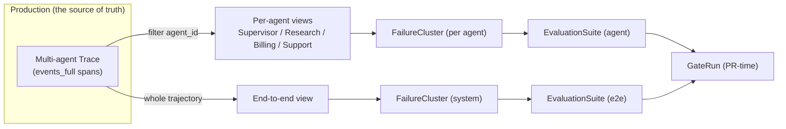
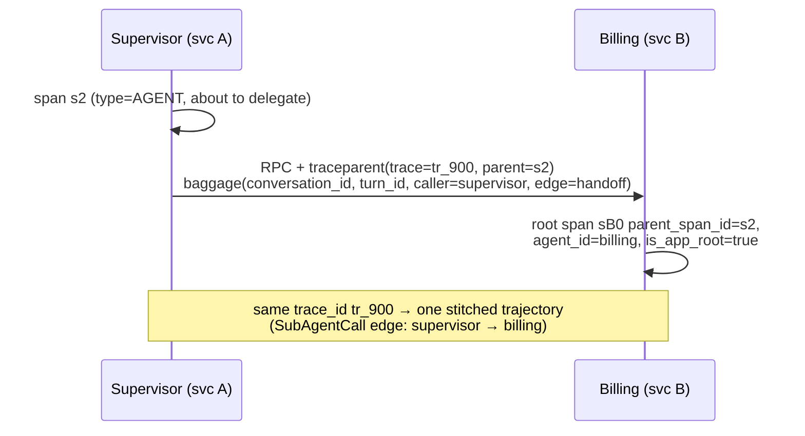
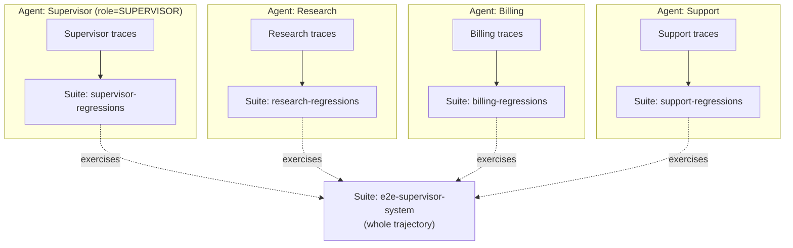
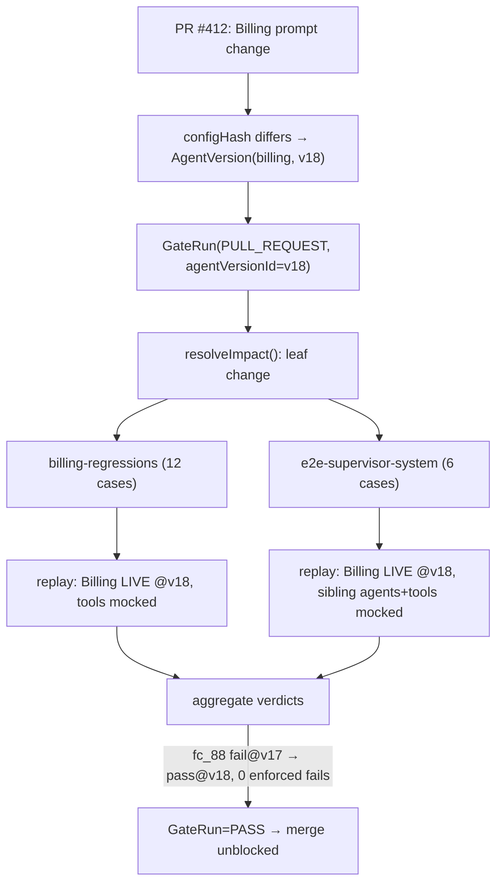

# Tracely Doc 06 — Multi-Agent Architecture

> **Scope.** How Tracely models multi-agent systems as first-class entities, derives per-agent **and** end-to-end evaluation from production traces, computes multi-agent-specific quality metrics grounded in MAST, and gates CI on the right suites when *one* agent or *the graph itself* changes. The trace is the source of truth; every agent/edge/suite/metric here is **derived from spans**.
>
> **Running example used throughout:** a **Supervisor** agent routing to three sub-agents — **Research**, **Billing**, **Support**. We model it once and reuse it in every section (data model, metrics, replay, CI, frameworks).
>
> **Coherence contract.** This doc obeys the canonical entities (`Agent, AgentVersion, AgentRun, Trace, Conversation, Turn, Step, ToolCall, LLMCall, SubAgentCall, EvaluationSuite, EvaluationCase, FailureCluster, Score, GateRun`) and the shared storage stack (Postgres registry + ClickHouse `events_full` wide span table + Redis/BullMQ + S3 + pgvector). Where it pins a schema field, **siblings must honor it** (see "Assumptions siblings must honor" at the end).

---

## 0. The thesis applied to many agents

Langfuse has **no** `Agent`, `AgentVersion`, `Conversation`, `Turn`, `Step`, or sub-agent edge — verified against all 65 Prisma models (Part 1 doc 06 §8; doc 11 §6). A "multi-agent system" in Langfuse is *one untyped span tree* where some nodes happen to carry `type='AGENT'` (`ObservationTypeMapper.ts:217-268`), and the "graph" is reconstructed in the browser from two LangGraph-only metadata keys `langgraph_node` / `langgraph_step` (`traces.ts:1588`, `events.ts:2832`) or, failing that, from span **timestamps** (`buildStepData.ts`). Edges are *inferred between consecutive steps and never recorded* (`buildGraphCanvasData.ts:175-205`); there is even a `// TODO: make detection more robust` (`TraceGraphView.tsx:58`).

That read-time reconstruction is fine for a waterfall UI and **fatal for regression testing**: you cannot diff, version, or assert on a graph you recompute (lossily) on every render. Tracely's multi-agent bet is to **persist the agent graph as data at ingest** — first-class `agent_id` on every span, a typed `SubAgentCall` edge between caller and callee, and explicit `Conversation/Turn/Step` boundaries for all frameworks (not just LangGraph) — so each agent and the whole system can each own traces, suites, regression tests, and a CI gate.



---

## 1. Entities: modeling the Supervisor tree

### 1.1 Postgres registry (OLTP) — `Agent`, `AgentVersion`, edges

Agents and their versions are **registry metadata** → Postgres (Prisma), exactly like Langfuse keeps `Project`/`ApiKey` in Postgres and bulk spans in ClickHouse (Part 1 doc 04). Runs and spans live in ClickHouse (§1.2). [Synthesis]

```prisma
// packages/shared/prisma/schema.prisma  (Tracely additions)

model Agent {
  id           String   @id @default(cuid())
  projectId    String   @map("project_id")
  slug         String                              // stable slug, e.g. "supervisor", "billing"; SDK wire attr tracely.agent.id carries this
  displayName  String   @map("display_name")
  kind         AgentKind @default(SINGLE)          // topology: SINGLE | MULTI_AGENT | WORKFLOW
  role         AgentRole @default(GENERIC)         // role in a multi-agent system: SUPERVISOR | WORKER | PLANNER | EXECUTOR | GENERIC
  framework    AgentFramework @default(CUSTOM_OTEL)// LANGGRAPH | OPENAI_AGENTS | AGNO | CUSTOM_OTEL
  // declared graph (optional, from code/config); the OBSERVED graph is derived from spans (§3)
  declaredChildren AgentEdge[] @relation("caller")
  declaredParents  AgentEdge[] @relation("callee")
  versions     AgentVersion[]
  createdAt    DateTime @default(now()) @map("created_at")
  @@unique([projectId, slug])
  @@map("agents")
}

model AgentVersion {
  id           String   @id @default(cuid())
  agentId      String   @map("agent_id")
  agent        Agent    @relation(fields: [agentId], references: [id])
  // human label + content hash so a PR that changes a prompt/graph mints a new version
  label        String                              // "v17", git sha, or semver
  configHash  String                              // sha256(systemPrompt + toolSchemas + modelParams + graphTopology)
  gitSha       String?  @map("git_sha")
  promptHash   String?  @map("prompt_hash")
  toolSchemaHash String? @map("tool_schema_hash")
  createdAt    DateTime @default(now()) @map("created_at")
  @@unique([agentId, configHash])
  @@index([agentId, createdAt])
  @@map("agent_versions")
}

// DECLARED edge of the multi-agent graph (the topology a human/codegen asserts).
// The OBSERVED edge per run is the SubAgentCall row in ClickHouse (§2). Impact analysis (§6)
// unions both: declared edges give a stable graph even before any run exists.
model AgentEdge {
  id            String   @id @default(cuid())
  projectId     String   @map("project_id")
  callerAgentId String   @map("caller_agent_id")
  caller        Agent    @relation("caller", fields: [callerAgentId], references: [id])
  calleeAgentId String   @map("callee_agent_id")
  callee        Agent    @relation("callee", fields: [calleeAgentId], references: [id])
  edgeType      EdgeType                            // HANDOFF | DELEGATE | TOOL_AS_AGENT
  @@unique([projectId, callerAgentId, calleeAgentId, edgeType])
  @@map("agent_edges")
}

enum AgentKind        { SINGLE MULTI_AGENT WORKFLOW }
enum AgentRole        { SUPERVISOR WORKER PLANNER EXECUTOR GENERIC }
enum AgentFramework   { LANGGRAPH OPENAI_AGENTS AGNO CUSTOM_OTEL }
enum EdgeType         { HANDOFF DELEGATE TOOL_AS_AGENT }
```

For the running example the registry holds 4 `Agent` rows and 3 `AgentEdge` rows:

```
Agent(supervisor, kind=MULTI_AGENT, role=SUPERVISOR)  Agent(research, role=WORKER)  Agent(billing, role=WORKER)  Agent(support, role=WORKER)
AgentEdge(supervisor -> research, HANDOFF)
AgentEdge(supervisor -> billing,  DELEGATE)
AgentEdge(supervisor -> support,  HANDOFF)
```

### 1.2 ClickHouse `events_full` — first-class semantic columns on every span

We reuse the Langfuse `events_full` DDL verbatim (`dev-tables.sh:137-281`; verified facts §"events_full verbatim DDL"): `ReplacingMergeTree(event_ts, is_deleted)`, `PARTITION BY toYYYYMM(start_time)`, `ORDER BY (project_id, toStartOfMinute(start_time), xxHash32(trace_id), span_id, start_time)`, ZSTD-3 `input`/`output`, materialized cost columns. We **add Tracely first-class semantic columns** — the core gap vs Langfuse, where these live only in `metadata['langgraph_*']` and are reconstructed at read time.

```sql
-- ALTER events_full ADD COLUMN ... (Tracely semantic layer; all LowCardinality where bounded)
-- == Identity of the actor and the run ==
agent_id              LowCardinality(String) DEFAULT '',   -- which Agent produced this span
agent_version_id      LowCardinality(String) DEFAULT '',   -- which AgentVersion (impact analysis + FAIL-TO-PASS provenance)
agent_run_id          String                 DEFAULT '',   -- one invocation of one agent (root span of that agent's subtree)
-- == Conversation / turn / step (FIRST-CLASS, not derived) ==
conversation_id       String                 DEFAULT '',   -- multi-turn grouping (supersedes Langfuse session_id-as-string)
turn_id               String                 DEFAULT '',   -- one user<->system exchange within a conversation
turn_index            UInt32                 DEFAULT 0,     -- ordering of the turn (Langfuse has NO turn ordering)
step_id               String                 DEFAULT '',   -- one logical step within an agent run
step_index            UInt32                 DEFAULT 0,     -- ordering of the step within the run
-- == Typed edges ==
edge_type             LowCardinality(String) DEFAULT '',   -- '' | handoff | delegate | tool-as-agent  (set on SubAgentCall spans)
caller_agent_id       LowCardinality(String) DEFAULT '',   -- handoff/delegate: who initiated
callee_agent_id       LowCardinality(String) DEFAULT '',   -- handoff/delegate: who received
tool_call_id          String                 DEFAULT '',   -- links an LLMCall tool-request to the TOOL span that executed it (§2.3)
-- == Skip indexes for the new access paths ==
INDEX idx_agent_id        agent_id        TYPE bloom_filter(0.01) GRANULARITY 1,
INDEX idx_agent_run_id    agent_run_id    TYPE bloom_filter(0.01) GRANULARITY 1,
INDEX idx_conversation_id conversation_id TYPE bloom_filter(0.01) GRANULARITY 1,
INDEX idx_turn_id         turn_id         TYPE bloom_filter(0.01) GRANULARITY 1,
INDEX idx_callee_agent_id callee_agent_id TYPE bloom_filter(0.01) GRANULARITY 1
```

Mapping canonical entities onto rows (the span `type` reuses the Langfuse 10-value enum `SPAN|EVENT|GENERATION|AGENT|TOOL|CHAIN|RETRIEVER|EVALUATOR|EMBEDDING|GUARDRAIL`, `observations.ts:5-16`):

| Canonical entity | `events_full` representation |
|---|---|
| **AgentRun** | the subtree rooted at the span where `span_id == agent_run_id` (the agent's entry span; `type='AGENT'`). A root agent run is also a trace root: `parent_span_id='' OR is_app_root=true` (`eventsTable.ts:4`). |
| **Step** | any span with a `step_id`; `step_index` orders them within `agent_run_id`. |
| **ToolCall** | `type='TOOL'` span; linked to its requesting `LLMCall` via `tool_call_id`. |
| **LLMCall** | `type='GENERATION'` span carrying `model/usage_details/cost_details` + emitted `tool_calls[]`. |
| **SubAgentCall** | a span with `edge_type∈{handoff,delegate,tool-as-agent}`, `caller_agent_id`/`callee_agent_id` set; `parent_span_id` points into the caller's subtree, `span_id` is (or parents) the callee's `agent_run_id`. |
| **Conversation / Turn** | `conversation_id` + `turn_id`/`turn_index` denormalized onto every span (same flattening pattern Langfuse uses for `session_id`). |

### 1.3 The Supervisor tree as one trace (preferred)

When all sub-agents run **in one process** (e.g. a LangGraph app), the whole system is **one `trace_id`**. The supervisor and each sub-agent get distinct `agent_id` + `agent_run_id`; handoffs are `SubAgentCall` spans inside the tree.

```
trace_id = tr_900   conversation_id = c_1   turn_id = t_1  turn_index=0
└─ span s0  type=AGENT  agent_id=supervisor  agent_run_id=s0  is_app_root=true   step_index=0   (root agent run)
   ├─ span s1 type=GENERATION agent_id=supervisor (LLMCall: "route this billing question")
   │     tool_calls=["{name:route, args:{to:billing}}"]   tool_call_names=["route"]
   ├─ span s2 type=AGENT  edge_type=delegate  caller_agent_id=supervisor  callee_agent_id=billing
   │     agent_id=billing  agent_run_id=s2  step_index=1            <- SubAgentCall (the typed handoff)
   │  ├─ span s3 type=GENERATION agent_id=billing (LLMCall) tool_calls=["{name:get_invoice,args:{id:42}}"]
   │  │     tool_call_id=tc_7
   │  └─ span s4 type=TOOL  agent_id=billing  name=get_invoice  tool_call_id=tc_7   <- linked to s3
   └─ span s5 type=GENERATION agent_id=supervisor (LLMCall: compose final answer)
```

Each agent now has **its own runs** by filtering `agent_id`; the **system** is the whole `trace_id` (or whole `conversation_id` for multi-turn).

### 1.4 Sub-agents as separate services (linked traces) — OTel context propagation

When sub-agents are **separate services** (Billing is its own deployment behind RPC), they emit their **own** traces. Tracely links them across the service boundary using **standard W3C OTel context propagation** — the same mechanism Langfuse relies on for parentage (the entire tree backbone is OTLP `parentSpanId`, doc 11 §1.2): the caller injects `traceparent` (and Tracely baggage) into the outbound request; the callee continues the same `trace_id` and sets its root span's `parent_span_id` to the caller's span id.

Propagation contract (caller → callee headers):

```
traceparent:  00-<trace_id>-<caller_span_id>-01            # W3C standard; preserves trace_id + parent
baggage:      tracely.conversation_id=c_1,                  # OTel baggage (RFC) carries Tracely keys
              tracely.turn_id=t_1,
              tracely.caller_agent_id=supervisor,
              tracely.edge_type=handoff
```

Two valid outcomes, both supported:

1. **Same trace_id across services (preferred even cross-service).** The callee's spans share `trace_id=tr_900`; the `SubAgentCall` span at the boundary has `caller_agent_id=supervisor`, `callee_agent_id=billing`. This is the cleanest — one trace = one system trajectory. Langfuse already supports a non-root span being a logical entry via `is_app_root`/`langfuse.internal.as_root` (`OtelIngestionProcessor.ts:769-771`), which we reuse to mark the callee's service-root.
2. **Linked traces (when teams refuse a shared trace_id).** The callee starts a **new** `trace_id` but stamps `metadata['tracely.parent_trace_id']` + `metadata['tracely.parent_span_id']` from the incoming `traceparent`. At ingest we materialize a `SubAgentCall` **link row** (a synthetic span in the caller's trace with `callee_agent_id=billing` and a `linked_trace_id` pointer). End-to-end suites (§4.2) then stitch the two traces by following the link.



**Ingest-side derivation** (where these columns get populated): extend the Langfuse `OtelIngestionProcessor` (doc 11 §1–4). Reuse its convention cascade (`extractInputAndOutput`, `:1386-1848`) and the `ObservationTypeMapperRegistry` (`ObservationTypeMapper.ts`) unchanged. **Add** a Tracely pass that (a) resolves `agent_id`/`agent_version_id` (from `tracely.*` baggage, else the framework signal in §5, else span `name`); (b) cuts `agent_run_id` at each `type='AGENT'` boundary; (c) emits `SubAgentCall` columns when an AGENT span's parent belongs to a *different* agent; (d) assigns `turn_id`/`step_id` once at ingest and **stores** them (vs Langfuse's per-render `buildStepData`). This is doc 06's instruction to "run the stepper once at ingest and persist" (doc 11 §7 item 6).

---

## 2. Typed edges in detail

### 2.1 `SubAgentCall` (`caller → callee`)

A `SubAgentCall` is the explicit edge Langfuse lacks (doc 06 §8.2: "a multi-agent handoff is just one AGENT span being the parent of another … there is no edge typed as handoff/delegation"). It is **one span row** with:

```
type            = AGENT
edge_type       ∈ { handoff, delegate, tool-as-agent }
caller_agent_id = <initiating agent>
callee_agent_id = <receiving agent>
agent_run_id    = <span_id>          # the callee's run starts here
input           = the context the caller passed (used for context-passing fidelity, §3)
parent_span_id  = <a span inside the caller's subtree>
```

`edge_type` semantics:
- **handoff** — control transfers; the callee owns the rest of the turn (OpenAI Agents SDK handoffs; LangGraph conditional edge to another node).
- **delegate** — the caller fans out a sub-task and **resumes** afterward (supervisor → billing → back to supervisor to compose the answer).
- **tool-as-agent** — a sub-agent invoked *as a tool* (an agent wrapped behind a tool schema). Detected when a `type='TOOL'` span's callee resolves to a registered `Agent`.

### 2.2 Turn ordering edge

`turn_index` gives the strict ordering Langfuse has *nothing* for (doc 06 §8.4: "no turn ordering or boundaries; multi-turn = multiple traces sharing session_id"). A `Conversation` is `conversation_id`; its `Turn[]` are ordered by `(turn_index, min(start_time))`. This makes **turn-level** regression possible (a fix must not break turn 3 given turns 1–2 as fixed prefix).

### 2.3 `tool_call_id` linkage (LLMCall request → TOOL execution)

Langfuse captures tool use twice (a `TOOL` observation *and* `tool_calls[]` on the GENERATION) but the link between "model asked for tool X" and "TOOL span that ran X" is **name-matched only, no FK** (doc 06 §5.2). Tracely adds `tool_call_id` to both the emitting `LLMCall` and the executed `TOOL` span. We reuse the existing extraction: `tool_calls[i]` already stores `{id, arguments, type, index}` and `tool_call_names[i]` stores the name (verified facts §"ClickhouseToolArgumentSchema"). We simply **promote that `id` to a stored column** and write the same id onto the matching `TOOL` span. This typed edge is what trajectory replay (§5) and tool-args matching depend on.

---

## 3. Multi-agent-specific metrics (grounded in MAST)

MAST (doc 91 §1.3) partitions multi-agent failures into three buckets with measured prevalence across 1600+ traces (κ=0.88): **specification / system-design ≈ 42%**, **inter-agent misalignment / coordination ≈ 37%**, **task-verification ≈ 21%**. Tracely ships these three as the **default `FailureCluster` categories** for multi-agent systems and defines metrics that map onto each. Every metric is a `Score` (reusing the Langfuse `Score` addressing model and the self-tracing `execution_trace_id`, verified facts §"Score addressing model").

| Tracely metric | MAST bucket | What it measures | How it's computed from spans | Targets (`Score` address) |
|---|---|---|---|---|
| **Routing / handoff quality** | inter-agent misalignment | Did the supervisor route to the *right* sub-agent? | Compare each `SubAgentCall.callee_agent_id` against the reference callee for that turn (deterministic when a reference trajectory exists; LLM-judge "should this query go to billing or support?" otherwise). | the `SubAgentCall` span (`observation_id`) |
| **Context-passing fidelity** | inter-agent misalignment | Did the caller pass the info the callee needed (no dropped entities)? | Entity/slot recall: extract required slots from the caller's pre-handoff state, check presence in `SubAgentCall.input`. LLM-judge fallback (reference-guided). | the `SubAgentCall` span |
| **Coordination quality** | inter-agent misalignment | Were sub-agents invoked in a sane order, without redundant/looping handoffs? | Structural: count redundant `SubAgentCall`s (same callee twice with no new info), detect cycles, compare handoff sequence to reference via `agentevals` graph-trajectory match (doc 91 §1.2). | the `agent_run_id` (root) |
| **Sub-agent task success** | task-verification | Did each sub-agent complete *its* sub-task? | Per-agent eval (§4.1): the callee's subtree judged against that agent's own suite. | the callee `agent_run_id` |
| **Spec / role adherence** | specification / system-design | Did each agent stay in its role (billing agent didn't answer a research question)? | Role classifier over the agent's outputs vs its declared `AgentRole`/scope; flag out-of-scope tool calls. | the agent's `agent_run_id` |
| **End-to-end success** | (whole system) | Did the *system* satisfy the user's request across the full trajectory? | Final-answer judge over the conversation/turn output + trajectory-satisfy (doc 91 §1.1) over the whole stitched trace. | `conversation_id` / `turn_id` / `trace_id` |

[Synthesis] **Why these six.** They are the smallest set that (a) covers all three MAST buckets, (b) is mostly *deterministic* (routing, context recall, coordination structure are computable from the typed edges without an LLM — cheap enough to run on every PR, the Galileo Luna-2 economics point from doc 90), and (c) decomposes cleanly into "per-agent" vs "system" so the CI impact analysis (§6) can pick the right subset. LLM-judge is reserved for the genuinely fuzzy parts (was *billing* the right destination? did the handoff *context* suffice?) and always carries bias mitigations (position-swap, cross-provider judge, reference-guided) per doc 91 §1.4.

**Score reuse (verbatim addressing).** A Tracely `Score` targets any of `conversation_id | turn_id | agent_run_id(observation/span) | tool_call(span) | trace_id` plus `execution_trace_id` (the trace of the judge run itself). This is literally the Langfuse `scoreRecordBaseSchema` address set (`definitions.ts:210-231`) extended with the Tracely entity ids; we keep `source=EVAL` for evaluator output and add a `verdict ∈ {PASS,FAIL,SKIP}` alongside `value` for gate semantics (REPLACE/EXTEND note, verified facts §eval).

---

## 4. Per-agent vs end-to-end suites

### 4.1 Each agent owns its traces, suite, and regression tests

Because `agent_id` is a first-class indexed column, **"the Billing agent's traces"** is a single filter:

```sql
-- All Billing AgentRuns in the last 7 days (events_full, FINAL for correctness)
SELECT agent_run_id, agent_version_id, min(start_time) AS t0,
       max(level = 'ERROR') AS had_error
FROM events_full FINAL
WHERE project_id = {pid}
  AND agent_id   = 'billing'
  AND start_time > now() - INTERVAL 7 DAY
GROUP BY agent_run_id, agent_version_id
ORDER BY t0 DESC;
```

The per-agent pipeline is the Tracely spine restricted to one `agent_id`:

```
Billing production runs
  → failure detection (level=ERROR/status_message; metric thresholds §3)
  → FailureCluster (agent_id='billing' scoped): Drain3 template_id + MinHash-LSH dedup at ingest,
     batch BERTopic for labels (doc 91 §2)
  → promote cluster medoid → EvaluationCase (input prefix + recorded FIXTURES of billing's tool outputs
     + reference sub-trajectory + match mode), provenance {source_trace_id, failure_cluster_id,
     agent_version_first_failed}
  → EvaluationSuite("billing-regressions")
  → FAIL-TO-PASS contract: case must fail on agent_version_first_failed, pass on the fix
```

A per-agent `EvaluationCase` replays **only the Billing subtree**: the `SubAgentCall` *into* billing supplies the input; everything *outside* billing is irrelevant. This is why per-agent tests are cheap and stable — they don't depend on the supervisor's prompt.

### 4.2 The system owns end-to-end suites over the whole trajectory

An **end-to-end** `EvaluationCase` captures the *whole* multi-agent trajectory:

- **Input/prefix:** the user message(s) for the conversation/turn at the trace root.
- **Reference trajectory:** the full sequence of typed edges — `Supervisor.LLMCall → SubAgentCall(→billing) → Billing.LLMCall → Billing.ToolCall(get_invoice) → Supervisor.LLMCall(compose)` — with a **graph-trajectory match mode** (`agentevals` node-based mode for LangGraph; sequence mode otherwise, doc 91 §1.2).
- **Fixtures:** recorded tool outputs for *all* agents' tools (so replay is hermetic), optionally recorded LLM outputs for the agents you want frozen.
- **Assertions:** end-to-end success + coordination/handoff/context metrics from §3.

```sql
-- The end-to-end trajectory of one system run (stitched, ordered) for case capture / replay
SELECT span_id, parent_span_id, agent_id, type, name,
       edge_type, caller_agent_id, callee_agent_id, tool_call_id,
       step_index, input, output
FROM events_full FINAL
WHERE project_id = {pid} AND trace_id = {trace_id}   -- (UNION linked_trace_id rows for cross-service, §1.4)
ORDER BY step_index, start_time;
```



The dashed edges encode the **impact graph** used in §6: the e2e suite *exercises* each agent, so changing an agent triggers both its own suite and every e2e suite that exercises it.

---

## 5. Replay of a multi-agent trajectory (which spans are mocked vs live)

A regression test is a **deterministic hermetic replay** (eval decision: captured input/prefix + recorded fixtures for replay). The central question for multi-agent: **which spans run live and which are served from fixtures?**

### 5.1 The replay matrix

| Replay target | LLMCall spans | ToolCall spans | SubAgentCall (callee subtree) |
|---|---|---|---|
| **Per-agent test (e.g. Billing)** | the *agent under test* runs **live** (new `AgentVersion`); other agents are **not present** (we only replay the billing subtree). | billing's tools **mocked from fixtures** (deterministic). | n/a — billing is a leaf in this replay; the inbound `SubAgentCall.input` is the captured fixture. |
| **End-to-end test, changed agent = Billing** | **Billing live**; Supervisor/Research/Support LLMCalls **replayed from fixtures** (frozen) so the test isolates billing's change. | the changed agent's tools mocked; unchanged agents' tools also mocked. | only Billing's subtree executes live; sibling `SubAgentCall`s replay recorded outputs. |
| **End-to-end test, changed = Supervisor/graph** | **Supervisor live**; sub-agent runs replayed from fixtures *unless* the new routing reaches a sub-agent the recording didn't exercise. | all tools mocked. | sub-agents are replayed by `callee_agent_id`; a **new** callee (routing changed) is run live or flagged "uncovered" (see §5.3). |
| **Full live (smoke / nightly)** | everything live | everything live (or sandbox tools) | all sub-agents live |

**Default:** *replay everything except the spans owned by the changed `AgentVersion`.* This gives the tightest blast radius and the cleanest FAIL-TO-PASS signal: the test fails *because of* the change, not because of unrelated nondeterminism.

### 5.2 How a replay is driven (fixture store + interceptor)

Fixtures are recorded blobs in S3 (reusing the Langfuse S3 source-of-truth pattern; verified facts §"Async write-path"): `s3://.../fixtures/{evaluation_case_id}/{span_id}.json`. At replay, a thin **interceptor** keyed on `tool_call_id` (tools) and `(agent_id, step_index)` (LLMCalls / sub-agents) returns the recorded `output` instead of calling the provider. The replay itself is **traced** (it produces a normal `events_full` trace with `agent_version_id` = the version under test and a `gate_run_id`), so the eval is auditable — the same "evals are themselves traced" guarantee Langfuse encodes via `execution_trace_id` (Part 1 doc 06 §6).

### 5.3 Trajectory divergence (the multi-agent-hard case)

When the changed Supervisor routes **differently** (e.g. now sends a billing question to Support), the recorded fixtures for the new path may not exist. Policy [Synthesis]:

1. If the new callee has a fixture for the same `SubAgentCall.input` → replay it.
2. Else if the new callee is a registered `Agent` with a pinned version → run it live in the sandbox (still hermetic at the tool layer).
3. Else → **`verdict=SKIP` with reason `uncovered_trajectory`**, surfaced as a coverage gap (and a candidate new e2e case). A divergent route that *improves* the answer should not be a false FAIL; a divergent route that drops context **fails** the context-passing-fidelity metric (§3). Match mode matters: default to **order-relaxed** trajectory matching (doc 91 §1.5 — Inclusion > Exact-Match empirically) so a legitimately re-ordered-but-correct multi-agent run is not a phantom regression.

---

## 6. CI implications: impact analysis from the agent graph

The whole point: a PR that changes **one** agent should run *that agent's* suite **plus** the end-to-end suites that exercise it — not the entire eval universe (too slow) and not just the unit suite (misses coordination regressions). [Synthesis]

### 6.1 The impact graph

The impact graph is the **union** of (a) declared `AgentEdge` rows (registry) and (b) observed `SubAgentCall` edges aggregated from recent production traces (so a route a human forgot to declare but that happens in prod is still covered). A `GateRun` resolves the suite set from the changed `AgentVersion`(s):

```ts
// worker: resolve which suites a PR must run, given the changed agent versions
type ImpactResult = { agentSuites: SuiteId[]; e2eSuites: SuiteId[]; reason: string };

async function resolveImpact(changed: AgentVersion[]): Promise<ImpactResult> {
  const changedAgentIds = new Set(changed.map(v => v.agentId));

  // 1) the changed agents' own suites (always)
  const agentSuites = await suitesForAgents([...changedAgentIds]);

  // 2) e2e suites that EXERCISE any changed agent.
  //    "exercises" = the e2e suite's reference trajectories contain a span with agent_id ∈ changed,
  //    OR the impact graph has a path from an e2e root agent to a changed agent.
  const e2eSuites = await e2eSuitesTouching([...changedAgentIds]);

  // 3) if a SUPERVISOR or the graph topology changed (declared AgentEdge set changed,
  //    or supervisor configHash changed) → run ALL e2e suites rooted at that supervisor.
  const graphChanged = changed.some(v => v.agent.role === "SUPERVISOR")
                    || (await topologyChanged(changed));
  const e2eFinal = graphChanged ? await allE2eSuitesRootedAt(changedAgentIds) : e2eSuites;

  return { agentSuites, e2eSuites: e2eFinal,
           reason: graphChanged ? "graph/supervisor change → all e2e" : "leaf agent change → impacted e2e" };
}
```

Rules, stated plainly:

- **Change one leaf agent** (Billing prompt/tool) → run `billing-regressions` + every e2e suite whose reference trajectory contains a `billing` span. Research/Support unit suites are **skipped**.
- **Change the Supervisor or the graph topology** (add/remove an `AgentEdge`, change routing logic, supervisor configHash changes) → run **all** e2e suites rooted at that supervisor (routing changes can break *any* downstream path), plus the supervisor's own suite.
- **Change shared infra** (a tool used by multiple agents) → union of all agents that call that tool, via `tool_call_names`/`tool_definitions` reverse lookup.

### 6.2 `GateRun` and verdict aggregation

The `GateRun` model is **owned by doc 09** (the schema of record); this doc does not redefine it. A `GateRun` carries `agentVersionId` (the candidate under test), `baselineVersionId` (the version currently at `env=prod`, §7.5 of `00-canonical-decisions.md`), and `selectedSuiteIds[]` — for a multi-agent change, the impacted e2e suites are simply the entries `resolveImpact()` (§6.1) writes into `selectedSuiteIds`. Per-case verdict/cost/latency live in `GateCase` rows; `GateStatus ∈ {PENDING,RUNNING,PASS,FAIL,ERROR}` and `GateTrigger ∈ {PULL_REQUEST,MANUAL,SCHEDULED,API}` (canonical: `00-canonical-decisions.md` §3; full DDL in `09-database-schema.md`).

A `GateRun` **fails** if any `EvaluationCase` with an enforced FAIL-TO-PASS contract returns `verdict=FAIL`. `verdict=SKIP` (e.g. `uncovered_trajectory`) is reported but non-blocking by default (configurable). This is the Langfuse eval-job spine reused: `createEvalJobs → JobExecution(PENDING) → enqueue` with a new `sourceEventType="agent-run-replay"` and a `verdict` field (REUSE list, verified facts §eval).

### 6.3 BullMQ wiring (reuse Langfuse queues verbatim)

We reuse the Langfuse `QueueName`/`QueueJobs` machinery (`queues.ts:324-397`) and `WorkerManager.register` (`workerManager.ts:127-185`). New queues mirror the existing eval queues:

```ts
// packages/shared/src/server/queues.ts  (Tracely additions to QueueName)
GateRunQueue   = "gate-run-queue"   // one job per PR; resolves impact, fans out cases
ReplayQueue    = "replay-queue"     // one job per EvaluationCase replay (sharded by agent_run_id)
ClusteringQueue = "clustering-queue" // batch BERTopic re-cluster + medoid selection (nightly)
```

```ts
// worker/src/queues/gateRunQueue.ts
export const gateRunProcessor = async (job: Job<GateRunJob>) => {
  const { gateRunId, changedAgentVersionIds } = job.data;
  const changed = await getAgentVersions(changedAgentVersionIds);
  const { agentSuites, e2eSuites } = await resolveImpact(changed);   // §6.1
  const cases = await casesForSuites([...agentSuites, ...e2eSuites]);
  await Promise.all(cases.map(c =>
    ReplayQueue.add(QueueJobs.TrajectoryReplayJob,
      { gateRunId, evaluationCaseId: c.id, agentVersionUnderTest: pickVersion(c, changed) },
      { attempts: 3, backoff: { type: "exponential", delay: 5000 } })));  // mirrors IngestionQueue opts
};
```

Each `TrajectoryReplayJob` runs the §5 replay, writes `Score`s (with `verdict` + `execution_trace_id`), and decrements an outstanding-cases counter; when it hits zero the `GateRun` status is aggregated to PASS/FAIL. Replay is **sharded by `agent_run_id`** so a flaky case can't block the shard (reusing the Langfuse `getShardIndex` SHA-256 pattern, `sharding.ts:9-20`).

---

## 7. Framework specifics

The ingest layer reuses Langfuse's `OtelIngestionProcessor` + `ObservationTypeMapperRegistry` and adds a per-framework resolver that fills `agent_id`, `agent_run_id`, `edge_type`, `caller/callee_agent_id`, `turn_id`, `step_id`. Below: the signals each framework already emits (verified in Langfuse source) and how Tracely lifts them to first-class columns.

### 7.1 LangGraph — graph nodes/edges as Steps/handoffs

LangGraph is the *only* framework Langfuse partially models, via `metadata['langgraph_node']` / `metadata['langgraph_step']` (`traces.ts:1588`, `events.ts:2832`; constants `LANGGRAPH_NODE_TAG`/`LANGGRAPH_STEP_TAG`, `trace-graph-view/types.ts:14-15`). Tracely mapping:

| LangGraph concept | Signal (existing) | Tracely column |
|---|---|---|
| graph node | `metadata['langgraph_node']` | `step_id = node`, and `agent_id` if the node *is* a sub-agent (node name ∈ registered agents) |
| step ordinal | `metadata['langgraph_step']` | `step_index` (stored at ingest, not re-derived) |
| reserved start/end | `__start__` / `__end__` (`types.ts:16-17`) | dropped from the trajectory (system nodes) |
| conditional edge to another agent node | consecutive nodes where callee node is a registered agent | `SubAgentCall` with `edge_type=handoff`, `caller/callee_agent_id` from the two nodes |
| checkpoint namespace | `langgraph_checkpoint_ns` (doc 11 §5.1) | used to disambiguate sub-graph boundaries → `agent_run_id` cut |

So a LangGraph supervisor graph becomes: each node-execution span → a `Step`; each transition into a node that maps to a registered `Agent` → a typed `SubAgentCall`. Graph-trajectory match mode (node-based, `agentevals`) is used for e2e assertions.

### 7.2 OpenAI Agents SDK — handoffs

The OpenAI Agents SDK is instrumented via **OpenInference** (scope name `openinference.instrumentation.openai_agents`, confirmed `langgraph.ts:290-292`). Its spans carry `openinference.span.kind` which the mapper already turns into `AGENT`/`TOOL`/`GENERATION` (priority 2, `ObservationTypeMapper.ts:236-247`). Handoffs in this SDK are explicit handoff tool-calls. Tracely mapping:

| OpenAI Agents concept | Signal | Tracely column |
|---|---|---|
| agent | `openinference.span.kind == AGENT` | `agent_id` (from span name / agent name attr) |
| handoff | a tool-call whose name is a handoff (`transfer_to_<agent>` convention) → child AGENT span | `SubAgentCall` `edge_type=handoff`, `callee_agent_id` parsed from the handoff target; `tool_call_id` links the request to the new agent run |
| tool | `openinference.span.kind == TOOL` | `ToolCall` + `tool_call_id` |
| conversation | `gen_ai.conversation.id` (recognized by Langfuse sessionId chain, `OtelIngestionProcessor.ts:2023`) | `conversation_id` |

Because handoffs are real tool-calls here, the `tool_call_id` → callee `agent_run_id` link (§2.3) is exact — the cleanest handoff signal of any framework.

### 7.3 Agno

Agno emits **OpenInference** `llm.input_messages.*` / `llm.output_messages.*` (explicitly called out in Langfuse: `// used by Agno, BeeAI, etc.`, `OtelIngestionProcessor.ts:1798`). Langfuse already un-flattens these via `convertKeyPathToNestedObject` (doc 11 §2). Agno multi-agent "teams" appear as nested AGENT spans. Tracely mapping: `openinference.span.kind` (when present) or the model-based fallback gives `type`; team membership / leader→member calls become `SubAgentCall` (`edge_type=delegate` for a team leader fanning out, `handoff` for sequential transfer). Where Agno does not emit an explicit edge, we fall back to **parentage + the AGENT-type-change heuristic** with an `edge_provenance='inferred'` flag (so the CI gate never fails on a phantom edge — doc 11 §7 open implication).

### 7.4 Custom OTel-compatible frameworks

For a bespoke framework the contract is: emit OTLP spans and set, at minimum, the **Tracely semantic attributes** (a small, framework-neutral superset of `langfuse.observation.*`):

```
tracely.agent.id           = "billing"
tracely.agent.version      = "v17"            # or git sha; we hash to AgentVersion.configHash
tracely.agent.kind         = "worker"         # supervisor|worker|planner|executor|generic
tracely.conversation.id    = "c_1"
tracely.turn.id            = "t_1"
tracely.turn.index         = 0
tracely.step.id            = "fetch_invoice"
tracely.step.index         = 1
tracely.edge.type          = "handoff"        # on the SubAgentCall span only
tracely.edge.caller_agent  = "supervisor"
tracely.edge.callee_agent  = "billing"
langfuse.observation.type  = "agent"          # reuse Langfuse type mapping (priority-1 direct map)
```

If a custom framework sets **none** of these, Tracely still produces a serviceable graph by running the Langfuse timing-based stepper **once at ingest** (`buildStepData.ts` logic, doc 11 §4.4) and storing the result — agents default to one-per-root-AGENT-span, steps from timing, edges from parentage with `edge_provenance='inferred'`. This guarantees the "OpenTelemetry-compatible custom frameworks" requirement: zero framework cooperation still yields per-agent + e2e suites, just with weaker edge fidelity.

---

## 8. Worked CI scenario (end-to-end)

A developer changes the **Billing** agent's system prompt to fix a hallucinated-refund bug that `FailureCluster fc_88` ("billing invents refund amounts", MAST=task-verification) flagged in production.

1. **Push.** CI calls Tracely's webhook with `git_sha`, PR #412, and the changed files. Tracely computes the Billing `AgentVersion.configHash` from the new prompt+tool schemas+model params; it differs → mints `AgentVersion(billing, v18)`. A `GateRun(trigger=PULL_REQUEST, agentVersionId=v18, baselineVersionId=<billing prod version>)` is created.

2. **Impact analysis** (`resolveImpact`, §6.1): Billing is a **leaf** (not a supervisor) →
   - `agentSuites = [billing-regressions]`
   - `e2eSuites` = every e2e suite whose reference trajectory contains a `billing` span → `[e2e-supervisor-system]`
   - Research/Support unit suites: **skipped**. Supervisor suite: skipped (its configHash is unchanged).

3. **Fan-out.** `GateRunQueue` enqueues one `TrajectoryReplayJob` per `EvaluationCase` in those two suites. Suppose `billing-regressions` has 12 cases (one is the `fc_88` medoid, FAIL-TO-PASS contract bound to `agent_version_first_failed=v17`) and `e2e-supervisor-system` has 6 cases that route to billing.

4. **Replay** (§5):
   - **Per-agent cases:** Billing runs **live at v18**; billing's tools served from fixtures; the inbound `SubAgentCall.input` is the captured prefix. The `fc_88` case **must now PASS** (refund amount comes from the `get_invoice` fixture, not hallucinated) and **must have FAILED at v17** — the FAIL-TO-PASS contract is checked against the stored v17 result.
   - **E2e cases:** Supervisor + Research + Support LLMCalls **replayed from fixtures** (frozen); only Billing's subtree runs live at v18. Metrics: end-to-end success, plus **context-passing fidelity** (did the supervisor still hand billing the invoice id? — unchanged, should pass) and **routing quality** (supervisor still routed to billing — unchanged).

5. **Verdict aggregation.** All 12 + 6 cases return `verdict`. The `fc_88` case: was-FAIL@v17, now-PASS@v18 → satisfies FAIL-TO-PASS → contributes PASS. One e2e case returns `verdict=SKIP(uncovered_trajectory)` because v18's slightly different phrasing made the supervisor's *replayed* turn reference a tool the fixture lacks — non-blocking, surfaced as a coverage gap. `GateRun.status = PASS` (no enforced case failed).

6. **PR comment** (Braintrust-style UX, doc 90 §3): per-case deltas, the `fc_88` row highlighted "regression FIXED (fail→pass)", the 1 skip flagged, links to each replay's own trace (`execution_trace_id`). Merge is unblocked.

7. **Merge → MERGE-trigger GateRun** (optional, stricter) re-runs the same suites + a nightly full-live smoke. The `fc_88` case stays in `billing-regressions` **forever** — "create a regression test → add to suite → run forever" (the spine).



---

## 9. Summary of decisions (opinionated)

1. **Persist the agent graph at ingest; never reconstruct it for a gate.** First-class `agent_id`/`agent_run_id`/`conversation_id`/`turn_id`/`step_id` + a typed `SubAgentCall` edge (`caller/callee_agent_id`, `edge_type`) + `tool_call_id` linkage are added as columns on the reused `events_full` table. This is the concrete fix for Langfuse's read-time `langgraph_node`/timestamp reconstruction (Part 1 docs 06, 11).
2. **One trace per system run is preferred** (even cross-service via W3C `traceparent` + Tracely baggage); linked traces are the fallback when teams refuse a shared `trace_id`, stitched via a `SubAgentCall` link row.
3. **Per-agent suites are leaf-scoped and cheap; e2e suites cover coordination.** Impact analysis unions declared `AgentEdge`s and observed `SubAgentCall`s to run *the changed agent's suite + every e2e suite that exercises it*; a supervisor/graph change runs *all* rooted e2e suites.
4. **Replay default = everything mocked except the changed `AgentVersion`'s spans** — tightest blast radius, cleanest FAIL-TO-PASS. Divergent trajectories that drop context fail the context-passing metric; novel routes with no fixture are `skip(uncovered_trajectory)`, not false fails. Order-relaxed trajectory matching by default.
5. **Metrics are MAST-bucketed and mostly deterministic** (routing, context-recall, coordination structure computed from typed edges; LLM-judge only for fuzzy routing/context decisions, always with bias mitigations). Results are `Score`s reusing Langfuse addressing + `execution_trace_id`, plus a `verdict` for gating.
6. **Reuse the Langfuse spine wholesale:** OTLP ingestion, `OtelIngestionProcessor`, `ObservationTypeMapperRegistry`, `events_full`, `Score`/`execution_trace_id`, `createEvalJobs`/`JobExecution`, BullMQ `WorkerManager`/sharding. Build only the semantic + suite/cluster/gate layer on top.

---

## Assumptions siblings must honor

- **`events_full` semantic columns are canonical** (names + types): `agent_id, agent_version_id, agent_run_id, conversation_id, turn_id, turn_index, step_id, step_index, edge_type, caller_agent_id, callee_agent_id, tool_call_id`. The data-model / ingestion docs must add exactly these (LowCardinality where bounded), not alternative names. (Doc 06 §1.2.)
- **Postgres registry tables:** `agents`, `agent_versions` (with `configHash` unique per agent), `agent_edges` (declared topology, `EdgeType ∈ {HANDOFF,DELEGATE,TOOL_AS_AGENT}`), `gate_runs`. (§1.1, §6.2.)
- **`AgentVersion.configHash = sha256(systemPrompt + toolSchemas + modelParams + graphTopology)`** is the trigger for impact analysis and the anchor for FAIL-TO-PASS provenance (`agent_version_first_failed`). The eval/CI docs must use this definition. (§1.1, §6.)
- **`Score` carries `verdict ∈ {PASS,FAIL,SKIP}`** alongside `value`/`string_value`, and targets any of `conversation_id|turn_id|agent_run_id|tool_call|trace_id` + `execution_trace_id`. The eval doc owns the full `Score`/`EvaluationCase`/`EvaluationSuite`/`FailureCluster` schema; this doc only constrains the multi-agent address set + verdict. (§3, §6.2.)
- **`edge_provenance ∈ {observed,inferred}`** must exist on `SubAgentCall` so a CI gate never fails on a heuristically-inferred (timing/parentage) edge. (§7.3, §7.4.)
- **OTel context propagation contract:** caller injects W3C `traceparent` + `baggage` keys `tracely.{conversation_id,turn_id,caller_agent_id,edge_type}`; custom frameworks set `tracely.*` span attributes (§1.4, §7.4). The ingestion doc must read these.
- **Multi-agent `FailureCluster` default categories = the 3 MAST buckets** (spec/system-design, inter-agent misalignment, task-verification). The clustering doc must seed these. (§3.)
