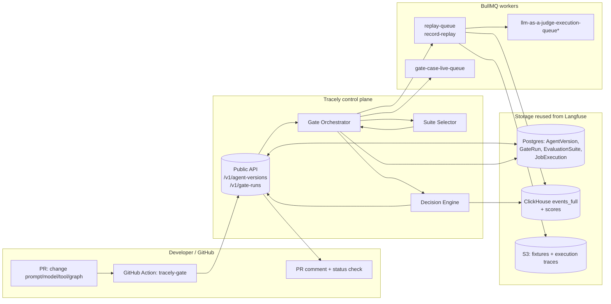

# Doc 08 — CI/CD-for-Agents Gate Architecture (the core product)

> **This is the product.** Tracely is *trace-native CI/CD for AI agents*: production traces become regression tests, and those tests gate the pull request that changes an agent. This document specifies the spine's right half — **AgentVersion → Gate → Verdict → Promotion** — and the developer surface (GitHub App + Action + `tracely test` CLI + Braintrust-style PR comment).
>
> Reads as a sibling to: doc 02 (entities/Postgres), doc 03 (ClickHouse span model), doc 05 (ingestion), doc 06 (EvaluationSuite/EvaluationCase + replay fixtures), doc 07 (failure clustering/RCA). Where those docs own an entity in detail, this doc references it and owns only the **GateRun** entity and the **gate decision algorithm**.
>
> Storage/eval/failure decisions are inherited verbatim from the project brief and `92-langfuse-verified-facts.md`. Every "reuse this" cites a Langfuse `file:line`. Author opinions are marked **[Synthesis]**.

---

## 0. TL;DR — the gate in one paragraph

A PR that changes a prompt, model, tool, agent graph, or retrieval config produces a **new `AgentVersion`** (deterministic `config_hash` + `git_sha`). A GitHub Action registers that version with the Tracely API and starts a **`GateRun`**. The gate orchestrator selects the relevant `EvaluationSuite`s (the changed agent's regression + eval suites, plus impacted e2e suites), fans them out as `EvaluationCase` jobs onto BullMQ worker queues (**record-replay by default**, live where the suite demands it), and reduces per-case `Score`s into a single **PASS/FAIL verdict** by combining: (1) fail-to-pass regression contracts, (2) eval-score thresholds (absolute **and** delta vs the current production `AgentVersion`), (3) cost, (4) latency. The verdict is posted as a Braintrust-style PR comment with per-case deltas; green ⇒ the `AgentVersion` is marked `deployable` and optionally canaried against live traffic. This is the part **no incumbent ships**: the CI artifact is a *production-failure-derived regression suite bound to the agent version*, not a curated dataset experiment (doc 90 §1, §5).


\* `llm-as-a-judge-execution-queue` is reused verbatim — Langfuse `queues.ts:330`.

---

## 1. The trigger: PR → new AgentVersion

### 1.1 What counts as "a change that needs a new version"

**[Synthesis]** An agent's *behavioral surface* is the set of inputs that can change its output for a fixed user request. Tracely versions exactly that surface, nothing else (no version churn on README edits). The surface is declared in `tracely.yaml` (§1.2) and consists of:

| Surface element | Example file/source | In `config_hash`? |
|---|---|---|
| System/instruction prompts | `prompts/planner.md`, inline strings | ✅ |
| Model + decode params | `gpt-5.1`, `temperature`, `top_p`, `max_tokens` | ✅ |
| Tool set + tool schemas | `tools/*.py` JSON schemas, MCP server URLs | ✅ |
| Agent graph / topology | LangGraph graph spec, handoff edges, sub-agent wiring | ✅ |
| Retrieval config | index name, `k`, reranker, chunking, embedding model | ✅ |
| Framework/runtime pin | `langgraph==0.2.x`, `openai-agents==1.x` | ✅ (coarse: major.minor) |
| Business logic around the agent | arbitrary repo code | ❌ (covered by `git_sha`, gated by e2e suites) |

The `config_hash` makes versions **content-addressable and dedup-able**: two PRs that arrive at the same prompt+model+tools+graph map to the *same* `AgentVersion`, so the gate skips re-running suites whose inputs didn't change (cache key `(config_hash, suite_id, suite_revision)`). `git_sha` is recorded for provenance/PR linkage but is **not** in the cache key.

### 1.2 `tracely.yaml` — the agent manifest (schema)

One file at repo root declares every agent in the repo, mapping `agent_id` → entrypoint, tools, graph, and **how to invoke it for live replay**. This is the contract the Action and the worker both read.

```yaml
# tracely.yaml — repo-root manifest. JSON-Schema'd; validated by `tracely lint`.
version: 1
project: connectly-support            # Tracely project slug (maps to Langfuse project_id)

defaults:
  replay_mode: record-replay          # record-replay | live  (per-suite override allowed)
  judge:
    provider: anthropic               # cross-provider judge default (doc 91 §1.4 bias mitigation)
    model: claude-haiku-4-6           # cheap judge a la Galileo Luna-2 (doc 90 §3 economics)
  thresholds:                         # repo-wide gate defaults; suite/agent can override
    regression_must_pass: true        # fail-to-pass contract is non-negotiable by default
    min_pass_rate: 1.0                # all selected regression cases must pass
    score_delta_max_drop: 0.02        # vs baseline prod version, per eval metric (warn-only by default)
    cost_delta_max_pct: 0.15          # +15% p50 cost vs baseline => warn (set cost_blocking:true to fail)
    latency_p95_delta_max_pct: 0.20   # +20% p95 latency vs baseline => warn (set latency_blocking:true to fail)
    # Only regression fail-to-pass is a hard gate by default; eval/cost/latency are warnings (canonical: 00-canonical-decisions.md §7.5)

agents:
  - id: support-planner               # canonical Agent.id (stable across versions)
    name: "Support Planner"
    kind: MULTI_AGENT                 # AgentKind topology: SINGLE | MULTI_AGENT | WORKFLOW (canonical: 00-canonical-decisions.md §3)
    role: PLANNER                     # AgentRole in a multi-agent system: SUPERVISOR | WORKER | PLANNER | EXECUTOR | GENERIC
    framework: langgraph              # langgraph | agno | openai-agents | otel-custom

    # --- behavioral surface (everything here feeds config_hash) ---
    entrypoint:
      module: app.agents.planner
      symbol: build_graph             # importable factory returning the runnable
    prompts:
      - prompts/planner_system.md
      - prompts/planner_replan.md
    model:
      provider: openai
      name: gpt-5.1
      params: { temperature: 0.2, max_tokens: 2048 }
    graph:
      spec: graphs/support.graph.json # serialized LangGraph topology (nodes + edges)
      handoffs:                       # typed handoff edges -> SubAgentCall semantics (doc 06)
        - from: support-planner
          to: refund-executor
    tools:
      - name: search_kb
        schema: tools/search_kb.schema.json
      - name: issue_refund
        schema: tools/issue_refund.schema.json
        mcp: https://mcp.internal/refunds   # MCP-backed tool; schema fetched + hashed
    retrieval:
      index: kb-prod-v4
      embedding_model: text-embedding-3-large
      k: 8
      reranker: cohere-rerank-3

    # --- how the gate INVOKES this agent for live replay (record-replay needs this too,
    #     to drive the agent while fixtures intercept tool/LLM I/O) ---
    invoke:
      kind: python                    # python | http | cli
      callable: app.agents.planner:run_once   # (input: TracelyInput) -> TracelyRun
      # OR for an HTTP-served agent:
      # kind: http
      # url: http://localhost:8080/invoke
      # method: POST
      # body_template: '{"messages": {{conversation}}, "session_id": "{{turn_id}}"}'
      timeout_s: 120
      env:                            # secrets injected from CI; never hashed
        - OPENAI_API_KEY
        - REFUNDS_MCP_TOKEN

    # --- which suites gate THIS agent (selector can also auto-discover, §3.1) ---
    suites:
      regression: [support-planner/regressions]   # auto-grown from failure clusters (doc 07)
      eval: [support-planner/quality]
      e2e: [support-e2e/full-conversation]

  - id: refund-executor
    name: "Refund Executor"
    kind: MULTI_AGENT                 # topology; this agent participates as a delegated executor
    role: EXECUTOR                    # AgentRole (canonical: 00-canonical-decisions.md §3)
    framework: langgraph
    entrypoint: { module: app.agents.refund, symbol: build_executor }
    prompts: [prompts/refund_system.md]
    model: { provider: openai, name: gpt-5.1-mini, params: { temperature: 0.0 } }
    tools:
      - { name: issue_refund, schema: tools/issue_refund.schema.json, mcp: https://mcp.internal/refunds }
    invoke: { kind: python, callable: app.agents.refund:run_once, timeout_s: 60 }
    suites:
      regression: [refund-executor/regressions]
      eval: [refund-executor/quality]
```

### 1.3 Computing `config_hash` (deterministic)

The hash is over a **canonicalized** surface: resolve every referenced file to its content, normalize JSON (sorted keys), pin model params, and fold framework version to major.minor. Editor whitespace and key order never change the hash.

```ts
// packages/tracely-core/src/version/configHash.ts   [Synthesis — net-new]
import { createHash } from "node:crypto";
import canonicalize from "canonicalize";   // RFC 8785 JSON Canonicalization Scheme

export interface AgentSurface {
  agentId: string;
  kind: string;
  framework: string;            // already folded to "langgraph@0.2"
  prompts: Record<string, string>;          // path -> sha256(content)
  model: { provider: string; name: string; params: Record<string, unknown> };
  graphSpec: unknown | null;    // parsed JSON of graph.spec, key-sorted
  handoffs: Array<{ from: string; to: string }>;
  tools: Array<{ name: string; schemaHash: string; mcp?: string }>;   // sorted by name
  retrieval: Record<string, unknown> | null;
}

export function computeConfigHash(s: AgentSurface): string {
  // Sort every array deterministically before canonicalizing.
  const normalized: AgentSurface = {
    ...s,
    tools: [...s.tools].sort((a, b) => a.name.localeCompare(b.name)),
    handoffs: [...s.handoffs].sort((a, b) =>
      (a.from + a.to).localeCompare(b.from + b.to)),
  };
  const json = canonicalize(normalized)!;            // stable, key-sorted, no whitespace drift
  return "cfg_" + createHash("sha256").update(json).digest("hex").slice(0, 32);
}

// file content hashing — what populates AgentSurface.prompts[path] and tools[].schemaHash
export const sha256 = (buf: Buffer | string) =>
  createHash("sha256").update(buf).digest("hex");
```

**Canonical serialization (00-canonical-decisions.md §7.1 — authoritative; this doc must match it).** The surface above is serialized as `sha256(RFC8785_canonical_json({ models: sortedBy(id)([{id,params}]), promptHashes: sortedBy(name)([{name,hash}]), toolSchemas: sortedBy(name)([{name,schemaHash}]), graphHash, framework:{name,majorMinor} }))`. In particular:

- **`graphHash`** (replaces hashing the raw `graphSpec`/`handoffs` arrays) is computed separately and folded in:
  ```
  graphHash = sha256( RFC8785_canonical_json({
    nodes: sortedBy(id)([{ id, kind, role? }]),
    edges: sortedBy([from,to,type])([{ from, to, type, condition? }])
  }) )
  ```
  - **LangGraph conditional edges** → one edge per branch with `type:"conditional"` and `condition: <branchKey>`.
  - **Agno team** → members as nodes, delegations as edges with `type:"delegate"`.
  - **Single agent** → one node, no edges.
- **Prompt-hash rule** — `AgentSurface.prompts[path]` is `sha256(template string + sorted list of variable names)`, **not** the rendered prompt. If only a rendered prompt is available, redact detected interpolations to `{{var}}` and hash that; if not detectable, hash raw and set `configHashDegraded=true`.
- **MCP-backed tool schemas** are fetched at hash time. On fetch failure, use the last-known cached schema and set `configHashDegraded=true`; the gate emits a warning (a degraded hash may produce false "unchanged" verdicts).

**[Synthesis]** Folding framework to major.minor (not patch) is deliberate: patch bumps shouldn't invalidate every cached suite, but a `0.2 → 0.3` LangGraph bump can change graph semantics and *should* re-gate. Make the fold granularity a per-agent `framework_pin_granularity: major.minor | exact` knob for teams that pin hard.

### 1.4 Registering the AgentVersion from CI

`AgentVersion` lives in **Postgres** (OLTP registry — same role as Langfuse's `EvalTemplate`/`JobConfiguration` which are Postgres-resident, `schema.prisma:917`, `:977`). The Action computes the surface locally and POSTs it; the server upserts on `(agent_id, config_hash)`.

```prisma
// packages/shared/prisma/schema.prisma   [Synthesis — net-new, mirrors Langfuse modeling conventions]
model Agent {
  id          String   @id @default(cuid())
  projectId   String   @map("project_id")
  slug        String                         // "support-planner" — stable canonical id
  name        String
  kind        AgentKind                      // topology: SINGLE|MULTI_AGENT|WORKFLOW (canonical: 00-canonical-decisions.md §3)
  role        AgentRole @default(GENERIC)    // role in a multi-agent system; impact analysis branches on SUPERVISOR
  framework   String
  createdAt   DateTime @default(now()) @map("created_at")
  versions    AgentVersion[]
  @@unique([projectId, slug])
  @@map("agents")
}

enum AgentKind { SINGLE MULTI_AGENT WORKFLOW }
enum AgentRole { SUPERVISOR WORKER PLANNER EXECUTOR GENERIC }

model AgentVersion {
  id              String   @id @default(cuid())
  projectId       String   @map("project_id")
  agentId         String   @map("agent_id")
  configHash      String   @map("config_hash")        // cfg_<sha256[:32]> — cache + dedup key
  gitSha          String   @map("git_sha")            // provenance + PR linkage
  gitRef          String?  @map("git_ref")            // refs/pull/123/merge
  surface         Json     @map("surface")            // full canonicalized AgentSurface
  manifestDigest  String   @map("manifest_digest")    // sha256 of tracely.yaml
  status          AgentVersionStatus @default(REGISTERED)
  // lifecycle: REGISTERED -> GATED -> DEPLOYABLE -> (PRODUCTION | CANARY | ROLLED_BACK)
  isProduction    Boolean  @default(false) @map("is_production")   // exactly one true per agent
  registeredBy    String?  @map("registered_by")      // CI actor
  createdAt       DateTime @default(now()) @map("created_at")
  gateRuns        GateRun[]
  @@unique([projectId, agentId, configHash])          // dedup: same surface => same row
  @@index([projectId, agentId, isProduction])
  @@map("agent_versions")
}

enum AgentVersionStatus { REGISTERED GATED DEPLOYABLE PRODUCTION CANARY ROLLED_BACK }
```

> **Why a unique `(agentId, configHash)`**: this is the lever that makes the gate skip-able. If a PR re-arrives at an existing surface (e.g. revert, or a no-op refactor), `POST /v1/agent-versions` returns the existing row with `created: false`, and the orchestrator can short-circuit any suite whose `(config_hash, suite_id, suite_revision)` already has a terminal `GateRun` verdict. This is the agent-version analog of a CI cache hit.

---

## 2. The GateRun entity

`GateRun` is the **one entity this doc owns**. It is a Postgres aggregate over many per-case `JobExecution`s (the eval-execution unit reused verbatim from Langfuse, `schema.prisma:1014`). Per-case verdicts and `Score`s live where Langfuse already puts them (ClickHouse `scores`, `0003_scores.up.sql`); `GateRun` is the rollup + the thing the PR status check reads. There is no separate stored `verdict` column: the terminal `status` (`PASS`/`FAIL`) **is** the verdict (canonical `GateStatus`: 00-canonical-decisions.md §3); the public API and Action surface a derived `verdict` projected from that terminal status.

```prisma
model GateRun {
  id               String   @id @default(cuid())
  projectId        String   @map("project_id")
  agentVersionId   String   @map("agent_version_id")     // the version under test
  baselineVersionId String? @map("baseline_version_id")  // current production AgentVersion
  trigger          GateTrigger @default(PULL_REQUEST)    // PULL_REQUEST | MANUAL | SCHEDULED | API (canonical: 00-canonical-decisions.md §3)
  status           GateStatus @default(PENDING)          // PENDING | RUNNING | PASS | FAIL | ERROR — terminal status carries the verdict (PASS/FAIL)
  // selection snapshot (what suites/cases this run actually executed)
  selectedSuiteIds String[] @map("selected_suite_ids")
  caseTotal        Int      @default(0) @map("case_total")
  casePass         Int      @default(0) @map("case_pass")
  caseFail         Int      @default(0) @map("case_fail")
  caseError        Int      @default(0) @map("case_error")
  caseSkip         Int      @default(0) @map("case_skip")
  // decision inputs (denormalized for the PR comment + audit)
  report           Json?    @map("report")               // GateReport (see §5/§7)
  // GitHub linkage
  ghOwner          String?  @map("gh_owner")
  ghRepo           String?  @map("gh_repo")
  ghPrNumber       Int?     @map("gh_pr_number")
  ghCheckRunId     String?  @map("gh_check_run_id")
  ghCommentId      String?  @map("gh_comment_id")
  startedAt        DateTime? @map("started_at")
  finishedAt       DateTime? @map("finished_at")
  createdAt        DateTime @default(now()) @map("created_at")
  cases            GateCase[]
  @@index([projectId, agentVersionId])
  @@index([projectId, ghOwner, ghRepo, ghPrNumber])
  @@map("gate_runs")
}

enum GateTrigger     { PULL_REQUEST MANUAL SCHEDULED API }   // canonical: 00-canonical-decisions.md §3
enum GateStatus      { PENDING RUNNING PASS FAIL ERROR }      // terminal PASS/FAIL is the verdict; ERROR = infra failure (canonical: 00-canonical-decisions.md §3)
enum Verdict         { PASS FAIL SKIP }                       // first-class verdict on Score + GateCase (canonical: 00-canonical-decisions.md §3)

// One row per EvaluationCase executed in a GateRun. Joins the Langfuse JobExecution
// (which carries the actual eval mechanics) to the gate rollup + adds the missing verdict.
model GateCase {
  id               String   @id @default(cuid())
  gateRunId        String   @map("gate_run_id")
  evaluationCaseId String   @map("evaluation_case_id")   // doc 06 entity
  suiteId          String   @map("suite_id")
  jobExecutionId   String?  @map("job_execution_id")     // FK to Langfuse JobExecution
  replayMode       String   @map("replay_mode")          // record-replay | live
  verdict          Verdict                               // PASS | FAIL | SKIP — the gap Langfuse lacks (canonical Verdict: 00-canonical-decisions.md §3)
  baselineVerdict  Verdict? @map("baseline_verdict")     // the baseline production version's verdict on this case (canonical: 00-canonical-decisions.md §7.5)
  status           GateCaseStatus @default(DONE)         // execution outcome; ERROR = infra/replay crash (verdict is null/SKIP then)
  failClass        String?  @map("fail_class")           // why it failed (trajectory|score|cost|latency|error)
  // metrics for the PR diff
  scores           Json     @map("scores")               // [{name, value, dataType, threshold?, baseline?}]
  baselineScores   Json?    @map("baseline_scores")
  costUsd          Decimal? @map("cost_usd") @db.Decimal(18, 12)
  baselineCostUsd  Decimal? @map("baseline_cost_usd") @db.Decimal(18, 12)
  latencyMs        Int?     @map("latency_ms")
  baselineLatencyMs Int?    @map("baseline_latency_ms")
  diff             Json?    @map("diff")                  // TrajectoryDiff for the PR comment (canonical: 00-canonical-decisions.md §7.3)
  replayTraceId    String?  @map("replay_trace_id")       // the trace of THIS replay (evals are traced; = Langfuse execution_trace_id) (canonical: 00-canonical-decisions.md §7.5)
  sourceTraceId    String?  @map("source_trace_id")      // production trace the case was mined from
  failureClusterId String?  @map("failure_cluster_id")
  createdAt        DateTime @default(now()) @map("created_at")
  @@index([gateRunId])
  @@unique([gateRunId, evaluationCaseId])
  @@map("gate_cases")
}

// verdict uses the canonical Verdict {PASS,FAIL,SKIP}; ERROR (infra/replay crash) is tracked on `status` so it stays out of the verdict axis.
enum GateCaseStatus { DONE ERROR }
```

> **Reuse note — `execution_trace_id`**: every replay is itself a trace. Tracely keeps Langfuse's "evals are traced" invariant: `JobExecution.executionTraceId = createW3CTraceId(jobExecutionId)` (`evalService.ts:860`, facts:eval-dataset), and the `Score` row carries `execution_trace_id` (migration `0030`, `0030_add_eval_execution_trace_id_to_scores.up.sql`). `GateCase.replayTraceId` is that same id, surfaced for the PR-comment "view replay" deep link. The replay environment uses the `langfuse-`-prefixed internal-environment guard to avoid an infinite eval loop (`evalService.ts:243-253`); Tracely uses `tracely-gate-replay` as its guarded environment prefix.

---

## 3. The gate: orchestration + decision

### 3.1 Suite selection (what to run)

Given a new `AgentVersion`, select the minimal-but-sufficient set of `EvaluationSuite`s:

1. **Changed agent's own suites** — `regression` + `eval` from the manifest (always).
2. **Impacted e2e suites** — any e2e suite whose declared `agents:` list includes the changed agent (a graph change to `support-planner` re-runs `support-e2e/full-conversation` because the planner is a participant).
3. **Downstream-by-handoff** — if the changed agent is a *callee* in a handoff edge (`refund-executor` is called by `support-planner`), pull the caller's regression suites too: a callee contract change can break the caller's trajectory (multi-agent MAST "inter-agent misalignment" ~37%, doc 91 §1.3).
4. **Cluster-derived freshness** — include any `EvaluationCase` whose `failure_cluster_id` is still `OPEN` (doc 07): newly-clustered prod failures that haven't been fixed must keep failing until the fix lands.

> **Case-selection predicate (canonical: 00-canonical-decisions.md §3, §7.5).** Within each selected suite, the gate executes only cases whose `CaseStatus = PROMOTED` **and** `failToPassValidated = true`. `CaseStatus ∈ {DRAFT, PROMOTED, QUARANTINED, ARCHIVED, UNREPRODUCIBLE}` — `DRAFT`/`QUARANTINED`/`ARCHIVED`/`UNREPRODUCIBLE` cases are never gated. (`resolveSuites`/`openFailureClusterCases` apply this filter when materializing cases.)

```ts
// worker/src/features/gate/selectSuites.ts   [Synthesis]
async function selectSuites(version: AgentVersion): Promise<SelectedSuite[]> {
  const manifest = version.surface;
  const direct = [...manifest.suites.regression, ...manifest.suites.eval];
  const e2e = await findE2eSuitesIncludingAgent(version.projectId, version.agentId);
  const callers = await findCallerAgents(version.projectId, version.agentId);  // handoff graph
  const callerRegress = await regressionSuitesFor(callers);
  const openClusterCases = await openFailureClusterCases(version.projectId, version.agentId);
  return dedupe([
    ...resolveSuites(direct),
    ...e2e,
    ...callerRegress,
    wrapAsAdHocSuite(openClusterCases),   // "uncovered open failures" pseudo-suite
  ]);
}
```

### 3.2 Replay mode: record-replay by default, live where required

**[Synthesis]** Record-replay is the default because it is **deterministic, hermetic, cheap, and fast** — the only way per-PR gating is economically viable (doc 90 §3 "trace-native gating *requires* this cost structure"). The `EvaluationCase` carries recorded **fixtures** (tool outputs + optionally LLM outputs, doc 06). During replay the worker drives the agent via the manifest `invoke` callable; a fixture interceptor returns recorded tool/LLM responses keyed by `(tool_call_id | llm_call_hash)`. Live mode (hitting real tools/models) is opt-in per suite for cases where fidelity beats determinism (e.g. retrieval-config changes that *must* hit the real index).

| | record-replay (default) | live |
|---|---|---|
| Tool calls | served from fixtures | real (or sandboxed) |
| LLM calls | served from fixtures **unless** the change is the model/prompt itself, then real-LLM + fixture-tools | real |
| Determinism | high (re-run = same result) | low |
| Cost / latency in gate | ~0 / seconds | real $ / minutes |
| Queue | `replay-queue` | `gate-case-live-queue` |
| When the gate picks it | always, except… | suite `replay_mode: live`, or retrieval/tool-schema change |

> Subtlety: when the **PR changes the model or prompt**, the LLM output *is* the thing under test, so it cannot be served from a fixture — those cases run with **real LLM + recorded tool fixtures** (a "semi-replay"). The selector sets `replayMode` per case accordingly; `GateCase.replayMode` records what actually happened.

### 3.3 Fan-out onto worker queues (reuse Langfuse infra)

The gate reuses Langfuse's BullMQ + sharding + `WorkerManager` substrate verbatim (facts:queue-worker-infra). Net-new queues sit alongside the existing eval queues:

```ts
// packages/shared/src/server/queues.ts — ADD to QueueName enum (existing enum: queues.ts:324-361)
GateRunQueue = "gate-run-queue-queue",   // 1 job per GateRun: select -> fan-out -> await -> decide
ReplayQueue   = "replay-queue",               // sharded; record-replay cases
GateCaseLiveExecution = "gate-case-live-queue",        // live cases (lower concurrency)
// reused as-is for the judge step:
//   LLMAsJudgeExecution = "llm-as-a-judge-execution-queue"   (queues.ts:330)
//   CodeEvalExecution   = "code-eval-execution-queue"        (queues.ts:331)
```

```ts
// payload schemas — mirror Langfuse's ObservationEvalExecutionEventSchema (queues.ts:104-109)
const GateCaseEventSchema = z.object({
  projectId: z.string(),
  gateRunId: z.string(),
  gateCaseId: z.string(),
  evaluationCaseId: z.string(),
  agentVersionId: z.string(),
  baselineVersionId: z.string().nullish(),
  replayMode: z.enum(["record-replay", "live"]),
  fixtureS3Path: z.string(),               // S3 blob of recorded fixtures (doc 06)
  executionMode: z.enum(["LIVE", "MANUAL"]).default("MANUAL"),  // reuse facts:eval-dataset; MANUAL bypasses live-traffic gate
});
```

**Worker registration** reuses `WorkerManager.register` (one dedicated Redis connection per queue, `metricWrapper`, `failed`/`error` handlers — `workerManager.ts:127-185`). Concurrency knobs follow the eval-worker pattern (facts:queue-worker-infra):

```
LANGFUSE_GATE_ORCHESTRATOR_CONCURRENCY=5
LANGFUSE_GATE_CASE_WORKER_CONCURRENCY=10        # record-replay: cheap, parallelize hard
LANGFUSE_GATE_CASE_LIVE_WORKER_CONCURRENCY=3    # live: rate-limit-bound
LANGFUSE_GATE_CASE_QUEUE_SHARD_COUNT=1          # raise with REDIS_CLUSTER_ENABLED=true (sharding.ts:9-20)
```

`RetryBaggage` (`{originalJobTimestamp, attempt}`, `queues.ts:317-322`) is attached to gate-case jobs exactly as it is to `EvaluationExecution` — so a flaky live tool call retries without re-running the whole gate.

### 3.4 The per-case worker (record-then-replay-then-judge)

```ts
// worker/src/features/gate/gateCaseProcessor.ts   [Synthesis — composes reused pieces]
export async function processGateCase(ev: GateCaseEvent) {
  const c = await loadEvaluationCase(ev.evaluationCaseId);          // input prefix + fixtures + ref trajectory (doc 06)
  const version = await loadAgentVersion(ev.agentVersionId);
  const executionTraceId = createW3CTraceId(ev.gateCaseId);         // reuse: evalService.ts:860

  // 1) REPLAY: drive the agent under tracely-gate-replay env; intercept tool/LLM via fixtures.
  const run: TracelyRun = await replayAgent({
    version, input: c.input, fixtures: ev.replayMode === "record-replay" ? await loadFixtures(ev.fixtureS3Path) : null,
    invoke: version.surface.invoke, environment: "tracely-gate-replay", traceId: executionTraceId,
  });   // emits a full events_full span tree for the replay (doc 03 span model)

  // 2) STRUCTURAL VERDICT (cheap, unbiased, CI-first — doc 91 §1.5 "tier the judge"):
  const traj = trajectoryMatch(run.trajectory, c.referenceTrajectory, {
    mode: c.trajectoryMatchMode,                 // strict|unordered|subset|superset (agentevals taxonomy)
    toolArgs: c.toolArgsMatchMode,               // exact|ignore|subset|superset (+per-tool overrides)
  });

  // 3) JUDGE (only if the case has a rubric AND structure didn't already decide):
  let judge = null;
  if (c.judgeRubric && traj.inconclusive) {
    judge = await runLLMAsJudgeEvaluation({       // reuse: evalService.ts runLLMAsJudge path
      rubric: c.judgeRubric, run, reference: c.referenceTrajectory,
      biasMitigations: { positionSwap: true, crossProvider: true, referenceGuided: !!c.referenceTrajectory }, // doc 91 §1.4
    });
  }

  // 4) FAIL-TO-PASS CONTRACT for regression cases:
  //    case must FAIL on agent_version_first_failed, PASS on the fix (doc 91 §3.2).
  const verdict = decideCaseVerdict({ case: c, traj, judge, run });

  // 5) WRITE SCORES the Langfuse way (deterministic ids, source=EVAL, reasoning->comment):
  const result: EvalExecutionResult = toEvalExecutionResult({ verdict, traj, judge, run, executionTraceId });
  await completeEvalExecution({                   // reuse verbatim: worker/src/features/evaluation/evalCompletion.ts:21
    projectId: ev.projectId, jobExecutionId: ev.gateCaseId, result,
    traceId: executionTraceId, environment: "tracely-gate-replay", deps,
  });

  await upsertGateCase(ev.gateCaseId, { verdict, scores: result.scores, replayTraceId: executionTraceId,
                                        costUsd: run.costUsd, latencyMs: run.latencyMs, failClass: verdict.failClass });
  await maybeFinalizeGateRun(ev.gateRunId);       // last case in -> enqueue decision (§3.5)
}
```

> Score-writing reuse is exact: deterministic score ids via `uuidv5(["eval-score", jobExecutionId, scoreName, occurrenceIndex], NAMESPACE)` (`evalScoreIds.ts:1-38`), `source: EVAL`, `comment = reasoning`, boolean normalized to `0|1` (`evalService.ts:963-998`). The only Tracely addition is the **`verdict`** column on `GateCase` — Langfuse's `JobExecutionStatus` has no `PASS/FAIL` (facts:eval-dataset REPLACE note: "Tracely needs a `verdict: pass|fail|skip`").

### 3.5 The decision algorithm (pseudo-code)

Once all cases are terminal, the orchestrator runs the **Decision Engine**. The verdict combines four gates; **regression fail-to-pass is the ONLY hard gate by default; eval-threshold, cost, and latency gates default to warnings (configurable)** (canonical: 00-canonical-decisions.md §7.5). Baseline is the *current production `AgentVersion`* (its most recent green `GateRun` on the overlapping suites — canonical §7.5), not a curated dataset — this is the trace-native difference.

```python
# Gate decision — combines regression, score-delta, cost, latency.
# Inputs: gate_run (with all GateCase verdicts/metrics), thresholds (manifest-resolved),
#         baseline = current production AgentVersion's metrics on the SAME suites.
def decide_gate(gate_run, thresholds, baseline) -> GateReport:
    report = GateReport(agent_version=gate_run.agent_version_id,
                        baseline_version=baseline.version_id)

    # --- Gate 1: REGRESSION FAIL-TO-PASS (hard) ---------------------------------
    # Every regression case must PASS on this version. Each was born from a real
    # production failure and is contractually required to fail on the version that
    # produced it and pass on the fix (doc 91 §3.2). Any regression FAIL => gate FAIL.
    regressions = [c for c in gate_run.cases if c.suite_kind == SuiteKind.REGRESSION]   # canonical SuiteKind {REGRESSION,EVAL,E2E}
    # read GateCase.verdict for the regression gate; ERROR (infra crash) lives on GateCase.status (canonical §7.5)
    failed_regressions = [c for c in regressions if c.verdict == FAIL or c.status == ERROR]
    report.regression = Section(
        passed = len(failed_regressions) == 0,
        detail = failed_regressions,
        blocking = True,                       # never overridable by thresholds
    )
    # Optional fail-to-pass *self-check*: for a brand-new regression case whose
    # agent_version_first_failed == baseline, also assert baseline FAILS it.
    # (Guards against a non-discriminating / flaky test sneaking into the suite.)
    for c in regressions:
        if c.is_new and baseline.case_verdict(c.evaluation_case_id) == PASS:
            report.warnings.append(f"new regression {c.id} does not fail on baseline (non-discriminating)")

    # --- Gate 2: EVAL-SCORE THRESHOLDS (absolute + delta-vs-baseline) -----------
    # For each quality/eval metric: absolute floor AND no regression beyond delta.
    score_fail = []
    for metric in gate_run.eval_metrics():                       # e.g. answer_relevance, faithfulness
        # eval thresholds read the ClickHouse aggregate: SELECT name, avg(value) FROM scores
        #   WHERE gate_run_id = ? GROUP BY name (canonical §7.5). baseline.mean_score reads the
        #   baseline GateRun's CH aggregate; per-case baseline verdicts come from its GateCase rows.
        cur  = gate_run.mean_score(metric)
        base = baseline.mean_score(metric)
        floor = thresholds.absolute_floor.get(metric)            # optional per-metric absolute
        if floor is not None and cur < floor:
            score_fail.append((metric, "below_absolute_floor", cur, floor))
        if base is not None and (base - cur) > thresholds.score_delta_max_drop:
            score_fail.append((metric, "regressed_vs_baseline", cur, base))
    report.scores = Section(passed=len(score_fail) == 0, detail=score_fail,
                            blocking=thresholds.scores_blocking)  # default False (warn-only; canonical §7.5)

    # --- Gate 3: COST ----------------------------------------------------------
    cur_cost  = gate_run.p50_cost_usd()
    base_cost = baseline.p50_cost_usd()
    cost_ok = base_cost is None or (cur_cost - base_cost) / base_cost <= thresholds.cost_delta_max_pct
    report.cost = Section(passed=cost_ok, detail={"cur": cur_cost, "base": base_cost,
                          "limit_pct": thresholds.cost_delta_max_pct},
                          blocking=thresholds.cost_blocking)      # default False (warn-only; canonical §7.5)

    # --- Gate 4: LATENCY -------------------------------------------------------
    cur_lat  = gate_run.p95_latency_ms()
    base_lat = baseline.p95_latency_ms()
    lat_ok = base_lat is None or (cur_lat - base_lat) / base_lat <= thresholds.latency_p95_delta_max_pct
    report.latency = Section(passed=lat_ok, detail={"cur": cur_lat, "base": base_lat,
                            "limit_pct": thresholds.latency_p95_delta_max_pct},
                            blocking=thresholds.latency_blocking) # default False (warn-only by default)

    # --- COMBINE ---------------------------------------------------------------
    # Cost/latency metrics in record-replay are ~0/seconds, so cost & latency gates
    # are only meaningful for LIVE cases. If a gate has no live cases, mark its
    # cost/latency section "n/a" (not failing) to avoid false greens-as-reds.
    blocking_sections = [report.regression, report.scores, report.cost, report.latency]
    hard_fail = any(s.blocking and not s.passed and not s.is_na for s in blocking_sections)
    report.verdict = FAIL if hard_fail else PASS

    # Errors are not silently passed: case ERROR (infra/replay crash) blocks the gate
    # unless the suite is marked allow_error (rare; e.g. a known-flaky live tool).
    if any(c.status == ERROR and not c.suite_allows_error for c in gate_run.cases):
        report.verdict = FAIL
        report.errors_blocked = True

    return report
```

**[Synthesis] Defaults, opinionated:**
- **Regression fail-to-pass = the ONLY hard gate by default** (canonical: 00-canonical-decisions.md §7.5). This is the product's reason to exist; a knob to disable it would defeat the point.
- **Eval-threshold, cost, and latency all warn-only by default** (configurable). A 15 % cost regression or a faithfulness drop is worth surfacing, but is non-blocking until a team opts in (flip `scores_blocking` / `cost_blocking` / `latency_blocking: true` once their live suites are stable). This keeps the gate from going red on metrics that are ~0/noise in record-replay.
- **Baseline = current production version**, fetched by `AgentVersion.isProduction = true` for the agent. If there is *no* production baseline yet (first gate), delta gates are skipped (`is_na`), and only absolute floors + regression fail-to-pass apply.
- **No baseline metric ⇒ no delta failure** (you can't regress against nothing) — prevents the cold-start false-FAIL that plagues naive implementations.

---

## 4. Developer surface

### 4.1 GitHub App + the GitHub Action

The **GitHub App** owns the status check + PR comment (Checks API + Issues API write scopes) and stores the per-repo Tracely API key. The **Action** is a thin client: compute surface → register version → start gate → poll → let the App render. This is the proven Braintrust `eval-action` UX (doc 90 §3, "PR comments with per-case score deltas + git-metadata-linked experiments").

```yaml
# .github/workflows/tracely-gate.yml
name: Tracely Agent Gate
on:
  pull_request:
    paths:                       # only gate when the behavioral surface can change
      - "prompts/**"
      - "tools/**"
      - "graphs/**"
      - "app/agents/**"
      - "tracely.yaml"
permissions:
  contents: read
  pull-requests: write          # the App posts the comment; Action needs PR context
  checks: write

jobs:
  agent-gate:
    runs-on: ubuntu-latest
    steps:
      - uses: actions/checkout@v4
        with: { fetch-depth: 0 }            # need base..head to diff changed agents

      - uses: actions/setup-node@v4
        with: { node-version: "20" }

      - name: Install Tracely CLI
        run: npm i -g @tracely/cli

      - name: Lint manifest
        run: tracely lint tracely.yaml      # JSON-Schema validate + resolve referenced files

      # Single composite step: detect changed agents, register versions, start+await gate.
      - name: Run Tracely gate
        id: gate
        uses: tracely-ai/gate-action@v1
        with:
          api-key: ${{ secrets.TRACELY_API_KEY }}     # project-scoped key (Langfuse-style auth)
          api-url: https://api.tracely.ai
          # Which agents to gate: "changed" diffs base..head against the manifest surface.
          agents: changed                              # changed | all | "support-planner,refund-executor"
          base-ref: ${{ github.event.pull_request.base.sha }}
          head-ref: ${{ github.event.pull_request.head.sha }}
          fail-on: verdict                             # fail the check when GateRun.verdict == FAIL
          comment: true                                # post/update the PR comment
          wait-timeout: "20m"
        env:
          OPENAI_API_KEY: ${{ secrets.OPENAI_API_KEY }}        # injected into live replays only
          REFUNDS_MCP_TOKEN: ${{ secrets.REFUNDS_MCP_TOKEN }}

      # gate-action sets outputs; expose them for downstream jobs (e.g. auto-deploy on green).
      - name: Mark deployable
        if: steps.gate.outputs.verdict == 'PASS'
        run: tracely version promote --id ${{ steps.gate.outputs.agent_version_id }} --to deployable
```

Under the hood the Action does exactly three API calls per changed agent (§6): `POST /v1/agent-versions` → `POST /v1/gate-runs` → poll `GET /v1/gate-runs/{id}`. The GitHub App, subscribed to the `GateRun.finished` webhook, writes the check conclusion and upserts the PR comment (idempotent on `GateRun.ghCommentId`).

### 4.2 The `tracely test` CLI (DeepEval-style ergonomics)

**[Synthesis]** The gate must *feel like a test runner, not a dashboard* (doc 90 §3, DeepEval's `assert_test()`/`deepeval test run` is the bar). Same engine as CI, runs locally against a dev's working tree, record-replay by default so it's offline and instant.

```bash
# Run the changed agent's regression + eval suites locally (record-replay, no network):
$ tracely test --agent support-planner
Tracely v1.4.0 · project connectly-support · replay=record-replay

  support-planner/regressions   (12 cases, mined from 4 failure clusters)
   PASS  refund_double_charge_FC-2291          traj=strict   1.2s   $0.000
   PASS  empty_kb_hallucination_FC-2310        traj=subset   0.9s   $0.000
   FAIL  wrong_tool_order_FC-2188              traj=strict   1.1s   $0.000
         └ trajectory mismatch: expected [search_kb, issue_refund], got [issue_refund, search_kb]
            first-diverging step: Step#3 (doc 07 first-failing-step localization)
  support-planner/quality       (30 cases, LLM-judge)
   PASS  answer_relevance              mean 0.91  (baseline 0.90)  Δ+0.01
   FAIL  faithfulness                  mean 0.86  (baseline 0.90)  Δ-0.04  > max drop 0.02

  ─────────────────────────────────────────────────────────────────────
  VERDICT: FAIL   1 regression failed · 1 score regressed vs prod baseline
  42 cases · 40 pass · 2 fail · 0 error · 8.4s · est. $0.00 (replay)
  Re-run a single case live:  tracely test --case wrong_tool_order_FC-2188 --live
  View replay trace:          https://app.tracely.ai/t/4f0a...e91

$ echo $?
1     # non-zero exit on FAIL — drops straight into pre-commit hooks / Makefiles
```

```bash
# Other ergonomics:
tracely test --agent support-planner --suite regressions   # one suite
tracely test --case wrong_tool_order_FC-2188 --live        # one case, real tools/LLM
tracely test --changed                                     # diff working tree vs git baseline
tracely lint                                               # validate tracely.yaml
tracely version show --agent support-planner               # list versions + which is prod
tracely promote --id av_123 --to production --strategy canary --canary-pct 5
```

### 4.3 Example PR comment (markdown the App renders)

> Example from a repo that has opted the score-delta gate into blocking (`scores_blocking: true`). By default only regression fail-to-pass blocks; eval-score/cost/latency are warnings (canonical: 00-canonical-decisions.md §7.5), so in the default config the eval-score row below would read ⚠️ warn, not ❌ FAIL.

```markdown
## 🟥 Tracely Agent Gate — **FAIL**

**Agent** `support-planner` · version [`cfg_a1b2…`](https://app.tracely.ai/v/av_123) (`git 9f3c1d2`)
**Baseline** production [`cfg_77ef…`](https://app.tracely.ai/v/av_098) · **42 cases** · ✅ 40 · ❌ 2 · ⏭ 0 · 💥 0 · 8.4s

| Gate | Result | Detail |
|---|---|---|
| Regression (fail-to-pass) | ❌ **FAIL** | 1 of 12 regression cases failed |
| Eval score (abs + Δ) | ❌ **FAIL** | `faithfulness` −0.04 vs prod (max −0.02) |
| Cost | ✅ pass | replay (n/a for hermetic cases) |
| Latency | ✅ pass | replay (n/a for hermetic cases) |

### ❌ Regression failures (these are production bugs that must stay fixed)
| Case | Cluster | Match | First-diverging step | Trace |
|---|---|---|---|---|
| `wrong_tool_order_FC-2188` | [FC-2188 · tool-ordering](https://app.tracely.ai/c/FC-2188) | `strict` | Step#3 `issue_refund` before `search_kb` | [replay](https://app.tracely.ai/t/4f0a…e91) · [source prod trace](https://app.tracely.ai/t/orig…22b) |

### 📉 Score deltas vs production baseline
| Metric | This PR | Baseline | Δ | Status |
|---|---|---|---|---|
| answer_relevance | 0.91 | 0.90 | **+0.01** | ✅ |
| faithfulness | 0.86 | 0.90 | **−0.04** | ❌ exceeds −0.02 |
| tool_selection_quality | 0.97 | 0.97 | 0.00 | ✅ |

### 💸 Cost / ⏱ Latency (live cases only)
| | This PR | Baseline | Δ |
|---|---|---|---|
| p50 cost (live, 4 cases) | $0.0123 | $0.0119 | +3.4% ✅ |
| p95 latency (live, 4 cases) | 2,340 ms | 2,180 ms | +7.3% ✅ |

> **Verdict gate:** regression fail-to-pass + score-delta are blocking → **merge blocked**.
> Fix `faithfulness` regression and the `issue_refund`/`search_kb` ordering, then push.
> _Gated by Tracely · [GateRun gr_55a2](https://app.tracely.ai/g/gr_55a2) · record-replay + 4 live cases_
```

---

## 5. The GateReport (the shape behind the comment + the API)

```ts
// packages/tracely-core/src/gate/report.ts   [Synthesis]
export interface GateReport {
  gateRunId: string;
  verdict: "PASS" | "FAIL";
  agentVersion: { id: string; configHash: string; gitSha: string };
  baselineVersion: { id: string; configHash: string } | null;
  counts: { total: number; pass: number; fail: number; skip: number; error: number };
  sections: {
    regression: GateSection<RegressionFailure[]>;   // blocking:true always
    scores:     GateSection<ScoreDelta[]>;
    cost:       GateSection<{ cur: number; base: number | null; limitPct: number }>;
    latency:    GateSection<{ cur: number; base: number | null; limitPct: number }>;
  };
  scoreDeltas: ScoreDelta[];        // every eval metric, for the comment table
  regressionFailures: RegressionFailure[];
  warnings: string[];               // e.g. non-discriminating new regression case
  durationMs: number;
  estCostUsd: number;
}
export interface GateSection<T> { passed: boolean; blocking: boolean; isNa: boolean; detail: T; }
export interface ScoreDelta { metric: string; cur: number; baseline: number | null; delta: number | null; status: "ok" | "below_floor" | "regressed" | "improved"; }
export interface RegressionFailure { caseId: string; clusterId: string | null; matchMode: string; firstDivergingStepId: string | null; executionTraceId: string; sourceTraceId: string | null; }
```

---

## 6. Public API endpoints

All routes follow Langfuse's public-API convention: `withMiddlewares({ POST/GET: createAuthedProjectAPIRoute({...}) })` under `web/src/pages/api/public/` (`datasets/index.ts:1-2,14`; `scores/index.ts:1-2,15`). Auth is the same project-scoped key + `RateLimitService` (`features/public-api/server/apiAuth.ts`, `RateLimitService.ts`). All write paths fail-closed on S3 like ingestion (`processEventBatch.ts:268-272`).

```http
### Register (or dedup) an AgentVersion from CI
POST /api/public/v1/agent-versions
Authorization: Bearer <project-scoped key>
{
  "agentSlug": "support-planner",
  "configHash": "cfg_a1b2...",            # client-computed; server re-verifies from surface
  "gitSha": "9f3c1d2",
  "gitRef": "refs/pull/123/merge",
  "surface": { ...AgentSurface... },
  "manifestDigest": "sha256:..."
}
=> 200 { "agentVersionId": "av_123", "created": true|false, "status": "REGISTERED" }
#  created:false => identical surface already registered; orchestrator may reuse cached verdicts.

### Start a GateRun for a version
POST /api/public/v1/gate-runs
{
  "agentVersionId": "av_123",
  "trigger": "PULL_REQUEST",
  "github": { "owner": "connectly", "repo": "support", "prNumber": 123 },
  "suiteOverrides": null                  # optional: pin explicit suite ids
}
=> 202 { "gateRunId": "gr_55a2", "status": "PENDING", "baselineVersionId": "av_098" }

### Poll status (Action long-polls this)
GET /api/public/v1/gate-runs/{gateRunId}
=> 200 { "gateRunId":"gr_55a2","status":"RUNNING","verdict":null,
         "counts":{"total":42,"pass":18,"fail":0,"error":0,"skip":0,"pending":24} }

### Fetch the full report (App renders the comment from this)
GET /api/public/v1/gate-runs/{gateRunId}/report
=> 200 GateReport   # §5

### Promotion / rollout
POST /api/public/v1/agent-versions/{id}/promote
{ "to": "deployable" | "production" | "canary",
  "strategy": "immediate" | "canary",
  "canaryPct": 5 }
=> 200 { "status": "CANARY", "canaryPct": 5 }

### Cancel an in-flight gate (PR closed / superseded by new push)
POST /api/public/v1/gate-runs/{gateRunId}/cancel  => 200 { "status": "ERROR", "cancelled": true }
# canonical GateStatus has no CANCELLED — a cancelled run is terminal ERROR with cancelled:true (canonical: 00-canonical-decisions.md §3)
```

> **Cancel-on-superseded** reuses Langfuse's cancel-on-filter-miss pattern: pending `JobExecution`s are `updateMany`'d to `CANCELLED` (`evalService.ts:679-702`). A new push to the PR cancels the prior `GateRun` and its in-flight gate-case jobs.

---

## 7. Promotion & rollout

```mermaid
sequenceDiagram
  autonumber
  participant Dev as Developer
  participant GH as GitHub (App + Action)
  participant API as Tracely API
  participant ORCH as Gate Orchestrator
  participant WK as gate-case workers
  participant CH as ClickHouse/S3

  Dev->>GH: open PR (changes prompt/graph/tool)
  GH->>GH: Action computes AgentSurface + config_hash
  GH->>API: POST /v1/agent-versions (surface, git_sha)
  API-->>GH: { agentVersionId, created }
  GH->>API: POST /v1/gate-runs (agentVersionId, PR ctx)
  API->>ORCH: enqueue GateRunQueue job
  ORCH->>ORCH: select suites (regression+eval+e2e+open clusters)
  ORCH->>ORCH: resolve baseline = production AgentVersion
  loop per EvaluationCase
    ORCH->>WK: enqueue gate-case (record-replay | live)
    WK->>CH: replay -> events_full span tree + fixtures
    WK->>WK: trajectory match (+ LLM judge if rubric)
    WK->>CH: write Score (source=EVAL, deterministic id)
    WK->>ORCH: GateCase verdict (PASS/FAIL/SKIP; ERROR on status)
  end
  ORCH->>ORCH: decide_gate(regression, score-delta, cost, latency)
  ORCH->>API: GateRun terminal status PASS/FAIL + GateReport
  API-->>GH: webhook GateRun.finished
  GH->>GH: set check conclusion + upsert PR comment
  alt verdict PASS
    Dev->>API: POST /promote (to=deployable)
    API->>API: AgentVersion.status=DEPLOYABLE
    opt canary
      Dev->>API: POST /promote (to=canary, pct=5)
      API->>CH: route 5% live traffic -> new version; gate canary metrics vs prod
      API->>API: auto-promote to PRODUCTION if canary clean, else ROLLED_BACK
    end
  else verdict FAIL
    GH-->>Dev: merge blocked (status check red)
  end
```

**Lifecycle rules [Synthesis]:**
- `REGISTERED` → `GATED` on first terminal `GateRun`. A `GATED` version is `DEPLOYABLE` **iff** its latest `GateRun.status = PASS` (terminal status is the verdict — canonical `GateStatus`: 00-canonical-decisions.md §3).
- `promote(to=production)` flips `isProduction` to the new version and the old to `ROLLED_BACK` (or `DEPLOYABLE`) — exactly one `isProduction=true` per agent (enforced by the `@@index([projectId, agentId, isProduction])` + a transactional swap).
- **Canary** is a `GateRun` with `trigger=SCHEDULED` (continuous/rolling-window run; canonical `GateTrigger` has no `CANARY` value — canonical: 00-canonical-decisions.md §3) over *live* traffic: production traces tagged with the canary `agent_version_id` are scored continuously, and the same `decide_gate` runs on a rolling window. Clean window ⇒ auto-promote; breach ⇒ auto-rollback + reopen the originating failure cluster (doc 07). This closes the loop: **canary failures become new regression cases**, which gate the *next* PR.

---

## 8. Reuse vs net-new (summary)

- **Reused verbatim:** queues/sharding/worker mgmt (`WorkerManager.register` `workerManager.ts:127-185`, `QueueName` `queues.ts:324-361`, `sharding.ts:9-20`, `RetryBaggage` `queues.ts:317-322`); eval execution unit (`JobExecution` `schema.prisma:1014`, `JobConfigExecutionMode.MANUAL` `evalConfigBlocking.ts:31`); score writing (`completeEvalExecution` `evalCompletion.ts:21`, ids `evalScoreIds.ts:1-38`, `source=EVAL`+reasoning→comment `evalService.ts:963-998`); evals-are-traced (`evalService.ts:860`, `scores.execution_trace_id` `0030`); cancel-on-miss (`evalService.ts:679-702`); public-API shape (`createAuthedProjectAPIRoute.ts:283`, `apiAuth.ts`, `RateLimitService.ts`); span model (`events_full` `dev-tables.sh:137-281`).
- **Net-new for Tracely:** `Agent`/`AgentVersion`/`GateRun`/`GateCase` Postgres models with the `(agentId, configHash)` cache key and per-case **`verdict`** (the gap in `JobExecutionStatus`, facts:eval-dataset); `GateRunQueue` + `replay-queue`/`gate-case-live-queue`; `config_hash` computation; `decide_gate` (regression fail-to-pass + score-delta + cost + latency vs production baseline); `/v1/agent-versions` + `/v1/gate-runs` + promotion routes; `tracely-gate-replay` guarded environment; GitHub App/Action + PR comment + `tracely test` CLI; canary-as-GateRun rollout.

---

## 9. Open questions / assumptions siblings must honor

1. **`EvaluationSuite` / `EvaluationCase` schema is owned by doc 06.** This doc assumes a case carries: `input` (trace prefix), `fixtures` (S3 ptr), `referenceTrajectory`, `trajectoryMatchMode` (`strict|unordered|subset|superset`), `toolArgsMatchMode` (+ per-tool overrides), optional `judgeRubric`, and provenance (`source_trace_id`, `failure_cluster_id`, `agent_version_first_failed`). **Doc 06 must expose these fields** or the gate cannot run.
2. **`AgentVersion` + `Agent` Postgres models are introduced here** but are foundational; **doc 02 should adopt these exact models** (or this doc must be reconciled). The `(agentId, configHash)` uniqueness is load-bearing for gate caching.
3. **Replay harness (`replayAgent`, fixture interception) is sketched here but specified in doc 06.** This doc assumes record-replay can serve tool/LLM outputs keyed by `tool_call_id`/`llm_call_hash` and emits a full `events_full` span tree under `environment="tracely-gate-replay"`.
4. **Baseline metrics come from the production `AgentVersion`'s last clean `GateRun` on the same suites** (cached in ClickHouse `scores`), not from re-replaying production each PR. If a suite changed since the baseline's run, the baseline for *that* suite is `n/a` until the next production gate.
5. **Cost/latency gates are meaningful only for live cases.** Record-replay cases report ~0 cost / seconds; the decision engine marks cost/latency `is_na` when a gate has no live cases — siblings building dashboards must not render those as real zeros.
6. **One `isProduction=true` per agent** is a hard invariant enforced transactionally on promote; doc 02's migrations must add the partial-unique constraint.

---

## 10. Implemented (MVP) — the gate, the CLI, the PR check

The minimal end-to-end gate is built and wired to GitHub:

```
PR opened ─▶ CI replays the agent on the promoted suite (emits traces, tracely.env=ci)
         ─▶ `tracely gate --agent <slug>` ─▶ POST /api/gate (gate.run_gate)
              · match each PROMOTED EvaluationCase to its ci candidate by input_digest
              · replay -> evaluate_case (fail-to-pass: missing tool / error / trajectory)
              · aggregate -> GateRun.status PASS|FAIL
         ─▶ CLI exits 0/1 AND posts a commit status `tracely/regression-gate`
              + an upserted PR comment linking back to {WEB_URL}/gates/{id}
```

- **CLI** — `sdk/tracely_sdk/cli.py`, shipped as the `tracely` console script (stdlib-only, so it
  installs with the SDK and runs anywhere CI does). `tracely gate --agent planner` triggers the
  gate, prints a per-case table, and exits non-zero on FAIL. Inside GitHub Actions it auto-posts;
  `--dry-run` prints the exact GitHub API calls; `--no-github` stays local. Resolves repo / PR / head
  SHA from the Actions event payload (status goes on the PR **head**, not the merge commit).
- **GitHub status = the blocking check.** `POST /repos/{repo}/statuses/{sha}` with
  `context=tracely/regression-gate`, `state=success|failure`, `target_url` → the gate in the UI. Mark
  it a required check to block merge. The PR **comment** (upserted via a `<!-- tracely-gate -->`
  marker, never duplicated) carries the human-readable per-case table and the "promoted from a real
  production failure" framing.
- **Composite Action** — `.github/actions/tracely-gate/action.yml` pip-installs the SDK and runs the
  gate; `.github/workflows/tracely-gate.example.yml` shows the two-step flow (replay harness →
  gate). Needs `permissions: { statuses: write, pull-requests: write }`.
- **Case titles** now carry the failure-cluster label (`promote_trace(title=cluster.label)`), so the
  PR comment reads "get_weather requested but not executed", not the agent slug.

- **Replay harness** — `tracely replay --agent <slug> --entrypoint module:func` (or `--cmd`).
  It pulls the promoted suite + each case's recorded input from `GET /api/gate/suite`, re-runs the
  agent on every input inside an `env=ci` agent span the CLI opens (the function just emits its
  child llm/tool spans), captures each trace id, waits for ingestion, then gates. Because replay
  knows which trace replayed which case, it gates with **explicit `{case_id: trace_id}` pairings**
  (`run_gate(candidates=...)`) — no digest guessing. The `--cmd` path (non-Python agents) emits
  its own trace per case and falls back to digest matching. One step does replay + gate + PR check.
- **Hermetic replay** — replay is deterministic and offline by default. The suite ships each case's
  fixture bundle (recorded at promote time, `gate._load_fixtures`), the CLI activates it with
  `tracely_sdk.fixtures(bundle)`, and the agent's `tracely.call_tool(name, fn)` / `call_llm(model, fn)`
  serve the recorded output **instead of calling `fn`** — so CI makes no live model/tool call, costs
  nothing, and never flakes. `--live` opts back into real calls. A call the *fix* newly introduces has
  no fixture and runs live (or a stub); calls recorded in production are served.
- **Faithful fixtures (v2)** — `regression._capture_fixtures` records an **ordered list** of calls per
  kind, each with its `args`, `tool_call_id`, output, AND **error status**. The SDK normalizes v1
  (name→output) or v2 bundles into FIFO queues; `call_tool(name, fn, args=...)` consumes the next
  matching entry (by `args` when given, else in order) and, when the recorded call **errored**,
  marks the replayed span ERROR with the same message. So multiple calls to the same tool get their
  own outputs, and a tool that timed out in production replays as a timeout — the gate reproduces the
  exact failure (with v1, both calls got one output and the error was silently dropped → a spurious
  PASS). Verified e2e: a two-call trace whose 2nd `get_weather` errored, promoted and replayed, yields
  a candidate with `get_weather[NYC] level=ERROR` and a correctly **FAILing** gate.

- **Run-outcome assertion** — `evaluate_case` honours an `allow_tool_errors` assertion: a tool
  *may* error (it's the replayed environment) as long as the agent's own run is clean
  (`trajectory.split_errors` separates tool-span errors from run-level errors). `promote_trace`
  auto-sets it when the source failed because a tool errored AND the agent itself errored (the
  "tool failed and the agent crashed" case) — so a graceful **error-handling fix can pass** while
  the crashing version still fails. The SDK's `call_tool`/`call_llm` now **raise `ToolError`** on a
  recorded error (after marking the span), so the agent's own `try/except` runs exactly as it would
  live. Verified: `run_handles` (catches it) → PASS "tool errored (handled)"; `run_crashes` → FAIL
  "run failed".

- **Soft delta gates** — `run_gate` now also rolls up each candidate trace's **latency** and **token
  usage** (`gate._candidate_metrics`, a ClickHouse aggregate), compares them to the agent's last
  **green** gate (`_baseline_gate`), and emits non-blocking **warnings** when a metric is materially
  worse (`_delta_warnings`, thresholds `gate_latency_warn_pct` / `gate_tokens_warn_pct`, default 25%;
  a 50 ms latency floor suppresses hermetic noise). Metrics + warnings persist on `GateRun`
  (`latency_ms`, `total_tokens`, `warnings`, migration 0006) and render in the CLI console, the PR
  comment ("⚠️ Soft warnings"), and the gate-detail UI. **Fail-to-pass stays the only hard gate** by
  default; `gate_block_on_warnings` makes soft regressions blocking. Verified: an efficient agent
  (baseline) then a token-heavy variant → PASS + "tokens +900% vs baseline (120→1200)".

**Still net-new (next):** eval-**score**-delta is the identical pattern on a third metric (aggregate
the candidate traces' online-eval scores vs baseline) — deferred because it's only non-trivial with
live/varying answers (hermetic replay is deterministic). The canary-as-GateRun rollout loop remains.
