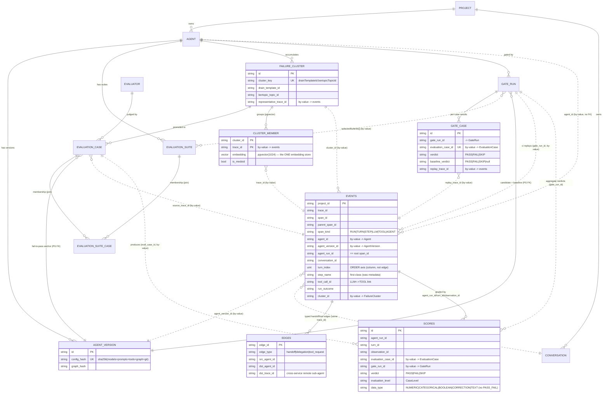

# Tracely — Doc 09: Concrete Database Schema Proposal (copy-pasteable V1 DDL)

> **What this is.** The implementation-level schema for V1, derived *directly* from doc 03 (the agent + trace data model). Every entity name, column name, and edge here is the one fixed in doc 03 §0–C5; this doc only turns those decisions into **real, runnable DDL** — ClickHouse `CREATE TABLE`s and Prisma model blocks — plus the per-table OLAP-vs-OLTP justification and a migration note.
>
> **Substrate (shared by all docs, verbatim from doc 03 §0 / facts §data-model).** Postgres (Prisma) is the **registry / control plane**: low-cardinality, mutable, FK-enforced config + curated artifacts. ClickHouse is the **telemetry / data plane**: ONE wide immutable OTel-shaped span table (`events`, modeled on Langfuse `events_full`, facts §data-model `dev-tables.sh:137-281`) + a `scores` table + a typed `edges` table. pgvector lives **inside Postgres** for failure-cluster embeddings. S3 holds raw event blobs + replay fixtures. Redis+BullMQ is the queue. We reuse Langfuse's async write path verbatim (SDK/OTLP → S3 source-of-truth → Redis ingestion queue → worker read-then-merge → batched CH insert; `ReplacingMergeTree(event_ts,is_deleted)` + `FINAL`/`LIMIT 1 BY` reads, facts §ingestion-otel).
>
> **The one rule that decides every table's home.** *Is it the trace (or derived per-span telemetry), append-mostly, high-cardinality, analytically scanned?* → **ClickHouse**. *Is it config, a curated artifact, or a CI record — low-volume, mutable, relational, transactionally written by web/CI?* → **Postgres**. This is exactly the Langfuse split (facts §eval-dataset; Part 1 doc 04 §12) — Postgres keeps `Dataset`/`EvalTemplate`/`JobExecution`; CH keeps `traces`/`observations`/`scores`. Tracely keeps the split and moves the *boundary* so Agent/Conversation/Turn/Step are first-class.

---

## 0. Table inventory (home + why), at a glance

| Table | Store | Engine / kind | Holds (doc 03 entity) | **WHY this store** |
|---|---|---|---|---|
| `events` | ClickHouse | `ReplacingMergeTree(event_ts,is_deleted)` | `AgentRun`/`Turn`/`Step`/`ToolCall`/`LLMCall`/`SubAgentCall` (all span rows) | The trace itself: per-request massive volume, append-mostly, analytical scans + aggregations; columnar + ZSTD + skip-indexes. FK integrity irrelevant; immutability via `event_ts`. (facts §data-model) |
| `events_core` | ClickHouse | `ReplacingMergeTree` (MV target) | truncated mirror of `events` (I/O ≤200 chars) | Fast list/table queries without scanning ZSTD blobs (Langfuse `events_core`, facts §data-model). Same reason as `events`, optimized for list latency. |
| `scores` | ClickHouse | `ReplacingMergeTree(event_ts,is_deleted)` | `Score` (eval result) | High-volume eval/annotation output, analytically aggregated in dashboards; reused from Langfuse `scores` verbatim + Tracely address cols. (facts §eval-dataset) |
| `edges` | ClickHouse | `ReplacingMergeTree(event_ts,is_deleted)` | `SubAgentCall` handoff/delegation + `tool_request` graph | Per-trace, append-mostly typed graph edges scanned alongside spans; co-located with `events` for join-free trajectory reads. (doc 03 §B3) |
| `event_blob_log` | ClickHouse | `MergeTree` | S3 pointer index `(project_id,entity_type,entity_id)→path` | Reuse of Langfuse `event_log` (Part 1 doc 04 §9); makes S3 the real source-of-truth for payloads + replay fixtures. |
| `failure_signals` | ClickHouse | `ReplacingMergeTree(event_ts,is_deleted)` | one row per detected failure signal (doc 07 §2.2) | Detection output is high-volume, append-only, analytically aggregated ("how many traces failed on detector X this week") and feeds clustering — same engine family as `events`. (doc 07 §2.2) |
| `agent_run_list_mv` / `_proj` | ClickHouse | lightweight projection MV (`events_core`-style, truncated I/O) | run-level list rows for run lists & dashboards | List-optimized projection of `events` (truncated I/O); run-list **aggregates are computed read-time** via `LIMIT 1 BY` / `argMaxIf` — **no AggregatingMergeTree trace-rollup** (canonical 7.7; 01 §B7). |
| `Project` | Postgres | Prisma model | tenancy hub | Identity/RBAC/config; low-volume, ACID, ~all tables FK to it (Langfuse `projects`, Part 1 doc 04 §1). |
| `Agent` | Postgres | Prisma model | `Agent` | Stable human-named registry entry; mutable (`currentVersionId`, archive); FK target for versions/suites/clusters/gates. (doc 03 §A1) |
| `AgentVersion` | Postgres | Prisma model | `AgentVersion` | Content-addressed config snapshot the gate keys on; immutable, FK-enforced, looked up by `config_hash`. (doc 03 §A2) |
| `Conversation` | Postgres | Prisma model | `Conversation` (thin shell) | Mutable curation flags (bookmark/label) on a low-volume per-thread row; content stays in CH. Exact Langfuse `trace_sessions` precedent (Part 1 doc 04 §11). (doc 03 §A4) |
| `EvaluationSuite` | Postgres | Prisma model | `EvaluationSuite` | Curated config (gate mode, threshold, `kind`), mutable membership; FK to Agent. (doc 03 §A10) |
| `EvaluationSuiteCase` | Postgres | Prisma model (join) | suite↔case membership | Many-to-many membership with optional `pinnedCaseVersion`; control-plane join. (canonical §2) |
| `EvaluationCase` | Postgres | Prisma model | `EvaluationCase` | The core curated artifact (match config, fixtures pointer, provenance); mutable status, FK-rich. (doc 03 §A11) |
| `FailureCluster` | Postgres | Prisma model | `FailureCluster` | Curated, human-reviewed group; mutable status; holds the **pgvector** centroid. (doc 03 §A12) |
| `ClusterMember` | Postgres | Prisma model | (new) per-failure embedding rows | pgvector ANN over individual failing runs for clustering/medoid selection (techniques §2). Low-volume vs spans; needs vector index. |
| `Evaluator` | Postgres | Prisma model | (new) reusable judge/code-eval template | Reusable eval definition (G-Eval rubric / code), referenced by cases; mutable config. Generalized Langfuse `EvalTemplate` (facts §eval-dataset). |
| `GateRun` | Postgres | Prisma model | `GateRun` | CI gate execution record + decision; mutable lifecycle, FK to versions; `selectedSuiteIds[]`. Generalized Langfuse `JobExecution` (facts §eval-dataset). (doc 03 §A14) |
| `GateCase` | Postgres | Prisma model | per-case gate result | Per-case verdict/cost/latency/diff for the decision engine + PR comment (detailed scores still land in CH `scores` by `gate_run_id`). (canonical §2, §7.5) |

`AgentRun`, `Turn`, `Step`, `ToolCall`, `LLMCall`, `SubAgentCall` are **NOT separate tables** — they are span rows in `events` distinguished by `span_kind` + semantic columns (doc 03 §0, §B2). That is the central schema decision and the reason this whole telemetry layer is one wide table.

---

# PART 1 — ClickHouse DDL (the telemetry / data plane)

## 1.1 `events` — the Tracely wide span table

**Construction rule (doc 03 §B1):** take Langfuse `events_full` (facts §data-model `dev-tables.sh:137-281`) *verbatim* — all identity/timing/IO/model/usage/cost/tool/metadata/OTel-source columns, the engine, `PARTITION BY`, `PRIMARY KEY`, `ORDER BY`, `SAMPLE BY`, `SETTINGS`, and skip-indexes — then **add the fixed Tracely semantic-column block (doc 03 §B2)** and **add new bloom/text skip-indexes** for the new high-selectivity columns. We keep Langfuse's `type` column (so the `ObservationTypeMapper` registry is reused at ingest, facts §sdk-frontend) and add `span_kind` as a thin typed projection.

```sql
-- =====================================================================================
-- TRACELY  events  (= Langfuse events_full VERBATIM + Tracely semantic columns)
-- Engine/partition/sort/sample/settings are byte-for-byte the §data-model events_full DDL.
-- =====================================================================================
CREATE TABLE IF NOT EXISTS events
(
    ----------------------------------------------------------------------------- LANGFUSE events_full (verbatim, dev-tables.sh:137-281)
    -- Identifiers
    project_id       String,
    trace_id         String,
    span_id          String,
    parent_span_id   String,

    -- Timing (microsecond precision — DateTime64(6), not (3))
    start_time       DateTime64(6),
    end_time         Nullable(DateTime64(6)),

    -- Core properties
    name                    String,
    type                    LowCardinality(String),              -- Langfuse ObservationType (10 vals), kept verbatim
    environment             LowCardinality(String) DEFAULT 'default',  -- Langfuse free-string env (OTel-mapper compat); KEEP
    env                     LowCardinality(String) DEFAULT 'prod',     -- Tracely gating axis {prod,staging,ci,dev} (canonical §5); defaults from tracely.env or maps `environment`
    version                 String,
    release                 String,
    trace_name              String,
    user_id                 String,
    session_id              String,                               -- Langfuse session; Tracely also mirrors to conversation_id
    tags                    Array(String),
    level                   LowCardinality(String),               -- DEBUG|DEFAULT|WARNING|ERROR (failure signal)
    status_message          String,                               -- treat '' and NULL the same (failure signal)
    completion_start_time   Nullable(DateTime64(6)),              -- TTFT anchor
    is_app_root             Bool DEFAULT false,                   -- TRUE => this span is an AgentRun root

    -- Updateable properties (mutated via read-then-merge + new event_ts)
    bookmarked   Bool DEFAULT false,
    public       Bool DEFAULT false,

    -- (DROPPED: prompt_id / prompt_name / prompt_version — prompt-management surface, out of thesis; if ever needed lives in metadata. canonical §5)

    -- Model
    model_id              String,
    provided_model_name   String,                                 -- LLMCall / AGENT model
    model_parameters      String,

    -- Usage & Cost (Decimal(18,12), not Decimal64(12))
    provided_usage_details   Map(LowCardinality(String), UInt64),
    usage_details            Map(LowCardinality(String), UInt64),
    provided_cost_details    Map(LowCardinality(String), Decimal(18,12)),
    cost_details             Map(LowCardinality(String), Decimal(18,12)),
    calculated_input_cost    Decimal(18,12) MATERIALIZED arraySum(mapValues(mapFilter(x -> positionCaseInsensitive(x.1, 'input')  > 0, cost_details))),
    calculated_output_cost   Decimal(18,12) MATERIALIZED arraySum(mapValues(mapFilter(x -> positionCaseInsensitive(x.1, 'output') > 0, cost_details))),
    calculated_total_cost    Decimal(18,12) MATERIALIZED arraySum(mapValues(mapFilter(x -> positionCaseInsensitive(x.1, 'input')  > 0 OR positionCaseInsensitive(x.1, 'output') > 0, cost_details))),
    total_cost               Decimal(18,12) ALIAS cost_details['total'],
    usage_pricing_tier_id    Nullable(String),
    usage_pricing_tier_name  Nullable(String),

    -- Tools (Langfuse migration 0033 — LLMCall tool-INTENT representation, reused verbatim)
    tool_definitions    Map(String, String),                      -- name -> JSON({description,parameters})
    tool_calls          Array(String),                            -- JSON({id,arguments,type,index}) per request
    tool_call_names     Array(String),                            -- parallel names => has(tool_call_names,'foo') w/o JSON parse

    -- I/O (ZSTD-3; events_core stores leftUTF8(*,200))
    input          String CODEC(ZSTD(3)),
    input_length   UInt64 MATERIALIZED lengthUTF8(input),
    output         String CODEC(ZSTD(3)),                         -- TOOL span output == the replay FIXTURE
    output_length  UInt64 MATERIALIZED lengthUTF8(output),

    -- Metadata (parallel arrays)
    metadata_names   Array(String),
    metadata_values  Array(String),

    -- (DROPPED: the entire dataset experiment_* block — experiment_id/experiment_name/experiment_dataset_id/experiment_item_*/… — thesis hygiene; replaced by the provenance columns below. canonical §5)

    -- Source / OTel instrumentation
    source                   LowCardinality(String),
    service_name             String,
    service_version          String,
    scope_name               String,
    scope_version            String,
    telemetry_sdk_language   LowCardinality(String),
    telemetry_sdk_name       String,
    telemetry_sdk_version    String,

    -- Generic operational
    blob_storage_file_path   String,
    event_bytes              UInt64,
    created_at               DateTime64(6) DEFAULT now(),
    updated_at               DateTime64(6) DEFAULT now(),
    event_ts                 DateTime64(6),                        -- dedup version column
    is_deleted               UInt8,                                -- soft-delete tombstone

    ----------------------------------------------------------------------------- TRACELY SEMANTIC COLUMNS (doc 03 §B2, verbatim names)
    -- Span kind: typed projection over Langfuse `type` + Tracely role (set in a thin ingest post-pass)
    span_kind            LowCardinality(String),                  -- RUN|TURN|STEP|LLM|TOOL|AGENT|RETRIEVER|GUARDRAIL|EVENT|SPAN

    -- Agent / version / run identity (denormalized onto EVERY span in the run)
    agent_id             String,                                  -- FK-by-value -> Agent (from gen_ai.agent.id / tracely.agent.id)
    agent_version_id     String,                                  -- FK-by-value -> AgentVersion (from tracely.agent.version / config_hash)
    agent_run_id         String,                                  -- == root span_id; the run this span belongs to

    -- Conversation / turn (multi-turn structure)
    conversation_id      String,                                  -- gen_ai.conversation.id / tracely.conversation.id ('' if single-shot)
    turn_id              String,                                  -- TURN span_id or synthesized uuidv5(conversation_id:turn_index)
    turn_index           UInt32 DEFAULT 0,                        -- 0-based monotonic order within conversation (the ORDER axis)
    prev_turn_id         String,                                  -- denormalized neighbor (derived; '' at start)
    next_turn_id         String,                                  -- denormalized neighbor (derived; '' at end)
    turn_role            LowCardinality(String),                  -- user|agent|system

    -- Step (logical work unit) -- FIRST-CLASS, replacing metadata['langgraph_node'/'langgraph_step']
    step_id              String,                                  -- STEP span_id
    step_name            String,                                  -- node/step name (was metadata['langgraph_node'])
    step_index           UInt32 DEFAULT 0,                        -- order within turn (was metadata['langgraph_step'])
    step_kind            LowCardinality(String),                  -- plan|act|observe|route|reflect|other

    -- Typed-edge INLINE keys (the cheap half; the edge TABLE is §1.4)
    tool_call_id         String,                                  -- gen_ai.tool.call.id: links TOOL span <-> emitting LLM request
    tool_name            String,                                  -- gen_ai.tool.name (on TOOL spans)
    emitting_llm_span_id String,                                  -- denormalized: which LLMCall emitted this TOOL (resolved at ingest)
    caller_agent_id      String,                                  -- handoff caller (gen_ai.agent.id of parent agent)
    callee_agent_id      String,                                  -- handoff callee (== agent_id of an AGENT span)
    edge_type            LowCardinality(String),                  -- '' | handoff | delegation | tool_as_agent | spawn
    linked_trace_id      String,                                  -- OTel span-link: remote sub-agent's trace (cross-service)

    -- Run outcome / RCA (run-level, on the root span; replicated down for query convenience)
    run_status           LowCardinality(String),                  -- running|succeeded|failed|errored|cancelled
    run_outcome          LowCardinality(String),                  -- ok|task_incomplete|wrong_answer|tool_error|timeout|guardrail_block
    first_failing_span_id String,                                 -- doc 05 first-failing-step localization
    source_trace_id      String,                                  -- CI replay -> the prod trace it reproduces ('' for prod)

    -- Failure-intelligence / gate provenance linkage (canonical §5: evaluation_case_id / gate_run_id / failure_cluster_id; doc-03 short names used here on `events`)
    template_id          String,                                  -- Drain3 ingest-time log template (doc 05)
    cluster_id           String,                                  -- FK-by-value -> FailureCluster (== canonical failure_cluster_id; set on failing runs)
    eval_case_id         String,                                  -- if this run is a case replay (== canonical evaluation_case_id)
    gate_run_id          String,                                  -- if this run is part of a GateRun (env=ci)

    ----------------------------------------------------------------------------- SKIP INDEXES
    -- Langfuse events_full skip-indexes (verbatim)
    INDEX idx_span_id        span_id      TYPE bloom_filter(0.01) GRANULARITY 1,
    INDEX idx_trace_id       trace_id     TYPE bloom_filter(0.01) GRANULARITY 1,
    INDEX idx_user_id        user_id      TYPE bloom_filter(0.01) GRANULARITY 1,
    INDEX idx_session_id     session_id   TYPE bloom_filter(0.01) GRANULARITY 1,
    INDEX idx_created_at     created_at   TYPE minmax            GRANULARITY 1,
    INDEX idx_updated_at     updated_at   TYPE minmax            GRANULARITY 1,
    -- Full-text (requires enable_full_text_index=1) — input/output/status_message text search
    INDEX idx_fts_input_low       lower(input)          TYPE text(tokenizer = splitByNonAlpha),
    INDEX idx_fts_output_low      lower(output)         TYPE text(tokenizer = splitByNonAlpha),
    INDEX idx_fts_status_message  lower(status_message) TYPE text(tokenizer = splitByNonAlpha),  -- Tracely add: failure-text search/cluster
    INDEX idx_fts_metadata_values metadata_values       TYPE text(tokenizer = splitByNonAlpha),
    INDEX idx_fts_metadata_names  metadata_names        TYPE text(tokenizer = splitByNonAlpha),
    -- Tracely high-selectivity id columns (bloom_filter, matching Langfuse's id-index style)
    INDEX idx_agent_id        agent_id         TYPE bloom_filter(0.01) GRANULARITY 1,
    INDEX idx_agent_version   agent_version_id TYPE bloom_filter(0.01) GRANULARITY 1,
    INDEX idx_agent_run_id    agent_run_id     TYPE bloom_filter(0.01) GRANULARITY 1,
    INDEX idx_conversation_id conversation_id  TYPE bloom_filter(0.01) GRANULARITY 1,
    INDEX idx_turn_id         turn_id          TYPE bloom_filter(0.01) GRANULARITY 1,
    INDEX idx_step_name       step_name        TYPE bloom_filter(0.01) GRANULARITY 1,
    INDEX idx_tool_call_id    tool_call_id     TYPE bloom_filter(0.01) GRANULARITY 1,
    INDEX idx_tool_name       tool_name        TYPE bloom_filter(0.01) GRANULARITY 1,
    INDEX idx_cluster_id      cluster_id       TYPE bloom_filter(0.01) GRANULARITY 1,
    INDEX idx_eval_case_id    eval_case_id     TYPE bloom_filter(0.01) GRANULARITY 1,
    INDEX idx_gate_run_id     gate_run_id      TYPE bloom_filter(0.01) GRANULARITY 1,
    -- span_kind is LowCardinality -> set index is cheap and lets "all TOOL spans" prune granules
    INDEX idx_span_kind       span_kind        TYPE set(16)            GRANULARITY 1
)
ENGINE = ReplacingMergeTree(event_ts, is_deleted)
-- prod: ENGINE = ReplicatedReplacingMergeTree(event_ts, is_deleted)
PARTITION BY toYYYYMM(start_time)
PRIMARY KEY (project_id, toStartOfMinute(start_time), xxHash32(trace_id))
ORDER BY    (project_id, toStartOfMinute(start_time), xxHash32(trace_id), span_id, start_time)
SAMPLE BY   xxHash32(trace_id)
TTL toDateTime(start_time) + INTERVAL 90 DAY DELETE     -- [Synthesis] default hot retention; per-project override via Project.retentionDays + a per-partition TTL job (Langfuse pattern)
SETTINGS
    index_granularity_bytes    = '64Mi',
    merge_max_block_size_bytes = '64Mi',
    enable_block_number_column = 1,
    enable_block_offset_column = 1,
    prewarm_mark_cache         = 1,
    prewarm_primary_key_cache  = 1;
```

### 1.1.1 Why ClickHouse (not Postgres) — and why this exact key

**Store = ClickHouse:** spans are the trace. They are written per-request at huge volume, never updated in place (only re-inserted with a newer `event_ts`), and read via analytical scans (a trajectory = `WHERE agent_run_id = ? ORDER BY turn_index, step_index, start_time`) and aggregations (cost/latency/outcome rollups). Columnar storage + ZSTD on `input`/`output` + bloom/text skip-indexes is built for exactly this; Postgres row-store with FKs is not (Part 1 doc 04 §12.1). FK integrity is irrelevant here — cross-store references are by-value (§3).

**`ORDER BY (project_id, toStartOfMinute(start_time), xxHash32(trace_id), span_id, start_time)` — kept verbatim from Langfuse, and it is exactly what Tracely needs [Synthesis]:**
- `project_id` first → every read is tenant-pruned (multi-tenant isolation).
- `toStartOfMinute(start_time)` → time-bucketed; recent-data reads (the common case) touch few granules; aligns with `PARTITION BY toYYYYMM`.
- `xxHash32(trace_id)` → **trace-contiguous**: all spans of one run/trace land adjacent on disk, so a whole-trajectory read (`agent_run_id`/`trace_id` filter) is a short contiguous scan, not a scatter. This is the property the trajectory reader and the replay engine depend on.
- `span_id, start_time` → stable per-row ordering + dedup determinism for the `ReplacingMergeTree`.

**Agent-filtered reads** ("all runs of agent X / version Y", "all failing TOOL spans of agent X") are *not* in the sort key — by design. They are **high-cardinality point/range filters**, served by the `idx_agent_id` / `idx_agent_version` / `idx_span_kind` skip-indexes pruning granules, combined with the time bucket. Putting `agent_id` ahead of `trace_id` in the sort key would scatter a single trace's spans across the agent's whole history and wreck trajectory reads — the opposite of what we want. [Synthesis] The skip-index path is the right tool for the agent filter; the sort key stays trace-contiguous. (If a single mega-agent dominates a project and agent-scoped scans dominate the workload, a per-project `events` projection `ORDER BY (project_id, agent_id, toStartOfMinute(start_time), xxHash32(trace_id))` can be added later — noted, out of V1 scope.)

**`SAMPLE BY xxHash32(trace_id)`** → dashboards can `SAMPLE 0.1` for fast approximate metrics over huge windows, sampling whole traces coherently (Langfuse pattern).

**`TTL` + retention:** Langfuse drives retention from `projects.retention_days` (Part 1 doc 04 §1). V1 ships a static 90-day partition TTL above; a per-project override job rewrites the partition TTL from `Project.retentionDays`. `is_deleted=1` tombstones (soft delete) are reconciled by the same delete-queue pattern as Langfuse (`pending_deletions`, Part 1 doc 04 §12.3).

### 1.1.2 Read-pattern cheat-sheet (how each entity is read off `events`)

```sql
-- AgentRun (root attrs): isolate the root span, then read run-level cols
SELECT span_id AS agent_run_id, agent_id, agent_version_id, conversation_id, turn_index,
       run_status, run_outcome, env, source_trace_id,
       dateDiff('millisecond', start_time, end_time) AS latency_ms, total_cost
FROM events
WHERE project_id = {pid} AND trace_id = {tid} AND (parent_span_id = '' OR is_app_root = true)
ORDER BY event_ts DESC LIMIT 1 BY project_id, span_id;          -- manual dedup (lets bloom indexes fire)

-- Trajectory (doc 03 §B6): one contiguous scan, ordered by the first-class columns
SELECT span_kind, step_id, step_name, step_index, turn_index, span_id, tool_call_id,
       tool_name, provided_model_name, input, output, level, status_message
FROM events
WHERE project_id = {pid} AND agent_run_id = {rid} AND is_deleted = 0
ORDER BY turn_index, step_index, start_time;

-- Conversation turns (ordered): turn_index is the source of truth
SELECT turn_id, turn_index, turn_role, agent_run_id, run_outcome, input, output
FROM events
WHERE project_id = {pid} AND conversation_id = {cid} AND span_kind = 'TURN' AND is_deleted = 0
ORDER BY turn_index;
```

`FINAL` is used only for correctness-critical single-row reads; high-throughput reads use `ORDER BY event_ts DESC LIMIT 1 BY ...` so skip-indexes still fire (the Langfuse dedup tradeoff, facts §data-model "Dedup mechanics").

## 1.2 `events_core` — truncated fast-list mirror (reused from Langfuse)

```sql
-- Same columns as `events` EXCEPT input/output are NOT CODEC'd and are truncated to 200 chars by the MV.
-- Adds the model/experiment/metadata bloom indexes Langfuse puts only on events_core.
CREATE TABLE IF NOT EXISTS events_core AS events
ENGINE = ReplacingMergeTree(event_ts, is_deleted)
PARTITION BY toYYYYMM(start_time)
PRIMARY KEY (project_id, toStartOfMinute(start_time), xxHash32(trace_id))
ORDER BY    (project_id, toStartOfMinute(start_time), xxHash32(trace_id), span_id, start_time)
SAMPLE BY   xxHash32(trace_id);
-- then ALTER to drop CODEC on input/output and add:
--   INDEX idx_provided_model_name provided_model_name TYPE bloom_filter(0.01) GRANULARITY 2,
--   INDEX idx_metadata_names      metadata_names      TYPE bloom_filter(0.01) GRANULARITY 1

CREATE MATERIALIZED VIEW IF NOT EXISTS events_core_mv TO events_core AS
SELECT * REPLACE (leftUTF8(input, 200) AS input,
                  leftUTF8(output, 200) AS output,
                  arrayMap(v -> leftUTF8(v, 200), metadata_values) AS metadata_values)
FROM events;
```

**Why CH:** identical to `events` — it is just the list-optimized projection. The read router defaults to `events_core` for list/table views and escalates to `events` when full I/O is needed (Langfuse `EVENTS_TABLE_NAMES` default-then-escalate, facts §data-model).

## 1.3 `scores` — eval results (Langfuse `scores` verbatim + Tracely addressing)

```sql
-- =====================================================================================
-- TRACELY scores  (= Langfuse scores evolved schema + Tracely address cols + verdict)
-- =====================================================================================
CREATE TABLE IF NOT EXISTS scores
(
    -- Langfuse scores columns (verbatim, facts §eval-dataset; through migration 0034)
    id                  String,
    timestamp           DateTime64(6),
    project_id          String,
    environment         LowCardinality(String) DEFAULT 'default',
    name                String,
    value               Float64,                                 -- numeric/boolean (bool => 0/1)
    string_value        Nullable(String),                        -- categorical/boolean label
    long_string_value   String CODEC(ZSTD(3)) DEFAULT '',        -- 0034: overflow TEXT/CORRECTION
    comment             Nullable(String) CODEC(ZSTD(1)),         -- judge reasoning goes here (evalService:970)
    source              LowCardinality(String),                  -- API | EVAL | ANNOTATION (EVAL internal-only)
    data_type           LowCardinality(String),                  -- NUMERIC|CATEGORICAL|BOOLEAN|CORRECTION|TEXT (Langfuse, unchanged; gate/regression use BOOLEAN + the verdict column — NO PASS_FAIL value, canonical §3)
    author_user_id      Nullable(String),
    config_id           Nullable(String),                        -- FK-by-value -> Postgres score config (if used)
    queue_id            Nullable(String),                        -- annotation queue
    metadata            Map(LowCardinality(String), String),     -- 0010
    -- Langfuse addressing (reused verbatim — a score targets exactly one)
    trace_id            Nullable(String),                        -- whole-run grade; Tracely uses as run trace
    observation_id      Nullable(String),                        -- any span: step_id / tool span_id / llm span_id
    session_id          Nullable(String),                        -- Tracely == conversation_id target
    execution_trace_id  Nullable(String),                        -- 0030: the eval judge's OWN trace (self-tracing)
    -- ---- TRACELY ADDED address columns (doc 03 §A13) ----
    agent_run_id        Nullable(String),                        -- explicit run target (== trace_id of the run)
    turn_id             Nullable(String),                        -- turn-level score target
    -- NOTE: verdict + gate_run_id + evaluation_case_id + evaluation_level are added via ADDITIVE ALTERs below (one column per migration, Langfuse convention — canonical §5), NOT inline here.
    -- dedup
    created_at          DateTime64(6) DEFAULT now(),
    updated_at          DateTime64(6) DEFAULT now(),
    event_ts            DateTime64(6),
    is_deleted          UInt8,

    INDEX idx_id                       id            TYPE bloom_filter(0.001) GRANULARITY 1,
    INDEX idx_score_trace_observation (project_id, trace_id, observation_id) TYPE bloom_filter(0.001) GRANULARITY 1,
    INDEX idx_score_session            session_id    TYPE bloom_filter(0.001) GRANULARITY 1,
    INDEX idx_score_agent_run          agent_run_id  TYPE bloom_filter(0.001) GRANULARITY 1,  -- Tracely add
    INDEX idx_score_turn               turn_id       TYPE bloom_filter(0.001) GRANULARITY 1,  -- Tracely add
    -- (idx on gate_run_id / evaluation_case_id added via ADD INDEX ALTERs below — canonical §5)
    INDEX idx_score_exec_trace         execution_trace_id TYPE bloom_filter(0.001) GRANULARITY 1
)
ENGINE = ReplacingMergeTree(event_ts, is_deleted)
PARTITION BY toYYYYMM(timestamp)
PRIMARY KEY (project_id, toDate(timestamp), name)
ORDER BY    (project_id, toDate(timestamp), name, id);
```

**Tracely verdict + gate provenance — ADDITIVE migrations (one column per migration, Langfuse convention; canonical §5).** These are *not* a table rewrite and *not* a new `data_type` value:

```sql
-- 00xx_scores_verdict.up.sql            -- {PASS,FAIL,SKIP}; gate semantics alongside `value` (NOT a data_type value)
ALTER TABLE scores ADD COLUMN verdict LowCardinality(String);
-- 00xx_scores_gate_run_id.up.sql        -- links score -> the GateRun aggregate
ALTER TABLE scores ADD COLUMN gate_run_id String;
-- 00xx_scores_evaluation_case_id.up.sql -- links score -> the EvaluationCase that produced it
ALTER TABLE scores ADD COLUMN evaluation_case_id String;
-- 00xx_scores_evaluation_level.up.sql   -- CaseLevel of the asserting case (CONVERSATION|TURN|STEP|TOOL_CALL|AGENT_RUN|MULTI_AGENT)
ALTER TABLE scores ADD COLUMN evaluation_level LowCardinality(String);
-- bloom-filter skip-indexes on the two high-selectivity gate ids
ALTER TABLE scores ADD INDEX idx_score_gate_run  gate_run_id        TYPE bloom_filter(0.001) GRANULARITY 1;
ALTER TABLE scores ADD INDEX idx_score_eval_case evaluation_case_id TYPE bloom_filter(0.001) GRANULARITY 1;
```

**Why CH:** scores are high-volume eval/annotation output, aggregated in dashboards (pass-rate per agent/version, score trends) — same access pattern as spans. Reused from Langfuse `scores` (facts §eval-dataset) so the deterministic-id idempotent-write path, self-tracing-eval, and dashboard aggregations port verbatim.

**Tracely deltas (doc 03 §A13, all additive):** `agent_run_id`, `turn_id` (inline above); plus `verdict`, `gate_run_id`, `evaluation_case_id`, `evaluation_level` via the ADD COLUMN migrations above. **`data_type` is unchanged — no `PASS_FAIL` value (canonical §3);** gate/regression results use `BOOLEAN` (1/0) plus the first-class `verdict` column. `dataset_run_id` is **dropped** (no datasets) — `evaluation_case_id` replaces it conceptually. Score ids stay deterministic via the Langfuse `uuidv5(["eval-score", jobExecutionId, scoreName, occurrenceIndex], NAMESPACE)` formula (facts §eval-dataset `evalScoreIds.ts`) so verdict writes are idempotent into the `ReplacingMergeTree`; for gate runs we use `gate_run_id` in place of `jobExecutionId`.

## 1.4 `failure_signals` — detection output (doc 07 §2.2, ported verbatim)

One row per detected failure signal `(trace, span, detector)`. High-volume, append-only — the analytic substrate for "how many traces failed on detector X this week" and the input to clustering. Same engine family as `events`/`scores` (doc 07 §2.2).

```sql
-- migration 0040_failure_signals.up.sql  (Tracely, modeled on scores/events DDL)
CREATE TABLE IF NOT EXISTS failure_signals
(
    project_id        String,
    trace_id          String,
    span_id           String,                       -- the span that triggered the signal
    parent_span_id    String,
    agent_id          String,
    agent_version_id  String,
    agent_run_id      String,
    conversation_id   String,
    turn_id           String,
    step_id           String,

    signal_class      LowCardinality(String),       -- FailureSignalClass enum string
    detector_name     LowCardinality(String),       -- e.g. "span_level_error", "trajectory.unordered_mismatch"
    severity          LowCardinality(String),       -- INFO | WARN | ERROR | CRITICAL
    -- normalized free-text used by Drain3 + embeddings (status_message, tool error, judge reasoning…)
    failure_text      String CODEC(ZSTD(3)),
    -- structured detail (e.g. {expected_tool, actual_tool, latency_ms, cost_usd, score_name, verdict})
    detail            String CODEC(ZSTD(3)),        -- JSON
    online_score_id   String,                       -- if produced by a Score verdict (links to scores.id)

    -- dedup/version columns (same pattern as events)
    event_ts          DateTime64(6),
    is_deleted        UInt8,
    created_at        DateTime64(6) DEFAULT now(),
    INDEX idx_trace_id trace_id   TYPE bloom_filter(0.01) GRANULARITY 1,
    INDEX idx_run_id   agent_run_id TYPE bloom_filter(0.01) GRANULARITY 1,
    INDEX idx_signal_class signal_class TYPE bloom_filter(0.01) GRANULARITY 1,
    INDEX idx_fts_failure lower(failure_text) TYPE text(tokenizer = splitByNonAlpha)
)
ENGINE = ReplacingMergeTree(event_ts, is_deleted)
PARTITION BY toYYYYMM(created_at)
PRIMARY KEY (project_id, toStartOfMinute(created_at), xxHash32(trace_id))
ORDER BY    (project_id, toStartOfMinute(created_at), xxHash32(trace_id), span_id, detector_name);
```

Read with `LIMIT 1 BY (trace_id, span_id, detector_name) ORDER BY event_ts DESC` to dedup (the manual-dedup pattern that keeps skip-indexes usable).

**Why CH:** detection output is high-volume, append-only telemetry, analytically aggregated and fed into clustering — identical access pattern to `events`/`scores`. (doc 07 §2.2)

## 1.5 `edges` — the typed graph table (doc 03 §B3 verbatim)

```sql
-- =====================================================================================
-- TRACELY edges  (typed graph relations NOT expressible as parent_span_id)
-- =====================================================================================
CREATE TABLE IF NOT EXISTS edges
(
    project_id        String,
    trace_id          String,
    edge_id           String,                                    -- uuidv5(src_span_id + dst_span_id + edge_type)
    edge_type         LowCardinality(String),                    -- handoff|delegation|tool_request|tool_as_agent|turn_succ
    src_span_id       String,                                    -- caller / requester / predecessor
    dst_span_id       String,                                    -- callee / executor / successor
    src_agent_id      String,                                    -- caller_agent_id (handoff/delegation)
    dst_agent_id      String,                                    -- callee_agent_id
    tool_call_id      String,                                    -- for tool_request edges (== gen_ai.tool.call.id)
    src_trace_id      String,                                    -- usually == trace_id
    dst_trace_id      String,                                    -- != trace_id for cross-service remote sub-agents
    agent_run_id      String,
    turn_id           String,
    attributes        Map(LowCardinality(String), String),
    event_ts          DateTime64(6),
    is_deleted        UInt8,
    INDEX idx_edge_src    src_span_id                 TYPE bloom_filter(0.01) GRANULARITY 1,
    INDEX idx_edge_dst    dst_span_id                 TYPE bloom_filter(0.01) GRANULARITY 1,
    INDEX idx_edge_agents (src_agent_id, dst_agent_id) TYPE bloom_filter(0.01) GRANULARITY 1
)
ENGINE = ReplacingMergeTree(event_ts, is_deleted)
PARTITION BY toYYYYMM(toDateTime(event_ts))
ORDER BY (project_id, trace_id, edge_type, src_span_id, dst_span_id);
```

**Why CH (not a join table in Postgres):** edges are per-trace, append-mostly telemetry produced by the ingest worker, scanned *alongside* spans to build a trajectory (`WHERE agent_run_id = ?`). Co-locating them in CH avoids a cross-store join on the hot read path. **Why a table at all (vs only `parent_span_id`):** handoffs/delegations form a many-to-many *typed* directed graph that can loop and can cross trace boundaries (a remote sub-agent is its own trace) — `parent_span_id` carries neither the *type* nor a cross-trace target. The `(src_agent_id, dst_agent_id, edge_type)`-indexed table answers "all delegations into `sql-executor`", "handoff cycles". (Full columns-vs-edge-table justification: doc 03 §B4.)

## 1.6 `event_blob_log` — S3 pointer index (reused from Langfuse `event_log`)

```sql
CREATE TABLE IF NOT EXISTS event_blob_log
(
    id            String,
    project_id    String,
    entity_type   LowCardinality(String),    -- 'span' | 'score' | 'fixture' | 'replay'
    entity_id     String,                    -- span_id / score id / eval_case_id (for fixtures)
    bucket_name   String,
    bucket_path   String,                    -- S3 key of the raw blob / replay fixture
    event_ts      DateTime64(6) DEFAULT now()
)
ENGINE = MergeTree
ORDER BY (project_id, entity_type, entity_id);
```

**Why CH:** it is the index that makes S3 the source-of-truth for payloads and **replay fixtures** (recorded tool outputs that make `EvaluationCase` replay hermetic, doc 03 §A7/A11). High write volume, point lookups by `(project_id, entity_type, entity_id)` — a plain `MergeTree`, exactly Langfuse `event_log` (Part 1 doc 04 §9).

## 1.7 `agent_run_list_proj` — run-list projection MV (lightweight, NOT an AggregatingMergeTree)

> **Canonical 7.7 / 01 §B7: do NOT add an AggregatingMergeTree run-list rollup.** Langfuse tried trace-rollup AMTs and **reverted** them (`part1-langfuse/03`, `01-steal-and-do-not-copy.md §B7`). Tracely uses an `events_core`-style **lightweight projection MV** (truncated I/O, root-span rows only) for the *list*, and computes per-run **aggregates read-time** via `LIMIT 1 BY` / `argMaxIf`. No `AggregateFunction`/`SimpleAggregateFunction` state, no merge-time rollup.

```sql
-- A thin per-run row materialized from the ROOT span only (one row per run, no child fan-in).
-- Same ReplacingMergeTree dedup discipline as events; I/O truncated like events_core.
CREATE TABLE IF NOT EXISTS agent_run_list_proj
(
    project_id        String,
    agent_id          String,
    agent_version_id  String,
    agent_run_id      String,
    conversation_id   String,
    env               LowCardinality(String),
    run_start         DateTime64(6),
    run_end           Nullable(DateTime64(6)),
    run_status        LowCardinality(String),
    run_outcome       LowCardinality(String),
    cluster_id        String,
    total_cost        Decimal(18,12),                 -- root-span calculated_total_cost (run total)
    input             String,                         -- leftUTF8(.,200) (list preview only)
    output            String,                         -- leftUTF8(.,200)
    event_ts          DateTime64(6),
    is_deleted        UInt8,
    INDEX idx_agent_id agent_id TYPE bloom_filter(0.01) GRANULARITY 1
)
ENGINE = ReplacingMergeTree(event_ts, is_deleted)
PARTITION BY toYYYYMM(run_start)
ORDER BY (project_id, agent_id, agent_version_id, run_start, agent_run_id);

-- Populate from ROOT spans only (is_app_root) — cheap, no GROUP BY over child spans.
CREATE MATERIALIZED VIEW IF NOT EXISTS agent_run_list_mv TO agent_run_list_proj AS
SELECT
    project_id, agent_id, agent_version_id, agent_run_id, conversation_id, env,
    start_time AS run_start, end_time AS run_end,
    run_status, run_outcome, cluster_id,
    calculated_total_cost AS total_cost,
    leftUTF8(input, 200)  AS input,
    leftUTF8(output, 200) AS output,
    event_ts, is_deleted
FROM events
WHERE is_app_root = true;
```

Per-run **aggregates not on the root span** (e.g. span count, error-span count, cost summed across children when not denormalized) are computed **read-time** over `events`, e.g.:

```sql
-- Read-time run aggregate (no AMT): one pass over the run's spans, dedup-safe.
SELECT agent_run_id,
       countIf(level = 'ERROR')         AS error_span_count,
       count()                           AS span_count,
       sum(calculated_total_cost)        AS total_cost
FROM events
WHERE project_id = {pid} AND agent_run_id = {rid} AND is_deleted = 0
GROUP BY agent_run_id;

-- Run-list latest-state read uses LIMIT 1 BY / argMaxIf over events_core when the projection isn't enough.
```

**Why CH (and why no AMT):** the projection is a pure list-latency optimization (one root row per run, trace-contiguous), identical in spirit to `events_core`; run-level numbers come from read-time `LIMIT 1 BY` / `argMaxIf` aggregation. This deliberately avoids the reverted Langfuse trace-rollup AggregatingMergeTree (canonical 7.7; 01 §B7).

---

# PART 2 — Postgres / Prisma DDL (the registry / control plane)

All models are `project_id`-scoped (multi-tenant, FK to `Project`), PascalCase Prisma models `@@map`'d to snake_case tables, columns `@map`'d to snake_case — the Langfuse convention (Part 1 doc 04 §0). `cuid()` PKs for registry rows. pgvector is enabled (`CREATE EXTENSION vector;`) and exposed via Prisma `Unsupported("vector(1024)")` (the doc 03 §A12 choice).

```prisma
// ============================ datasource / generator ============================
generator client {
  provider        = "prisma-client-js"
  previewFeatures = ["views", "relationJoins", "metrics", "postgresqlExtensions"]
}
datasource db {
  provider   = "postgresql"
  url        = env("DATABASE_URL")
  directUrl  = env("DIRECT_URL")
  extensions = [vector]            // pgvector for failure-cluster embeddings
}
```

## 2.1 `Project` — tenancy hub

```prisma
model Project {
  id            String   @id @default(cuid())
  orgId         String   @map("org_id")            // FK -> Organization (RBAC/identity reused from Langfuse, omitted here)
  name          String
  slug          String
  retentionDays Int?     @map("retention_days")    // drives the CH events TTL override job
  metadata      Json?
  deletedAt     DateTime? @map("deleted_at")        // soft-delete (Langfuse pattern)
  createdAt     DateTime @default(now()) @map("created_at")
  updatedAt     DateTime @updatedAt @map("updated_at")

  agents          Agent[]
  agentVersions   AgentVersion[]
  conversations   Conversation[]
  suites          EvaluationSuite[]
  cases           EvaluationCase[]
  clusters        FailureCluster[]
  evaluators      Evaluator[]
  gateRuns        GateRun[]

  @@unique([orgId, slug])
  @@index([orgId])
  @@map("projects")
}
```

**Why Postgres:** identity/config hub; every registry table FKs to it; needs ACID + cascade deletes. (Langfuse `projects`, Part 1 doc 04 §1.)

## 2.2 `Agent` (doc 03 §A1, verbatim)

```prisma
model Agent {
  id            String   @id @default(cuid())
  projectId     String   @map("project_id")
  slug          String                                  // wire id: tracely.agent.id (e.g. "support-router")
  displayName   String   @map("display_name")
  description   String?
  kind          AgentKind @default(SINGLE)              // SINGLE | MULTI_AGENT | WORKFLOW (topology)
  role          AgentRole?                              // SUPERVISOR | WORKER | PLANNER | EXECUTOR | GENERIC (role in a multi-agent system; impact analysis branches on role==SUPERVISOR, doc 06)
  framework     String?                                 // "langgraph" | "agno" | "openai-agents" | "custom" | ...
  defaultEnv    String   @default("prod") @map("default_env")
  currentVersionId String? @map("current_version_id")  // FK -> AgentVersion.id; the "live" version
  archived      Boolean  @default(false)
  metadata      Json?
  createdAt     DateTime @default(now()) @map("created_at")
  updatedAt     DateTime @updatedAt @map("updated_at")

  project       Project        @relation(fields: [projectId], references: [id], onDelete: Cascade)
  versions      AgentVersion[] @relation("AgentVersions")
  currentVersion AgentVersion? @relation("AgentCurrentVersion", fields: [currentVersionId], references: [id])
  suites        EvaluationSuite[]
  cases         EvaluationCase[]
  clusters      FailureCluster[]
  gateRuns      GateRun[]

  @@unique([projectId, slug])
  @@index([projectId, archived])
  @@map("agents")
}
enum AgentKind { SINGLE MULTI_AGENT WORKFLOW }
enum AgentRole { SUPERVISOR WORKER PLANNER EXECUTOR GENERIC }
```

**Why Postgres:** low-cardinality, mutable (`currentVersionId` advances, archive flag), FK target for the whole registry. ClickHouse runs reference it by-value via `events.agent_id` (no DB FK — runs live in CH, the Langfuse `JobExecution.jobInputTraceId` no-FK pattern, facts §eval-dataset `schema.prisma:913`).

## 2.3 `AgentVersion` (doc 03 §A2, verbatim)

```prisma
model AgentVersion {
  id          String   @id @default(cuid())
  projectId   String   @map("project_id")
  agentId     String   @map("agent_id")
  configHash  String   @map("config_hash")           // sha256 of normalized config — the content address (doc 03 §A2)
  label       String?                                 // "v1.4.2" / git short sha / SDK-supplied
  gitSha      String?  @map("git_sha")
  gitRef      String?  @map("git_ref")
  config      Json                                    // the full AgentVersionConfig (models+prompts+tools+graph+framework)
  graphHash   String   @map("graph_hash")            // duplicated out for cheap topology diffing
  modelsSummary String? @map("models_summary")       // denormalized "gpt-4o,claude-3-5" for UI
  createdAt   DateTime @default(now()) @map("created_at")
  firstSeenAt DateTime @default(now()) @map("first_seen_at")  // first prod run on this version
  // NO updatedAt — versions are immutable

  project     Project @relation(fields: [projectId], references: [id], onDelete: Cascade)
  agent       Agent   @relation("AgentVersions", fields: [agentId], references: [id], onDelete: Cascade)
  currentOf   Agent[] @relation("AgentCurrentVersion")
  casesFirstFailed EvaluationCase[] @relation("CaseFirstFailedVersion")
  gateCandidate    GateRun[] @relation("GateCandidateVersion")
  gateBaseline     GateRun[] @relation("GateBaselineVersion")

  @@unique([agentId, configHash])
  @@index([projectId, agentId, createdAt])
  @@index([projectId, gitSha])
  @@map("agent_versions")
}
```

**Why Postgres:** THE entity the gate keys on; needs FK-enforced uniqueness on `(agentId, configHash)`, transactional pre-deploy registration by CI, and immutability. CH `events.agent_version_id` references it by-value.

## 2.4 `Conversation` — thin shell (doc 03 §A4, verbatim)

```prisma
model Conversation {              // thin shell, exactly like Langfuse trace_sessions (Part 1 doc 04 §11)
  id          String              // == conversation_id on the wire
  projectId   String   @map("project_id")
  agentId     String?  @map("agent_id")     // the primary agent of the conversation
  env         String   @default("prod")
  bookmarked  Boolean  @default(false)
  public      Boolean  @default(false)
  label       String?                        // human label for curated conversations
  createdAt   DateTime @default(now()) @map("created_at")

  project     Project @relation(fields: [projectId], references: [id], onDelete: Cascade)

  @@id([id, projectId])
  @@index([projectId, agentId])
  @@map("conversations")
}
```

**Why Postgres (and only a shell):** the conversation needs *mutable curation state* (bookmark, public, label) on a single low-volume per-thread row — a real UPDATE workload. Its *content* (turns, runs, aggregates like turn count / total cost / last outcome) is computed at query time from CH `events`, never stored — exactly the Langfuse `trace_sessions` precedent (one PG shell row per conversation while traces stay in CH; Part 1 doc 04 §11). Turn ordering is `events.turn_index` in CH, **not** a PG table.

## 2.5 `EvaluationSuite` (doc 03 §A10, verbatim)

```prisma
model EvaluationSuite {
  id          String   @id @default(cuid())
  projectId   String   @map("project_id")
  agentId     String   @map("agent_id")
  slug        String                                // "core-regressions"
  displayName String   @map("display_name")
  description String?
  kind        SuiteKind @default(REGRESSION)        // REGRESSION (promoted failures) | EVAL (curated quality) | E2E (cross-agent)
  gateMode    GateMode @default(BLOCK_ON_FAIL)     // BLOCK_ON_FAIL | WARN | OFF
  passThreshold Float   @default(1.0) @map("pass_threshold") // fraction of cases that must pass
  archived    Boolean  @default(false)
  createdAt   DateTime @default(now()) @map("created_at")
  updatedAt   DateTime @updatedAt @map("updated_at")

  project     Project @relation(fields: [projectId], references: [id], onDelete: Cascade)
  agent       Agent   @relation(fields: [agentId], references: [id], onDelete: Cascade)
  caseLinks   EvaluationSuiteCase[]                  // many-to-many membership (join table)
  // NOTE: GateRun references suites by-value via selectedSuiteIds[] (canonical §5) — no FK back-relation.

  @@unique([projectId, agentId, slug])
  @@index([projectId, agentId])
  @@map("evaluation_suites")
}
enum GateMode { BLOCK_ON_FAIL WARN OFF }
enum SuiteKind { REGRESSION EVAL E2E }

// Many-to-many suite<->case membership with optional version pin (canonical §2, conflict #15).
model EvaluationSuiteCase {
  suiteId           String   @map("suite_id")
  caseId            String   @map("case_id")
  pinnedCaseVersion Int?     @map("pinned_case_version")   // pin a specific case version; null = floating (latest)
  addedAt           DateTime @default(now()) @map("added_at")

  suite             EvaluationSuite @relation(fields: [suiteId], references: [id], onDelete: Cascade)
  case              EvaluationCase  @relation(fields: [caseId], references: [id], onDelete: Cascade)

  @@id([suiteId, caseId])
  @@index([caseId])
  @@map("evaluation_suite_cases")
}
```

**Why Postgres:** curated config (gate mode, threshold) with mutable case membership; FK to Agent; referenced by GateRun. Pure control-plane.

## 2.6 `EvaluationCase` (doc 03 §A11, verbatim + `evaluatorId` link)

```prisma
model EvaluationCase {
  id          String   @id @default(cuid())
  projectId   String   @map("project_id")
  agentId     String   @map("agent_id")
  title       String                                 // non-unique human label (was `slug`/`displayName`)
  inputDigest String   @map("input_digest")          // content address of the case input (the natural key)
  level       CaseLevel                              // scope the case asserts on; the gate uses it to scope replay (canonical §3)
  // --- the captured trace + fixtures (replay inputs) ---
  sourceTraceId String @map("source_trace_id")      // the prod AgentRun (ClickHouse, NO FK)
  inputPrefix Json     @map("input_prefix")         // captured trace input / turn prefix
  fixturesS3Path String @map("fixtures_s3_path")    // recorded tool outputs (+ optional LLM outputs) — hermetic replay
  referenceTrajectory Json @map("reference_trajectory") // ordered steps/tool calls/handoffs
  // --- match config (agentevals taxonomy; semantics in doc 04) ---
  trajectoryMatchMode String @map("trajectory_match_mode") // strict|unordered|subset|superset
  toolArgsMatchMode   String @map("tool_args_match_mode")  // exact|ignore|subset|superset
  toolArgsOverrides   Json?  @map("tool_args_overrides")
  judgeRubric Json?   @map("judge_rubric")          // optional inline G-Eval CoT rubric (or use evaluatorId)
  evaluatorId String? @map("evaluator_id")          // FK -> Evaluator (reusable judge/code eval)
  // --- FAIL-TO-PASS contract ---
  agentVersionFirstFailed String @map("agent_version_first_failed") // FK -> AgentVersion.id; MUST fail here
  // --- provenance ---
  failureClusterId String? @map("failure_cluster_id")  // FK -> FailureCluster.id
  origin      CaseOrigin @default(PROMOTED_CLUSTER) @map("origin") // PROMOTED_CLUSTER|MANUAL|GENERATED
  status      CaseStatus @default(DRAFT)            // DRAFT|PROMOTED|QUARANTINED|ARCHIVED|UNREPRODUCIBLE
  createdAt   DateTime @default(now()) @map("created_at")
  updatedAt   DateTime @updatedAt @map("updated_at")

  project       Project        @relation(fields: [projectId], references: [id], onDelete: Cascade)
  suiteLinks    EvaluationSuiteCase[]                // many-to-many membership via the join table
  agent         Agent          @relation(fields: [agentId], references: [id], onDelete: Cascade)
  firstFailedVersion AgentVersion @relation("CaseFirstFailedVersion", fields: [agentVersionFirstFailed], references: [id])
  failureCluster FailureCluster? @relation(fields: [failureClusterId], references: [id])
  evaluator     Evaluator?     @relation(fields: [evaluatorId], references: [id])

  @@unique([projectId, agentId, inputDigest])
  @@index([projectId, agentId, status])
  @@index([projectId, failureClusterId])
  @@map("evaluation_cases")
}
enum CaseLevel  { CONVERSATION TURN STEP TOOL_CALL AGENT_RUN MULTI_AGENT }
enum CaseOrigin { PROMOTED_CLUSTER MANUAL GENERATED }
enum CaseStatus { DRAFT PROMOTED QUARANTINED ARCHIVED UNREPRODUCIBLE }
```

**Why Postgres:** the central curated artifact — mutable status/config, FK-rich (suite, cluster, version, evaluator), transactionally edited in the UI. `sourceTraceId`/`fixturesS3Path` point into CH/S3 **by-value** (the Langfuse `DatasetItem.sourceTraceId` no-FK seam, generalized; facts §eval-dataset `schema.prisma:1034`). Match-mode *semantics* are doc 04; this is just storage.

## 2.7 `Evaluator` — reusable judge / code-eval template (new; generalizes Langfuse `EvalTemplate`)

```prisma
model Evaluator {
  id          String   @id @default(cuid())
  projectId   String   @map("project_id")
  name        String
  version     Int      @default(1)
  family      EvaluatorFamily @default(LLM_JUDGE)  // STRUCTURAL | CODE | LLM_JUDGE — selects the executor (canonical §3); STRUCTURAL = trajectory/tool match
  // LLM judge (G-Eval CoT + bias mitigations, doc 04)
  prompt      String?                                // rubric / CoT template
  model       String?
  provider    String?
  modelParams Json?    @map("model_params")
  outputSchema Json?   @map("output_schema")
  biasMitigations Json? @map("bias_mitigations")    // {positionSwap, crossProviderJudge, referenceGuided}
  // Code eval
  sourceCode  String?  @map("source_code") @db.VarChar(262144)
  sourceCodeLanguage EvalSourceLang? @map("source_code_language") // PYTHON | TYPESCRIPT
  createdAt   DateTime @default(now()) @map("created_at")
  updatedAt   DateTime @updatedAt @map("updated_at")

  project     Project @relation(fields: [projectId], references: [id], onDelete: Cascade)
  cases       EvaluationCase[]

  @@unique([projectId, name, version])
  @@map("evaluators")
}
enum EvaluatorFamily { STRUCTURAL CODE LLM_JUDGE }
enum EvalSourceLang { PYTHON TYPESCRIPT }
```

**Why Postgres:** reusable, versioned eval config (prompt/model/code) edited in the UI and referenced by many cases — exactly Langfuse `EvalTemplate` (facts §eval-dataset `schema.prisma:917-945`), generalized with a `STRUCTURAL` (trajectory/tool match) family and bias-mitigation flags. Low-volume config, not telemetry.

## 2.8 `FailureCluster` (doc 03 §A12, verbatim) + `ClusterMember` (pgvector)

```prisma
model FailureCluster {
  id          String   @id @default(cuid())
  projectId   String   @map("project_id")
  agentId     String   @map("agent_id")
  drainTemplateId String? @map("drain_template_id")  // Drain3 ingest-time template id (canonical §8)
  bertopicTopicId String? @map("bertopic_topic_id")  // BERTopic/HDBSCAN topic id ('none'/-1 == novel)
  clusterKey  String   @map("cluster_key")           // = drainTemplateId + ':' + (bertopicTopicId ?? 'none') (canonical §8 / conflict #10)
  label       String                                 // human-legible (MAST/TRAJECT seed -> refined)
  taxonomy    String?                                // MAST bucket | TRAJECT mode | custom
  representativeTraceId String @map("representative_trace_id") // medoid AgentRun (ClickHouse, NO FK)
  exemplarTraceIds String[] @map("exemplar_trace_ids")        // medoid + 2-3 diverse boundary cases (techniques §2.5)
  firstSeenAt DateTime @map("first_seen_at")
  lastSeenAt  DateTime @map("last_seen_at")
  count       Int      @default(0)                   // dedup-counted occurrences (MinHash-LSH, techniques §2.4)
  suggestedFix Json?   @map("suggested_fix")         // SuggestedFix (doc 07 §6)
  agentVersionFirstFailed String? @map("agent_version_first_failed") // earliest failing version
  status      ClusterStatus @default(OPEN)           // OPEN | PROMOTED | IGNORED | MERGED (canonical §3)
  candidateCaseId String? @map("candidate_case_id")  // FK -> EvaluationCase.id if a case was drafted/promoted
  createdAt   DateTime @default(now()) @map("created_at")
  updatedAt   DateTime @updatedAt @map("updated_at")

  project     Project @relation(fields: [projectId], references: [id], onDelete: Cascade)
  agent       Agent   @relation(fields: [agentId], references: [id], onDelete: Cascade)
  cases       EvaluationCase[]
  members     ClusterMember[]

  @@unique([projectId, agentId, clusterKey])
  @@index([projectId, agentId, status])
  @@map("failure_clusters")
}
enum ClusterStatus { OPEN PROMOTED IGNORED MERGED }

// Per-failing-run membership + embedding row — the ONE embedding store (no separate FailureEmbedding table).
model ClusterMember {
  clusterId   String   @map("cluster_id")            // FK -> FailureCluster
  traceId     String   @map("trace_id")              // the failing run (ClickHouse, NO FK)
  embedding   Unsupported("vector(1024)") @map("embedding") // failure embedding (sentence-emb of error+trajectory)
  distance    Float                                   // distance to the cluster centroid/medoid
  isMedoid    Boolean  @default(false) @map("is_medoid") // the representative member
  createdAt   DateTime @default(now()) @map("created_at")

  cluster     FailureCluster @relation(fields: [clusterId], references: [id], onDelete: Cascade)

  @@id([clusterId, traceId])
  @@index([traceId])
  @@map("cluster_members")
}
// Vector (HNSW) index created in raw SQL migration (Prisma can't express pgvector ops yet) — ONE embedding store:
//   CREATE INDEX cluster_members_embedding_hnsw
//     ON cluster_members USING hnsw (embedding vector_cosine_ops);
```

**Why Postgres (incl. the vectors):** `FailureCluster` is a curated, human-reviewed artifact with mutable status — control-plane. The **embeddings live in Postgres pgvector** (doc 03 §A12 `Unsupported("vector(1024)")`) because clustering operates on a *bounded* set — one embedding per *failing* run (a small fraction of spans), not per span — and needs **ANN search** (`<=>` cosine) for "nearest existing cluster?" at ingest and medoid/centroid math in batch. That is pgvector's exact niche; ClickHouse has no first-class ANN-over-mutable-set story for this scale. **There is exactly one embedding store — the `embedding` column on `ClusterMember`** (canonical §6); the cluster's centroid/medoid is derived from its members (`isMedoid`/`distance`), not stored as a separate vector. `1024` dims matches a standard sentence-embedding model; `hnsw` + `vector_cosine_ops` is the V1 index (switch to `ivfflat` only if recall/latency demands). Raw failing-run telemetry stays in CH (`events.cluster_id`/`template_id` link runs back to their cluster by-value).

## 2.9 `GateRun` (doc 03 §A14, verbatim)

```prisma
model GateRun {
  id          String   @id @default(cuid())
  projectId   String   @map("project_id")
  agentId     String   @map("agent_id")
  agentVersionId    String  @map("agent_version_id")    // FK -> AgentVersion.id — the CANDIDATE under test (the PR)
  baselineVersionId String? @map("baseline_version_id") // FK -> AgentVersion.id — the baseline (main / env=prod)
  selectedSuiteIds  String[] @map("selected_suite_ids") // the suites this gate ran (by-value ids; canonical §5)
  // CI context
  gitSha      String?  @map("git_sha")
  gitRef      String?  @map("git_ref")
  prNumber    Int?     @map("pr_number")
  runUrl      String?  @map("run_url")              // GitHub Actions run URL
  trigger     GateTrigger @default(PULL_REQUEST)    // PULL_REQUEST | MANUAL | SCHEDULED | API
  triggeredBy String?  @map("triggered_by")
  // outcome
  status      GateStatus @default(PENDING)          // PENDING | RUNNING | PASS | FAIL | ERROR
  decision    Json?     @map("decision")            // decide_gate output: regression/eval/cost/latency breakdown (canonical §7.5)
  casesTotal  Int      @default(0) @map("cases_total")
  casesPassed Int      @default(0) @map("cases_passed")
  casesFailed Int      @default(0) @map("cases_failed")
  casesSkipped Int     @default(0) @map("cases_skipped")
  executionTraceId String? @map("execution_trace_id") // the gate run is itself traced (CH)
  startedAt   DateTime? @map("started_at")
  finishedAt  DateTime? @map("finished_at")
  createdAt   DateTime @default(now()) @map("created_at")

  project     Project @relation(fields: [projectId], references: [id], onDelete: Cascade)
  agent       Agent   @relation(fields: [agentId], references: [id], onDelete: Cascade)
  candidateVersion AgentVersion @relation("GateCandidateVersion", fields: [agentVersionId], references: [id])
  baselineVersion  AgentVersion? @relation("GateBaselineVersion", fields: [baselineVersionId], references: [id])
  gateCases   GateCase[]

  @@index([projectId, agentId, createdAt])
  @@index([projectId, agentVersionId])
  @@index([projectId, gitSha])
  @@map("gate_runs")
}
enum GateStatus  { PENDING RUNNING PASS FAIL ERROR }
enum GateTrigger { PULL_REQUEST MANUAL SCHEDULED API }
enum Verdict     { PASS FAIL SKIP }

// Per-case gate result — feeds the decision engine + the PR comment (canonical §2, §7.5).
model GateCase {
  id               String   @id @default(cuid())
  gateRunId        String   @map("gate_run_id")
  evaluationCaseId String   @map("evaluation_case_id")  // by-value -> EvaluationCase.id
  caseVersion      Int      @map("case_version")        // which case version was replayed
  verdict          Verdict                              // PASS | FAIL | SKIP
  baselineVerdict  Verdict? @map("baseline_verdict")    // the same case's verdict on the baseline version
  scores           Json                                  // per-evaluator scores for this case
  costUsd          Decimal? @map("cost_usd") @db.Decimal(18, 12)
  latencyMs        Int?     @map("latency_ms")
  replayTraceId    String?  @map("replay_trace_id")      // CH trace of this case's replay (by-value)
  diff             Json?                                  // trajectory/output diff vs reference

  gateRun          GateRun  @relation(fields: [gateRunId], references: [id], onDelete: Cascade)

  @@unique([gateRunId, evaluationCaseId])
  @@index([gateRunId])
  @@map("gate_cases")
}
```

**Why Postgres:** a CI record with a mutable lifecycle (`PENDING→RUNNING→PASS/FAIL/ERROR`) and FKs to both versions (candidate + baseline); suites referenced by-value via `selectedSuiteIds[]` — generalized Langfuse `JobExecution` (facts §eval-dataset `schema.prisma:1014`). Per-case replay *telemetry* is in CH (`events` with `env=ci`, joined by `gate_run_id`) and the per-case verdict/cost/latency/diff is in the **`GateCase`** Postgres rows (the decision engine + PR comment read these); detailed aggregate scores also land in CH `scores` with `gate_run_id`. The PG row holds the `decision` JSON + counters the UI/CI read.

---

# PART 3 — Cross-store wiring + ER diagram

## 3.1 The by-value link map (no DB FKs across stores)

Every Postgres→ClickHouse reference is a plain string column with **no FK** (target lives in CH), reconciled by project-cascade + delete queues — the Langfuse rule (Part 1 doc 04 §12.3, facts §eval-dataset). The complete set:

| Postgres column | → ClickHouse target | Meaning |
|---|---|---|
| `EvaluationCase.sourceTraceId` | `events.trace_id` (of an `is_app_root` run) | the prod run a case was captured from |
| `FailureCluster.representativeTraceId` / `.exemplarTraceIds[]` | `events.agent_run_id` | medoid + diverse exemplars |
| `ClusterMember.traceId` | `events.agent_run_id` / `trace_id` | the failing run that was embedded |
| `GateRun.executionTraceId` | `events.trace_id` | the gate's own trace |
| `GateCase.replayTraceId` | `events.trace_id` (of the case replay, `env=ci`) | the per-case replay run |
| `GateRun.selectedSuiteIds[]` | `EvaluationSuite.id` (PG, by-value) | suites the gate ran (no FK back-relation) |
| `Agent.id` ← | `events.agent_id` | run→agent resolution |
| `AgentVersion.id` ← | `events.agent_version_id` | run→version resolution |
| `Conversation.id` = | `events.conversation_id` | shared key (shell↔spans) |
| `FailureCluster.id` ← | `events.cluster_id` | failing run→cluster |
| `EvaluationCase.id` ← | `events.eval_case_id`, `scores.eval_case_id` | case→its replay runs + verdicts |
| `GateRun.id` ← | `events.gate_run_id`, `scores.gate_run_id` | gate→replays + aggregate verdicts |
| `EvaluationCase.agentVersionFirstFailed` | `AgentVersion.id` (PG FK) | fail-to-pass anchor (in-store FK) |

## 3.2 Mermaid ER — PG registry tied to CH telemetry by ids



Solid lines = in-store relations (CH `parent`/edge co-location, PG FKs). Dotted `..` lines = **by-value cross-store** links (no DB FK), the Langfuse pattern.

---

# PART 4 — Migration note (V1 bootstrap)

**[Synthesis] Start on the events model. No legacy split.** Tracely is greenfield: there is **no `traces`/`observations` two-table legacy** to migrate (Langfuse carries those only for v2→v3 back-compat, facts §data-model `ClickhouseTableNames`; Part 1 doc 04 §11). We create `events` (+ `events_core` MV) as the *only* span store from migration `0001`, skipping the legacy tables entirely. Concretely:

1. **CH migration `0001_events`:** `CREATE TABLE events` (§1.1) — Langfuse `events_full` DDL **minus the dropped `prompt_*` / `experiment_*` blocks** + the Tracely semantic block (incl. `env`) + new indexes, in one shot. Then `0002_events_core` (`events_core` + `events_core_mv`), `0003_scores` (+ the additive `verdict`/`gate_run_id`/`evaluation_case_id`/`evaluation_level` `ALTER`s, one per migration, §1.3), `0004_failure_signals` (§1.4), `0005_edges`, `0006_event_blob_log`, `0007_agent_run_list` (**lightweight projection MV — NOT an AggregatingMergeTree**, §1.7). Use `ReplicatedReplacingMergeTree` in prod (single-node `ReplacingMergeTree` in dev), the Langfuse clustered/unclustered split.
2. **PG migration `0001_init`:** `CREATE EXTENSION IF NOT EXISTS vector;` then all Prisma models (§2). Add the two raw-SQL `hnsw` vector indexes (Prisma can't emit pgvector ops). Reuse Langfuse's `Organization`/`User`/membership/RBAC/`ApiKey` tables verbatim for identity (omitted here; Part 1 doc 04 §1–2) — `Project` FKs to `Organization`.
3. **Ingest worker post-pass (reuse Langfuse write path + thin Tracely step, doc 03 §C5.5):** after the verbatim Langfuse S3→Redis→read-then-merge→insert, a thin pass (a) derives `span_kind` from `type`+role, (b) resolves `tool_call_id`→`emitting_llm_span_id`, (c) materializes `edges` rows from caller/callee, (d) synthesizes `turn_index`/`step_index` when not emitted (the `buildStepData` timing-grouping fallback, facts §sdk-frontend). No new queue infra — extend the existing ingestion consumer.
4. **No data backfill.** Day-one writes go straight to `events`. The only "migration" over time is the per-project TTL job that rewrites the `events` partition TTL from `Project.retentionDays`.
5. **Schema evolution discipline:** new Tracely span columns are *additive* `ALTER TABLE events ADD COLUMN ... DEFAULT ...` (ReplacingMergeTree tolerates this cheaply); `config_hash`'s `schemaVersion` (doc 03 §A2) bumps force version recompute, never a CH rewrite. Score additions follow the Langfuse migration-numbering convention (one column per migration).

---

# PART 5 — Decisions a sibling doc MUST honor (schema-level)

1. **One span table.** `AgentRun/Turn/Step/ToolCall/LLMCall/SubAgentCall` are rows in `events` keyed by `span_kind` + semantic columns — never separate tables. Doc 04 (eval), 05 (clustering), 06 (gate) read them via the §1.1.2 patterns.
2. **Sort key is trace-contiguous, agent filter is index-served.** `ORDER BY (project_id, toStartOfMinute(start_time), xxHash32(trace_id), span_id, start_time)`; agent/version filters use bloom skip-indexes, not the sort key. Don't reorder the key to lead with `agent_id`.
3. **Scores are the Langfuse `scores` table + additive columns** (`agent_run_id, turn_id` inline, plus `verdict, gate_run_id, evaluation_case_id, evaluation_level` via one-column-per-migration `ALTER`s) — **`data_type` is unchanged (NO `PASS_FAIL` value);** gate/regression use `BOOLEAN` + the `verdict {PASS,FAIL,SKIP}` column. `dataset_run_id` dropped. Deterministic `uuidv5` ids reused (use `gate_run_id` as the salt for gate aggregates).
4. **pgvector(1024) lives in Postgres** — the **ONE** embedding store is `ClusterMember.embedding` with `hnsw vector_cosine_ops` (no separate `FailureCluster.embeddingCentroid`/`FailureEmbedding`; centroid/medoid derived from members). Clustering (doc 05) does ANN here, not in CH; CH only carries `cluster_id`/`template_id` by-value on failing runs.
5. **All PG→CH references are by-value, no FK** (the §3.1 map). `EvaluationCase.agentVersionFirstFailed` and `GateRun.agentVersionId`/`baselineVersionId` are the only cross-entity links that ARE PG FKs (both endpoints in Postgres); `GateRun.selectedSuiteIds[]` references suites by-value.
6. **`edges` is the home of typed handoff/delegation/tool_request graph**; `turn_index` (column) is the home of turn order. Trajectory readers join `events` + `edges` on `agent_run_id`, never a PG table.
7. **Greenfield: no legacy `traces`/`observations`.** Migrations start at `events`. Any doc assuming a Langfuse-style two-table split is wrong for Tracely.
