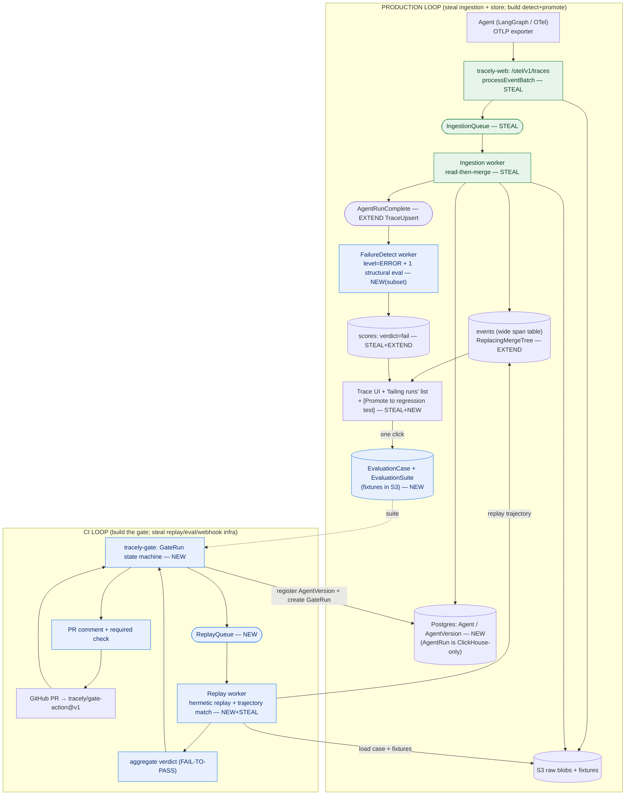

# Doc 10 — MVP Definition + Implementation Roadmap

> **What this doc is.** The build plan. It defines the **smallest end-to-end slice that proves the spine** (`Production Trace → Failure Detection → Regression Test → CI/CD Gate`), states exactly **what is deferred and why**, picks the **single killer demo**, and lays out a **phased roadmap** (P0–P5) where each phase has scope, a **steal-from-Langfuse** ledger (cited `file:line`), an effort estimate, dependencies, and **measurable** success criteria. It closes with a concrete **first-2-weeks** and **first-90-days** plan for a founding engineer, a **build-vs-steal** table, and the **top risks + mitigations**.
>
> **Coherence.** Obeys the canonical entities verbatim — `Agent, AgentVersion, AgentRun, Trace, Conversation, Turn, Step, ToolCall, LLMCall, SubAgentCall, EvaluationSuite, EvaluationCase, FailureCluster, Score, GateRun` — and the fixed storage stack: TypeScript monorepo (`tracely-web` Next.js + `tracely-worker` Express + `tracely-gate` + `packages/shared`), Postgres (+pgvector), ClickHouse (one wide `events` span table modeled on Langfuse `events_full` + `scores` + `edges`), Redis+BullMQ, S3/MinIO. It draws scope from doc 01 (steal/don't-copy), doc 02 (architecture), doc 03 (data model), doc 04 (eval), doc 05 (regression cases), doc 06 (multi-agent), doc 07 (failure intelligence), doc 08 (CI gate), doc 09 (schema). Citations `file:line` are into `/Users/julien/Documents/Repos/langfuse` (v3.177.1) or `92-langfuse-verified-facts.md`. Author opinion = **[Synthesis]**.

---

## 0. TL;DR — the MVP in one paragraph and the decision list

**MVP = the thinnest vertical cut of the spine that a real user can run.** A developer instruments their agent with OTLP/OpenInference → traces land in `events` and auto-register an `Agent`/`AgentVersion` → a failing run is detected by a **two-signal** detector (`level=ERROR` + **one** online structural evaluator) → the user clicks **"Promote to regression test"** on that trace and Tracely records the input prefix + tool fixtures + reference trajectory into an `EvaluationCase` → the case joins a one-suite `EvaluationSuite` → on the next PR, the **GitHub Action** registers the new `AgentVersion`, a `GateRun` **hermetically replays** the case, the **structural trajectory matcher** decides PASS/FAIL honoring the **FAIL-TO-PASS** contract, and the gate posts a **PR comment + required status check** that blocks merge. Everything else — semantic clustering, RCA, suggested fixes, multi-agent end-to-end, multi-level LLM judges, the v2 codebase product, canary — is **explicitly deferred**.

**The ten MVP decisions [Synthesis]:**

1. **Steal Langfuse ingestion wholesale** (OTLP edge + S3-first async write path + `ClickhouseWriter` + `events_full`). Do not rebuild a single line of the write path.
2. **Start ONLY on the `events` (`events_full`-shaped) wide table** with the Tracely semantic columns. No legacy `traces`/`observations` split (doc 01 §B6).
3. **Failure detection in MVP = 2 signals only**: `level=ERROR` (deterministic) + **one** online structural evaluator (trajectory mismatch / tool error). The 7-signal catalog (doc 07 §4) is post-MVP.
4. **One-click promotion is manual and human-confirmed** — no auto-clustering, no auto-draft. The user picks a failing trace and promotes it. (Braintrust-grade UX, but the *object graph* is trace-native.)
5. **Record-replay (hermetic) is the only gate mode in MVP.** Live re-execution is deferred (doc 05 §3.2).
6. **The structural trajectory matcher is the only evaluator in the gate** (`agentevals` taxonomy, doc 04 §4.1). No LLM judge in the gate path for MVP.
7. **GitHub Action + a thin `tracely-gate` service**, not the full GitHub App, for MVP. The Action does register→start→poll→exit-code; the PR comment is posted by the Action's token.
8. **One framework adapter end-to-end** (LangGraph) + the generic OTel ingestion path. The other adapters (OpenAI Agents SDK, Agno) come in P5.
9. **No clustering, RCA, suggested-fix, or test-gen workers in MVP.** `FailureCluster` table may exist (empty); the pipeline that fills it is P4.
10. **Single-node docker-compose**, all `*_CLUSTER_ENABLED=false`, all `*_SHARD_COUNT=1` (doc 02 §5.1). Real sharding/replication is a scale concern, not an MVP concern.

---

## 1. The MVP slice (precise scope)

### 1.1 The seven MVP capabilities (and nothing else)

| # | Capability | Owns it (sibling doc) | What ships in MVP | Reuse posture |
|---|---|---|---|---|
| **C1** | **Ingest** OTLP/OpenInference traces | doc 02 §4.1, doc 05/ingest | `POST /api/public/otel/v1/traces` + the native `/api/public/ingestion`; raw → S3 → Redis → worker merge → `events` | **STEAL verbatim** |
| **C2** | **Store** in `events` + **agent registry** | doc 03, doc 09 §1.1/§2.2-§2.3 | `events` wide table + Tracely semantic columns; auto-upsert `Agent`/`AgentVersion` (Postgres registry) from span attributes; `AgentRun` is ClickHouse-only (the root span) | **EXTEND** (add columns + registry) |
| **C3** | **Waterfall trace UI** + run list | doc 02 §1, doc 06 §4.1 | trace explorer (span tree), run list filtered by `agent_id`/`agent_version_id`, a "failing runs" list | **STEAL UI + EXTEND** |
| **C4** | **Detect a failure** (2 signals) | doc 07 §4 (subset), doc 04 §5.3 | `level=ERROR` + one online structural evaluator on `AgentRunComplete`; write a `Score` with `verdict=fail` | **EXTEND** eval trigger |
| **C5** | **One-click promote** trace → `EvaluationCase` (record-replay fixtures) | doc 05 §1, §7 | UI button + API: mine input prefix + tool fixtures + reference trajectory from the failing trace → S3 + Postgres `EvaluationCase` | **NEW** |
| **C6** | **Run the suite in CI** via the GitHub Action (hermetic replay) | doc 08 §4.1, doc 05 §3.1/§6 | `tracely/gate-action@v1` → register `AgentVersion` → `GateRun` → `ReplayQueue` → trajectory match | **NEW** (gate) + **STEAL** queue/eval infra |
| **C7** | **PASS/FAIL PR gate** + comment | doc 08 §3.5/§4.3 | aggregate per-case `verdict` → `GateRun.verdict` → GitHub check-run + PR comment; FAIL-TO-PASS enforced | **NEW** + **STEAL** webhook dispatch |

### 1.2 The MVP data path (one diagram)



### 1.3 The exact `events` columns the MVP must populate

The full DDL is doc 09 §1.1. The MVP needs **only this subset** of the Tracely semantic columns populated at ingest (the rest can default to `''`):

```sql
-- MVP-critical Tracely semantic columns (rest of doc 09 §1.1 may be DEFAULT '')
agent_id            String,   -- from tracely.agent.id / gen_ai.agent.id / span name fallback
agent_version_id    String,   -- from tracely.agent.version / config_hash
agent_run_id        String,   -- == root span_id (is_app_root)
turn_id             String,   -- LangGraph: synthesized; single-shot: == agent_run_id
step_id             String,   -- LangGraph node span_id (was metadata['langgraph_node'])
step_index          UInt32,   -- (was metadata['langgraph_step'])
tool_call_id        String,   -- gen_ai.tool.call.id — links LLMCall request ↔ TOOL span (the typed edge)
tool_name           String,   -- gen_ai.tool.name (TOOL spans)
run_status          LowCardinality(String),  -- running|succeeded|failed|errored
source_trace_id     String,   -- CI replay → the prod trace it reproduces ('' for prod)
eval_case_id        String,   -- set on replay runs
gate_run_id         String    -- set on replay runs (env=ci)
```

`conversation_id`, `caller_agent_id`/`callee_agent_id`, `edge_type`, `cluster_id`, the `edges` table, and `agent_run_list_agg` MV are **defined but not load-bearing** in MVP (multi-agent + clustering are deferred). They ship as additive columns so no migration is needed when P4/P5 land.

### 1.4 The MVP `EvaluationCase` (minimum viable fields)

From doc 05 §1.2 / doc 09 §2.6 — the MVP uses the **structural-only** subset (no judge rubric, record-replay only):

```jsonc
{
  "id": "case_…", "projectId": "…", "agentId": "…", "suiteId": "…",
  "level": "AGENT_RUN",                        // MVP supports AGENT_RUN + TURN; STEP/TOOL post-MVP
  "sourceTraceId": "tr_…",                     // provenance (ClickHouse, no FK)
  "inputPrefix": { "...": "captured run/turn input" },
  "fixturesS3Path": "s3://…/cases/<id>/fixtures/1.json",  // recorded tool outputs (+ optional LLM)
  "referenceTrajectory": "s3://…/cases/<id>/reference/1.json",
  "trajectoryMatchMode": "unordered",          // default (Inclusion > EM, doc 04 §4.1)
  "toolArgsMatchMode": "exact",
  "judgeRubric": null,                          // NO judge in MVP gate
  "agentVersionFirstFailed": "av_…",           // FAIL-TO-PASS anchor — MUST fail here
  "failToPassVerified": true,                   // validated at promote time
  "origin": "MANUAL", "status": "PROMOTED",     // CaseStatus (canonical §3); gate selects PROMOTED ∧ failToPassValidated; MVP promotion = manual confirm
  "replayMode": "RECORD_REPLAY"
}
```

`failToPassVerified` is set by a one-shot hermetic replay against `agentVersionFirstFailed` at promote time — if it does **not** fail there, the case is rejected with "non-discriminating / could not reproduce" (the doc 05 §7.1 / doc 07 §8 validate step, but synchronous and human-triggered in MVP).

---

## 2. The single killer demo

**[Synthesis] "Catch the regression you already shipped, before you ship it again."**

A 90-second, self-contained, reproducible demo on **one** LangGraph agent:

1. **Run a broken agent in prod.** A refund agent on version `av_v7` that *stopped escalating high-value refunds* (the doc 05 §8 worked example). It auto-approves a $900 refund. The trace lands in Tracely; the run shows `level` is clean but the **online structural evaluator fails** (the trajectory is missing the `escalate_to_human` tool call against the agent's expected path) → a red **"failing run"** in the UI.
2. **One click → regression test.** Open the failing trace, click **"Promote to regression test."** Tracely mines the input prefix (`"refund $900, jacket never arrived"`), records the `lookup_order` tool fixture, captures the reference trajectory, and (synchronously) verifies the case **fails on `av_v7`**. It joins `refund-agent/core-regressions`.
3. **Open the fix PR.** The dev edits `prompts/refund_system.md` to restore the escalation rule and opens a PR. The `tracely/gate-action@v1` computes the new `config_hash` → `av_v8` → starts a `GateRun`.
4. **The gate goes green, but proves it.** The PR check shows **Tracely / regression-gate** running within seconds; the hermetic replay of `case_refund_esc_900` now produces a trajectory that **includes `escalate_to_human`** → trajectory match passes → `FAIL@v7 → PASS@v8` = **fix confirmed**. PR comment: *"refund_esc_900: regression FIXED (fail→pass)."* Merge unblocked.
5. **Re-break it to show the gate bites.** Revert the prompt fix in a second PR → the same case flips **PASS→FAIL** → **merge blocked** with a step-aligned trajectory diff ("expected `escalate_to_human`, got `auto_approve_refund`").

**Why this is the killer demo [Synthesis]:** it is the *whole spine in one screen recording*, it needs zero curated dataset, the artifact gating the PR is a **production failure replayed**, and the FAIL-TO-PASS flip is the visceral "this is not Datadog, this is CI" moment no incumbent can show (doc 90 §5: Braintrust's flow is manual + dataset-first; OpenAI validates the sequence but ships no gate).

### 2.1 The MVP gate wire contract (the three calls + the Action + the jobs)

The gate is **three public-API calls** the Action makes per changed agent (doc 08 §6, routes reuse `createAuthedProjectAPIRoute`), a thin Action YAML, and two BullMQ jobs. Concretely, for MVP:

```yaml
# .github/workflows/tracely-gate.yml  — the ONLY thing the user adds to their repo
name: Tracely Agent Gate
on:
  pull_request:
    paths: ["prompts/**", "tools/**", "graphs/**", "app/agents/**", "tracely.yaml"]
permissions: { contents: read, pull-requests: write, checks: write }
jobs:
  agent-gate:
    runs-on: ubuntu-latest
    steps:
      - uses: actions/checkout@v4
        with: { fetch-depth: 0 }                 # base..head to diff the behavioral surface
      - uses: tracely-ai/gate-action@v1
        with:
          api-key: ${{ secrets.TRACELY_API_KEY }}    # project-scoped key (Langfuse-style auth)
          agents: changed                            # diff base..head vs tracely.yaml surface
          fail-on: verdict                           # exit non-zero when GateRun.verdict == FAIL
          comment: true                              # post/update the PR comment
          wait-timeout: "10m"
```

```http
# 1) register (or dedup) the AgentVersion — server re-verifies config_hash from the surface
POST /api/public/v1/agent-versions   { agentSlug, configHash, gitSha, gitRef, surface }
   => 200 { agentVersionId, created: true|false }      # created:false ⇒ cache hit, reuse verdicts

# 2) start the GateRun (record-replay; structural matcher only in MVP)
POST /api/public/v1/gate-runs        { agentVersionId, trigger:"PR", github:{owner,repo,prNumber} }
   => 202 { gateRunId, status:"QUEUED", baselineVersionId }

# 3) poll until terminal, then read the report the PR comment renders from
GET  /api/public/v1/gate-runs/{id}            => { status, verdict, counts }
GET  /api/public/v1/gate-runs/{id}/report     => GateReport   # doc 08 §5
```

```ts
// tracely-gate enqueues one ReplayQueue job per PROMOTED EvaluationCase in the suite (CaseStatus, canonical §3).
// payload mirrors Langfuse ObservationEvalExecutionEventSchema (queues.ts:104-109)
interface ReplayJob {
  projectId: string; gateRunId: string; gateCaseId: string;
  evaluationCaseId: string; agentVersionId: string;        // candidate (the PR's version)
  replayMode: "RECORD_REPLAY";                              // MVP: hermetic only
  fixtureS3Path: string;                                    // recorded tool (+optional LLM) outputs
}
// AgentRunComplete (extends TraceUpsert; key projectId-agentRunId, 30s debounce):
interface AgentRunCompleteJob { projectId: string; agentRunId: string; rootTraceId: string; }
```

The replay worker loads the case + fixtures from S3, runs the target `AgentVersion` under `environment="tracely-gate-replay"` with the fixture interceptor (deterministic), emits a real `events` trajectory, runs the structural matcher, writes a `Score{source:EVAL, verdict, execution_trace_id}` with a deterministic id, and sets `GateCase.verdict`. When the last case settles, `tracely-gate` aggregates to `GateRun.verdict` honoring FAIL-TO-PASS and updates the GitHub check-run + PR comment. **No GitHub App in MVP** — the Action's own `GITHUB_TOKEN` writes the check + comment.

---

## 3. Explicitly deferred out of MVP (and why)

| Deferred capability | Sibling doc | Why deferred [Synthesis] |
|---|---|---|
| **Semantic failure clustering** (Drain3 → MinHash-LSH → BERTopic, pgvector) | doc 07 §5 | The spine is provable with **manual** promotion of one failing trace. Clustering is a *scale-of-curation* optimization (turn 10k failures into N suites); it adds Drain3/embedding/UMAP/HDBSCAN infra that earns its keep only once a user has volume. Ship the wedge first. |
| **RCA** (first-failing-step + LLM RCA agent) | doc 07 §6 | RCA is *explanation*, not *gating*. The gate works without a root-cause hypothesis. RCA is the least-commoditized, highest-risk component (doc 91 §3.1) — sequence it after the loop is real. |
| **Suggested fixes** (prompt/schema/graph patches; code diffs) | doc 07 §7, §9 | Pure assistance on top of RCA; depends on RCA + (for code diffs) the v2 codebase product. Zero gate value in MVP. |
| **Auto-test-generation** (understand→generate→validate→refine) | doc 07 §8 | The fixture-mining *primitive* ships in MVP (it's what "one-click promote" does), but **autonomous drafting from a cluster** depends on clustering + RCA. MVP keeps promotion human-driven. |
| **Multi-agent end-to-end** (typed `SubAgentCall` edges, impact analysis, e2e suites) | doc 06 | The MVP models a **single agent** end-to-end. The semantic columns (`caller/callee_agent_id`, `edge_type`) and `edges` table ship as *defined-but-empty* so P5 is additive. Multi-agent replay (which spans mocked vs live, doc 06 §5) is the hardest replay case — defer until single-agent replay is rock-solid. |
| **Multi-level LLM judges** (G-Eval CoT, position-swap, cross-provider, the 6 levels) | doc 04 §2.3, §4.3 | The **structural matcher** (cheap, deterministic, unbiased, CI-safe) is sufficient to gate the killer demo and is the *default* family anyway (doc 04 §2.4). Judges add cost, flakiness, and bias-mitigation complexity; reserve for free-text quality in P3. |
| **Live re-execution gate mode** | doc 05 §3.2 | Record-replay is the only economically viable per-PR mode (doc 90 §3); live adds endpoint registry, real secrets in CI, non-determinism, N-run majority. Defer. |
| **GitHub App** (zero-config check-runs via installation token) | doc 08 §4.1 | The **Action** alone (register→start→poll→comment with its own `GITHUB_TOKEN`) proves the gate. The App is a UX/onboarding upgrade (required-check enforcement without workflow edits), not a spine requirement. |
| **Cost / latency gates, score-delta-vs-baseline** | doc 08 §3.5 | These are meaningful mostly for **live** cases (record-replay cost≈0); and they need a production-baseline `GateRun`. Regression FAIL-TO-PASS is the one hard gate for MVP. |
| **Canary / promotion rollout** | doc 08 §7 | Post-merge, post-gate concern. Closes the loop later (canary failures → new clusters), but the loop must exist first. |
| **The v2 "codebase-aware" product** (span→source, code diffs) | doc 07 §9 | Requires SDK stack-frame capture + tool-binding metadata. Explicitly a *second product version*. |
| **Helm / k8s, ClickHouse sharding, read replicas** | doc 02 §5.2, §5.3 | Single-node compose serves design-partner scale. Scale-out is parametrization of the same primitives later (doc 02 §5.3). |
| **Annotation queues, prompt management, dataset/experiment pillar, billing, analytics dashboards** | doc 01 §B1–B5, §B8 | Permanently out (not just deferred) — off-thesis per doc 01. |

**The deferral principle [Synthesis]:** keep anything that *gates a PR* (ingest, store, detect-enough, promote, replay, match, comment); drop anything that merely *explains, scales the curation, or broadens coverage* until the gating loop has a real user.

---

## 4. Phased roadmap (P0–P5)

Each phase: **scope · steal-from-Langfuse (cited) · effort · dependencies · success criteria.** Effort is in **founding-engineer-weeks (FEW)**, one person, assuming heavy reuse. **P0–P2 = the MVP** (the wedge). P3–P5 = the moat.

### P0 — Infra + OTLP ingest (steal Langfuse ingestion wholesale)

- **Scope.** Fork the Langfuse monorepo skeleton (`web` + `worker` + `packages/shared`); stand up the stateful tier via compose (Postgres+pgvector, ClickHouse, Redis, MinIO); get OTLP/native ingestion writing **unmodified** Langfuse `events_full` + `scores`; boot migrations; auth via project-scoped keys.
- **Steal (verbatim).** OTLP edge `web/src/pages/api/public/otel/v1/traces/index.ts:79-187`; native batch `processEventBatch.ts:104-349` (S3-first fail-closed `:268-272`, pointer-only enqueue `:329-335`); ingestion worker `ingestionQueue.ts:29`; `IngestionService` read-then-merge; `ClickhouseWriter/index.ts` batch buffer + 4 resilience behaviors; `ObservationTypeMapperRegistry` `ObservationTypeMapper.ts:165-489`; `WorkerManager`/`metricWrapper`/sharding `workerManager.ts:127-185`, `sharding.ts:9-20`; `events_full`/`events_core` DDL `dev-tables.sh:137-482`; `scores` `0003_scores.up.sql`+`0030`; graceful shutdown `shutdown.ts:22-86`; `async_insert=1` `client.ts:203-204`.
- **Effort.** **2 FEW** (mostly fork + rename `langfuse-`→`tracely-`, env wiring, deleting off-thesis modules per doc 01 §B).
- **Dependencies.** None.
- **Success criteria.** (1) `docker compose up` brings up all 5 stores + 2 app images. (2) A LangGraph app exporting OTLP produces rows in `events`/`events_core`; a span re-sent (same `span_id`) **dedups** under `ReplacingMergeTree` (verify with `FINAL`). (3) S3 holds the raw blob *before* the row exists (kill the worker mid-ingest → row appears on restart from S3 = rebuildable-index property). (4) p50 ingest→queryable < 10s on a single node.

### P1 — `events` semantic columns + agent registry + waterfall UI

- **Scope.** Add the Tracely semantic-column block to `events` (doc 09 §1.1); add a thin ingest post-pass that resolves `agent_id`/`agent_version_id`/`agent_run_id`/`turn_id`/`step_id`/`tool_call_id` from OTel attributes (and LangGraph `metadata['langgraph_node'/'langgraph_step']` → `step_name`/`step_index`); auto-upsert `Agent`/`AgentVersion` in Postgres (`AgentRun` is ClickHouse-only — it is the root span, no Postgres table; canonical §2); ship the trace waterfall + a run list filterable by `agent_id`/`agent_version_id`.
- **Steal.** Iterative span-tree builder `web/src/components/trace/lib/tree-building.ts:5-181` (orphan-tolerant, 10k-deep) — the rendered tree *is* the trajectory object. Trace-as-synthetic-span root convention `definitions.ts:383-443` for the `AgentRun` container. The `events_core` two-tier read split for the list views (`event-query-builder.ts:851-854`). The Langfuse trace-explorer UI components (extend, don't rebuild).
- **Effort.** **3 FEW** (the ingest post-pass + registry upsert is the new work; UI is mostly reuse).
- **Dependencies.** P0.
- **Success criteria.** (1) A LangGraph multi-node run renders a correct waterfall where each node is a `Step` with a **first-class `step_name`/`step_index`** (NOT read from metadata). (2) `SELECT … WHERE agent_run_id = ? ORDER BY turn_index, step_index, start_time` returns the full trajectory in one contiguous scan. (3) First ingest of an unseen `tracely.agent.id` auto-creates an `Agent` + `AgentVersion`. (4) The run list filters by agent and version and shows status.

### P2 — Regression cases + record-replay + GitHub Action gate (THE WEDGE)

- **Scope.** The whole right half of the spine. (a) **Detect**: extend `TraceUpsert`→`AgentRunComplete` and add the 2-signal detector writing `Score{verdict:fail}`; surface a "failing runs" list. (b) **Promote**: one-click trace→`EvaluationCase` (mine input prefix + tool fixtures + reference trajectory → S3 + Postgres; synchronous FAIL-TO-PASS validate). (c) **Replay shim**: the LangGraph adapter that, under `TRACELY_REPLAY=1`, intercepts tool/LLM calls and serves recorded fixtures (doc 05 §3.1), emitting real `events` spans. (d) **Gate**: `tracely-gate` service + `ReplayQueue` worker + `config_hash` computation + `GateRun`/`GateCase` state machine + the structural trajectory matcher + verdict aggregation (FAIL-TO-PASS). (e) **Action**: `tracely/gate-action@v1` (register→start→poll→exit) + PR comment + required check.
- **Steal.** Eval execution spine `evalService.ts:180-389` (`createEvalJobs`→`JobExecution(PENDING)`→enqueue) — reuse the shell, replace the single-observation extractor (`evalService.ts:1290-1349`, which `.shift()`s) with the trajectory reader. `completeEvalExecution` `evalCompletion.ts:21` for verdict write-back. Deterministic idempotent score ids `evalScoreIds.ts:1-38` keyed on `(gate_run_id, eval_case_id, scoreName, occurrence)`. Self-tracing + infinite-loop guard `evalService.ts:243-253`, `:860` (rename env prefix `langfuse-`→`tracely-gate-replay`). New queues via `WorkerManager.register` `workerManager.ts:127-185`. Webhook/`repository_dispatch` + HMAC for the PR side `webhooks.ts:486-570` (or direct check-run API from the Action). S3 fixture blobs reuse `StorageService.uploadJson` `StorageService.ts:715-731`. Public-API route shape `createAuthedProjectAPIRoute`.
- **Effort.** **5 FEW** (the replay shim + `config_hash` + gate state machine + Action are all net-new; the matcher is ~1 day porting `agentevals` logic, doc 04 §4.1).
- **Dependencies.** P1 (needs first-class trajectory columns + the registry).
- **Success criteria — this is the MVP gate:** (1) The **killer demo** runs end to end (§2): a real prod failure → promoted case → PR that fixes it goes **green with a FAIL→PASS** comment, a PR that re-breaks it goes **red and blocks merge**. (2) Hermetic replay is **deterministic** (same case + same fixtures + same `AgentVersion` ⇒ byte-identical trajectory ⇒ same verdict across 10 runs). (3) Promote rejects a non-discriminating case (one that passes on `agentVersionFirstFailed`). (4) Gate p50 end-to-end (Action start → check conclusion) **< 60s** for a ≤10-case suite (record-replay). (5) Re-running the same `GateRun` produces **idempotent** score rows (RMT collapse).

> **P0+P1+P2 = MVP.** Total ≈ **10 FEW** for one founding engineer (≈ first 90 days, §6). Everything below is the moat, built once the wedge has a design partner.

### P3 — Multi-level evaluation (structural depth + LLM judge)

- **Scope.** The six `EvalScope` levels (doc 04 §1) beyond `AGENT_RUN`/`TURN`: `STEP`/`TOOL_CALL` structural evals (tool-arg correctness, tool-selection), then Family C **LLM-as-judge** (G-Eval CoT) for free-text Turn/Conversation quality, with all bias mitigations as defaults (position-swap, cross-provider, reference-guided). Add `Score.scope` + level-id addressing + the `verdict {PASS,FAIL,SKIP}` column (NOT a `PASS_FAIL` data_type value — canonical §3/§5). Add score-delta-vs-baseline + cost/latency gates (doc 08 §3.5) for live cases.
- **Steal.** The `{reasoning, score}` typed-output judge engine `runLLMAsJudgeEvaluation` (`evalService.ts:735-961`) + `outputDefinition.ts` (categorical → one Score row per match `evalService.ts:963-998`). The sandboxed code-eval dispatcher `codeEvalDispatchers.ts` / `awsLambdaCodeEvalDispatcher.ts` (10s timeout, no-network, per-tenant) — only the payload becomes a `TrajectoryView`. The `LLMAsJudgeExecution`/`CodeEvalExecution` queues `queues.ts:330-331`. Cancel-on-miss `evalService.ts:679-702`.
- **Effort.** **4 FEW**.
- **Dependencies.** P2 (the matcher + `Score` addressing + the gate).
- **Success criteria.** (1) A turn-level groundedness judge runs reference-guided with position-swap and stores its CoT in `Score.comment`; its own run is traced (`execution_trace_id`). (2) Cross-provider judge by default (judge family ≠ agent family). (3) A flaky judge case is auto-`QUARANTINED` (runs, doesn't block, doc 05 §5). (4) Score-delta gate blocks a PR that drops `faithfulness` > threshold vs the production baseline.

### P4 — Failure detection (full) + clustering + auto-test-gen

- **Scope.** The full doc 07 pipeline: 7-signal detection → ingest-time Drain3 `template_id` + MinHash-LSH dedup → nightly BERTopic (embeddings→UMAP→HDBSCAN→c-TF-IDF) in a Derive worker → `FailureCluster` with medoid + diverse variants → first-failing-step RCA + LLM RCA agent → auto-draft `EvaluationCase` (understand→generate→validate→refine, BRMiner mining) → human-confirm-to-promote UI. Embeddings in **pgvector**.
- **Steal.** The `TraceUpsert` trigger + `hasNoEvalConfigsCache` short-circuit `IngestionService:705-734` (now fanning into detect+cluster). Sharded BullMQ for the 8 new FI queues (doc 07 §11) via `WorkerManager`. The 24h LLM-rate-limit self-requeue + `RetryBaggage` `queues.ts:317-322` for RCA/test-gen LLM calls. Cron-singleton scheduler→processing pattern for the nightly batch. (Clustering/RCA/test-gen algorithms themselves are **net-new** — Langfuse has none, doc 07 §13.)
- **Effort.** **6 FEW** (the heaviest phase: Drain3/MinHash/BERTopic integration, pgvector ANN, the test-gen refine loop, RCA agent).
- **Dependencies.** P2 (needs `EvaluationCase` + replay for the validate step) and ideally P3 (online judges as a signal source).
- **Success criteria.** (1) 1000 synthetic failing traces collapse into a small, human-reviewable set of labeled `FailureCluster`s; HDBSCAN noise surfaces as "novel failures." (2) A cluster's medoid auto-drafts an `EvaluationCase` that **fails on `agentVersionFirstFailed`** (validated) ≥ a target reproduction rate (doc 07 §8 frames ~30-33%+ as realistic). (3) Promotion is one human click; drafts never gate until `status=PROMOTED ∧ failToPassValidated`. (4) Occurrence counting + first/last-seen are correct under dedup.

### P5 — Multi-agent end-to-end + RCA depth + v2 codebase + canary

- **Scope.** Typed `SubAgentCall` edges + the `edges` table populated; per-agent vs e2e suites; impact analysis (`resolveImpact`, doc 06 §6.1) so a one-agent PR runs that agent's suite + every e2e suite that exercises it; multi-agent replay matrix (which spans mocked vs live, doc 06 §5); cross-service linked traces (W3C `traceparent` + Tracely baggage). Then the **GitHub App** (zero-config check-runs), **canary** rollout (canary failures → new clusters → gate the next PR, doc 08 §7), and the **v2 codebase product** (span→source via stack frames + tool bindings → code-diff suggested fixes, doc 07 §9). Additional framework adapters: OpenAI Agents SDK, Agno.
- **Steal.** `is_app_root`/`langfuse.internal.as_root` for service-root marking `OtelIngestionProcessor.ts:769-771` (cross-service entry spans). W3C context propagation (the OTLP `parentSpanId` backbone Langfuse already relies on). Everything from P0-P2 generalizes; the additions are the agent-graph layer + App + canary.
- **Effort.** **8 FEW** (broad; can be sub-phased — multi-agent first, then App+canary, then v2).
- **Dependencies.** P4 (canary reuses clustering) and P2/P3 (replay + judges generalize to multi-agent).
- **Success criteria.** (1) The doc 06 §8 scenario: a Billing-agent prompt change runs `billing-regressions` + the e2e suite that routes to billing, **skips** Research/Support, and the gate is green with per-case deltas. (2) A supervisor/graph-topology change runs **all** rooted e2e suites. (3) GitHub App enforces a required check with zero workflow edits. (4) A canary breach auto-rolls-back and reopens the originating cluster. (5) (v2) An error span with a stack frame yields a span→source mapping and a code-diff suggested fix as a human-reviewed draft.

### Roadmap summary

| Phase | Scope headline | Effort (FEW) | Cumulative | Gates a PR? |
|---|---|---|---|---|
| **P0** | Infra + OTLP ingest (steal wholesale) | 2 | 2 | — |
| **P1** | Semantic columns + registry + waterfall | 3 | 5 | — |
| **P2** | **Regression cases + replay + Action gate (WEDGE)** | 5 | **10 (MVP)** | ✅ |
| P3 | Multi-level eval (structural + judge) | 4 | 14 | ✅ deeper |
| P4 | Detection + clustering + auto-test-gen | 6 | 20 | ✅ at scale |
| P5 | Multi-agent e2e + RCA + v2 + canary | 8 | 28 | ✅ multi-agent |

---

## 5. Build-vs-steal table (the decisive ledger)

Reuse posture for every component the MVP touches. **STEAL** = port near-verbatim (cite); **EXTEND** = steal the shell, change the core; **NEW** = net-new (Langfuse has no analog).

| Component | Posture | Langfuse source (`file:line`) | Tracely change |
|---|---|---|---|
| OTLP/OpenInference edge | **STEAL** | `otel/v1/traces/index.ts:79-187` | none (add `tracely.*` attr recognition) |
| S3-first async write path | **STEAL** | `processEventBatch.ts:104-349` | add `agent_run` grouped entity type |
| Ingestion worker / read-then-merge | **STEAL** | `ingestionQueue.ts:29`, `IngestionService` | none |
| `ClickhouseWriter` batch buffer | **STEAL** | `ClickhouseWriter/index.ts:280-354,477-479` | none |
| `ObservationTypeMapperRegistry` | **STEAL** | `ObservationTypeMapper.ts:165-489` | +SubAgentCall/Turn mappers (P5) |
| `events`/`events_core` tables | **EXTEND** | `dev-tables.sh:137-482` | +12 semantic columns + skip-indexes (doc 09 §1.1) |
| `scores` table + addressing | **EXTEND** | `0003_scores.up.sql`,`0030` | +`agent_run_id`/`turn_id`/`eval_case_id`/`gate_run_id`/`verdict` |
| Span-tree builder | **STEAL** | `tree-building.ts:5-181` | enrich nodes with typed-edge info |
| Trace explorer UI | **STEAL+EXTEND** | (web components) | +failing-runs list, +promote button |
| `TraceUpsert` eval trigger | **EXTEND** | `IngestionService:705-734`, `traceUpsert.ts:80` | →`AgentRunComplete`, key `projectId-agentRunId`, 30s debounce |
| `createEvalJobs` spine | **EXTEND** | `evalService.ts:180-389` | replace single-obs extractor (`:1290-1349`) with trajectory reader |
| `completeEvalExecution` | **STEAL** | `evalCompletion.ts:21` | +`verdict` |
| Deterministic score ids | **STEAL** | `evalScoreIds.ts:1-38` | key on `(gate_run_id, eval_case_id, name, occ)` |
| Self-tracing + loop guard | **STEAL** | `evalService.ts:243-253,860` | env prefix `tracely-` |
| Sharded BullMQ + WorkerManager | **STEAL** | `workerManager.ts:127-185`, `sharding.ts:9-20` | +`AgentRunComplete`/`FailureDetectQueue`/`ReplayQueue` (canonical §4) |
| Webhook / `repository_dispatch` + HMAC | **STEAL** | `webhooks.ts:486-570` | the PR-comment/check-run edge |
| S3 fixture storage | **STEAL+EXTEND** | `StorageService.ts:715-731` | +`fixtures/<proj>/<caseId>/…` prefix |
| Public-API auth/route shape | **STEAL** | `createAuthedProjectAPIRoute`, `apiAuth.ts` | +`/agent-versions`,`/gate-runs`,`/cases` |
| Code-eval sandbox dispatcher | **STEAL** (P3) | `codeEvalDispatchers.ts` | payload → `TrajectoryView` |
| LLM-judge typed-output engine | **STEAL** (P3) | `evalService.ts:735-961`, `outputDefinition.ts` | bias mitigations as defaults |
| **Agent registry** (Agent/AgentVersion in Postgres; AgentRun = ClickHouse root span, no PG table) | **NEW** | — | doc 03 §A1-A3, doc 09 §2.2-2.3 |
| **`config_hash`** computation | **NEW** | — | doc 08 §1.3 (RFC8785 canonical JSON) |
| **One-click promote** (fixture mining) | **NEW** | — | doc 05 §1.5, BRMiner-from-trace |
| **Record-replay shim** (LangGraph) | **NEW** | — | doc 05 §3.1 |
| **Structural trajectory matcher** | **NEW** | — | doc 04 §4.1 (`agentevals` taxonomy) |
| **`tracely-gate` + GateRun state machine** | **NEW** | — | doc 02 §1.1, doc 08 §2-3 |
| **GitHub Action** `gate-action@v1` | **NEW** | — | doc 08 §4.1 |
| **Failure clustering / RCA / test-gen** | **NEW** (P4) | — | doc 07 §5-8 (Langfuse has none) |
| **Typed `SubAgentCall` edges / `edges` table** | **NEW** (P5) | — | doc 06 §2, doc 09 §1.4 |

**The headline [Synthesis]:** the entire **left half of the spine (ingest→store)** is STEAL/EXTEND — ~70% reused code. The entire **right half (promote→replay→gate)** is NEW but sits on stolen infra (queues, eval execution, score write-back, webhooks). That asymmetry is the whole bet: build only the trace-native CI layer Langfuse lacks, on a substrate it perfected.

---

## 6. First-2-weeks and first-90-days plan (founding engineer)

### First 2 weeks — "trace in, trace on screen, one fixture replayed"

The goal is to **de-risk the two scariest unknowns early**: (a) does the stolen ingestion path actually run outside Langfuse, and (b) can a recorded fixture replay deterministically. Everything else is execution.

- **Day 1-2.** Fork the monorepo; `docker compose up` the stateful tier (pgvector image for Postgres). Delete the off-thesis modules (prompt mgmt, dataset/experiment, annotation queues, billing, analytics — doc 01 §B) so the surface is small. Get `tracely-web` + `tracely-worker` booting with migrations.
- **Day 3-5.** Point a tiny **LangGraph** agent's OTLP exporter at `/api/public/otel/v1/traces`. Verify the full path: raw blob in S3 → pointer job → worker merge → row in `events`. Confirm `ReplacingMergeTree` dedup on re-send. **Milestone: a real trace is queryable.** (P0 done in spirit.)
- **Day 6-8.** Add the semantic-column ingest post-pass for the single-agent case: `agent_id`, `agent_run_id` (root span), `step_name`/`step_index` from LangGraph metadata, `tool_call_id` linkage. Auto-upsert `Agent`/`AgentVersion` (Postgres; `AgentRun` = root span in ClickHouse, no PG table). Render the existing waterfall against `events`. **Milestone: a LangGraph run's waterfall shows first-class steps.** (P1 spike.)
- **Day 9-12.** Build the **record-replay shim spike** in isolation (no gate yet): take one captured trace, dump its tool outputs to an S3 fixture blob, load the agent in-process with `TRACELY_REPLAY=1`, intercept the LangGraph `ToolNode`, serve fixtures, and confirm the produced trajectory matches the original **byte-for-byte across repeated runs**. **This is the single highest-risk primitive — prove it in week 2, not month 3.**
- **Day 13-14.** Wire the **structural trajectory matcher** (port `agentevals` `unordered`+`exact`) against two trajectories from the spike. Write the FAIL-TO-PASS check by hand (replay vs a deliberately-broken agent → expect FAIL). **Milestone: a hand-run "fail on broken, pass on fixed" demo in a terminal**, no CI yet. This proves the spine's logic before the GitHub plumbing.

**End-of-2-weeks state:** ingestion stolen and running; LangGraph traces with first-class trajectory columns on screen; deterministic hermetic replay + structural match proven in a script. The two unknowns are dead. What remains (promotion UI, `tracely-gate`, the Action, the PR comment) is *plumbing on proven primitives*.

### First 90 days — ship the MVP (P0→P2)

| Weeks | Focus | Exit criterion |
|---|---|---|
| **1-2** | P0 + de-risk (above) | trace in/on-screen; replay+match proven in a script |
| **3-5** | Finish **P1** | LangGraph waterfall with first-class `Agent`/`AgentVersion`/`AgentRun` + trajectory columns; run list filterable by agent/version |
| **6-7** | **P2 detect + promote** | failing-runs list (level=ERROR + 1 structural eval); one-click promote → `EvaluationCase` with S3 fixtures; synchronous FAIL-TO-PASS validate |
| **8-10** | **P2 gate** | `tracely-gate` + `ReplayQueue` worker + `config_hash` + `GateRun`/`GateCase` state machine + verdict aggregation; structural matcher in the worker path |
| **11-12** | **P2 Action + comment** | `tracely/gate-action@v1` (register→start→poll→exit); PR comment + required status check; the **killer demo** (§2) recorded end-to-end |
| **13** | Harden + design-partner onboard | deterministic replay across 10 runs; idempotent re-gate; one external LangGraph agent gated on a real PR |

**90-day definition of done = the MVP gate works for one real design partner on one real LangGraph agent:** a production failure they actually had becomes a regression test that blocks the PR that would reintroduce it. That single sentence is the whole company thesis, shipped.

---

## 7. Top risks + mitigations

| # | Risk | Likelihood × Impact | Mitigation [Synthesis] |
|---|---|---|---|
| **R1** | **Hermetic replay isn't deterministic** (agent reads wall-clock, RNG, ambient env; fixture lookup misses on arg drift) → flaky gate, the product's credibility killer. | High × Critical | **De-risk in week 2** (§6). Two-key fixture lookup: `${tool}::${canonicalHash(args)}` with **call-order fallback** (doc 05 §3.1). Optionally record **LLM outputs** too (fully hermetic tier, doc 05 §3.1). Quarantine oscillating cases (doc 05 §5). Capture seed where the framework allows. Make the matcher default **order-relaxed** (`unordered`) so legitimate re-orderings aren't false fails (doc 04 §4.1). |
| **R2** | **Fork drift / maintenance tax** — Langfuse v3.177.1 keeps moving; a hard fork rots. | Med × High | **Vendor the substrate, not the product.** Keep stolen modules (write path, `ClickhouseWriter`, mapper, queues) as *thin, rarely-edited* ports with clear seams; build Tracely logic in **new** files/packages (`packages/tracely-core`). Pin the Langfuse version; cherry-pick only ingestion/mapper fixes. Don't track their feature branches (datasets, prompts) — we deleted those (doc 01 §B). |
| **R3** | **Promotion produces non-discriminating tests** (case passes on the broken version, or is so strict it false-fails) → noisy gate, users disable it. | High × High | **FAIL-TO-PASS is a hard precondition** at promote time (doc 05 §7.1) — reject any case that doesn't fail on `agentVersionFirstFailed`. Default to relaxed match modes; surface the trajectory diff for human tuning before activation. Never auto-activate in MVP (human confirm). |
| **R4** | **`config_hash` mis-scoping** — too coarse (gate never fires on real changes) or too noisy (fires on whitespace/README). | Med × High | Hash a **canonicalized behavioral surface only** (prompts/model/tools/graph/retrieval), RFC8785 JSON, framework folded to major.minor (doc 08 §1.1-1.3). README/business-logic edits don't churn the version; a real prompt/graph change does. Test the hash against revert/no-op-refactor (should dedup). |
| **R5** | **OTLP coverage gaps** — a framework emits spans Tracely can't resolve into agent/turn/step, so the trajectory is garbage. | Med × Med | The `ObservationTypeMapperRegistry` already normalizes 10 frameworks (doc 01 §A6). Fall back to the timing-based stepper **once at ingest** and persist (doc 06 §7.4) with `edge_provenance='inferred'` so the gate never fails on a heuristic edge. MVP commits to **one** framework (LangGraph) fully; others degrade gracefully. |
| **R6** | **Gate latency feels broken** — a PR check that inherits the 15s ingestion delay + queue backlog. | Med × High | `tracely-gate` is a **control-plane** service that **bypasses the ingestion delay** entirely (doc 02 §1.1, §3.2 step 3); replays dispatch straight to `ReplayQueue`. Create the GitHub check-run within seconds (`in_progress`) so the PR shows activity immediately. Record-replay is cost≈0/seconds. Target gate p50 < 60s (P2 success criterion). |
| **R7** | **Scope creep into clustering/RCA/judges before the wedge ships** — the shiny P4/P5 work is more fun than the plumbing. | High × Critical | This doc's deferral list (§3) is the contract. **Nothing in P3-P5 starts until the §2 killer demo runs for a real design partner.** Clustering/RCA explain and scale; they don't gate. Resist. |
| **R8** | **ClickHouse single-node can't hold a design partner's span volume.** | Low × Med (MVP) | Single-node serves design-partner scale (doc 02 §5.1). The sort key is trace-contiguous and tenant-pruned (doc 09 §1.1.1); `events_core` two-tier read split keeps list queries cheap. Plan real sharding (ClickHouse Cloud / `Distributed`) explicitly for scale — **do not inherit scale-out from Langfuse** (doc 02 §5.3) — but it's a P5+ concern, not MVP. |
| **R9** | **"Evals trigger their own evals" infinite loop** once replay/judge runs emit traces into the same `events` store. | Low × High | Reuse Langfuse's reserved-environment guard verbatim: skip eval creation for traces whose environment `startsWith("tracely-")` (`evalService.ts:243-253`); replays run in `tracely-gate-replay`, judges in a guarded env. Deterministic `execution_trace_id` so re-runs collapse (doc 04 §5.5). **Non-negotiable from day one** of P2. |

---

## 8. Assumptions sibling docs must honor

1. **MVP = P0+P1+P2 only.** The single-agent slice (ingest → store → 2-signal detect → manual one-click promote → record-replay → structural-match gate → PR comment). Siblings describing fuller capability (clustering doc 07, judges doc 04 §4.3, multi-agent doc 06, canary doc 08 §7) are **post-MVP** and must ship as *additive* extensions — no MVP migration may be required to enable them.
2. **The deferral set (§3) is the scope contract.** Clustering, RCA, suggested fixes, auto-test-gen, multi-agent e2e, multi-level judges, live gate mode, GitHub App, cost/latency gates, canary, and the v2 codebase product are **out of MVP**. The `FailureCluster`/`edges`/`agent_run_list_agg` schema may exist but is *defined-but-empty* until P4/P5.
3. **The MVP gate uses the structural matcher only**; `EvaluationCase.judgeRubric = null` and `replayMode = RECORD_REPLAY` in MVP. Doc 04's six-level judge architecture is P3.
4. **Promotion is manual + human-confirmed in MVP** and gated by **FAIL-TO-PASS validation at promote time** (`failToPassVerified = true`). Auto-drafting from clusters (doc 07 §8) is P4.
5. **`config_hash` (doc 08 §1.3) is the versioning + gate-cache key** from MVP; `git_sha` is provenance only. Siblings must not introduce a competing version key.
6. **The build-vs-steal ledger (§5) is binding**: the ingest→store half is STEAL/EXTEND (cite `file:line`); the promote→gate half is NEW-on-stolen-infra. No sibling may propose rebuilding the stolen write path.
7. **One framework adapter (LangGraph) is the MVP target**; others degrade via the timing stepper with `edge_provenance='inferred'` (doc 06 §7.4) and are fully supported only in P5.
8. **Effort budget: MVP ≈ 10 founding-engineer-weeks (~90 days).** Roadmap phases are sequenced by *gating value*, not by component elegance.
